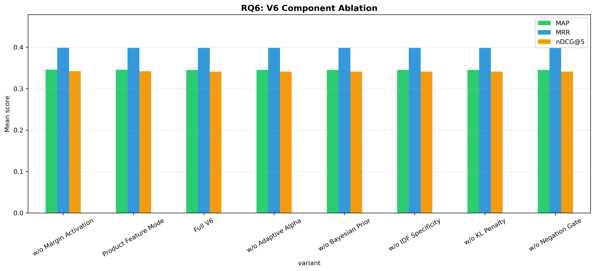

# H2L V6 Ablation Study — Full Report

**Generated**: 2026-04-27 03:34:32
**Evaluation**: Real retrieval via EvaluationRunner with ground truth cases

---

## Overview

This study systematically evaluates H2L V6 components using **real retrieval** 
(not simulated/mock data). Each experiment toggles one component while holding 
others constant, measuring impact on rank-aware metrics.

## RQ6: V6 Component Ablation

| Configuration | P@5 | R@5 | F1@5 | nDCG@5 | MAP | MRR |
|---|---|---|---|---|---|---|
| Full V6 | 0.1360 ± 0.1942 | 0.3510 ± 0.4357 | 0.1787 ± 0.2272 | 0.3410 ± 0.4220 | 0.3453 ± 0.4133 | 0.3982 ± 0.4694 |
| Product Feature Mode | 0.1371 ± 0.1961 | 0.3522 ± 0.4365 | 0.1798 ± 0.2291 | 0.3418 ± 0.4226 | 0.3454 ± 0.4134 | 0.3982 ± 0.4694 |
| w/o Adaptive Alpha | 0.1360 ± 0.1942 | 0.3510 ± 0.4357 | 0.1787 ± 0.2272 | 0.3410 ± 0.4220 | 0.3453 ± 0.4133 | 0.3982 ± 0.4694 |
| w/o Bayesian Prior | 0.1360 ± 0.1942 | 0.3510 ± 0.4357 | 0.1787 ± 0.2272 | 0.3410 ± 0.4220 | 0.3453 ± 0.4133 | 0.3982 ± 0.4694 |
| w/o IDF Specificity | 0.1360 ± 0.1942 | 0.3510 ± 0.4357 | 0.1787 ± 0.2272 | 0.3410 ± 0.4220 | 0.3453 ± 0.4133 | 0.3982 ± 0.4694 |
| w/o KL Penalty | 0.1360 ± 0.1942 | 0.3510 ± 0.4357 | 0.1787 ± 0.2272 | 0.3410 ± 0.4220 | 0.3453 ± 0.4133 | 0.3982 ± 0.4694 |
| w/o Margin Activation | 0.1371 ± 0.1961 | 0.3522 ± 0.4365 | 0.1798 ± 0.2291 | 0.3421 ± 0.4227 | 0.3460 ± 0.4135 | 0.3986 ± 0.4693 |
| w/o Negation Gate | 0.1360 ± 0.1942 | 0.3510 ± 0.4357 | 0.1787 ± 0.2272 | 0.3410 ± 0.4220 | 0.3453 ± 0.4133 | 0.3982 ± 0.4694 |

**Score/Ranking Diagnostics:**

| Configuration | rank_changed@5 | mean_abs_score_delta | mean_detected_problems |
|---|---:|---:|---:|
| w/o Bayesian Prior | 12.7% | 0.3533 | 2.76 |
| w/o KL Penalty | 12.7% | 0.3306 | 2.76 |
| Full V6 | 12.7% | 0.3297 | 2.76 |
| w/o Margin Activation | 15.7% | 0.3247 | 2.76 |
| w/o Negation Gate | 12.7% | 0.2581 | 2.76 |
| w/o IDF Specificity | 12.7% | 0.2512 | 2.76 |
| w/o Adaptive Alpha | 12.2% | 0.1790 | 2.76 |
| Product Feature Mode | 12.7% | 0.0209 | 2.76 |

Interpretation: rank-aware relevance metrics are unchanged across one-component-disabled variants in this run, but the diagnostic columns show that component toggles alter H2L scores and top-5 ordering. Treat this as component sensitivity evidence, not yet as causal component-level effectiveness evidence.

**Statistical Tests:**

- **Full V6 vs w/o Adaptive Alpha**: No difference, p=1.0000 (❌ not significant), Cohen's d=0.000 (negligible), 95% CI: (0.0, 0.0)
- **Full V6 vs w/o Bayesian Prior**: No difference, p=1.0000 (❌ not significant), Cohen's d=0.000 (negligible), 95% CI: (0.0, 0.0)
- **Full V6 vs w/o IDF Specificity**: No difference, p=1.0000 (❌ not significant), Cohen's d=0.000 (negligible), 95% CI: (0.0, 0.0)
- **Full V6 vs w/o Margin Activation**: Wilcoxon, p=0.1797 (❌ not significant), Cohen's d=-0.095 (negligible), 95% CI: (-0.0028, 0.0005)
- **Full V6 vs w/o KL Penalty**: No difference, p=1.0000 (❌ not significant), Cohen's d=0.000 (negligible), 95% CI: (0.0, 0.0)
- **Full V6 vs w/o Negation Gate**: No difference, p=1.0000 (❌ not significant), Cohen's d=0.000 (negligible), 95% CI: (0.0, 0.0)
- **Full V6 vs Product Feature Mode**: Wilcoxon, p=0.3173 (❌ not significant), Cohen's d=-0.071 (negligible), 95% CI: (-0.0023, 0.0007)
- **w/o Adaptive Alpha vs w/o Bayesian Prior**: No difference, p=1.0000 (❌ not significant), Cohen's d=0.000 (negligible), 95% CI: (0.0, 0.0)
- **w/o Adaptive Alpha vs w/o IDF Specificity**: No difference, p=1.0000 (❌ not significant), Cohen's d=0.000 (negligible), 95% CI: (0.0, 0.0)
- **w/o Adaptive Alpha vs w/o Margin Activation**: Wilcoxon, p=0.1797 (❌ not significant), Cohen's d=-0.095 (negligible), 95% CI: (-0.0028, 0.0005)
- **w/o Adaptive Alpha vs w/o KL Penalty**: No difference, p=1.0000 (❌ not significant), Cohen's d=0.000 (negligible), 95% CI: (0.0, 0.0)
- **w/o Adaptive Alpha vs w/o Negation Gate**: No difference, p=1.0000 (❌ not significant), Cohen's d=0.000 (negligible), 95% CI: (0.0, 0.0)
- **w/o Adaptive Alpha vs Product Feature Mode**: Wilcoxon, p=0.3173 (❌ not significant), Cohen's d=-0.071 (negligible), 95% CI: (-0.0023, 0.0007)
- **w/o Bayesian Prior vs w/o IDF Specificity**: No difference, p=1.0000 (❌ not significant), Cohen's d=0.000 (negligible), 95% CI: (0.0, 0.0)
- **w/o Bayesian Prior vs w/o Margin Activation**: Wilcoxon, p=0.1797 (❌ not significant), Cohen's d=-0.095 (negligible), 95% CI: (-0.0028, 0.0005)
- **w/o Bayesian Prior vs w/o KL Penalty**: No difference, p=1.0000 (❌ not significant), Cohen's d=0.000 (negligible), 95% CI: (0.0, 0.0)
- **w/o Bayesian Prior vs w/o Negation Gate**: No difference, p=1.0000 (❌ not significant), Cohen's d=0.000 (negligible), 95% CI: (0.0, 0.0)
- **w/o Bayesian Prior vs Product Feature Mode**: Wilcoxon, p=0.3173 (❌ not significant), Cohen's d=-0.071 (negligible), 95% CI: (-0.0023, 0.0007)
- **w/o IDF Specificity vs w/o Margin Activation**: Wilcoxon, p=0.1797 (❌ not significant), Cohen's d=-0.095 (negligible), 95% CI: (-0.0028, 0.0005)
- **w/o IDF Specificity vs w/o KL Penalty**: No difference, p=1.0000 (❌ not significant), Cohen's d=0.000 (negligible), 95% CI: (0.0, 0.0)
- **w/o IDF Specificity vs w/o Negation Gate**: No difference, p=1.0000 (❌ not significant), Cohen's d=0.000 (negligible), 95% CI: (0.0, 0.0)
- **w/o IDF Specificity vs Product Feature Mode**: Wilcoxon, p=0.3173 (❌ not significant), Cohen's d=-0.071 (negligible), 95% CI: (-0.0023, 0.0007)
- **w/o Margin Activation vs w/o KL Penalty**: Wilcoxon, p=0.1797 (❌ not significant), Cohen's d=0.095 (negligible), 95% CI: (-0.0005, 0.0028)
- **w/o Margin Activation vs w/o Negation Gate**: Wilcoxon, p=0.1797 (❌ not significant), Cohen's d=0.095 (negligible), 95% CI: (-0.0005, 0.0028)
- **w/o Margin Activation vs Product Feature Mode**: Wilcoxon, p=0.3173 (❌ not significant), Cohen's d=0.071 (negligible), 95% CI: (-0.0003, 0.001)
- **w/o KL Penalty vs w/o Negation Gate**: No difference, p=1.0000 (❌ not significant), Cohen's d=0.000 (negligible), 95% CI: (0.0, 0.0)
- **w/o KL Penalty vs Product Feature Mode**: Wilcoxon, p=0.3173 (❌ not significant), Cohen's d=-0.071 (negligible), 95% CI: (-0.0023, 0.0007)
- **w/o Negation Gate vs Product Feature Mode**: Wilcoxon, p=0.3173 (❌ not significant), Cohen's d=-0.071 (negligible), 95% CI: (-0.0023, 0.0007)

---

## Baseline Comparison

| Method | P@5 | F1@5 | nDCG@5 | MAP | MRR |
|---|---|---|---|---|---|
| basic | 0.1391 | 0.1829 | 0.3470 | 0.3435 | 0.3990 |
| **h2l-hybrid** | 0.1371 | 0.1801 | 0.3456 | 0.3503 | 0.4053 |

---

## Advanced Computational Analysis

### Bootstrap BCa 95% Confidence Intervals

| Strategy | nDCG@5 | MAP |
|---|---|---|
| basic | 0.3470 [0.2852, 0.4068] | 0.3435 [0.2853, 0.4000] |
| h2l-hybrid | 0.3456 [0.2825, 0.4065] | 0.3503 [0.2919, 0.4091] |

### Bayesian Signed-Rank Analysis

| Comparison | P(H2L wins) | P(ROPE) | P(Baseline wins) |
|---|---|---|---|
| h2l-hybrid vs basic | 0.000 | 0.992 | 0.008 |

### Stratified Effect Size (Forest)

| Complexity | Cohen's d | 95% CI | n |
|---|---|---|---|
| moderate | -0.016 | [-0.028, -0.004] | 75 |
| complex | -0.171 | [-0.184, -0.157] | 58 |
| simple | 0.221 | [0.215, 0.226] | 64 |

---

## Generated Files

- `advanced_bayesian.png`
- `advanced_bootstrap_ci.png`
- `advanced_forest_plot.png`
- `baseline_comparison.csv`
- `baseline_comparison.png`
- `baseline_results.csv`
- `rq1_l2_filtering_impact.csv`
- `rq1_l2_filtering_impact.png`
- `rq1_results.csv`
- `rq2_alpha_sensitivity.png`
- `rq2_α_parameter_sensitivity.csv`
- `rq3_matching_method.png`
- `rq3_soft_vs_hard_matching.csv`
- `rq4_prior_calculation.png`
- `rq4_prior_calculation_impact.csv`
- `rq6_q1_final_log.txt`
- `rq6_results.csv`
- `rq6_v6_component_ablation.png`

---

*Generated by H2L V6 Ablation Study (real evaluation pipeline)*