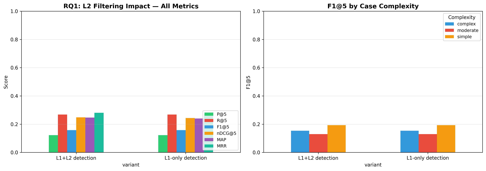

# H2L V6 Ablation Study — Full Report

**Generated**: 2026-08-09 14:19:56
**Evaluation**: Real retrieval via EvaluationRunner with ground truth cases

---

## Overview

This study systematically evaluates H2L V6 components using **real retrieval** 
(not simulated/mock data). Each experiment toggles one component while holding 
others constant, measuring impact on rank-aware metrics.

## RQ1: L2 Filtering Impact

| Configuration | P@5 | R@5 | F1@5 | nDCG@5 | MAP | MRR |
|---|---|---|---|---|---|---|
| L1+L2 detection | 0.1221 ± 0.2110 | 0.2677 ± 0.4182 | 0.1576 ± 0.2565 | 0.2485 ± 0.3952 | 0.2467 ± 0.3769 | 0.2801 ± 0.4303 |
| L1-only detection | 0.1221 ± 0.2110 | 0.2677 ± 0.4182 | 0.1576 ± 0.2565 | 0.2432 ± 0.3883 | 0.2396 ± 0.3688 | 0.2731 ± 0.4238 |

**Statistical Tests:**

- **nDCG@5 — L1+L2 detection vs L1-only detection**: Wilcoxon, p=0.3173 (❌ not significant), Cohen's d=0.103 (negligible), 95% CI: (-0.0049981943151945945, 0.01552451010466828)

---

## Generated Files

- `rq1_l2_filtering_impact.png`
- `rq1_results.csv`
- `run.log`
- `run_metadata.json`

---

*Generated by H2L V6 Ablation Study (real evaluation pipeline)*