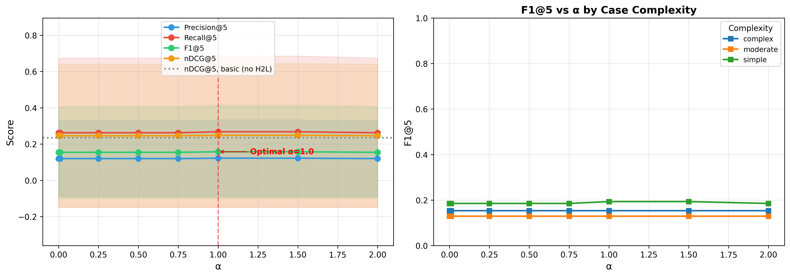

# H2L V6 Ablation Study — Full Report

**Generated**: 2026-08-11 16:18:34
**Evaluation**: Real retrieval via EvaluationRunner with ground truth cases

---

## Overview

This study systematically evaluates H2L V6 components using **real retrieval** 
(not simulated/mock data). Each experiment toggles one component while holding 
others constant, measuring impact on rank-aware metrics.

## RQ2: α Parameter Sensitivity

| Configuration | P@5 | R@5 | F1@5 | nDCG@5 | nDCG@10 | MAP | MRR |
|---|---|---|---|---|---|---|---|
| 0.0 | 0.1200 ± 0.2092 | 0.2625 ± 0.4120 | 0.1546 ± 0.2532 | 0.2460 ± 0.3943 | 0.2731 ± 0.4056 | 0.2463 ± 0.3768 | 0.2800 ± 0.4303 |
| 0.01 | 0.1200 ± 0.2092 | 0.2625 ± 0.4120 | 0.1546 ± 0.2532 | 0.2460 ± 0.3943 | 0.2731 ± 0.4056 | 0.2463 ± 0.3768 | 0.2800 ± 0.4303 |
| 0.25 | 0.1200 ± 0.2092 | 0.2625 ± 0.4120 | 0.1546 ± 0.2532 | 0.2460 ± 0.3943 | 0.2731 ± 0.4056 | 0.2463 ± 0.3768 | 0.2800 ± 0.4303 |
| 0.5 | 0.1200 ± 0.2092 | 0.2625 ± 0.4120 | 0.1546 ± 0.2532 | 0.2460 ± 0.3943 | 0.2731 ± 0.4056 | 0.2463 ± 0.3768 | 0.2800 ± 0.4303 |
| 0.75 | 0.1200 ± 0.2092 | 0.2625 ± 0.4120 | 0.1546 ± 0.2532 | 0.2460 ± 0.3943 | 0.2732 ± 0.4057 | 0.2463 ± 0.3768 | 0.2801 ± 0.4303 |
| 1.0 | 0.1221 ± 0.2110 | 0.2677 ± 0.4182 | 0.1576 ± 0.2565 | 0.2485 ± 0.3952 | 0.2734 ± 0.4058 | 0.2467 ± 0.3769 | 0.2801 ± 0.4303 |
| 1.5 | 0.1221 ± 0.2110 | 0.2677 ± 0.4182 | 0.1576 ± 0.2565 | 0.2485 ± 0.3952 | 0.2734 ± 0.4058 | 0.2467 ± 0.3769 | 0.2801 ± 0.4303 |
| 2.0 | 0.1200 ± 0.2092 | 0.2625 ± 0.4120 | 0.1546 ± 0.2532 | 0.2460 ± 0.3943 | 0.2731 ± 0.4056 | 0.2463 ± 0.3768 | 0.2800 ± 0.4303 |

**Statistical Tests:**

- **nDCG@5 — 0.0 vs 0.01**: No difference, p=1.0000 (❌ not significant), Cohen's d=0.000 (negligible), 95% CI: (0.0, 0.0)
- **nDCG@5 — 0.0 vs 0.25**: No difference, p=1.0000 (❌ not significant), Cohen's d=0.000 (negligible), 95% CI: (0.0, 0.0)
- **nDCG@5 — 0.0 vs 0.5**: No difference, p=1.0000 (❌ not significant), Cohen's d=0.000 (negligible), 95% CI: (0.0, 0.0)
- **nDCG@5 — 0.0 vs 0.75**: No difference, p=1.0000 (❌ not significant), Cohen's d=0.000 (negligible), 95% CI: (0.0, 0.0)
- **nDCG@5 — 0.0 vs 1.0**: Wilcoxon, p=0.3173 (❌ not significant), Cohen's d=-0.103 (negligible), 95% CI: (-0.007364756577382284, 0.002371120519081312)
- **nDCG@5 — 0.0 vs 1.5**: Wilcoxon, p=0.3173 (❌ not significant), Cohen's d=-0.103 (negligible), 95% CI: (-0.007364756577382284, 0.002371120519081312)
- **nDCG@5 — 0.0 vs 2.0**: No difference, p=1.0000 (❌ not significant), Cohen's d=0.000 (negligible), 95% CI: (0.0, 0.0)
- **nDCG@5 — 0.01 vs 0.25**: No difference, p=1.0000 (❌ not significant), Cohen's d=0.000 (negligible), 95% CI: (0.0, 0.0)
- **nDCG@5 — 0.01 vs 0.5**: No difference, p=1.0000 (❌ not significant), Cohen's d=0.000 (negligible), 95% CI: (0.0, 0.0)
- **nDCG@5 — 0.01 vs 0.75**: No difference, p=1.0000 (❌ not significant), Cohen's d=0.000 (negligible), 95% CI: (0.0, 0.0)
- **nDCG@5 — 0.01 vs 1.0**: Wilcoxon, p=0.3173 (❌ not significant), Cohen's d=-0.103 (negligible), 95% CI: (-0.007364756577382284, 0.002371120519081312)
- **nDCG@5 — 0.01 vs 1.5**: Wilcoxon, p=0.3173 (❌ not significant), Cohen's d=-0.103 (negligible), 95% CI: (-0.007364756577382284, 0.002371120519081312)
- **nDCG@5 — 0.01 vs 2.0**: No difference, p=1.0000 (❌ not significant), Cohen's d=0.000 (negligible), 95% CI: (0.0, 0.0)
- **nDCG@5 — 0.25 vs 0.5**: No difference, p=1.0000 (❌ not significant), Cohen's d=0.000 (negligible), 95% CI: (0.0, 0.0)
- **nDCG@5 — 0.25 vs 0.75**: No difference, p=1.0000 (❌ not significant), Cohen's d=0.000 (negligible), 95% CI: (0.0, 0.0)
- **nDCG@5 — 0.25 vs 1.0**: Wilcoxon, p=0.3173 (❌ not significant), Cohen's d=-0.103 (negligible), 95% CI: (-0.007364756577382284, 0.002371120519081312)
- **nDCG@5 — 0.25 vs 1.5**: Wilcoxon, p=0.3173 (❌ not significant), Cohen's d=-0.103 (negligible), 95% CI: (-0.007364756577382284, 0.002371120519081312)
- **nDCG@5 — 0.25 vs 2.0**: No difference, p=1.0000 (❌ not significant), Cohen's d=0.000 (negligible), 95% CI: (0.0, 0.0)
- **nDCG@5 — 0.5 vs 0.75**: No difference, p=1.0000 (❌ not significant), Cohen's d=0.000 (negligible), 95% CI: (0.0, 0.0)
- **nDCG@5 — 0.5 vs 1.0**: Wilcoxon, p=0.3173 (❌ not significant), Cohen's d=-0.103 (negligible), 95% CI: (-0.007364756577382284, 0.002371120519081312)
- **nDCG@5 — 0.5 vs 1.5**: Wilcoxon, p=0.3173 (❌ not significant), Cohen's d=-0.103 (negligible), 95% CI: (-0.007364756577382284, 0.002371120519081312)
- **nDCG@5 — 0.5 vs 2.0**: No difference, p=1.0000 (❌ not significant), Cohen's d=0.000 (negligible), 95% CI: (0.0, 0.0)
- **nDCG@5 — 0.75 vs 1.0**: Wilcoxon, p=0.3173 (❌ not significant), Cohen's d=-0.103 (negligible), 95% CI: (-0.007364756577382284, 0.002371120519081312)
- **nDCG@5 — 0.75 vs 1.5**: Wilcoxon, p=0.3173 (❌ not significant), Cohen's d=-0.103 (negligible), 95% CI: (-0.007364756577382284, 0.002371120519081312)
- **nDCG@5 — 0.75 vs 2.0**: No difference, p=1.0000 (❌ not significant), Cohen's d=0.000 (negligible), 95% CI: (0.0, 0.0)
- **nDCG@5 — 1.0 vs 1.5**: No difference, p=1.0000 (❌ not significant), Cohen's d=0.000 (negligible), 95% CI: (0.0, 0.0)
- **nDCG@5 — 1.0 vs 2.0**: Wilcoxon, p=0.3173 (❌ not significant), Cohen's d=0.103 (negligible), 95% CI: (-0.002371120519081312, 0.007364756577382284)
- **nDCG@5 — 1.5 vs 2.0**: Wilcoxon, p=0.3173 (❌ not significant), Cohen's d=0.103 (negligible), 95% CI: (-0.002371120519081312, 0.007364756577382284)

---

## Generated Files

- `rq2_alpha_sensitivity.png`
- `rq2_results.csv`
- `run_metadata.json`

---

*Generated by H2L V6 Ablation Study (real evaluation pipeline)*