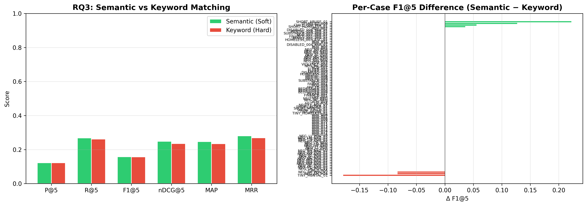
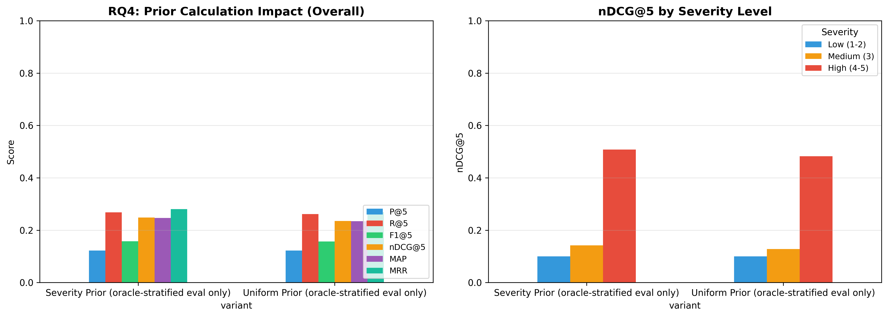

# H2L V6 Ablation Study — Full Report

**Generated**: 2026-08-09 17:28:49
**Evaluation**: Real retrieval via EvaluationRunner with ground truth cases

---

## Overview

This study systematically evaluates H2L V6 components using **real retrieval** 
(not simulated/mock data). Each experiment toggles one component while holding 
others constant, measuring impact on rank-aware metrics.

## RQ3: Matching Methods

| Configuration | P@5 | R@5 | F1@5 | nDCG@5 | MAP | MRR |
|---|---|---|---|---|---|---|
| Keyword (Hard) | 0.1221 ± 0.2089 | 0.2616 ± 0.4139 | 0.1566 ± 0.2556 | 0.2351 ± 0.3796 | 0.2346 ± 0.3633 | 0.2686 ± 0.4183 |
| Semantic (Soft) | 0.1221 ± 0.2110 | 0.2677 ± 0.4182 | 0.1576 ± 0.2565 | 0.2485 ± 0.3952 | 0.2467 ± 0.3769 | 0.2801 ± 0.4303 |

**Statistical Tests:**

- **nDCG@5 — Semantic (Soft) vs Keyword (Hard)**: Wilcoxon, p=0.0640 (❌ not significant), Cohen's d=0.159 (negligible), 95% CI: (-0.003556873777898411, 0.030417037792848965)

---

## RQ4: Prior Calculation

| Configuration | P@5 | R@5 | F1@5 | nDCG@5 | MAP | MRR |
|---|---|---|---|---|---|---|
| Severity Prior (oracle-stratified eval only) | 0.1221 ± 0.2110 | 0.2677 ± 0.4182 | 0.1576 ± 0.2565 | 0.2485 ± 0.3952 | 0.2467 ± 0.3769 | 0.2801 ± 0.4303 |
| Uniform Prior (oracle-stratified eval only) | 0.1221 ± 0.2089 | 0.2616 ± 0.4139 | 0.1566 ± 0.2556 | 0.2351 ± 0.3796 | 0.2346 ± 0.3633 | 0.2686 ± 0.4183 |

**Statistical Tests:**

- **nDCG@5 — Severity Prior (oracle-stratified eval only) vs Uniform Prior (oracle-stratified eval only)**: Wilcoxon, p=0.0640 (❌ not significant), Cohen's d=0.159 (negligible), 95% CI: (-0.003556873777898411, 0.030417037792848965)

---

## Generated Files

- `rq3_matching_method.png`
- `rq3_results.csv`
- `rq4_prior_calculation.png`
- `rq4_results.csv`
- `run.log`
- `run_metadata.json`

---

*Generated by H2L V6 Ablation Study (real evaluation pipeline)*