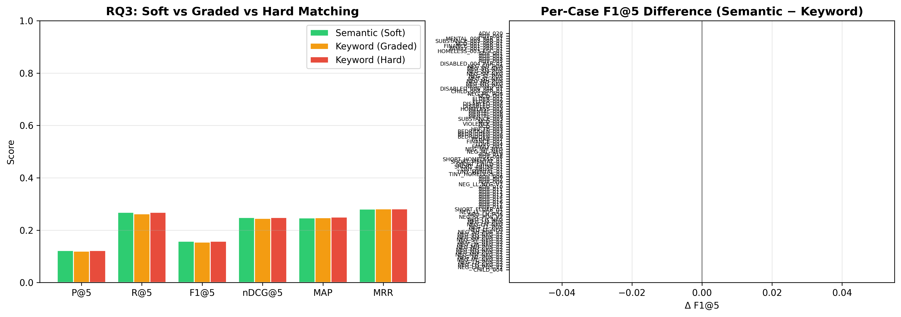

# H2L V6 Ablation Study — Full Report

**Generated**: 2026-08-10 03:24:35
**Evaluation**: Real retrieval via EvaluationRunner with ground truth cases

---

## Overview

This study systematically evaluates H2L V6 components using **real retrieval** 
(not simulated/mock data). Each experiment toggles one component while holding 
others constant, measuring impact on rank-aware metrics.

## RQ3: Matching Methods

| Configuration | P@5 | R@5 | F1@5 | nDCG@5 | nDCG@10 | MAP | MRR |
|---|---|---|---|---|---|---|---|
| Keyword (Graded) | 0.1200 ± 0.2092 | 0.2625 ± 0.4120 | 0.1546 ± 0.2532 | 0.2451 ± 0.3926 | 0.2722 ± 0.4041 | 0.2473 ± 0.3773 | 0.2811 ± 0.4303 |
| Keyword (Hard) | 0.1221 ± 0.2110 | 0.2677 ± 0.4182 | 0.1576 ± 0.2565 | 0.2485 ± 0.3953 | 0.2756 ± 0.4087 | 0.2503 ± 0.3811 | 0.2811 ± 0.4303 |
| Semantic (Soft) | 0.1221 ± 0.2110 | 0.2677 ± 0.4182 | 0.1576 ± 0.2565 | 0.2485 ± 0.3952 | 0.2734 ± 0.4058 | 0.2467 ± 0.3769 | 0.2801 ± 0.4303 |

**Statistical Tests:**

- **nDCG@5 — nDCG@5: Semantic (Soft) vs Keyword (Graded)**: Wilcoxon, raw p=0.2850, Holm p=0.5701 (❌ not significant), Cohen's d=0.138 (negligible), 95% CI: (-0.0015856735001986148, 0.00846462183848783)
- **nDCG@5 — nDCG@5: Semantic (Soft) vs Keyword (Hard)**: Wilcoxon, raw p=0.7150, Holm p=0.7150 (❌ not significant), Cohen's d=0.002 (negligible), 95% CI: (-0.0034194537935284684, 0.0034725367628609103)
- **nDCG@5 — nDCG@5: Keyword (Graded) vs Keyword (Hard)**: Wilcoxon, raw p=0.1088, Holm p=0.3264 (❌ not significant), Cohen's d=-0.134 (negligible), 95% CI: (-0.00852298461307288, 0.0016971192441161075)
- **nDCG@10 — nDCG@10: Semantic (Soft) vs Keyword (Graded)**: Wilcoxon, raw p=0.6858, Holm p=0.6858 (❌ not significant), Cohen's d=0.071 (negligible), 95% CI: (-0.0020208652085365775, 0.004245647580379633)
- **nDCG@10 — nDCG@10: Semantic (Soft) vs Keyword (Hard)**: Wilcoxon, raw p=0.0926, Holm p=0.1852 (❌ not significant), Cohen's d=-0.098 (negligible), 95% CI: (-0.0068638932646355785, 0.002364744603870112)
- **nDCG@10 — nDCG@10: Keyword (Graded) vs Keyword (Hard)**: Wilcoxon, raw p=0.0180, Holm p=0.0539 (❌ not significant), Cohen's d=-0.196 (negligible), 95% CI: (-0.006814129166175268, 9.019813356674587e-05)

---

## Generated Files

- `rq3_arm_summary.csv`
- `rq3_matching_method.png`
- `rq3_ranking_changes.csv`
- `rq3_results.csv`
- `rq3_significance.csv`
- `run_metadata.json`

---

*Generated by H2L V6 Ablation Study (real evaluation pipeline)*