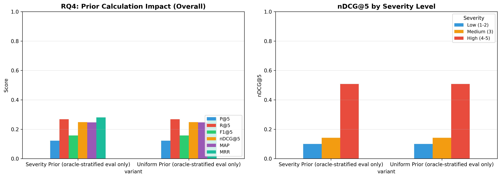

# H2L V6 Ablation Study — Full Report

**Generated**: 2026-08-10 03:47:25
**Evaluation**: Real retrieval via EvaluationRunner with ground truth cases

---

## Overview

This study systematically evaluates H2L V6 components using **real retrieval** 
(not simulated/mock data). Each experiment toggles one component while holding 
others constant, measuring impact on rank-aware metrics.

## RQ4: Prior Calculation

| Configuration | P@5 | R@5 | F1@5 | nDCG@5 | MAP | MRR |
|---|---|---|---|---|---|---|
| Severity Prior (oracle-stratified eval only) | 0.1221 ± 0.2110 | 0.2677 ± 0.4182 | 0.1576 ± 0.2565 | 0.2485 ± 0.3952 | 0.2467 ± 0.3769 | 0.2801 ± 0.4303 |
| Uniform Prior (oracle-stratified eval only) | 0.1221 ± 0.2110 | 0.2677 ± 0.4182 | 0.1576 ± 0.2565 | 0.2485 ± 0.3952 | 0.2467 ± 0.3769 | 0.2801 ± 0.4303 |

**Statistical Tests:**

- **nDCG@5 — Severity Prior (oracle-stratified eval only) vs Uniform Prior (oracle-stratified eval only)**: No difference, p=1.0000 (❌ not significant), Cohen's d=0.000 (negligible), 95% CI: (0.0, 0.0)

---

## Generated Files

- `rq4_prior_calculation.png`
- `rq4_results.csv`
- `run_metadata.json`

---

*Generated by H2L V6 Ablation Study (real evaluation pipeline)*