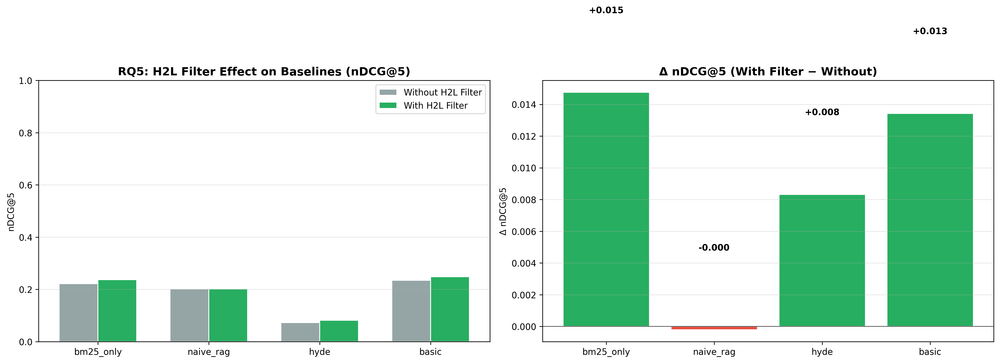

# H2L V6 Ablation Study — Full Report

**Generated**: 2026-08-09 22:29:14
**Evaluation**: Real retrieval via EvaluationRunner with ground truth cases

---

## Overview

This study systematically evaluates H2L V6 components using **real retrieval** 
(not simulated/mock data). Each experiment toggles one component while holding 
others constant, measuring impact on rank-aware metrics.

## RQ5: H2L Filter Toggle

| Configuration | P@5 | R@5 | F1@5 | nDCG@5 | MAP | MRR |
|---|---|---|---|---|---|---|
| basic | 0.1221 ± 0.2094 | 0.2646 ± 0.4150 | 0.1571 ± 0.2554 | 0.2418 ± 0.3865 | 0.2406 ± 0.3692 | 0.2744 ± 0.4233 |
| bm25_only | 0.1147 ± 0.1987 | 0.2477 ± 0.3920 | 0.1461 ± 0.2369 | 0.2295 ± 0.3650 | 0.2261 ± 0.3491 | 0.2692 ± 0.4180 |
| hyde | 0.0316 ± 0.0888 | 0.0952 ± 0.2678 | 0.0445 ± 0.1201 | 0.0773 ± 0.2259 | 0.0790 ± 0.2079 | 0.0885 ± 0.2366 |
| naive_rag | 0.1000 ± 0.1755 | 0.2153 ± 0.3646 | 0.1263 ± 0.2104 | 0.2018 ± 0.3418 | 0.1984 ± 0.3249 | 0.2563 ± 0.4148 |

---

## Generated Files

- `rq5_filter_toggle.png`
- `rq5_results.csv`
- `run.log`
- `run_metadata.json`

---

*Generated by H2L V6 Ablation Study (real evaluation pipeline)*