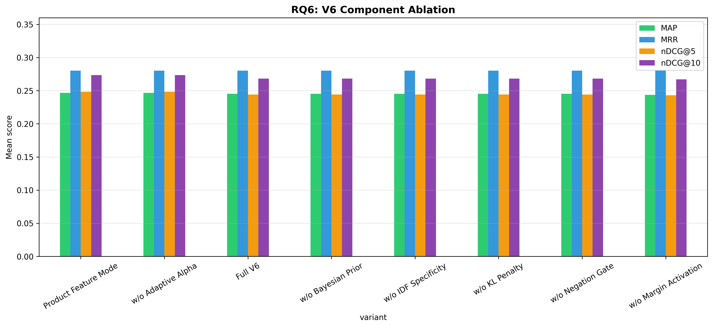

# H2L V6 Ablation Study — Full Report

**Generated**: 2026-08-09 16:53:34
**Evaluation**: Real retrieval via EvaluationRunner with ground truth cases

---

## Overview

This study systematically evaluates H2L V6 components using **real retrieval** 
(not simulated/mock data). Each experiment toggles one component while holding 
others constant, measuring impact on rank-aware metrics.

## RQ6: V6 Component Ablation

| Configuration | P@5 | R@5 | F1@5 | DCG@5 | IDCG@5 | nDCG@5 | P@10 | R@10 | F1@10 | DCG@10 | IDCG@10 | nDCG@10 | MAP | MRR |
|---|---|---|---|---|---|---|---|---|---|---|---|---|---|---|
| Full V6 | 0.1221 ± 0.2110 | 0.2660 ± 0.4169 | 0.1570 ± 0.2558 | 0.6139 ± 1.1410 | 0.9221 ± 1.4622 | 0.2442 ± 0.3917 | 0.0768 ± 0.1275 | 0.3233 ± 0.4609 | 0.1189 ± 0.1886 | 0.6764 ± 1.1877 | 0.9221 ± 1.4622 | 0.2683 ± 0.4007 | 0.2454 ± 0.3752 | 0.2801 ± 0.4303 |
| Product Feature Mode | 0.1221 ± 0.2110 | 0.2677 ± 0.4182 | 0.1576 ± 0.2565 | 0.6139 ± 1.1410 | 0.8965 ± 1.4185 | 0.2485 ± 0.3952 | 0.0768 ± 0.1275 | 0.3260 ± 0.4640 | 0.1193 ± 0.1892 | 0.6764 ± 1.1877 | 0.8965 ± 1.4185 | 0.2734 ± 0.4058 | 0.2467 ± 0.3769 | 0.2801 ± 0.4303 |
| w/o Adaptive Alpha | 0.1221 ± 0.2110 | 0.2677 ± 0.4182 | 0.1576 ± 0.2565 | 0.6139 ± 1.1410 | 0.8965 ± 1.4185 | 0.2485 ± 0.3952 | 0.0768 ± 0.1275 | 0.3260 ± 0.4640 | 0.1193 ± 0.1892 | 0.6764 ± 1.1877 | 0.8965 ± 1.4185 | 0.2734 ± 0.4058 | 0.2467 ± 0.3769 | 0.2801 ± 0.4303 |
| w/o Bayesian Prior | 0.1221 ± 0.2110 | 0.2660 ± 0.4169 | 0.1570 ± 0.2558 | 0.6139 ± 1.1410 | 0.9221 ± 1.4622 | 0.2442 ± 0.3917 | 0.0768 ± 0.1275 | 0.3233 ± 0.4609 | 0.1189 ± 0.1886 | 0.6764 ± 1.1877 | 0.9221 ± 1.4622 | 0.2683 ± 0.4007 | 0.2454 ± 0.3752 | 0.2801 ± 0.4303 |
| w/o IDF Specificity | 0.1221 ± 0.2110 | 0.2660 ± 0.4169 | 0.1570 ± 0.2558 | 0.6139 ± 1.1410 | 0.9221 ± 1.4622 | 0.2442 ± 0.3917 | 0.0768 ± 0.1275 | 0.3233 ± 0.4609 | 0.1189 ± 0.1886 | 0.6764 ± 1.1877 | 0.9221 ± 1.4622 | 0.2683 ± 0.4007 | 0.2454 ± 0.3752 | 0.2801 ± 0.4303 |
| w/o KL Penalty | 0.1221 ± 0.2110 | 0.2660 ± 0.4169 | 0.1570 ± 0.2558 | 0.6139 ± 1.1410 | 0.9221 ± 1.4622 | 0.2442 ± 0.3917 | 0.0768 ± 0.1275 | 0.3233 ± 0.4609 | 0.1189 ± 0.1886 | 0.6764 ± 1.1877 | 0.9221 ± 1.4622 | 0.2683 ± 0.4007 | 0.2454 ± 0.3752 | 0.2801 ± 0.4303 |
| w/o Margin Activation | 0.1221 ± 0.2110 | 0.2625 ± 0.4120 | 0.1562 ± 0.2546 | 0.6139 ± 1.1410 | 0.9273 ± 1.4730 | 0.2430 ± 0.3897 | 0.0768 ± 0.1275 | 0.3198 ± 0.4569 | 0.1186 ± 0.1883 | 0.6764 ± 1.1877 | 0.9273 ± 1.4730 | 0.2671 ± 0.3989 | 0.2436 ± 0.3735 | 0.2801 ± 0.4303 |
| w/o Negation Gate | 0.1221 ± 0.2110 | 0.2660 ± 0.4169 | 0.1570 ± 0.2558 | 0.6139 ± 1.1410 | 0.9221 ± 1.4622 | 0.2442 ± 0.3917 | 0.0768 ± 0.1275 | 0.3233 ± 0.4609 | 0.1189 ± 0.1886 | 0.6764 ± 1.1877 | 0.9221 ± 1.4622 | 0.2683 ± 0.4007 | 0.2454 ± 0.3752 | 0.2801 ± 0.4303 |

**Score/Ranking Diagnostics:**

| Configuration | rank_changed@5 | rank_changed@10 | mean_abs_score_delta | mean_detected_problems |
|---|---:|---:|---:|---:|
| w/o Bayesian Prior | 1.1% | 3.2% | 0.1926 | 2.78 |
| w/o KL Penalty | 1.1% | 3.2% | 0.1823 | 2.78 |
| Full V6 | 1.1% | 3.2% | 0.1820 | 2.78 |
| w/o Margin Activation | 4.2% | 7.4% | 0.1791 | 2.78 |
| w/o Negation Gate | 1.1% | 3.2% | 0.1418 | 2.78 |
| w/o IDF Specificity | 1.1% | 3.2% | 0.1398 | 2.78 |
| w/o Adaptive Alpha | 1.1% | 3.2% | 0.1015 | 2.78 |
| Product Feature Mode | 1.1% | 3.2% | 0.0108 | 2.78 |

Interpretation: at least one one-component-disabled variant changes a rank-aware relevance metric in this run. Statistical tests below determine whether those paired changes survive multiplicity correction.
Treat score-only changes as component sensitivity evidence, not causal component-level effectiveness evidence.

**Statistical Tests:**

- **nDCG@5 — nDCG@5: Full V6 vs w/o Adaptive Alpha**: Wilcoxon, raw p=0.3173, Holm p=1.0000 (❌ not significant), Cohen's d=-0.103 (negligible), 95% CI: (-0.012662614753811488, 0.004076792675020916)
- **nDCG@5 — nDCG@5: Full V6 vs w/o Bayesian Prior**: No difference, raw p=1.0000, Holm p=1.0000 (❌ not significant), Cohen's d=0.000 (negligible), 95% CI: (0.0, 0.0)
- **nDCG@5 — nDCG@5: Full V6 vs w/o IDF Specificity**: No difference, raw p=1.0000, Holm p=1.0000 (❌ not significant), Cohen's d=0.000 (negligible), 95% CI: (0.0, 0.0)
- **nDCG@5 — nDCG@5: Full V6 vs w/o Margin Activation**: Wilcoxon, raw p=0.3173, Holm p=1.0000 (❌ not significant), Cohen's d=0.103 (negligible), 95% CI: (-0.0011286097612178917, 0.0035054886899834863)
- **nDCG@5 — nDCG@5: Full V6 vs w/o KL Penalty**: No difference, raw p=1.0000, Holm p=1.0000 (❌ not significant), Cohen's d=0.000 (negligible), 95% CI: (0.0, 0.0)
- **nDCG@5 — nDCG@5: Full V6 vs w/o Negation Gate**: No difference, raw p=1.0000, Holm p=1.0000 (❌ not significant), Cohen's d=0.000 (negligible), 95% CI: (0.0, 0.0)
- **nDCG@5 — nDCG@5: Full V6 vs Product Feature Mode**: Wilcoxon, raw p=0.3173, Holm p=1.0000 (❌ not significant), Cohen's d=-0.103 (negligible), 95% CI: (-0.012662614753811488, 0.004076792675020916)
- **nDCG@10 — nDCG@10: Full V6 vs w/o Adaptive Alpha**: Wilcoxon, raw p=0.3173, Holm p=1.0000 (❌ not significant), Cohen's d=-0.103 (negligible), 95% CI: (-0.014999825695047483, 0.004829269523638738)
- **nDCG@10 — nDCG@10: Full V6 vs w/o Bayesian Prior**: No difference, raw p=1.0000, Holm p=1.0000 (❌ not significant), Cohen's d=0.000 (negligible), 95% CI: (0.0, 0.0)
- **nDCG@10 — nDCG@10: Full V6 vs w/o IDF Specificity**: No difference, raw p=1.0000, Holm p=1.0000 (❌ not significant), Cohen's d=0.000 (negligible), 95% CI: (0.0, 0.0)
- **nDCG@10 — nDCG@10: Full V6 vs w/o Margin Activation**: Wilcoxon, raw p=0.3173, Holm p=1.0000 (❌ not significant), Cohen's d=0.103 (negligible), 95% CI: (-0.0011286097612178917, 0.0035054886899834863)
- **nDCG@10 — nDCG@10: Full V6 vs w/o KL Penalty**: No difference, raw p=1.0000, Holm p=1.0000 (❌ not significant), Cohen's d=0.000 (negligible), 95% CI: (0.0, 0.0)
- **nDCG@10 — nDCG@10: Full V6 vs w/o Negation Gate**: No difference, raw p=1.0000, Holm p=1.0000 (❌ not significant), Cohen's d=0.000 (negligible), 95% CI: (0.0, 0.0)
- **nDCG@10 — nDCG@10: Full V6 vs Product Feature Mode**: Wilcoxon, raw p=0.3173, Holm p=1.0000 (❌ not significant), Cohen's d=-0.103 (negligible), 95% CI: (-0.014999825695047483, 0.004829269523638738)

---

## Generated Files

- `rq6_results.csv`
- `rq6_significance.csv`
- `rq6_slice_summary.csv`
- `rq6_v6_component_ablation.png`
- `run.log`
- `run_metadata.json`

---

*Generated by H2L V6 Ablation Study (real evaluation pipeline)*