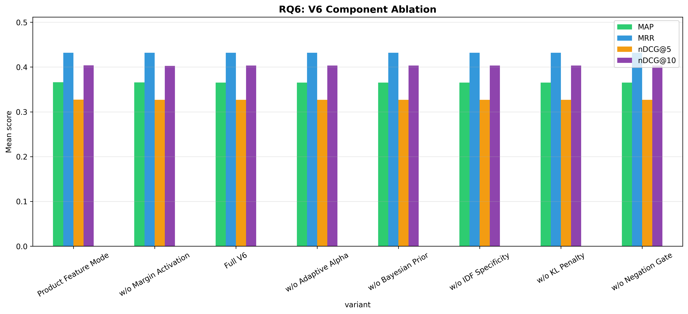

# H2L V6 Ablation Study — Full Report

**Generated**: 2026-08-14 04:03:12
**Evaluation**: Real retrieval via EvaluationRunner with ground truth cases

---

## Overview

This study systematically evaluates H2L V6 components using **real retrieval** 
(not simulated/mock data). Each experiment toggles one component while holding 
others constant, measuring impact on rank-aware metrics.

## RQ6: V6 Component Ablation

| Configuration | P@5 | R@5 | F1@5 | DCG@5 | IDCG@5 | nDCG@5 | P@10 | R@10 | F1@10 | DCG@10 | IDCG@10 | nDCG@10 | MAP | MRR |
|---|---|---|---|---|---|---|---|---|---|---|---|---|---|---|
| Full V6 | 0.2442 ± 0.2891 | 0.3464 ± 0.3693 | 0.2485 ± 0.2512 | 1.6904 ± 2.2627 | 3.2832 ± 3.0447 | 0.3269 ± 0.3478 | 0.2095 ± 0.2339 | 0.5573 ± 0.4240 | 0.2719 ± 0.2546 | 2.2355 ± 2.6962 | 3.5393 ± 3.4984 | 0.4034 ± 0.3441 | 0.3655 ± 0.3370 | 0.4318 ± 0.4173 |
| Product Feature Mode | 0.2442 ± 0.2891 | 0.3464 ± 0.3693 | 0.2485 ± 0.2512 | 1.6909 ± 2.2625 | 3.2832 ± 3.0447 | 0.3272 ± 0.3480 | 0.2095 ± 0.2339 | 0.5573 ± 0.4240 | 0.2719 ± 0.2546 | 2.2360 ± 2.6959 | 3.5393 ± 3.4984 | 0.4037 ± 0.3443 | 0.3660 ± 0.3370 | 0.4318 ± 0.4173 |
| w/o Adaptive Alpha | 0.2442 ± 0.2891 | 0.3464 ± 0.3693 | 0.2485 ± 0.2512 | 1.6904 ± 2.2627 | 3.2832 ± 3.0447 | 0.3269 ± 0.3478 | 0.2095 ± 0.2339 | 0.5573 ± 0.4240 | 0.2719 ± 0.2546 | 2.2355 ± 2.6962 | 3.5393 ± 3.4984 | 0.4034 ± 0.3441 | 0.3655 ± 0.3370 | 0.4318 ± 0.4173 |
| w/o Bayesian Prior | 0.2442 ± 0.2891 | 0.3464 ± 0.3693 | 0.2485 ± 0.2512 | 1.6904 ± 2.2627 | 3.2832 ± 3.0447 | 0.3269 ± 0.3478 | 0.2095 ± 0.2339 | 0.5573 ± 0.4240 | 0.2719 ± 0.2546 | 2.2355 ± 2.6962 | 3.5393 ± 3.4984 | 0.4034 ± 0.3441 | 0.3655 ± 0.3370 | 0.4318 ± 0.4173 |
| w/o IDF Specificity | 0.2442 ± 0.2891 | 0.3464 ± 0.3693 | 0.2485 ± 0.2512 | 1.6904 ± 2.2627 | 3.2832 ± 3.0447 | 0.3269 ± 0.3478 | 0.2095 ± 0.2339 | 0.5573 ± 0.4240 | 0.2719 ± 0.2546 | 2.2355 ± 2.6962 | 3.5393 ± 3.4984 | 0.4034 ± 0.3441 | 0.3655 ± 0.3370 | 0.4318 ± 0.4173 |
| w/o KL Penalty | 0.2442 ± 0.2891 | 0.3464 ± 0.3693 | 0.2485 ± 0.2512 | 1.6904 ± 2.2627 | 3.2832 ± 3.0447 | 0.3269 ± 0.3478 | 0.2095 ± 0.2339 | 0.5573 ± 0.4240 | 0.2719 ± 0.2546 | 2.2355 ± 2.6962 | 3.5393 ± 3.4984 | 0.4034 ± 0.3441 | 0.3655 ± 0.3370 | 0.4318 ± 0.4173 |
| w/o Margin Activation | 0.2442 ± 0.2891 | 0.3464 ± 0.3693 | 0.2485 ± 0.2512 | 1.6904 ± 2.2627 | 3.3018 ± 3.0522 | 0.3269 ± 0.3478 | 0.2095 ± 0.2339 | 0.5538 ± 0.4217 | 0.2716 ± 0.2545 | 2.2358 ± 2.6961 | 3.5578 ± 3.5036 | 0.4025 ± 0.3446 | 0.3658 ± 0.3369 | 0.4318 ± 0.4173 |
| w/o Negation Gate | 0.2442 ± 0.2891 | 0.3464 ± 0.3693 | 0.2485 ± 0.2512 | 1.6904 ± 2.2627 | 3.2832 ± 3.0447 | 0.3269 ± 0.3478 | 0.2095 ± 0.2339 | 0.5573 ± 0.4240 | 0.2719 ± 0.2546 | 2.2355 ± 2.6962 | 3.5393 ± 3.4984 | 0.4034 ± 0.3441 | 0.3655 ± 0.3370 | 0.4318 ± 0.4173 |

**Score/Ranking Diagnostics:**

| Configuration | rank_changed@5 | rank_changed@10 | mean_abs_score_delta | mean_detected_problems |
|---|---:|---:|---:|---:|
| w/o Bayesian Prior | 1.1% | 3.2% | 0.2747 | 2.78 |
| w/o KL Penalty | 1.1% | 3.2% | 0.2632 | 2.78 |
| Full V6 | 1.1% | 3.2% | 0.2624 | 2.78 |
| w/o Margin Activation | 5.3% | 9.5% | 0.2557 | 2.78 |
| w/o Negation Gate | 1.1% | 3.2% | 0.1924 | 2.78 |
| w/o IDF Specificity | 1.1% | 3.2% | 0.1889 | 2.78 |
| w/o Adaptive Alpha | 1.1% | 3.2% | 0.1566 | 2.78 |
| Product Feature Mode | 2.1% | 3.2% | 0.0185 | 2.78 |

Interpretation: at least one one-component-disabled variant changes a rank-aware relevance metric in this run. Statistical tests below determine whether those paired changes survive multiplicity correction.
Treat score-only changes as component sensitivity evidence, not causal component-level effectiveness evidence.

**Statistical Tests:**

- **nDCG@5 — nDCG@5: Full V6 vs w/o Adaptive Alpha**: No difference, raw p=1.0000, Holm p=1.0000 (❌ not significant), Cohen's d=0.000 (negligible), 95% CI: (0.0, 0.0)
- **nDCG@5 — nDCG@5: Full V6 vs w/o Bayesian Prior**: No difference, raw p=1.0000, Holm p=1.0000 (❌ not significant), Cohen's d=0.000 (negligible), 95% CI: (0.0, 0.0)
- **nDCG@5 — nDCG@5: Full V6 vs w/o IDF Specificity**: No difference, raw p=1.0000, Holm p=1.0000 (❌ not significant), Cohen's d=0.000 (negligible), 95% CI: (0.0, 0.0)
- **nDCG@5 — nDCG@5: Full V6 vs w/o Margin Activation**: No difference, raw p=1.0000, Holm p=1.0000 (❌ not significant), Cohen's d=0.000 (negligible), 95% CI: (0.0, 0.0)
- **nDCG@5 — nDCG@5: Full V6 vs w/o KL Penalty**: No difference, raw p=1.0000, Holm p=1.0000 (❌ not significant), Cohen's d=0.000 (negligible), 95% CI: (0.0, 0.0)
- **nDCG@5 — nDCG@5: Full V6 vs w/o Negation Gate**: No difference, raw p=1.0000, Holm p=1.0000 (❌ not significant), Cohen's d=0.000 (negligible), 95% CI: (0.0, 0.0)
- **nDCG@5 — nDCG@5: Full V6 vs Product Feature Mode**: Wilcoxon, raw p=0.3173, Holm p=1.0000 (❌ not significant), Cohen's d=-0.103 (negligible), 95% CI: (-0.000834299897015652, 0.0002686070590515532)
- **nDCG@10 — nDCG@10: Full V6 vs w/o Adaptive Alpha**: No difference, raw p=1.0000, Holm p=1.0000 (❌ not significant), Cohen's d=0.000 (negligible), 95% CI: (0.0, 0.0)
- **nDCG@10 — nDCG@10: Full V6 vs w/o Bayesian Prior**: No difference, raw p=1.0000, Holm p=1.0000 (❌ not significant), Cohen's d=0.000 (negligible), 95% CI: (0.0, 0.0)
- **nDCG@10 — nDCG@10: Full V6 vs w/o IDF Specificity**: No difference, raw p=1.0000, Holm p=1.0000 (❌ not significant), Cohen's d=0.000 (negligible), 95% CI: (0.0, 0.0)
- **nDCG@10 — nDCG@10: Full V6 vs w/o Margin Activation**: Wilcoxon, raw p=0.6547, Holm p=1.0000 (❌ not significant), Cohen's d=0.092 (negligible), 95% CI: (-0.0011773150432037398, 0.003164287052766327)
- **nDCG@10 — nDCG@10: Full V6 vs w/o KL Penalty**: No difference, raw p=1.0000, Holm p=1.0000 (❌ not significant), Cohen's d=0.000 (negligible), 95% CI: (0.0, 0.0)
- **nDCG@10 — nDCG@10: Full V6 vs w/o Negation Gate**: No difference, raw p=1.0000, Holm p=1.0000 (❌ not significant), Cohen's d=0.000 (negligible), 95% CI: (0.0, 0.0)
- **nDCG@10 — nDCG@10: Full V6 vs Product Feature Mode**: Wilcoxon, raw p=0.3173, Holm p=1.0000 (❌ not significant), Cohen's d=-0.103 (negligible), 95% CI: (-0.000834299897015652, 0.0002686070590515532)

---

## Generated Files

- `rq6_results.csv`
- `rq6_significance.csv`
- `rq6_slice_summary.csv`
- `rq6_v6_component_ablation.png`
- `run_metadata.json`

---

*Generated by H2L V6 Ablation Study (real evaluation pipeline)*