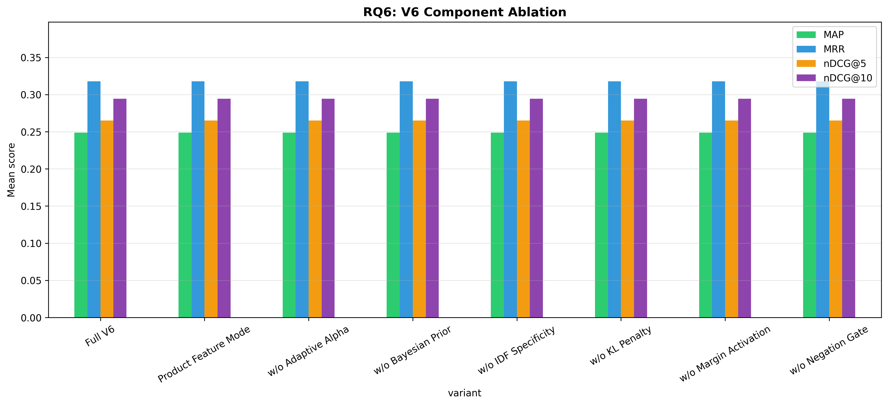

# H2L V6 Ablation Study — Full Report

**Generated**: 2026-07-30 10:24:28
**Evaluation**: Real retrieval via EvaluationRunner with ground truth cases

---

## Overview

This study systematically evaluates H2L V6 components using **real retrieval** 
(not simulated/mock data). Each experiment toggles one component while holding 
others constant, measuring impact on rank-aware metrics.

## RQ6: V6 Component Ablation

| Configuration | P@5 | R@5 | F1@5 | DCG@5 | IDCG@5 | nDCG@5 | P@10 | R@10 | F1@10 | DCG@10 | IDCG@10 | nDCG@10 | MAP | MRR |
|---|---|---|---|---|---|---|---|---|---|---|---|---|---|---|
| Full V6 | 0.1474 ± 0.2126 | 0.3023 ± 0.4028 | 0.1819 ± 0.2424 | 0.7500 ± 1.2465 | 1.2238 ± 1.8389 | 0.2651 ± 0.3622 | 0.0974 ± 0.1376 | 0.3862 ± 0.4562 | 0.1462 ± 0.1930 | 0.8511 ± 1.3565 | 1.2329 ± 1.8492 | 0.2943 ± 0.3736 | 0.2488 ± 0.3349 | 0.3178 ± 0.4373 |
| Product Feature Mode | 0.1474 ± 0.2126 | 0.3023 ± 0.4028 | 0.1819 ± 0.2424 | 0.7500 ± 1.2465 | 1.2238 ± 1.8389 | 0.2651 ± 0.3622 | 0.0974 ± 0.1376 | 0.3862 ± 0.4562 | 0.1462 ± 0.1930 | 0.8511 ± 1.3565 | 1.2329 ± 1.8492 | 0.2943 ± 0.3736 | 0.2488 ± 0.3349 | 0.3178 ± 0.4373 |
| w/o Adaptive Alpha | 0.1474 ± 0.2126 | 0.3023 ± 0.4028 | 0.1819 ± 0.2424 | 0.7500 ± 1.2465 | 1.2238 ± 1.8389 | 0.2651 ± 0.3622 | 0.0974 ± 0.1376 | 0.3862 ± 0.4562 | 0.1462 ± 0.1930 | 0.8511 ± 1.3565 | 1.2329 ± 1.8492 | 0.2943 ± 0.3736 | 0.2488 ± 0.3349 | 0.3178 ± 0.4373 |
| w/o Bayesian Prior | 0.1474 ± 0.2126 | 0.3023 ± 0.4028 | 0.1819 ± 0.2424 | 0.7500 ± 1.2465 | 1.2238 ± 1.8389 | 0.2651 ± 0.3622 | 0.0974 ± 0.1376 | 0.3862 ± 0.4562 | 0.1462 ± 0.1930 | 0.8511 ± 1.3565 | 1.2329 ± 1.8492 | 0.2943 ± 0.3736 | 0.2488 ± 0.3349 | 0.3178 ± 0.4373 |
| w/o IDF Specificity | 0.1474 ± 0.2126 | 0.3023 ± 0.4028 | 0.1819 ± 0.2424 | 0.7500 ± 1.2465 | 1.2238 ± 1.8389 | 0.2651 ± 0.3622 | 0.0974 ± 0.1376 | 0.3862 ± 0.4562 | 0.1462 ± 0.1930 | 0.8511 ± 1.3565 | 1.2329 ± 1.8492 | 0.2943 ± 0.3736 | 0.2488 ± 0.3349 | 0.3178 ± 0.4373 |
| w/o KL Penalty | 0.1474 ± 0.2126 | 0.3023 ± 0.4028 | 0.1819 ± 0.2424 | 0.7500 ± 1.2465 | 1.2238 ± 1.8389 | 0.2651 ± 0.3622 | 0.0974 ± 0.1376 | 0.3862 ± 0.4562 | 0.1462 ± 0.1930 | 0.8511 ± 1.3565 | 1.2329 ± 1.8492 | 0.2943 ± 0.3736 | 0.2488 ± 0.3349 | 0.3178 ± 0.4373 |
| w/o Margin Activation | 0.1474 ± 0.2126 | 0.3023 ± 0.4028 | 0.1819 ± 0.2424 | 0.7500 ± 1.2465 | 1.2238 ± 1.8389 | 0.2651 ± 0.3622 | 0.0974 ± 0.1376 | 0.3862 ± 0.4562 | 0.1462 ± 0.1930 | 0.8511 ± 1.3565 | 1.2329 ± 1.8492 | 0.2943 ± 0.3736 | 0.2488 ± 0.3349 | 0.3178 ± 0.4373 |
| w/o Negation Gate | 0.1474 ± 0.2126 | 0.3023 ± 0.4028 | 0.1819 ± 0.2424 | 0.7500 ± 1.2465 | 1.2238 ± 1.8389 | 0.2651 ± 0.3622 | 0.0974 ± 0.1376 | 0.3862 ± 0.4562 | 0.1462 ± 0.1930 | 0.8511 ± 1.3565 | 1.2329 ± 1.8492 | 0.2943 ± 0.3736 | 0.2488 ± 0.3349 | 0.3178 ± 0.4373 |

**Score/Ranking Diagnostics:**

| Configuration | rank_changed@5 | rank_changed@10 | mean_abs_score_delta | mean_detected_problems |
|---|---:|---:|---:|---:|
| Full V6 | 100.0% | 100.0% | 0.0431 | 2.79 |
| Product Feature Mode | 100.0% | 100.0% | 0.0431 | 2.79 |
| w/o Adaptive Alpha | 100.0% | 100.0% | 0.0431 | 2.79 |
| w/o Bayesian Prior | 100.0% | 100.0% | 0.0431 | 2.79 |
| w/o IDF Specificity | 100.0% | 100.0% | 0.0431 | 2.79 |
| w/o KL Penalty | 100.0% | 100.0% | 0.0431 | 2.79 |
| w/o Margin Activation | 100.0% | 100.0% | 0.0431 | 2.79 |
| w/o Negation Gate | 100.0% | 100.0% | 0.0431 | 2.79 |

Interpretation: rank-aware relevance metrics are unchanged across one-component-disabled variants in this run, but the diagnostic columns show that component toggles alter H2L scores and top-5/top-10 ordering. Treat this as component sensitivity evidence, not yet as causal component-level effectiveness evidence.

**Statistical Tests:**

- **nDCG@5 — nDCG@5: Full V6 vs w/o Adaptive Alpha**: No difference, raw p=1.0000, Holm p=1.0000 (❌ not significant), Cohen's d=0.000 (negligible), 95% CI: (0.0, 0.0)
- **nDCG@5 — nDCG@5: Full V6 vs w/o Bayesian Prior**: No difference, raw p=1.0000, Holm p=1.0000 (❌ not significant), Cohen's d=0.000 (negligible), 95% CI: (0.0, 0.0)
- **nDCG@5 — nDCG@5: Full V6 vs w/o IDF Specificity**: No difference, raw p=1.0000, Holm p=1.0000 (❌ not significant), Cohen's d=0.000 (negligible), 95% CI: (0.0, 0.0)
- **nDCG@5 — nDCG@5: Full V6 vs w/o Margin Activation**: No difference, raw p=1.0000, Holm p=1.0000 (❌ not significant), Cohen's d=0.000 (negligible), 95% CI: (0.0, 0.0)
- **nDCG@5 — nDCG@5: Full V6 vs w/o KL Penalty**: No difference, raw p=1.0000, Holm p=1.0000 (❌ not significant), Cohen's d=0.000 (negligible), 95% CI: (0.0, 0.0)
- **nDCG@5 — nDCG@5: Full V6 vs w/o Negation Gate**: No difference, raw p=1.0000, Holm p=1.0000 (❌ not significant), Cohen's d=0.000 (negligible), 95% CI: (0.0, 0.0)
- **nDCG@5 — nDCG@5: Full V6 vs Product Feature Mode**: No difference, raw p=1.0000, Holm p=1.0000 (❌ not significant), Cohen's d=0.000 (negligible), 95% CI: (0.0, 0.0)
- **nDCG@10 — nDCG@10: Full V6 vs w/o Adaptive Alpha**: No difference, raw p=1.0000, Holm p=1.0000 (❌ not significant), Cohen's d=0.000 (negligible), 95% CI: (0.0, 0.0)
- **nDCG@10 — nDCG@10: Full V6 vs w/o Bayesian Prior**: No difference, raw p=1.0000, Holm p=1.0000 (❌ not significant), Cohen's d=0.000 (negligible), 95% CI: (0.0, 0.0)
- **nDCG@10 — nDCG@10: Full V6 vs w/o IDF Specificity**: No difference, raw p=1.0000, Holm p=1.0000 (❌ not significant), Cohen's d=0.000 (negligible), 95% CI: (0.0, 0.0)
- **nDCG@10 — nDCG@10: Full V6 vs w/o Margin Activation**: No difference, raw p=1.0000, Holm p=1.0000 (❌ not significant), Cohen's d=0.000 (negligible), 95% CI: (0.0, 0.0)
- **nDCG@10 — nDCG@10: Full V6 vs w/o KL Penalty**: No difference, raw p=1.0000, Holm p=1.0000 (❌ not significant), Cohen's d=0.000 (negligible), 95% CI: (0.0, 0.0)
- **nDCG@10 — nDCG@10: Full V6 vs w/o Negation Gate**: No difference, raw p=1.0000, Holm p=1.0000 (❌ not significant), Cohen's d=0.000 (negligible), 95% CI: (0.0, 0.0)
- **nDCG@10 — nDCG@10: Full V6 vs Product Feature Mode**: No difference, raw p=1.0000, Holm p=1.0000 (❌ not significant), Cohen's d=0.000 (negligible), 95% CI: (0.0, 0.0)

---

## Generated Files

- `rq6_results.csv`
- `rq6_v6_component_ablation.png`
- `run_metadata.json`

---

*Generated by H2L V6 Ablation Study (real evaluation pipeline)*