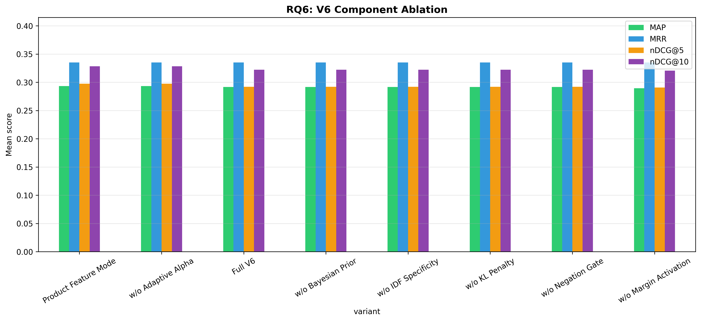

# H2L V6 Ablation Study — Full Report

**Generated**: 2026-07-30 10:32:25
**Evaluation**: Real retrieval via EvaluationRunner with ground truth cases

---

## Overview

This study systematically evaluates H2L V6 components using **real retrieval** 
(not simulated/mock data). Each experiment toggles one component while holding 
others constant, measuring impact on rank-aware metrics.

## RQ6: V6 Component Ablation

| Configuration | P@5 | R@5 | F1@5 | DCG@5 | IDCG@5 | nDCG@5 | P@10 | R@10 | F1@10 | DCG@10 | IDCG@10 | nDCG@10 | MAP | MRR |
|---|---|---|---|---|---|---|---|---|---|---|---|---|---|---|
| Full V6 | 0.1500 ± 0.2266 | 0.3193 ± 0.4367 | 0.1918 ± 0.2728 | 0.7543 ± 1.2326 | 1.1131 ± 1.5688 | 0.2921 ± 0.4099 | 0.0947 ± 0.1365 | 0.3910 ± 0.4800 | 0.1462 ± 0.2009 | 0.8324 ± 1.2775 | 1.1131 ± 1.5688 | 0.3222 ± 0.4170 | 0.2916 ± 0.3912 | 0.3351 ± 0.4519 |
| Product Feature Mode | 0.1500 ± 0.2266 | 0.3215 ± 0.4381 | 0.1926 ± 0.2736 | 0.7543 ± 1.2326 | 1.0811 ± 1.5217 | 0.2975 ± 0.4134 | 0.0947 ± 0.1365 | 0.3943 ± 0.4833 | 0.1467 ± 0.2016 | 0.8324 ± 1.2775 | 1.0811 ± 1.5217 | 0.3285 ± 0.4223 | 0.2933 ± 0.3930 | 0.3351 ± 0.4519 |
| w/o Adaptive Alpha | 0.1500 ± 0.2266 | 0.3215 ± 0.4381 | 0.1926 ± 0.2736 | 0.7543 ± 1.2326 | 1.0811 ± 1.5217 | 0.2975 ± 0.4134 | 0.0947 ± 0.1365 | 0.3943 ± 0.4833 | 0.1467 ± 0.2016 | 0.8324 ± 1.2775 | 1.0811 ± 1.5217 | 0.3285 ± 0.4223 | 0.2933 ± 0.3930 | 0.3351 ± 0.4519 |
| w/o Bayesian Prior | 0.1500 ± 0.2266 | 0.3193 ± 0.4367 | 0.1918 ± 0.2728 | 0.7543 ± 1.2326 | 1.1131 ± 1.5688 | 0.2921 ± 0.4099 | 0.0947 ± 0.1365 | 0.3910 ± 0.4800 | 0.1462 ± 0.2009 | 0.8324 ± 1.2775 | 1.1131 ± 1.5688 | 0.3222 ± 0.4170 | 0.2916 ± 0.3912 | 0.3351 ± 0.4519 |
| w/o IDF Specificity | 0.1500 ± 0.2266 | 0.3193 ± 0.4367 | 0.1918 ± 0.2728 | 0.7543 ± 1.2326 | 1.1131 ± 1.5688 | 0.2921 ± 0.4099 | 0.0947 ± 0.1365 | 0.3910 ± 0.4800 | 0.1462 ± 0.2009 | 0.8324 ± 1.2775 | 1.1131 ± 1.5688 | 0.3222 ± 0.4170 | 0.2916 ± 0.3912 | 0.3351 ± 0.4519 |
| w/o KL Penalty | 0.1500 ± 0.2266 | 0.3193 ± 0.4367 | 0.1918 ± 0.2728 | 0.7543 ± 1.2326 | 1.1131 ± 1.5688 | 0.2921 ± 0.4099 | 0.0947 ± 0.1365 | 0.3910 ± 0.4800 | 0.1462 ± 0.2009 | 0.8324 ± 1.2775 | 1.1131 ± 1.5688 | 0.3222 ± 0.4170 | 0.2916 ± 0.3912 | 0.3351 ± 0.4519 |
| w/o Margin Activation | 0.1500 ± 0.2266 | 0.3149 ± 0.4315 | 0.1909 ± 0.2716 | 0.7543 ± 1.2326 | 1.1197 ± 1.5805 | 0.2906 ± 0.4078 | 0.0947 ± 0.1365 | 0.3866 ± 0.4758 | 0.1459 ± 0.2006 | 0.8324 ± 1.2775 | 1.1197 ± 1.5805 | 0.3207 ± 0.4150 | 0.2895 ± 0.3894 | 0.3351 ± 0.4519 |
| w/o Negation Gate | 0.1500 ± 0.2266 | 0.3193 ± 0.4367 | 0.1918 ± 0.2728 | 0.7543 ± 1.2326 | 1.1131 ± 1.5688 | 0.2921 ± 0.4099 | 0.0947 ± 0.1365 | 0.3910 ± 0.4800 | 0.1462 ± 0.2009 | 0.8324 ± 1.2775 | 1.1131 ± 1.5688 | 0.3222 ± 0.4170 | 0.2916 ± 0.3912 | 0.3351 ± 0.4519 |

**Score/Ranking Diagnostics:**

| Configuration | rank_changed@5 | rank_changed@10 | mean_abs_score_delta | mean_detected_problems |
|---|---:|---:|---:|---:|
| w/o Bayesian Prior | 1.3% | 3.9% | 0.2329 | 2.79 |
| w/o KL Penalty | 1.3% | 3.9% | 0.2200 | 2.79 |
| Full V6 | 1.3% | 3.9% | 0.2197 | 2.79 |
| w/o Margin Activation | 3.9% | 7.9% | 0.2163 | 2.79 |
| w/o Negation Gate | 1.3% | 3.9% | 0.1715 | 2.79 |
| w/o IDF Specificity | 1.3% | 3.9% | 0.1692 | 2.79 |
| w/o Adaptive Alpha | 1.3% | 3.9% | 0.1217 | 2.79 |
| Product Feature Mode | 1.3% | 3.9% | 0.0129 | 2.79 |

Interpretation: rank-aware relevance metrics are unchanged across one-component-disabled variants in this run, but the diagnostic columns show that component toggles alter H2L scores and top-5/top-10 ordering. Treat this as component sensitivity evidence, not yet as causal component-level effectiveness evidence.

**Statistical Tests:**

- **nDCG@5 — nDCG@5: Full V6 vs w/o Adaptive Alpha**: Wilcoxon, raw p=0.3173, Holm p=1.0000 (❌ not significant), Cohen's d=-0.115 (negligible), 95% CI: (-0.0158, 0.0051)
- **nDCG@5 — nDCG@5: Full V6 vs w/o Bayesian Prior**: No difference, raw p=1.0000, Holm p=1.0000 (❌ not significant), Cohen's d=0.000 (negligible), 95% CI: (0.0, 0.0)
- **nDCG@5 — nDCG@5: Full V6 vs w/o IDF Specificity**: No difference, raw p=1.0000, Holm p=1.0000 (❌ not significant), Cohen's d=0.000 (negligible), 95% CI: (0.0, 0.0)
- **nDCG@5 — nDCG@5: Full V6 vs w/o Margin Activation**: Wilcoxon, raw p=0.3173, Holm p=1.0000 (❌ not significant), Cohen's d=0.115 (negligible), 95% CI: (-0.0014, 0.0044)
- **nDCG@5 — nDCG@5: Full V6 vs w/o KL Penalty**: No difference, raw p=1.0000, Holm p=1.0000 (❌ not significant), Cohen's d=0.000 (negligible), 95% CI: (0.0, 0.0)
- **nDCG@5 — nDCG@5: Full V6 vs w/o Negation Gate**: No difference, raw p=1.0000, Holm p=1.0000 (❌ not significant), Cohen's d=0.000 (negligible), 95% CI: (0.0, 0.0)
- **nDCG@5 — nDCG@5: Full V6 vs Product Feature Mode**: Wilcoxon, raw p=0.3173, Holm p=1.0000 (❌ not significant), Cohen's d=-0.115 (negligible), 95% CI: (-0.0158, 0.0051)
- **nDCG@10 — nDCG@10: Full V6 vs w/o Adaptive Alpha**: Wilcoxon, raw p=0.3173, Holm p=1.0000 (❌ not significant), Cohen's d=-0.115 (negligible), 95% CI: (-0.0187, 0.006)
- **nDCG@10 — nDCG@10: Full V6 vs w/o Bayesian Prior**: No difference, raw p=1.0000, Holm p=1.0000 (❌ not significant), Cohen's d=0.000 (negligible), 95% CI: (0.0, 0.0)
- **nDCG@10 — nDCG@10: Full V6 vs w/o IDF Specificity**: No difference, raw p=1.0000, Holm p=1.0000 (❌ not significant), Cohen's d=0.000 (negligible), 95% CI: (0.0, 0.0)
- **nDCG@10 — nDCG@10: Full V6 vs w/o Margin Activation**: Wilcoxon, raw p=0.3173, Holm p=1.0000 (❌ not significant), Cohen's d=0.115 (negligible), 95% CI: (-0.0014, 0.0044)
- **nDCG@10 — nDCG@10: Full V6 vs w/o KL Penalty**: No difference, raw p=1.0000, Holm p=1.0000 (❌ not significant), Cohen's d=0.000 (negligible), 95% CI: (0.0, 0.0)
- **nDCG@10 — nDCG@10: Full V6 vs w/o Negation Gate**: No difference, raw p=1.0000, Holm p=1.0000 (❌ not significant), Cohen's d=0.000 (negligible), 95% CI: (0.0, 0.0)
- **nDCG@10 — nDCG@10: Full V6 vs Product Feature Mode**: Wilcoxon, raw p=0.3173, Holm p=1.0000 (❌ not significant), Cohen's d=-0.115 (negligible), 95% CI: (-0.0187, 0.006)

---

## Generated Files

- `rq6_results.csv`
- `rq6_v6_component_ablation.png`
- `run_metadata.json`

---

*Generated by H2L V6 Ablation Study (real evaluation pipeline)*