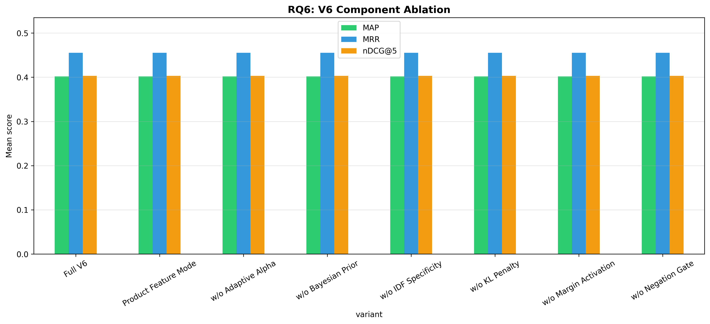

# H2L V6 Ablation Study — Full Report

**Generated**: 2026-04-26 09:17:06
**Evaluation**: Real retrieval via EvaluationRunner with ground truth cases

---

## Overview

This study systematically evaluates H2L V6 components using **real retrieval** 
(not simulated/mock data). Each experiment toggles one component while holding 
others constant, measuring impact on rank-aware metrics.

## RQ6: V6 Component Ablation

| Configuration | P@5 | R@5 | F1@5 | nDCG@5 | MAP | MRR |
|---|---|---|---|---|---|---|
| Full V6 | 0.1559 ± 0.2040 | 0.4268 ± 0.4488 | 0.2037 ± 0.2215 | 0.4031 ± 0.4299 | 0.4020 ± 0.4236 | 0.4551 ± 0.4734 |
| Product Feature Mode | 0.1559 ± 0.2040 | 0.4268 ± 0.4488 | 0.2037 ± 0.2215 | 0.4031 ± 0.4299 | 0.4020 ± 0.4236 | 0.4551 ± 0.4734 |
| w/o Adaptive Alpha | 0.1559 ± 0.2040 | 0.4268 ± 0.4488 | 0.2037 ± 0.2215 | 0.4031 ± 0.4299 | 0.4020 ± 0.4236 | 0.4551 ± 0.4734 |
| w/o Bayesian Prior | 0.1559 ± 0.2040 | 0.4268 ± 0.4488 | 0.2037 ± 0.2215 | 0.4031 ± 0.4299 | 0.4020 ± 0.4236 | 0.4551 ± 0.4734 |
| w/o IDF Specificity | 0.1559 ± 0.2040 | 0.4268 ± 0.4488 | 0.2037 ± 0.2215 | 0.4031 ± 0.4299 | 0.4020 ± 0.4236 | 0.4551 ± 0.4734 |
| w/o KL Penalty | 0.1559 ± 0.2040 | 0.4268 ± 0.4488 | 0.2037 ± 0.2215 | 0.4031 ± 0.4299 | 0.4020 ± 0.4236 | 0.4551 ± 0.4734 |
| w/o Margin Activation | 0.1559 ± 0.2040 | 0.4268 ± 0.4488 | 0.2037 ± 0.2215 | 0.4031 ± 0.4299 | 0.4020 ± 0.4236 | 0.4551 ± 0.4734 |
| w/o Negation Gate | 0.1559 ± 0.2040 | 0.4268 ± 0.4488 | 0.2037 ± 0.2215 | 0.4031 ± 0.4299 | 0.4020 ± 0.4236 | 0.4551 ± 0.4734 |

**Score/Ranking Diagnostics:**

| Configuration | rank_changed@5 | mean_abs_score_delta | mean_detected_problems |
|---|---:|---:|---:|
| Full V6 | 98.5% | 0.0628 | 3.07 |
| Product Feature Mode | 98.5% | 0.0628 | 3.07 |
| w/o Adaptive Alpha | 98.5% | 0.0628 | 3.07 |
| w/o Bayesian Prior | 98.5% | 0.0628 | 3.07 |
| w/o IDF Specificity | 98.5% | 0.0628 | 3.07 |
| w/o KL Penalty | 98.5% | 0.0628 | 3.07 |
| w/o Margin Activation | 98.5% | 0.0628 | 3.07 |
| w/o Negation Gate | 98.5% | 0.0628 | 3.07 |

Interpretation: rank-aware relevance metrics are unchanged across one-component-disabled variants in this run, but the diagnostic columns show that component toggles alter H2L scores and top-5 ordering. Treat this as component sensitivity evidence, not yet as causal component-level effectiveness evidence.

**Statistical Tests:**

- **Full V6 vs w/o Adaptive Alpha**: No difference, p=1.0000 (❌ not significant), Cohen's d=0.000 (negligible), 95% CI: (0.0, 0.0)
- **Full V6 vs w/o Bayesian Prior**: No difference, p=1.0000 (❌ not significant), Cohen's d=0.000 (negligible), 95% CI: (0.0, 0.0)
- **Full V6 vs w/o IDF Specificity**: No difference, p=1.0000 (❌ not significant), Cohen's d=0.000 (negligible), 95% CI: (0.0, 0.0)
- **Full V6 vs w/o Margin Activation**: No difference, p=1.0000 (❌ not significant), Cohen's d=0.000 (negligible), 95% CI: (0.0, 0.0)
- **Full V6 vs w/o KL Penalty**: No difference, p=1.0000 (❌ not significant), Cohen's d=0.000 (negligible), 95% CI: (0.0, 0.0)
- **Full V6 vs w/o Negation Gate**: No difference, p=1.0000 (❌ not significant), Cohen's d=0.000 (negligible), 95% CI: (0.0, 0.0)
- **Full V6 vs Product Feature Mode**: No difference, p=1.0000 (❌ not significant), Cohen's d=0.000 (negligible), 95% CI: (0.0, 0.0)
- **w/o Adaptive Alpha vs w/o Bayesian Prior**: No difference, p=1.0000 (❌ not significant), Cohen's d=0.000 (negligible), 95% CI: (0.0, 0.0)
- **w/o Adaptive Alpha vs w/o IDF Specificity**: No difference, p=1.0000 (❌ not significant), Cohen's d=0.000 (negligible), 95% CI: (0.0, 0.0)
- **w/o Adaptive Alpha vs w/o Margin Activation**: No difference, p=1.0000 (❌ not significant), Cohen's d=0.000 (negligible), 95% CI: (0.0, 0.0)
- **w/o Adaptive Alpha vs w/o KL Penalty**: No difference, p=1.0000 (❌ not significant), Cohen's d=0.000 (negligible), 95% CI: (0.0, 0.0)
- **w/o Adaptive Alpha vs w/o Negation Gate**: No difference, p=1.0000 (❌ not significant), Cohen's d=0.000 (negligible), 95% CI: (0.0, 0.0)
- **w/o Adaptive Alpha vs Product Feature Mode**: No difference, p=1.0000 (❌ not significant), Cohen's d=0.000 (negligible), 95% CI: (0.0, 0.0)
- **w/o Bayesian Prior vs w/o IDF Specificity**: No difference, p=1.0000 (❌ not significant), Cohen's d=0.000 (negligible), 95% CI: (0.0, 0.0)
- **w/o Bayesian Prior vs w/o Margin Activation**: No difference, p=1.0000 (❌ not significant), Cohen's d=0.000 (negligible), 95% CI: (0.0, 0.0)
- **w/o Bayesian Prior vs w/o KL Penalty**: No difference, p=1.0000 (❌ not significant), Cohen's d=0.000 (negligible), 95% CI: (0.0, 0.0)
- **w/o Bayesian Prior vs w/o Negation Gate**: No difference, p=1.0000 (❌ not significant), Cohen's d=0.000 (negligible), 95% CI: (0.0, 0.0)
- **w/o Bayesian Prior vs Product Feature Mode**: No difference, p=1.0000 (❌ not significant), Cohen's d=0.000 (negligible), 95% CI: (0.0, 0.0)
- **w/o IDF Specificity vs w/o Margin Activation**: No difference, p=1.0000 (❌ not significant), Cohen's d=0.000 (negligible), 95% CI: (0.0, 0.0)
- **w/o IDF Specificity vs w/o KL Penalty**: No difference, p=1.0000 (❌ not significant), Cohen's d=0.000 (negligible), 95% CI: (0.0, 0.0)
- **w/o IDF Specificity vs w/o Negation Gate**: No difference, p=1.0000 (❌ not significant), Cohen's d=0.000 (negligible), 95% CI: (0.0, 0.0)
- **w/o IDF Specificity vs Product Feature Mode**: No difference, p=1.0000 (❌ not significant), Cohen's d=0.000 (negligible), 95% CI: (0.0, 0.0)
- **w/o Margin Activation vs w/o KL Penalty**: No difference, p=1.0000 (❌ not significant), Cohen's d=0.000 (negligible), 95% CI: (0.0, 0.0)
- **w/o Margin Activation vs w/o Negation Gate**: No difference, p=1.0000 (❌ not significant), Cohen's d=0.000 (negligible), 95% CI: (0.0, 0.0)
- **w/o Margin Activation vs Product Feature Mode**: No difference, p=1.0000 (❌ not significant), Cohen's d=0.000 (negligible), 95% CI: (0.0, 0.0)
- **w/o KL Penalty vs w/o Negation Gate**: No difference, p=1.0000 (❌ not significant), Cohen's d=0.000 (negligible), 95% CI: (0.0, 0.0)
- **w/o KL Penalty vs Product Feature Mode**: No difference, p=1.0000 (❌ not significant), Cohen's d=0.000 (negligible), 95% CI: (0.0, 0.0)
- **w/o Negation Gate vs Product Feature Mode**: No difference, p=1.0000 (❌ not significant), Cohen's d=0.000 (negligible), 95% CI: (0.0, 0.0)

---

## Baseline Comparison

| Method | P@5 | F1@5 | nDCG@5 | MAP | MRR |
|---|---|---|---|---|---|
| basic | 0.1500 | 0.1989 | 0.4056 | 0.4002 | 0.4577 |
| **h2l-hybrid** | 0.1412 | 0.1918 | 0.4083 | 0.4064 | 0.4586 |

---

## Advanced Computational Analysis

### Bootstrap BCa 95% Confidence Intervals

| Strategy | nDCG@5 | MAP |
|---|---|---|
| basic | 0.4056 [0.3095, 0.5192] | 0.4002 [0.3065, 0.5137] |
| h2l-hybrid | 0.4083 [0.3164, 0.5256] | 0.4064 [0.3148, 0.5168] |

### Bayesian Signed-Rank Analysis

| Comparison | P(H2L wins) | P(ROPE) | P(Baseline wins) |
|---|---|---|---|
| h2l-hybrid vs basic | 0.209 | 0.715 | 0.076 |

### Stratified Effect Size (Forest)

| Complexity | Cohen's d | 95% CI | n |
|---|---|---|---|
| moderate | 0.154 | [0.121, 0.186] | 32 |
| complex | -0.181 | [-0.214, -0.148] | 20 |
| simple | 0.000 | [0.000, 0.000] | 16 |

---

## Generated Files

- `advanced_bayesian.png`
- `advanced_bootstrap_ci.png`
- `advanced_forest_plot.png`
- `baseline_comparison.png`
- `baseline_results.csv`
- `rq6_results.csv`
- `rq6_v6_component_ablation.png`

---

*Generated by H2L V6 Ablation Study (real evaluation pipeline)*