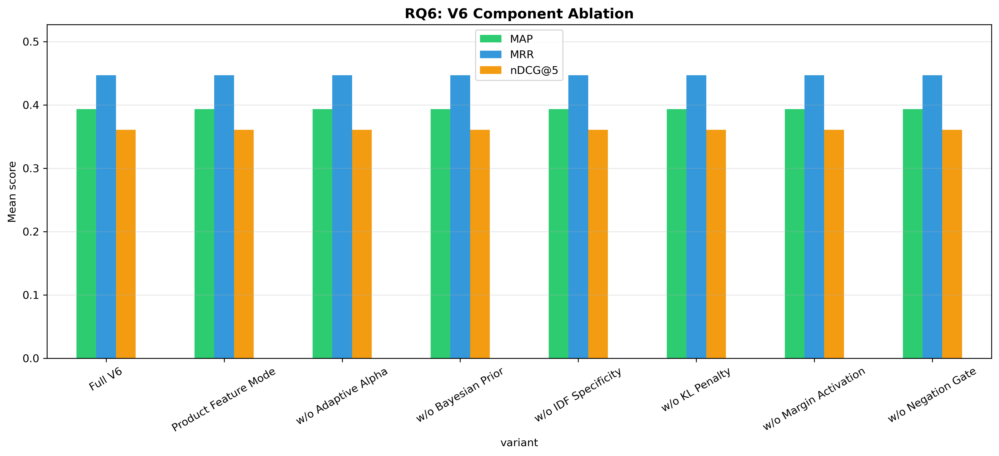

# H2L V6 Ablation Study — Full Report

**Generated**: 2026-04-25 17:31:44
**Evaluation**: Real retrieval via EvaluationRunner with ground truth cases

---

## Overview

This study systematically evaluates H2L V6 components using **real retrieval** 
(not simulated/mock data). Each experiment toggles one component while holding 
others constant, measuring impact on rank-aware metrics.

## RQ6: V6 Component Ablation

| Configuration | P@5 | R@5 | F1@5 | nDCG@5 | MAP | MRR |
|---|---|---|---|---|---|---|
| Full V6 | 0.1700 ± 0.2273 | 0.3837 ± 0.4344 | 0.2051 ± 0.2344 | 0.3609 ± 0.4106 | 0.3935 ± 0.4245 | 0.4467 ± 0.4802 |
| Product Feature Mode | 0.1700 ± 0.2273 | 0.3837 ± 0.4344 | 0.2051 ± 0.2344 | 0.3609 ± 0.4106 | 0.3935 ± 0.4245 | 0.4467 ± 0.4802 |
| w/o Adaptive Alpha | 0.1700 ± 0.2273 | 0.3837 ± 0.4344 | 0.2051 ± 0.2344 | 0.3609 ± 0.4106 | 0.3935 ± 0.4245 | 0.4467 ± 0.4802 |
| w/o Bayesian Prior | 0.1700 ± 0.2273 | 0.3837 ± 0.4344 | 0.2051 ± 0.2344 | 0.3609 ± 0.4106 | 0.3935 ± 0.4245 | 0.4467 ± 0.4802 |
| w/o IDF Specificity | 0.1700 ± 0.2273 | 0.3837 ± 0.4344 | 0.2051 ± 0.2344 | 0.3609 ± 0.4106 | 0.3935 ± 0.4245 | 0.4467 ± 0.4802 |
| w/o KL Penalty | 0.1700 ± 0.2273 | 0.3837 ± 0.4344 | 0.2051 ± 0.2344 | 0.3609 ± 0.4106 | 0.3935 ± 0.4245 | 0.4467 ± 0.4802 |
| w/o Margin Activation | 0.1700 ± 0.2273 | 0.3837 ± 0.4344 | 0.2051 ± 0.2344 | 0.3609 ± 0.4106 | 0.3935 ± 0.4245 | 0.4467 ± 0.4802 |
| w/o Negation Gate | 0.1700 ± 0.2273 | 0.3837 ± 0.4344 | 0.2051 ± 0.2344 | 0.3609 ± 0.4106 | 0.3935 ± 0.4245 | 0.4467 ± 0.4802 |

**Score/Ranking Diagnostics:**

| Configuration | rank_changed@5 | mean_abs_score_delta | mean_detected_problems |
|---|---:|---:|---:|
| w/o Bayesian Prior | 15.0% | 0.6098 | 3.15 |
| w/o Negation Gate | 15.0% | 0.5197 | 3.15 |
| w/o KL Penalty | 15.0% | 0.5172 | 3.15 |
| Full V6 | 15.0% | 0.5163 | 3.15 |
| w/o Margin Activation | 15.0% | 0.5117 | 3.15 |
| w/o IDF Specificity | 15.0% | 0.4330 | 3.15 |
| w/o Adaptive Alpha | 15.0% | 0.2572 | 3.15 |
| Product Feature Mode | 15.0% | 0.0230 | 3.15 |

Interpretation: rank-aware relevance metrics are unchanged across one-component-disabled variants in this run, but the diagnostic columns show that component toggles alter H2L scores and top-5 ordering. Treat this as component sensitivity evidence, not yet as causal component-level effectiveness evidence.

**Statistical Tests:**

- **Full V6 vs w/o Adaptive Alpha**: No difference, p=1.0000 (❌ not significant), Cohen's d=0.000 (negligible), 95% CI: (0.0, 0.0)
- **Full V6 vs w/o Bayesian Prior**: No difference, p=1.0000 (❌ not significant), Cohen's d=0.000 (negligible), 95% CI: (0.0, 0.0)
- **Full V6 vs w/o IDF Specificity**: No difference, p=1.0000 (❌ not significant), Cohen's d=0.000 (negligible), 95% CI: (0.0, 0.0)
- **Full V6 vs w/o Margin Activation**: No difference, p=1.0000 (❌ not significant), Cohen's d=0.000 (negligible), 95% CI: (0.0, 0.0)
- **Full V6 vs w/o KL Penalty**: No difference, p=1.0000 (❌ not significant), Cohen's d=0.000 (negligible), 95% CI: (0.0, 0.0)
- **Full V6 vs w/o Negation Gate**: No difference, p=1.0000 (❌ not significant), Cohen's d=0.000 (negligible), 95% CI: (0.0, 0.0)
- **Full V6 vs Product Feature Mode**: No difference, p=1.0000 (❌ not significant), Cohen's d=0.000 (negligible), 95% CI: (0.0, 0.0)
- **w/o Adaptive Alpha vs w/o Bayesian Prior**: No difference, p=1.0000 (❌ not significant), Cohen's d=0.000 (negligible), 95% CI: (0.0, 0.0)
- **w/o Adaptive Alpha vs w/o IDF Specificity**: No difference, p=1.0000 (❌ not significant), Cohen's d=0.000 (negligible), 95% CI: (0.0, 0.0)
- **w/o Adaptive Alpha vs w/o Margin Activation**: No difference, p=1.0000 (❌ not significant), Cohen's d=0.000 (negligible), 95% CI: (0.0, 0.0)
- **w/o Adaptive Alpha vs w/o KL Penalty**: No difference, p=1.0000 (❌ not significant), Cohen's d=0.000 (negligible), 95% CI: (0.0, 0.0)
- **w/o Adaptive Alpha vs w/o Negation Gate**: No difference, p=1.0000 (❌ not significant), Cohen's d=0.000 (negligible), 95% CI: (0.0, 0.0)
- **w/o Adaptive Alpha vs Product Feature Mode**: No difference, p=1.0000 (❌ not significant), Cohen's d=0.000 (negligible), 95% CI: (0.0, 0.0)
- **w/o Bayesian Prior vs w/o IDF Specificity**: No difference, p=1.0000 (❌ not significant), Cohen's d=0.000 (negligible), 95% CI: (0.0, 0.0)
- **w/o Bayesian Prior vs w/o Margin Activation**: No difference, p=1.0000 (❌ not significant), Cohen's d=0.000 (negligible), 95% CI: (0.0, 0.0)
- **w/o Bayesian Prior vs w/o KL Penalty**: No difference, p=1.0000 (❌ not significant), Cohen's d=0.000 (negligible), 95% CI: (0.0, 0.0)
- **w/o Bayesian Prior vs w/o Negation Gate**: No difference, p=1.0000 (❌ not significant), Cohen's d=0.000 (negligible), 95% CI: (0.0, 0.0)
- **w/o Bayesian Prior vs Product Feature Mode**: No difference, p=1.0000 (❌ not significant), Cohen's d=0.000 (negligible), 95% CI: (0.0, 0.0)
- **w/o IDF Specificity vs w/o Margin Activation**: No difference, p=1.0000 (❌ not significant), Cohen's d=0.000 (negligible), 95% CI: (0.0, 0.0)
- **w/o IDF Specificity vs w/o KL Penalty**: No difference, p=1.0000 (❌ not significant), Cohen's d=0.000 (negligible), 95% CI: (0.0, 0.0)
- **w/o IDF Specificity vs w/o Negation Gate**: No difference, p=1.0000 (❌ not significant), Cohen's d=0.000 (negligible), 95% CI: (0.0, 0.0)
- **w/o IDF Specificity vs Product Feature Mode**: No difference, p=1.0000 (❌ not significant), Cohen's d=0.000 (negligible), 95% CI: (0.0, 0.0)
- **w/o Margin Activation vs w/o KL Penalty**: No difference, p=1.0000 (❌ not significant), Cohen's d=0.000 (negligible), 95% CI: (0.0, 0.0)
- **w/o Margin Activation vs w/o Negation Gate**: No difference, p=1.0000 (❌ not significant), Cohen's d=0.000 (negligible), 95% CI: (0.0, 0.0)
- **w/o Margin Activation vs Product Feature Mode**: No difference, p=1.0000 (❌ not significant), Cohen's d=0.000 (negligible), 95% CI: (0.0, 0.0)
- **w/o KL Penalty vs w/o Negation Gate**: No difference, p=1.0000 (❌ not significant), Cohen's d=0.000 (negligible), 95% CI: (0.0, 0.0)
- **w/o KL Penalty vs Product Feature Mode**: No difference, p=1.0000 (❌ not significant), Cohen's d=0.000 (negligible), 95% CI: (0.0, 0.0)
- **w/o Negation Gate vs Product Feature Mode**: No difference, p=1.0000 (❌ not significant), Cohen's d=0.000 (negligible), 95% CI: (0.0, 0.0)

---

## Generated Files

- `rq6_results.csv`
- `rq6_v6_component_ablation.png`

---

*Generated by H2L V6 Ablation Study (real evaluation pipeline)*