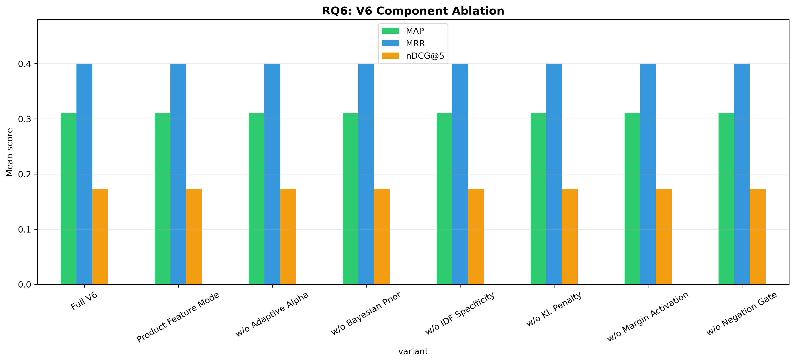

# H2L V6 Ablation Study — Full Report

**Generated**: 2026-04-25 16:15:49
**Evaluation**: Real retrieval via EvaluationRunner with ground truth cases

---

## Overview

This study systematically evaluates H2L V6 components using **real retrieval** 
(not simulated/mock data). Each experiment toggles one component while holding 
others constant, measuring impact on rank-aware metrics.

## RQ6: V6 Component Ablation

| Configuration | P@5 | R@5 | F1@5 | nDCG@5 | MAP | MRR |
|---|---|---|---|---|---|---|
| Full V6 | 0.2400 ± 0.3578 | 0.2600 ± 0.3715 | 0.2489 ± 0.3633 | 0.1733 ± 0.2432 | 0.3110 ± 0.4349 | 0.4000 ± 0.5477 |
| Product Feature Mode | 0.2400 ± 0.3578 | 0.2600 ± 0.3715 | 0.2489 ± 0.3633 | 0.1733 ± 0.2432 | 0.3110 ± 0.4349 | 0.4000 ± 0.5477 |
| w/o Adaptive Alpha | 0.2400 ± 0.3578 | 0.2600 ± 0.3715 | 0.2489 ± 0.3633 | 0.1733 ± 0.2432 | 0.3110 ± 0.4349 | 0.4000 ± 0.5477 |
| w/o Bayesian Prior | 0.2400 ± 0.3578 | 0.2600 ± 0.3715 | 0.2489 ± 0.3633 | 0.1733 ± 0.2432 | 0.3110 ± 0.4349 | 0.4000 ± 0.5477 |
| w/o IDF Specificity | 0.2400 ± 0.3578 | 0.2600 ± 0.3715 | 0.2489 ± 0.3633 | 0.1733 ± 0.2432 | 0.3110 ± 0.4349 | 0.4000 ± 0.5477 |
| w/o KL Penalty | 0.2400 ± 0.3578 | 0.2600 ± 0.3715 | 0.2489 ± 0.3633 | 0.1733 ± 0.2432 | 0.3110 ± 0.4349 | 0.4000 ± 0.5477 |
| w/o Margin Activation | 0.2400 ± 0.3578 | 0.2600 ± 0.3715 | 0.2489 ± 0.3633 | 0.1733 ± 0.2432 | 0.3110 ± 0.4349 | 0.4000 ± 0.5477 |
| w/o Negation Gate | 0.2400 ± 0.3578 | 0.2600 ± 0.3715 | 0.2489 ± 0.3633 | 0.1733 ± 0.2432 | 0.3110 ± 0.4349 | 0.4000 ± 0.5477 |

**Statistical Tests:**

- **Full V6 vs w/o Adaptive Alpha**: Wilcoxon, p=1.0000 (❌ not significant), Cohen's d=0.000 (negligible), 95% CI: (0.0, 0.0)
- **Full V6 vs w/o Bayesian Prior**: Wilcoxon, p=1.0000 (❌ not significant), Cohen's d=0.000 (negligible), 95% CI: (0.0, 0.0)
- **Full V6 vs w/o IDF Specificity**: Wilcoxon, p=1.0000 (❌ not significant), Cohen's d=0.000 (negligible), 95% CI: (0.0, 0.0)
- **Full V6 vs w/o Margin Activation**: Wilcoxon, p=1.0000 (❌ not significant), Cohen's d=0.000 (negligible), 95% CI: (0.0, 0.0)
- **Full V6 vs w/o KL Penalty**: Wilcoxon, p=1.0000 (❌ not significant), Cohen's d=0.000 (negligible), 95% CI: (0.0, 0.0)
- **Full V6 vs w/o Negation Gate**: Wilcoxon, p=1.0000 (❌ not significant), Cohen's d=0.000 (negligible), 95% CI: (0.0, 0.0)
- **Full V6 vs Product Feature Mode**: Wilcoxon, p=1.0000 (❌ not significant), Cohen's d=0.000 (negligible), 95% CI: (0.0, 0.0)
- **w/o Adaptive Alpha vs w/o Bayesian Prior**: Wilcoxon, p=1.0000 (❌ not significant), Cohen's d=0.000 (negligible), 95% CI: (0.0, 0.0)
- **w/o Adaptive Alpha vs w/o IDF Specificity**: Wilcoxon, p=1.0000 (❌ not significant), Cohen's d=0.000 (negligible), 95% CI: (0.0, 0.0)
- **w/o Adaptive Alpha vs w/o Margin Activation**: Wilcoxon, p=1.0000 (❌ not significant), Cohen's d=0.000 (negligible), 95% CI: (0.0, 0.0)
- **w/o Adaptive Alpha vs w/o KL Penalty**: Wilcoxon, p=1.0000 (❌ not significant), Cohen's d=0.000 (negligible), 95% CI: (0.0, 0.0)
- **w/o Adaptive Alpha vs w/o Negation Gate**: Wilcoxon, p=1.0000 (❌ not significant), Cohen's d=0.000 (negligible), 95% CI: (0.0, 0.0)
- **w/o Adaptive Alpha vs Product Feature Mode**: Wilcoxon, p=1.0000 (❌ not significant), Cohen's d=0.000 (negligible), 95% CI: (0.0, 0.0)
- **w/o Bayesian Prior vs w/o IDF Specificity**: Wilcoxon, p=1.0000 (❌ not significant), Cohen's d=0.000 (negligible), 95% CI: (0.0, 0.0)
- **w/o Bayesian Prior vs w/o Margin Activation**: Wilcoxon, p=1.0000 (❌ not significant), Cohen's d=0.000 (negligible), 95% CI: (0.0, 0.0)
- **w/o Bayesian Prior vs w/o KL Penalty**: Wilcoxon, p=1.0000 (❌ not significant), Cohen's d=0.000 (negligible), 95% CI: (0.0, 0.0)
- **w/o Bayesian Prior vs w/o Negation Gate**: Wilcoxon, p=1.0000 (❌ not significant), Cohen's d=0.000 (negligible), 95% CI: (0.0, 0.0)
- **w/o Bayesian Prior vs Product Feature Mode**: Wilcoxon, p=1.0000 (❌ not significant), Cohen's d=0.000 (negligible), 95% CI: (0.0, 0.0)
- **w/o IDF Specificity vs w/o Margin Activation**: Wilcoxon, p=1.0000 (❌ not significant), Cohen's d=0.000 (negligible), 95% CI: (0.0, 0.0)
- **w/o IDF Specificity vs w/o KL Penalty**: Wilcoxon, p=1.0000 (❌ not significant), Cohen's d=0.000 (negligible), 95% CI: (0.0, 0.0)
- **w/o IDF Specificity vs w/o Negation Gate**: Wilcoxon, p=1.0000 (❌ not significant), Cohen's d=0.000 (negligible), 95% CI: (0.0, 0.0)
- **w/o IDF Specificity vs Product Feature Mode**: Wilcoxon, p=1.0000 (❌ not significant), Cohen's d=0.000 (negligible), 95% CI: (0.0, 0.0)
- **w/o Margin Activation vs w/o KL Penalty**: Wilcoxon, p=1.0000 (❌ not significant), Cohen's d=0.000 (negligible), 95% CI: (0.0, 0.0)
- **w/o Margin Activation vs w/o Negation Gate**: Wilcoxon, p=1.0000 (❌ not significant), Cohen's d=0.000 (negligible), 95% CI: (0.0, 0.0)
- **w/o Margin Activation vs Product Feature Mode**: Wilcoxon, p=1.0000 (❌ not significant), Cohen's d=0.000 (negligible), 95% CI: (0.0, 0.0)
- **w/o KL Penalty vs w/o Negation Gate**: Wilcoxon, p=1.0000 (❌ not significant), Cohen's d=0.000 (negligible), 95% CI: (0.0, 0.0)
- **w/o KL Penalty vs Product Feature Mode**: Wilcoxon, p=1.0000 (❌ not significant), Cohen's d=0.000 (negligible), 95% CI: (0.0, 0.0)
- **w/o Negation Gate vs Product Feature Mode**: Wilcoxon, p=1.0000 (❌ not significant), Cohen's d=0.000 (negligible), 95% CI: (0.0, 0.0)

---

## Generated Files

- `rq6_results.csv`
- `rq6_v6_component_ablation.png`

---

*Generated by H2L V6 Ablation Study (real evaluation pipeline)*
