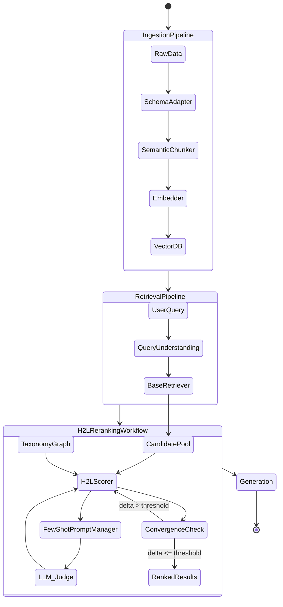

# 🚀 World-Class Technical Architecture Blueprint: `h2l-rag`

> **เอกสารข้อกำหนดทางเทคนิค (Technical Specification) สำหรับ Software Engineering (SWE) และ Data Engineering (DE)**
> *ระดับ: Staff Engineer / Principal Architect Level*
> *v3.1 — เพิ่ม Evaluation Methodology + Tokenizer Contract + Hybrid Retrieval + Anti-Overfitting Guardrails*

---

## 🏛️ 1. Architectural Workflow (วงจรการทำงานของระบบ)

ออกแบบด้วยสถาปัตยกรรมแบบ **Pipeline DAG (Directed Acyclic Graph)** พร้อม convergence loop ที่ชัดเจน



> **Convergence Loop:** H2LScorer วนซ้ำสูงสุด `max_iterations` รอบ หรือหยุดเร็วเมื่อ score delta < `convergence_delta` (early stopping) เพื่อประหยัด latency โดยไม่เสีย precision

---

## 💻 2. Software Engineering Specifications (SWE)

### 2.1 Design Patterns & Extensibility

1. **Adapter Pattern:** `connectors/` ครอบ Vector DB (Chroma, LanceDB, Qdrant, Milvus, Pinecone) → `List[H2LDocument]`
2. **Strategy Pattern:** `scorers/` สลับ algorithm (Dense Similarity, BM25, Cross-Encoder, LLM-as-a-judge)
3. **Dependency Injection:** Mock VectorDB/LLM ได้ 100% สำหรับ Unit Testing
4. **Schema Adapter Pattern (ใหม่):** `SchemaAdapter` แปลง field ของแต่ละ domain → H2L internal schema โดยอัตโนมัติ

### 2.2 Abstract Class Interfaces (เพิ่มใน v3.0)

```python
from abc import ABC, abstractmethod
from typing import List

class BaseConnector(ABC):
    """Adapter สำหรับ Vector DB ทุกชนิด"""
    @abstractmethod
    async def search(self, query_vector: list[float], top_k: int = 100) -> List[H2LDocument]: ...

    @abstractmethod
    async def upsert(self, documents: List[H2LDocument]) -> None: ...

class BaseScorer(ABC):
    """Strategy interface — สลับ scoring algorithm โดยไม่แตะ pipeline"""
    @abstractmethod
    def score(
        self,
        query: str,
        docs: List[H2LDocument],
        taxonomy: List[TaxonomyNode],
        config: H2LConfig,
    ) -> List[H2LDocument]: ...

class BaseTaxonomyLoader(ABC):
    """โหลด Taxonomy จาก JSON / DB / API"""
    @abstractmethod
    def load(self, source: str) -> List[TaxonomyNode]: ...

class BaseAutoTuner(ABC):
    """Auto-tune hyperparameters จาก labeled data"""
    @abstractmethod
    def fit(
        self,
        queries: List[str],
        relevant_doc_ids: List[List[str]],
    ) -> "H2LConfig": ...
```

### 2.3 Core Data Models (Pydantic v2)

```python
from pydantic import BaseModel, Field
from typing import List, Dict, Optional, Any

class TaxonomyNode(BaseModel):
    code: str
    name: str
    severity: float = Field(default=0.5, ge=0.0, le=1.0)
    code_type: str = Field(default="CUSTOM")
    keywords: List[str] = Field(default_factory=list)
    parent_code: Optional[str] = None  # รองรับ hierarchy

class ProblemNode(BaseModel):
    code: str = Field(..., description="Unique ID (ICD-10, ITIL, DSM-5, custom)")
    severity: float = Field(..., ge=0.0, le=1.0)

class H2LDocument(BaseModel):
    doc_id: str
    content: str
    metadata: Dict[str, Any] = Field(default_factory=dict)
    linked_codes: List[str] = Field(default_factory=list)  # Taxonomy anchors
    base_score: float = Field(default=0.0)
    h2l_score: Optional[float] = None
    score_breakdown: Optional[Dict[str, float]] = None     # Explainability
```

---

## 🗂️ 3. กลยุทธ์ที่ 1: Attribute & Mapping Driven

> **ปัญหา:** แต่ละ domain มีชื่อ field ต่างกัน — ระบบ HR เรียก `"priority_level"` แต่ Medical เรียก `"acuity_score"` ถ้า library บังคับ field name คงใช้ข้ามระบบไม่ได้

### 3.1 FieldMapping — ให้ธุรกิจแมปชื่อ field เอง

```python
from pydantic import BaseModel, Field
from typing import Optional, List, Dict

class FieldMapping(BaseModel):
    """
    กำหนดว่า field ของระบบคุณ ตรงกับ field อะไรใน H2L internal schema

    Recommendations:
    - content_field : ชี้ไปที่ field ที่มีข้อความหลัก (ยาวและมีความหมายที่สุด)
    - severity_field: ชี้ไป float 0-1 หรือ enum เช่น LOW/MED/HIGH (normalize อัตโนมัติ)
    - codes_field   : ชี้ไป list ของ taxonomy codes ที่ tag ไว้บนเอกสาร
    """
    content_field: str = "content"
    doc_id_field: str = "id"
    severity_field: Optional[str] = None          # None = ไม่มี severity ใน source
    codes_field: Optional[str] = "linked_codes"
    metadata_passthrough: List[str] = Field(default_factory=list)

    # Enum → float mapping สำหรับ severity (normalize อัตโนมัติ)
    severity_enum_map: Dict[str, float] = Field(default_factory=lambda: {
        "critical": 1.0,  "high": 0.75,  "medium": 0.5,  "low": 0.25,
        "วิกฤต":   1.0,  "สูง": 0.75,   "กลาง": 0.5,   "ต่ำ": 0.25,
    })
```

### 3.2 SchemaAdapter — แปลง raw dict → H2LDocument อัตโนมัติ

```python
from h2l.adapters import SchemaAdapter

# --- Domain 1: Social Work (สังคมสงเคราะห์) ---
sw_mapping = FieldMapping(
    content_field="case_description",
    doc_id_field="case_id",
    severity_field="risk_level",           # "วิกฤต" / "สูง" / "ต่ำ" → normalize เอง
    codes_field="problem_taxonomy_codes",  # ["P1_VIOLENCE", "P3_ECONOMIC"]
    metadata_passthrough=["caseworker_id", "district"],
)

# --- Domain 2: IT Support (ITIL) ---
itil_mapping = FieldMapping(
    content_field="incident_description",
    doc_id_field="ticket_id",
    severity_field="impact",               # "critical" / "high" / "medium" / "low"
    codes_field="itil_codes",
    metadata_passthrough=["assignee", "sla_deadline"],
)

# --- Domain 3: Healthcare (ICD-10) ---
health_mapping = FieldMapping(
    content_field="chief_complaint",
    doc_id_field="patient_id",
    severity_field="acuity_score",         # float 0.0–1.0 ตรงๆ ไม่ต้อง normalize
    codes_field="icd10_codes",
    metadata_passthrough=["ward", "attending_physician"],
)

# --- Domain 4: Legal Case Management ---
legal_mapping = FieldMapping(
    content_field="case_summary",
    doc_id_field="case_number",
    severity_field="urgency_tier",         # "URGENT" / "NORMAL" / "ROUTINE"
    severity_enum_map={"URGENT": 1.0, "NORMAL": 0.5, "ROUTINE": 0.2},
    codes_field="statute_codes",
    metadata_passthrough=["court", "filing_date"],
)

# ใช้งาน: raw_record คือ dict จาก DB/API ของคุณ
adapter = SchemaAdapter(mapping=sw_mapping)
h2l_doc: H2LDocument = adapter.transform(raw_record)

# batch transform
docs: List[H2LDocument] = adapter.transform_batch(raw_records)
```

### 3.3 Domain Preset — โหลด mapping สำเร็จรูป

```python
from h2l.presets import DomainPreset

# ใช้ preset ที่ library เตรียมไว้
adapter = SchemaAdapter(mapping=DomainPreset.SOCIAL_WORK)
adapter = SchemaAdapter(mapping=DomainPreset.ITIL)
adapter = SchemaAdapter(mapping=DomainPreset.HEALTHCARE_ICD10)
adapter = SchemaAdapter(mapping=DomainPreset.LEGAL_CASE)
adapter = SchemaAdapter(mapping=DomainPreset.HR_TICKET)

# override บางส่วน โดยไม่ต้องสร้าง mapping ใหม่ทั้งหมด
custom = DomainPreset.SOCIAL_WORK.model_copy(update={"doc_id_field": "record_no"})
```

---

## ⚙️ 4. กลยุทธ์ที่ 2: Sensible Defaults

> **ปรัชญา:** `pip install h2l-rag` แล้วรันได้เลยใน 5 นาที ไม่ต้องอ่าน doc ก่อน

### 4.1 H2LConfig — ค่า default ทุกอย่างพร้อมใช้งาน

```python
from pydantic import BaseModel, Field
from typing import Literal

class H2LConfig(BaseModel):
    # ── Scoring weights ──────────────────────────────────────────────────────
    alpha_base: float = Field(
        default=0.6, ge=0.0, le=1.0,
        description=(
            "น้ำหนัก base retriever score. "
            "↑ เพิ่ม: base retrieval ดีอยู่แล้ว (nDCG > 0.7) หรือ domain เป็น general-purpose. "
            "↓ ลด: taxonomy แรงและ domain-specific สูง."
        ),
    )
    alpha_eff: float = Field(
        default=0.4, ge=0.0, le=1.0,
        description=(
            "น้ำหนัก domain effectiveness score. "
            "↑ เพิ่ม: taxonomy label ครบ, domain-specific (Medical/Legal/Social Work). "
            "↓ ลด: taxonomy บาง หรือ domain เป็น general QA."
        ),
    )
    normalize_scores: bool = Field(
        default=False,
        description="True = บังคับ alpha_base + alpha_eff = 1.0 อัตโนมัติ (softmax normalization)",
    )

    # ── Tokenization (สำคัญมากสำหรับภาษาที่ไม่มีช่องว่าง) ──────────────────────
    tokenizer: Literal["whitespace", "thai_newmm", "tiktoken", "char"] = Field(
        default="whitespace",
        description=(
            "วิธีนับความยาว query สำหรับ G_len. "
            "⚠️ ภาษาไทย/ญี่ปุ่น/จีน ต้องใช้ 'thai_newmm' หรือ 'char' — "
            "'whitespace' จะนับประโยคไทยทั้งประโยคได้ 1 คำ ทำให้ G_len พังทั้งระบบ. "
            "ดู §6.4 สำหรับผลกระทบเชิงตัวเลข."
        ),
    )

    # ── Query length sigmoid G_len ────────────────────────────────────────────
    sigmoid_lambda: float = Field(
        default=0.15, gt=0.0,
        description=(
            "ความชันของ sigmoid. "
            "↑ เพิ่ม: query สั้นก็ได้ domain boost เต็มที่ (chatbot/helpdesk). "
            "↓ ลด: ต้องการ query ยาวพอก่อน domain boost จึงจะเปิด."
        ),
    )
    domain_agg: Literal["max", "mean", "logsumexp", "top2_mean"] = Field(
        default="max",
        description=(
            "วิธีรวมคะแนนเมื่อ doc แมปหลาย taxonomy node. "
            "'max' (default): เอา node รุนแรงสุด — เหมาะกับ triage. "
            "'logsumexp': เคสที่มีหลายปัญหาซ้อนได้เครดิตเพิ่ม — เหมาะกับ Social Work ที่เคสซับซ้อนควรถูกจัดลำดับสูงกว่า. "
            "'top2_mean': balanced. 'mean': เจือจางเมื่อ tag เยอะ (ไม่แนะนำถ้า severity ต่างกันมาก)."
        ),
    )
    sigmoid_L0: float = Field(
        default=8.0, gt=0.0,
        description=(
            "จุดกึ่งกลาง sigmoid (ความยาว query หน่วยเป็นคำ). "
            "↑ เพิ่ม: domain ที่ query มักยาว (Legal, Medical — ตั้ง 12-20). "
            "↓ ลด: domain ที่ query มักสั้น (IT Helpdesk, chatbot — ตั้ง 3-6)."
        ),
    )

    # ── Hybrid Search (Dense + Sparse) ────────────────────────────────────────
    hybrid_enabled: bool = Field(
        default=True,
        description=(
            "เปิด hybrid retrieval (dense + BM25) รวมด้วย RRF. "
            "True (default): production — ช่วย +5-15% precision, latency +10-20ms เท่านั้น. "
            "False: dense-only เมื่อ corpus ไม่มี exact-match term (เช่น รหัส ICD-10, ชื่อยา)."
        ),
    )
    rrf_k: int = Field(
        default=60,
        description=(
            "ค่าคงที่ RRF ลดผลของ rank สูงๆ (ค่ามาตรฐานงานวิจัย = 60). "
            "↑ เพิ่ม: ให้ rank ต่ำมีน้ำหนักใกล้ rank สูง (flatten). "
            "↓ ลด: เน้น top rank แรงขึ้น."
        ),
    )
    dense_weight: float = Field(
        default=0.6, ge=0.0, le=1.0,
        description=(
            "น้ำหนัก dense ใน RRF (sparse = 1 - dense_weight). "
            "↑ เพิ่ม: query เป็นภาษาธรรมชาติ/เชิงความหมาย (Social Work 0.7). "
            "↓ ลด: query มี exact term เยอะ (รหัส ITIL, error code → 0.4)."
        ),
    )

    # ── Retrieval ─────────────────────────────────────────────────────────────
    top_k_retrieval: int = Field(
        default=100,
        description=(
            "จำนวน candidate ที่ดึงมาก่อน rerank. "
            "↑ เพิ่ม: recall สำคัญ (Medical triage ตั้ง 200+). "
            "↓ ลด: latency สำคัญ (real-time chatbot ตั้ง 20-50)."
        ),
    )
    top_k_final: int = Field(
        default=10,
        description="จำนวน result สุดท้ายส่งให้ LLM generation",
    )

    # ── H2L Reranking loop ────────────────────────────────────────────────────
    max_iterations: int = Field(
        default=3,
        description=(
            "รอบ feedback loop สูงสุด. "
            "↑ เพิ่ม: precision สำคัญกว่า latency (batch processing ตั้ง 5-7). "
            "↓ ลด: real-time (ตั้ง 1 = single-pass, ตั้ง 2 สำหรับ balanced)."
        ),
    )
    convergence_delta: float = Field(
        default=0.01,
        description=(
            "หยุด loop เมื่อ score เปลี่ยนน้อยกว่านี้ (early stopping). "
            "↑ เพิ่ม: หยุดเร็ว ประหยัด compute. "
            "↓ ลด: converge ให้ครบก่อนหยุด (เหมาะกับ high-stakes)."
        ),
    )

    # ── LLM Judge ─────────────────────────────────────────────────────────────
    llm_judge_enabled: bool = Field(
        default=False,
        description=(
            "เปิด LLM-as-a-judge (แม่นขึ้น แต่ช้าและแพงขึ้น). "
            "True: high-stakes เช่น Medical triage, Legal priority. "
            "False (default): fast path — scoring ล้วน ไม่เรียก LLM."
        ),
    )
    llm_judge_mode: Literal["hyde", "l2_validation", "both"] = Field(
        default="hyde",
        description=(
            "HyDE: สร้าง hypothetical answer แล้ว re-embed (แนะนำสำหรับ query สั้น). "
            "L2: ให้ LLM score candidate โดยตรง (แม่นกว่า แต่แพงกว่า). "
            "both: รัน HyDE ก่อน แล้วใช้ L2 validate ผล top-K."
        ),
    )
    llm_judge_top_k: int = Field(
        default=20,
        description="จำนวน candidate ที่ส่ง LLM judge (subset of top_k_retrieval เพื่อประหยัด cost)",
    )

    # ── Embedding versioning (จำเป็นสำหรับ migration) ──────────────────────────
    embedding_model_id: str = Field(
        default="unspecified",
        description=(
            "ID + version ของ embedding model ที่ใช้ index. "
            "⚠️ ต้องบันทึกไว้ — ถ้าเปลี่ยน model แล้วไม่ re-index ทั้ง collection "
            "score จะเพี้ยนแบบเงียบๆ ไม่มี error. ระบบจะ warn เมื่อ mismatch."
        ),
    )
    embedding_dim: int | None = Field(
        default=None,
        description="มิติของ vector — ใช้ validate ว่า query vector กับ index ตรงกัน",
    )

    # ── Persistence ───────────────────────────────────────────────────────────
    def save(self, path: str) -> None:
        """บันทึก config เป็น JSON สำหรับใช้ซ้ำใน production"""
        import json, pathlib
        pathlib.Path(path).write_text(self.model_dump_json(indent=2))

    @classmethod
    def load(cls, path: str) -> "H2LConfig":
        import json, pathlib
        return cls.model_validate_json(pathlib.Path(path).read_text())
```

### 4.2 Zero-Config Quick Start

```python
from h2l import H2LPipeline

# ── Zero config: ทุกอย่างใช้ Sensible Defaults ──────────────────────────────
pipeline = H2LPipeline.auto(
    vector_db="lancedb",
    taxonomy_path="taxonomy.json",
)
results = await pipeline.search("ผู้ป่วยมีความเสี่ยงฆ่าตัวตาย")

# ── Partial override: เปลี่ยนแค่ที่อยากเปลี่ยน (ที่เหลือ = defaults) ──────────
config = H2LConfig(alpha_eff=0.7, llm_judge_enabled=True)
pipeline = H2LPipeline(connector=my_connector, config=config, taxonomy=taxonomy)

# ── Domain preset: โหลด config ที่ tune แล้วตาม domain ─────────────────────
from h2l.presets import ConfigPreset
pipeline = H2LPipeline.auto(
    vector_db="lancedb",
    taxonomy_path="taxonomy.json",
    config=ConfigPreset.SOCIAL_WORK,    # alpha_eff=0.65, sigmoid_L0=10.0, ...
)
```

---

## 🤖 5. กลยุทธ์ที่ 3: Auto-Tuning / Fit Method

> **ปัญหา:** `alpha_base=0.6` อาจดีสำหรับ Social Work แต่ IT Support อาจต้องการ `0.8` — ให้โมเดลหาเองแทนที่จะ guess

### 5.1 H2LAutoTuner Interface

```python
from h2l.tuning import H2LAutoTuner, TuningStrategy
from typing import Literal

class H2LAutoTuner(BaseAutoTuner):
    """
    รับ labeled data (queries + relevant doc IDs) แล้วหาค่า H2LConfig
    ที่ maximize metric เป้าหมาย (nDCG, MAP, MRR)

    Strategies:
    - "grid"     : brute-force grid search (เล็กแต่ reproducible, ดีสำหรับ < 4 params)
    - "bayesian" : Optuna TPE sampler (เร็วกว่า grid 10x สำหรับ param เยอะ) ← แนะนำ
    - "random"   : random search baseline (เร็วสุด แต่ไม่ exploit structure)
    """

    def __init__(
        self,
        connector: BaseConnector,
        taxonomy: list[TaxonomyNode],
        strategy: Literal["grid", "bayesian", "random"] = "bayesian",
        n_trials: int = 50,
        cv_folds: int = 3,           # k-fold cross-validation ป้องกัน overfitting
        min_queries: int = 30,       # ต่ำกว่านี้ = raise (กัน overfit ที่ดูเหมือนสำเร็จ)
        tie_alphas: bool = True,     # fix alpha_base = 1 - alpha_eff → ลด 1 มิติ, score เทียบข้าง config ได้
        metric: str = "ndcg@10",     # "ndcg@10" | "map" | "mrr"
        n_jobs: int = -1,            # parallel trials (-1 = ใช้ CPU ทั้งหมด)
        search_space: "TuningSearchSpace | None" = None,  # None = ใช้ default space
    ) -> None: ...

    def fit(
        self,
        queries: list[str],
        relevant_doc_ids: list[list[str]],  # [[doc_id1, doc_id2], [doc_id3], ...]
    ) -> H2LConfig:
        """Returns H2LConfig ที่ tune แล้ว พร้อม .tuning_report"""
        ...

    def fit_from_file(self, jsonl_path: str) -> H2LConfig:
        """โหลด labeled data จากไฟล์ JSONL format: {"query": ..., "relevant_ids": [...]}"""
        ...

    @property
    def tuning_report(self) -> dict:
        """เรียกหลัง fit() — สรุปผลการ tune"""
        ...
```

### 5.2 ตัวอย่างการใช้งาน

```python
from h2l.tuning import H2LAutoTuner

# ── Labeled data ──────────────────────────────────────────────────────────────
labeled_queries = [
    "ผู้ป่วยมีความเสี่ยงทำร้ายตัวเอง",
    "ครอบครัวมีปัญหาความรุนแรงในบ้าน",
    "เด็กถูกทอดทิ้ง ไม่มีผู้ดูแล",
]
relevant_ids = [
    ["case_001", "case_045", "case_103"],
    ["case_022", "case_067"],
    ["case_089"],
]

# ── Run Auto-Tuning ───────────────────────────────────────────────────────────
tuner = H2LAutoTuner(
    connector=my_connector,
    taxonomy=taxonomy,
    strategy="bayesian",
    n_trials=100,
    metric="ndcg@10",
)
best_config = tuner.fit(labeled_queries, relevant_ids)

print(best_config)
# H2LConfig(
#   alpha_base=0.42, alpha_eff=0.58,
#   sigmoid_lambda=0.12, sigmoid_L0=6.5,
#   top_k_retrieval=100, max_iterations=2, ...
# )

print(tuner.tuning_report)
# {
#   "train_ndcg@10":    0.871,
#   "val_ndcg@10":      0.847,    ← ค่าที่ใช้ตัดสินใจ
#   "train_val_gap":    0.024,    ← > 0.10 = overfit, เตือนอัตโนมัติ
#   "baseline_ndcg@10": 0.712,    ← Sensible Defaults ก่อน tune
#   "improvement":      "+18.9%",
#   "p_value":          0.003,    ← paired bootstrap vs baseline
#   "n_queries":        45,
#   "n_trials_run":     100,
#   "param_importance": {"alpha_eff": 0.52, "sigmoid_L0": 0.31, ...},  # Optuna fANOVA
#   "warnings":         [],
# }

# ── บันทึก / โหลด config (ไม่ต้อง tune ซ้ำใน production) ────────────────────
best_config.save("configs/h2l_social_work_v1.json")
config = H2LConfig.load("configs/h2l_social_work_v1.json")
```

### 5.3 TuningSearchSpace — ปรับ search range ตาม domain

```python
from h2l.tuning import TuningSearchSpace

class TuningSearchSpace(BaseModel):
    alpha_base:      tuple[float, float] = (0.2, 0.9)
    alpha_eff:       tuple[float, float] = (0.1, 0.8)
    sigmoid_lambda:  tuple[float, float] = (0.05, 0.5)
    sigmoid_L0:      tuple[float, float] = (3.0, 20.0)
    max_iterations:  tuple[int,   int]   = (1, 5)

# Domain-specific search spaces (แนะนำโดย library)
DOMAIN_SEARCH_SPACES = {
    # Social Work: domain signal แรง, query ยาวปานกลาง
    "social_work": TuningSearchSpace(
        alpha_base=(0.3, 0.7), alpha_eff=(0.3, 0.7),
        sigmoid_lambda=(0.05, 0.25), sigmoid_L0=(5.0, 15.0),
    ),
    # IT Support: base retrieval แม่น (keyword match), query สั้น
    "it_support": TuningSearchSpace(
        alpha_base=(0.5, 0.9), alpha_eff=(0.1, 0.5),
        sigmoid_lambda=(0.2, 0.5), sigmoid_L0=(3.0, 8.0),
    ),
    # Healthcare: domain signal สำคัญมาก (ICD-10), query ยาว
    "healthcare": TuningSearchSpace(
        alpha_base=(0.2, 0.6), alpha_eff=(0.4, 0.8),
        sigmoid_lambda=(0.05, 0.15), sigmoid_L0=(8.0, 20.0),
    ),
    # Legal: query ยาวมาก, taxonomy codes เป็น statute
    "legal": TuningSearchSpace(
        alpha_base=(0.2, 0.5), alpha_eff=(0.5, 0.8),
        sigmoid_lambda=(0.05, 0.12), sigmoid_L0=(12.0, 25.0),
    ),
    # HR / General: balanced, query ปานกลาง
    "hr_general": TuningSearchSpace(
        alpha_base=(0.4, 0.7), alpha_eff=(0.3, 0.6),
        sigmoid_lambda=(0.1, 0.3), sigmoid_L0=(4.0, 10.0),
    ),
}

tuner = H2LAutoTuner(
    connector=connector,
    taxonomy=taxonomy,
    search_space=DOMAIN_SEARCH_SPACES["social_work"],
)
```

---

## 📊 6. Parameter Recommendation Table (คู่มือปรับค่า)

### 6.1 ตารางหลัก — ปรับค่าแต่ละตัวเมื่อไหร่

| Parameter | Default | Range | ↑ เพิ่มเมื่อ | ↓ ลดเมื่อ | ผลข้างเคียง |
|---|---|---|---|---|---|
| `alpha_base` | `0.6` | 0.2–0.9 | Base retriever แม่นอยู่แล้ว (nDCG > 0.7), domain general | Taxonomy แรง, domain เฉพาะทาง | สูงเกิน → เสีย domain signal |
| `alpha_eff` | `0.4` | 0.1–0.8 | Taxonomy label ครบ + domain-specific สูง | Taxonomy บาง / label ไม่ครบ | สูงเกิน → over-fit taxonomy, พลาด doc ที่ไม่ได้ tag |
| `sigmoid_lambda` | `0.15` | 0.05–0.5 | อยากให้ query สั้นได้ boost เต็ม (chatbot) | ต้องการ query ยาวพอก่อน boost | สูงเกิน → sigmoid เป็น step function |
| `sigmoid_L0` | `8.0` | 3–25 | Query ยาว (Legal 12–25, Medical 8–20) | Query สั้น (Helpdesk 3–6) | ตั้งผิด → domain boost ไม่ทำงานเลย |
| `tokenizer` | `whitespace` | 4 modes | — | — | ⚠️ ภาษาไทยต้องใช้ `thai_newmm` ไม่งั้น `G_len` พัง (ดู §6.4) |
| `domain_agg` | `max` | 4 modes | `logsumexp` เมื่อเคสมีหลายปัญหาซ้อน | `max` เมื่อ triage ตามความรุนแรงสูงสุด | `mean` เจือจางเมื่อ tag เยอะ |
| `hybrid_enabled` | `True` | bool | Production (default) | Corpus ไม่มี exact-match term | `False` → เสีย 5–15% precision |
| `dense_weight` | `0.6` | 0.0–1.0 | Query เชิงความหมาย (Social Work 0.7) | Query มี exact code (ITIL 0.4) | — |
| `rrf_k` | `60` | 10–100 | Flatten rank distribution | เน้น top rank | ค่ามาตรฐานงานวิจัย = 60 |
| `top_k_retrieval` | `100` | 20–500 | Recall สำคัญ (Medical triage 200+) | Latency สำคัญ (real-time 20–50) | สูง → latency + cost เพิ่มเป็นเส้นตรง |
| `top_k_final` | `10` | 3–50 | LLM context ใหญ่, ต้องการ coverage | Context window จำกัด | สูงเกิน → LLM สับสน (lost-in-middle) |
| `max_iterations` | `3` | 1–7 | Precision > latency (batch job 5–7) | Real-time (1–2) | สูง → latency คูณตามรอบ |
| `convergence_delta` | `0.01` | 0.001–0.05 | อยากหยุดเร็ว ประหยัด compute | High-stakes ต้อง converge จริง | สูงเกิน → หยุดก่อน converge |
| `llm_judge_enabled` | `False` | bool | High-stakes (Medical, Legal) | ต้องการ fast path / cost ต่ำ | `True` → latency +2–5s, cost เพิ่มมาก |
| `llm_judge_top_k` | `20` | 5–50 | Budget เยอะ, ต้องการความแม่น | Cost sensitive | สูง → LLM cost เพิ่มเป็นเส้นตรง |

### 6.2 ตาราง Preset ตาม Domain (ค่าที่แนะนำ)

| Domain | `alpha_base` | `alpha_eff` | `λ` | `L0` | `top_k` | `max_iter` | `tokenizer` | `domain_agg` | `dense_w` | LLM Judge |
|---|---|---|---|---|---|---|---|---|---|---|
| **Social Work TH** | 0.35 | 0.65 | 0.12 | 10.0 | 100 | 3 | `thai_newmm` | `logsumexp` | 0.70 | ✅ `l2_validation` |
| **Healthcare** (ICD-10) | 0.30 | 0.70 | 0.10 | 14.0 | 200 | 3 | `thai_newmm` | `max` | 0.50 | ✅ `both` |
| **Legal** (คดี/กฎหมาย) | 0.30 | 0.70 | 0.08 | 18.0 | 150 | 4 | `thai_newmm` | `top2_mean` | 0.55 | ✅ `l2_validation` |
| **IT Support** (ITIL) | 0.75 | 0.25 | 0.30 | 5.0 | 50 | 2 | `whitespace` | `max` | 0.40 | ❌ |
| **HR Ticket** | 0.60 | 0.40 | 0.20 | 6.0 | 50 | 2 | `whitespace` | `max` | 0.55 | ❌ |
| **E-commerce Search** | 0.85 | 0.15 | 0.40 | 3.0 | 30 | 1 | `whitespace` | `max` | 0.50 | ❌ |
| **General QA / Chatbot** | 0.80 | 0.20 | 0.35 | 4.0 | 30 | 1 | `whitespace` | `max` | 0.60 | ❌ |

> **หมายเหตุ:** ค่าในตารางเป็น *จุดเริ่มต้นที่มีเหตุผล* (informed prior) ไม่ใช่ค่าที่พิสูจน์ด้วยการทดลอง — ใช้เป็นจุดตั้งต้นแล้วรัน `H2LAutoTuner` เมื่อมี labeled data

### 6.3 Decision Tree — เลือกค่าเริ่มต้นแบบเร็ว

```
STEP 0 (บังคับ): ภาษาที่ไม่มีช่องว่างระหว่างคำ (ไทย/ญี่ปุ่น/จีน)?
└─ ใช่ → ตั้ง tokenizer="thai_newmm" ก่อนทำอย่างอื่น  (ดู §6.4)

มี labeled data (>= 30 queries) ไหม?
├─ มี  → ใช้ H2LAutoTuner(strategy="bayesian", n_trials=100) ← แนะนำที่สุด
└─ ไม่มี
   ├─ Domain อยู่ในตาราง 6.2? → ใช้ ConfigPreset.<DOMAIN>
   └─ ไม่อยู่ → ตอบ 3 คำถาม:
      1. Taxonomy label ครบแค่ไหน?
         > 80% ของ doc มี code → alpha_eff = 0.6
         40-80%               → alpha_eff = 0.4  (default)
         < 40%                → alpha_eff = 0.2
      2. Query ยาวเฉลี่ยกี่คำ?
         ตั้ง sigmoid_L0 = median(query_word_count)
      3. Latency budget?
         < 500ms  → max_iterations=1, llm_judge_enabled=False
         < 2s     → max_iterations=2, llm_judge_enabled=False
         > 5s ได้ → max_iterations=3, llm_judge_enabled=True
```

### 6.4 ⚠️ Tokenizer Trap — กับดักที่ทำให้ `G_len` พังเงียบๆ

ค่า `sigmoid_L0` มีหน่วยเป็น "จำนวนคำ" แต่ **ภาษาไทยไม่มีช่องว่างระหว่างคำ** ถ้าใช้ `text.split()` ผลจะเป็น:

| Query | `whitespace` | `thai_newmm` | `G_len` @ L0=8, λ=0.15 |
|---|---|---|---|
| `"ผู้ป่วยมีความเสี่ยงทำร้ายตัวเอง"` | **1** คำ | **8** คำ | 0.26 ❌ vs 0.50 ✅ |
| `"เด็กถูกทอดทิ้งไม่มีผู้ดูแล"` | **1** คำ | **7** คำ | 0.26 ❌ vs 0.46 ✅ |
| `"database connection timeout error"` | 4 คำ | 4 คำ | 0.50 = 0.50 ✅ |

**ผลกระทบ:** ทุก query ไทยได้ `G_len ≈ 0.26` เท่ากันหมด → `S_domain` ถูกกดลง ~48% → `alpha_eff` ที่ tune ไว้ไม่มีความหมาย และ AutoTuner จะ "แก้ปัญหาผิดจุด" โดยดัน `sigmoid_L0` ลงไปที่ขอบ search space (1-2) เพื่อชดเชย

> **โปรเจกต์นี้มี `count_words()` ที่ใช้ `pythainlp newmm` อยู่แล้วใน [data_pipeline.py:119-125](data_pipeline.py#L119-L125) — library ต้อง reuse logic เดียวกัน ไม่ใช่เขียน `split()` ใหม่**

```python
# h2l/tokenizers.py
def count_tokens(text: str, mode: str = "whitespace") -> int:
    if mode == "thai_newmm":
        from pythainlp.tokenize import word_tokenize
        return len(word_tokenize(text, engine="newmm", keep_whitespace=False))
    if mode == "tiktoken":
        import tiktoken
        return len(tiktoken.get_encoding("cl100k_base").encode(text))
    if mode == "char":
        return len(text)          # ⚠️ ต้องปรับ L0 เป็น ~40-80 ไม่ใช่ 8
    return len(text.split())
```

**Recommendation:** `SchemaAdapter` ควร auto-detect — ถ้า Thai character ratio > 0.3 แล้ว `tokenizer="whitespace"` ให้ warn ทันที (โปรเจกต์นี้มี `thai_char_ratio` แล้วที่ [data_pipeline.py:115](data_pipeline.py#L115))

### 6.5 ⚠️ กับดักอื่นที่ควรรู้

| กับดัก | อาการ | ทางแก้ |
|---|---|---|
| **Min-max normalize บน candidate pool** | `top_k=100` vs `top_k=20` ให้อันดับต่างกัน เพราะ min/max เปลี่ยน | normalize บน pool ขนาดคงที่ หรือใช้ z-score / rank-based |
| **`max()` ใน `S_domain` ทิ้ง multi-label** | เคสที่มี 3 ปัญหาซ้อน ได้คะแนนเท่าเคสที่มี 1 ปัญหา | เพิ่ม `domain_agg: "max" \| "mean" \| "logsumexp" \| "top2_mean"` |
| **AutoTuner overfit เมื่อ query < 30** | `tuning_report` ดูดีมาก แต่ production แย่ | บังคับ min 30 queries + report train/val gap |
| **`alpha_base + alpha_eff ≠ 1`** | เทียบ score ข้าม config ไม่ได้ | `normalize_scores=True` หรือ tune แค่ `alpha_eff` โดย fix `alpha_base = 1 - alpha_eff` |
| **เปลี่ยน embedding model ไม่ re-index** | score เพี้ยนแบบไม่มี error | `embedding_model_id` + validate ตอน connect |

---

## 📏 7. Evaluation Methodology

> **หลักการ:** ห้าม tune แล้วรายงานผลบน data ชุดเดียวกัน — นั่นคือ overfitting ที่รายงานเป็น "improvement"

### 7.1 Data Splitting Protocol

```python
from h2l.eval import H2LEvaluator, EvalSplit

split = EvalSplit.from_labeled_data(
    queries=queries, relevant_ids=relevant_ids,
    train_ratio=0.6, val_ratio=0.2, test_ratio=0.2,
    stratify_by="taxonomy_code",   # กระจาย code ให้ครบทุก split
    seed=42,
)

# tune บน train+val (k-fold ข้างใน)  →  รายงานผลบน test เท่านั้น
best_config = tuner.fit(split.train_queries, split.train_relevant_ids)
report = H2LEvaluator(config=best_config).evaluate(split.test_queries, split.test_relevant_ids)
```

### 7.2 Metrics & Pass/Fail Thresholds

| Metric | Target | ใช้ตัดสินอะไร |
|---|---|---|
| `nDCG@10` | > 0.70 | อันดับถูกต้องไหม (metric หลักสำหรับ rerank) |
| `Precision@5` | > 0.70 | doc ที่ได้ relevant ไหม |
| `Recall@20` | > 0.80 | candidate pool กว้างพอไหม (ถ้าต่ำ → ขึ้น `top_k_retrieval`) |
| `MRR` | > 0.70 | เจอ doc แรกที่ถูกเร็วไหม |
| `Hit Rate@10` | > 0.85 | binary success |
| `latency p95` | ตาม SLA | production readiness |

### 7.3 Ablation Study (บังคับสำหรับงานวิจัย)

```python
report = H2LEvaluator(config=config).ablate(
    split.test_queries, split.test_relevant_ids,
    variants={
        "base_only":       {"alpha_eff": 0.0},                  # ไม่มี H2L เลย
        "domain_only":     {"alpha_base": 0.0},
        "no_g_len":        {"disable_g_len": True},             # G_len มีผลจริงไหม
        "no_hybrid":       {"hybrid_enabled": False},
        "no_llm_judge":    {"llm_judge_enabled": False},
        "single_pass":     {"max_iterations": 1},
        "full":            {},
    },
)
# → ตารางเทียบ nDCG@10 + delta + p-value ต่อ variant
```

**Statistical significance:** ใช้ paired bootstrap (n=1000) หรือ Wilcoxon signed-rank ต่อ query ไม่ใช่เทียบ mean ลอยๆ — `report.significance_vs("base_only")` คืน p-value

### 7.4 Golden Test Set

- ขนาด 50-200 queries ต่อ domain, stratify ตาม taxonomy code และความยาว query
- version control ไว้ใน `tests/fixtures/golden/<domain>.jsonl`
- re-run ทุกครั้งที่แก้ scorer — regression > 3% nDCG = fail CI

---

## 🧮 8. Mathematical Specifications

### 8.1 สูตรคำนวณ (ต้องทำ Vectorization)

**1. Final H2L Score**

$$S_{\text{H2L}}(d, Q) = \alpha_{\text{base}} \cdot \tilde{S}_{\text{base}}(d, Q) + \alpha_{\text{eff}} \cdot S_{\text{domain}}(d, P)$$

**2. Domain Effectiveness Score**

$$S_{\text{domain}}(d, P) = \max_{p \in P} \left[ P(p) \cdot P(d \mid p) \right] \cdot G_{\text{len}}(|Q|)$$

โดย $P(p)$ = `severity` ของ taxonomy node, $P(d|p)$ = affinity ระหว่างเอกสารกับ node

**3. Query Length Gate (Sigmoid)**

$$G_{\text{len}}(L) = \frac{1}{1 + e^{-\lambda (L - L_0)}}$$

**4. Score Normalization** (ต้องทำก่อนรวม — base score กับ domain score อยู่ scale ต่างกัน)

$$\tilde{S}_{\text{base}} = \frac{S_{\text{base}} - \min(S_{\text{base}})}{\max(S_{\text{base}}) - \min(S_{\text{base}}) + \epsilon}, \quad \epsilon = 10^{-9}$$

**5. Reciprocal Rank Fusion** (สำหรับ hybrid dense + sparse)

$$S_{\text{RRF}}(d) = \frac{w_{\text{dense}}}{k + r_{\text{dense}}(d)} + \frac{1 - w_{\text{dense}}}{k + r_{\text{sparse}}(d)}, \quad k = 60$$

### 8.2 Vectorized Reference Implementation

```python
import numpy as np

def h2l_score_vectorized(
    base_scores: np.ndarray,      # shape (N,)   — N candidates
    doc_code_matrix: np.ndarray,  # shape (N, M) — binary/affinity: doc × taxonomy node
    severities: np.ndarray,       # shape (M,)   — severity ของแต่ละ node
    query: str,
    config: H2LConfig,
) -> np.ndarray:
    """คำนวณ H2L score แบบ vectorized — เร็วกว่า Python loop ~100x"""
    eps = 1e-9
    query_len = count_tokens(query, mode=config.tokenizer)   # ⚠️ ไม่ใช่ .split()

    # 1. Min-max normalize base scores → [0, 1]
    lo, hi = base_scores.min(), base_scores.max()
    base_norm = (base_scores - lo) / (hi - lo + eps)

    # 2. Query length gate (scalar)
    g_len = 1.0 / (1.0 + np.exp(-config.sigmoid_lambda * (query_len - config.sigmoid_L0)))

    # 3. Domain score: aggregate over taxonomy nodes  → shape (N,)
    weighted = doc_code_matrix * severities[np.newaxis, :]   # (N, M)
    if config.domain_agg == "max":
        agg = weighted.max(axis=1)
    elif config.domain_agg == "mean":
        agg = weighted.sum(axis=1) / np.maximum(doc_code_matrix.sum(axis=1), 1)
    elif config.domain_agg == "logsumexp":       # soft-max: multi-label ได้เครดิตเพิ่ม
        agg = np.log1p(np.exp(weighted).sum(axis=1)) / np.log1p(weighted.shape[1])
    else:                                        # "top2_mean"
        top2 = -np.sort(-weighted, axis=1)[:, :2]
        agg = top2.mean(axis=1)
    domain_score = agg * g_len

    # 4. Weighted combination
    a_base, a_eff = config.alpha_base, config.alpha_eff
    if config.normalize_scores:
        total = a_base + a_eff + eps
        a_base, a_eff = a_base / total, a_eff / total

    return a_base * base_norm + a_eff * domain_score
```

---

## 🗄️ 9. Data Engineering Specifications (DE)

### 9.1 Multi-Domain Taxonomy Schema (Single Source of Truth)

`taxonomy.json` เป็นจุดที่ Domain Expert แก้ severity ได้เองโดยไม่ต้องแตะโค้ด

```json
{
  "version": "3.0",
  "domain": "social_work",
  "code_type": "CUSTOM_TH",
  "language": "th",
  "field_mapping": {
    "content_field": "case_description",
    "doc_id_field": "case_id",
    "severity_field": "risk_level",
    "codes_field": "problem_taxonomy_codes"
  },
  "default_config": {
    "alpha_base": 0.35,
    "alpha_eff": 0.65,
    "sigmoid_lambda": 0.12,
    "sigmoid_L0": 10.0,
    "tokenizer": "thai_newmm",
    "domain_agg": "logsumexp",
    "dense_weight": 0.70
  },
  "categories": [
    {
      "code": "P1_VIOLENCE",
      "name": "ความรุนแรงในครอบครัว",
      "severity": 1.0,
      "keywords": ["ทำร้าย", "ตี", "ข่มขู่", "violence", "abuse"],
      "parent_code": null
    },
    {
      "code": "P1_VIOLENCE_CHILD",
      "name": "ความรุนแรงต่อเด็ก",
      "severity": 1.0,
      "keywords": ["เด็กถูกทำร้าย", "child abuse"],
      "parent_code": "P1_VIOLENCE"
    },
    {
      "code": "P3_ECONOMIC",
      "name": "ปัญหาเศรษฐกิจ",
      "severity": 0.5,
      "keywords": ["ไม่มีเงิน", "ตกงาน", "หนี้สิน"],
      "parent_code": null
    }
  ]
}
```

> **Note:** `field_mapping` และ `default_config` ฝังใน taxonomy ได้ — ทำให้ไฟล์เดียวพอสำหรับ bootstrap ทั้ง domain

### 9.2 Ingestion & Idempotent ETL

- **Chunking:** `SemanticSplitter` + overlap window (default `chunk_size=512`, `overlap=64`)
  - ↑ เพิ่ม `chunk_size`: เอกสารยาว มี context ต่อเนื่อง (Legal 1024)
  - ↓ ลด: เอกสารสั้น ต้องการ precision สูง (FAQ 256)
- **Schema Enforcement:** `SchemaAdapter` validate ว่ามี `linked_codes` ก่อน ingest (ถ้าไม่มี → warn + fallback keyword matching)
- **Idempotent Upsert:** `doc_id = sha256(content + source_id)[:16]` ป้องกันข้อมูลซ้ำเมื่อรัน pipeline ซ้ำ

### 9.3 Scalability & Concurrency

- **Async I/O:** query VectorDB ผ่าน event loop, `asyncio.Semaphore(default=32)` จำกัด concurrent request
- **Vectorized Scoring:** NumPy tensor ops แทน Python loop
- **Batch Embedding:** `embed_batch_size=64` (↑ ถ้า GPU memory เยอะ, ↓ ถ้า OOM)

### 9.4 Error Handling & Resilience

```python
from h2l.resilience import RetryPolicy, FallbackPolicy

class RetryPolicy(BaseModel):
    max_retries: int = 3
    backoff_factor: float = 2.0        # exponential: 1s, 2s, 4s
    timeout_seconds: float = 30.0
    retry_on: list[type[Exception]] = [ConnectionError, TimeoutError]

class FallbackPolicy(BaseModel):
    """เมื่อ component ล้ม ให้ degrade แบบ graceful ไม่ใช่ crash"""
    on_llm_failure: Literal["skip_judge", "raise", "use_cached"] = "skip_judge"
    on_taxonomy_miss: Literal["keyword_match", "zero_score", "raise"] = "keyword_match"
    on_vectordb_failure: Literal["raise", "return_empty"] = "raise"
```

| สถานการณ์ | Default Behavior | เหตุผล |
|---|---|---|
| LLM rate limit / timeout | `skip_judge` — ใช้ score ล้วน | ยังได้ผลลัพธ์ที่ใช้ได้ ดีกว่า error |
| Doc ไม่มี taxonomy code | `keyword_match` — match จาก keywords | recover ได้จาก taxonomy keywords |
| VectorDB ล่ม | `raise` | ไม่มี candidate = ไม่มีอะไรให้ rerank |
| Embedding model ล่ม | `raise` | core dependency |

---

## 👁️ 10. Observability & Visualization

### 10.1 Tracing

```python
from h2l.telemetry import setup_tracing

setup_tracing(provider="langsmith", project_name="h2l-production")
# providers: "opentelemetry" | "langsmith" | "phoenix" | "console" (default)
```

Trace แต่ละ span: `base_retrieval` → `taxonomy_match` → `h2l_scoring` → `llm_judge` → `convergence`

### 10.2 Explainability — `score_breakdown`

```python
results = await pipeline.search("เด็กถูกทอดทิ้ง")
print(results[0].score_breakdown)
# {
#   "base_score_raw":     0.712,
#   "base_score_norm":    0.845,
#   "domain_score":       0.920,
#   "matched_code":       "P1_VIOLENCE_CHILD",
#   "matched_severity":   1.0,
#   "g_len":              0.847,
#   "alpha_base_contrib": 0.296,   # 0.35 × 0.845
#   "alpha_eff_contrib":  0.598,   # 0.65 × 0.920
#   "final_h2l_score":    0.894,
#   "iterations_run":     2,
# }
```

### 10.3 Visualization & Web Export

```python
from h2l.viz import AdvancedPlotter, WebExporter

# 1. 3D Performance Landscape — หา alpha ที่ดีที่สุด (ใช้ผลจาก AutoTuner)
AdvancedPlotter.plot_3d_landscape(
    tuning_report=tuner.tuning_report,
    x="alpha_base", y="alpha_eff", z="ndcg@10",
    engine="plotly", output="landscape_3d.html",
)

# 2. Tuning convergence curve — ดูว่า Bayesian optimization converge แล้วยัง
AdvancedPlotter.plot_tuning_convergence(tuner.tuning_report, output="convergence.html")

# 3. Export payload สำหรับ Frontend (Next.js + D3.js / Three.js)
WebExporter.export_to_json(
    taxonomy=taxonomy, results=results, config=config,
    filepath="dashboard_data.json",
)
```

- **3D Semantic Embedding Space:** UMAP/t-SNE ลดมิติ → ดู cluster ของ taxonomy vs query (`Nomic Atlas` หรือ Three.js)
- **Cross-Platform Dashboard:** JSON payload → Frontend สร้าง UI เอง

---

## 📁 11. Project Structure

```
h2l-rag/
├── pyproject.toml
├── README.md
├── src/h2l/
│   ├── __init__.py              # export H2LPipeline, H2LConfig
│   ├── config.py                # H2LConfig (Sensible Defaults)
│   ├── models.py                # H2LDocument, TaxonomyNode, ProblemNode
│   ├── pipeline.py              # H2LPipeline + .auto() factory
│   ├── tokenizers.py            # count_tokens() — whitespace/thai_newmm/tiktoken/char
│   ├── adapters/
│   │   ├── base.py              # FieldMapping, SchemaAdapter
│   │   └── normalizers.py       # severity enum → float, Thai-ratio warning
│   ├── connectors/
│   │   ├── base.py              # BaseConnector (ABC)
│   │   ├── lancedb.py           # + chroma.py, qdrant.py, milvus.py, pinecone.py
│   │   └── memory.py            # InMemoryConnector สำหรับ test
│   ├── scorers/
│   │   ├── base.py              # BaseScorer (ABC)
│   │   ├── h2l.py               # H2LScorer (vectorized core)
│   │   └── cross_encoder.py     # + bm25.py
│   ├── retrieval/
│   │   ├── hybrid.py            # BM25 + dense, reciprocal_rank_fusion()
│   │   └── query_understanding.py
│   ├── eval/
│   │   ├── evaluator.py         # H2LEvaluator, ablate(), significance_vs()
│   │   ├── metrics.py           # ndcg@k, map, mrr, recall@k, hit_rate
│   │   └── splits.py            # EvalSplit (stratified train/val/test)
│   ├── taxonomy/
│   │   ├── loader.py            # BaseTaxonomyLoader, JSONTaxonomyLoader
│   │   └── graph.py             # TaxonomyGraph (hierarchy traversal)
│   ├── llm/
│   │   ├── prompt_manager.py    # PromptManager
│   │   ├── few_shot.py          # DynamicFewShotSelector
│   │   └── judge.py             # LLMJudge (HyDE / L2 validation)
│   ├── tuning/
│   │   ├── auto_tuner.py        # H2LAutoTuner (ใช้ metric จาก eval/)
│   │   └── search_space.py      # TuningSearchSpace, DOMAIN_SEARCH_SPACES
│   ├── presets/
│   │   ├── domains.py           # DomainPreset (FieldMapping presets)
│   │   └── configs.py           # ConfigPreset (H2LConfig presets)
│   ├── resilience.py            # RetryPolicy, FallbackPolicy
│   ├── telemetry.py             # setup_tracing
│   └── viz/
│       ├── plotter.py           # AdvancedPlotter
│       └── exporter.py          # WebExporter
├── tests/
│   ├── unit/                    # mock connector + mock LLM
│   ├── integration/             # in-memory LanceDB
│   └── fixtures/
│       ├── taxonomies/          # taxonomy fixtures ต่อ domain
│       └── golden/              # <domain>.jsonl — regression test set (§7.4)
└── examples/
    ├── 01_zero_config.py
    ├── 02_custom_mapping.py
    ├── 03_auto_tuning.py
    ├── 04_thai_domain.py        # tokenizer setup + ablation
    ├── 05_evaluation.py
    └── taxonomies/              # social_work.json, itil.json, icd10.json, legal.json
```

### 11.1 `pyproject.toml` Skeleton

```toml
[project]
name = "h2l-rag"
version = "0.1.0"
requires-python = ">=3.10"
dependencies = [
    "pydantic>=2.6",
    "numpy>=1.26",
]

[project.optional-dependencies]
tuning   = ["optuna>=3.5", "scikit-learn>=1.4"]
viz      = ["plotly>=5.20", "umap-learn>=0.5"]
lancedb  = ["lancedb>=0.6"]
qdrant   = ["qdrant-client>=1.8"]
llm      = ["anthropic>=0.25"]
thai     = ["pythainlp>=5.0"]              # จำเป็นสำหรับ tokenizer="thai_newmm"
hybrid   = ["rank-bm25>=0.2.2"]            # sparse retrieval สำหรับ RRF
all      = ["h2l-rag[tuning,viz,lancedb,qdrant,llm,thai,hybrid]"]
dev      = ["pytest>=8.0", "pytest-asyncio>=0.23", "ruff>=0.4", "mypy>=1.9"]

[build-system]
requires = ["hatchling"]
build-backend = "hatchling.build"

[tool.mypy]
strict = true

[tool.ruff]
line-length = 100
```

> **Dependency strategy:** core มีแค่ `pydantic` + `numpy` — VectorDB/LLM/tuning เป็น optional extras ทำให้ `pip install h2l-rag` เบาและติดตั้งเร็ว
>
> **⚠️ Graceful degradation:** `tokenizers.py` ต้อง import `pythainlp` แบบ lazy และถ้าไม่มีให้ **raise error ชัดเจน** (`"tokenizer='thai_newmm' requires: pip install h2l-rag[thai]"`) — ห้าม fallback เงียบๆ ไปที่ `split()` เพราะจะทำให้ score เพี้ยนโดยผู้ใช้ไม่รู้ตัว ซึ่งต่างจาก LLM judge ที่ fallback ได้เพราะเป็น optional enhancement

---

## 🧪 12. Testing, CI/CD, DevOps

1. **Testing Pyramid**
   - Unit: mock `BaseConnector` + mock LLM (coverage > 90%)
   - Integration: in-memory LanceDB, ยิงจริงทั้ง pipeline
   - Property-based: `hypothesis` ตรวจว่า `h2l_score` อยู่ใน [0, 1] ทุกกรณี
   - Tuning test: `AutoTuner` บน synthetic dataset ต้อง beat baseline

2. **CI/CD (GitHub Actions):** `ruff` + `ruff format` + `mypy --strict` + `pytest --cov`

3. **Publishing:** PyPI Trusted Publishing (OIDC), semantic versioning

### 12.1 Test สำคัญที่ต้องมี

```python
def test_schema_adapter_handles_all_domain_presets(): ...
def test_severity_enum_normalization_thai_and_english(): ...
def test_zero_config_pipeline_runs_without_any_override(): ...
def test_autotuner_beats_default_config_on_labeled_data(): ...
def test_convergence_loop_stops_at_max_iterations(): ...
def test_llm_failure_falls_back_to_skip_judge(): ...
def test_doc_without_taxonomy_code_uses_keyword_match(): ...
def test_h2l_score_always_in_unit_interval(): ...

# --- regression guards ที่จับ bug จริง ---
def test_thai_query_token_count_matches_pythainlp_not_whitespace(): ...
def test_g_len_differs_across_thai_queries_of_different_length(): ...   # กัน tokenizer trap
def test_adapter_warns_when_thai_text_with_whitespace_tokenizer(): ...
def test_ranking_stable_when_top_k_changes(): ...                      # กัน normalize บน pool
def test_domain_agg_logsumexp_ranks_multilabel_above_singlelabel(): ...
def test_tuner_raises_when_fewer_than_min_queries(): ...
def test_tuner_reports_train_val_gap(): ...
def test_connector_rejects_embedding_dim_mismatch(): ...
def test_rrf_fusion_matches_reference_implementation(): ...
def test_eval_split_is_deterministic_given_seed(): ...
```

---

## 💡 13. Implementation Prompt (สำหรับเริ่ม workspace ใหม่)

> *สร้าง Python library `h2l-rag` ตาม Blueprint นี้ โดยยึด 3 กลยุทธ์หลัก:*
>
> **1. Attribute & Mapping Driven** — implement `FieldMapping` + `SchemaAdapter` ให้ธุรกิจแมปชื่อ field ของตัวเองได้ พร้อม `DomainPreset` สำหรับ social_work / itil / healthcare / legal / hr
>
> **2. Sensible Defaults** — `H2LConfig` ทุก field ต้องมี default ที่ใช้งานได้ทันที และ `H2LPipeline.auto()` ต้องรันได้โดยไม่ต้องตั้งค่าอะไรเลย
>
> **3. Auto-Tuning** — `H2LAutoTuner.fit(queries, relevant_ids)` ใช้ Optuna Bayesian optimization + k-fold CV คืน `H2LConfig` ที่ tune แล้ว พร้อม `tuning_report` เทียบกับ baseline
>
> *ลำดับการทำ:*
> 1. `pyproject.toml` + project structure ตาม §11
> 2. `models.py` + `config.py` (Pydantic v2, strict typing)
> 3. `tokenizers.py` — **ทำก่อน scorer** เพราะ `G_len` พึ่งพาทั้งหมด (ดู §6.4)
> 4. `adapters/` — FieldMapping, SchemaAdapter, severity normalizer, Thai-ratio warning
> 5. `connectors/base.py` + `memory.py` (สำหรับ test) + `lancedb.py` + embedding-dim validation
> 6. `taxonomy/` — loader + graph hierarchy
> 7. `scorers/h2l.py` — vectorized scoring ตาม §8.2 + `domain_agg` ทั้ง 4 mode
> 8. `retrieval/hybrid.py` — BM25 + RRF fusion
> 9. `pipeline.py` — async orchestration + convergence loop + fallback
> 10. `eval/` — **ทำก่อน tuning** เพราะ tuner ต้องใช้ metric ตัวเดียวกัน (§7)
> 11. `tuning/` — AutoTuner + search spaces + train/val gap reporting
> 12. `presets/` — DomainPreset + ConfigPreset ตามตาราง §6.2
> 13. `llm/`, `resilience.py`, `telemetry.py`, `viz/`
> 14. tests ตาม §12.1
>
> *ข้อกำหนด: async I/O, DI ทุก dependency, `mypy --strict` ผ่าน, core dependency มีแค่ pydantic + numpy*
>
> *ข้อห้าม: ห้ามใช้ `text.split()` นับความยาว query, ห้าม tune แล้ววัดผลบน split เดียวกัน, ห้ามเปลี่ยน embedding model โดยไม่ bump `embedding_model_id`*
