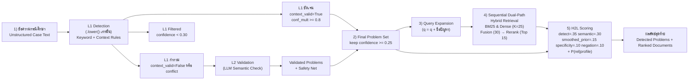
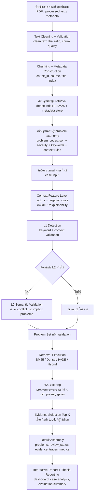
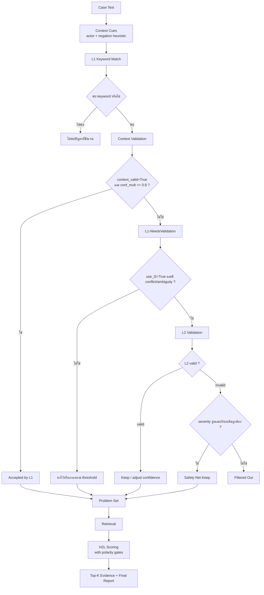
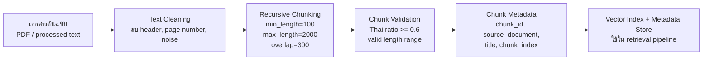
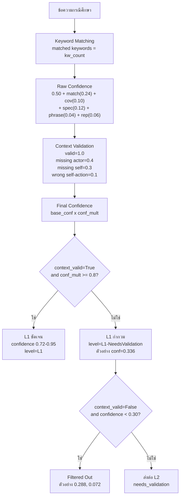
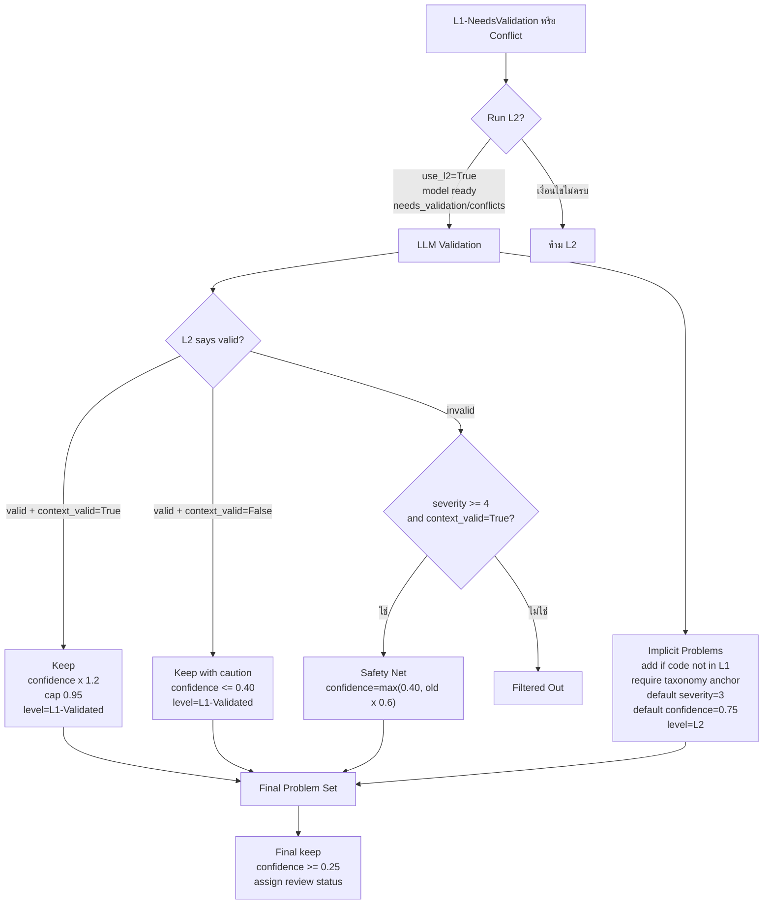
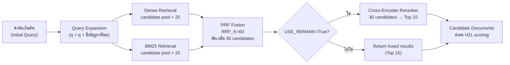
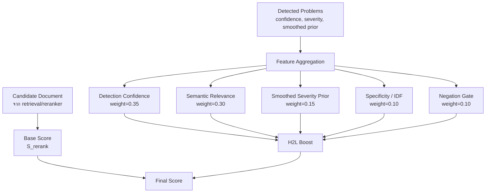
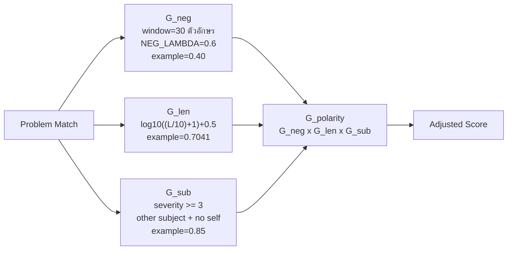

# 📄 เล่มวิทยานิพนธ์ฉบับสมบูรณ์ (H2L Thesis Master Document)
> **หมายเหตุ**: เอกสารนี้รวบรวมเนื้อหาบทคัดย่อและบทที่ 1-5 ทั้งหมดที่อัปเดตตัวเลขผลการทดลอง 100 เคสล่าสุดเรียบร้อยแล้ว

---


<!-- ==================== บทคัดย่อ (Abstract) ==================== -->

# บทคัดย่อ

**ชื่อวิทยานิพนธ์:** การสร้างคำตอบโดยการเพิ่มพูนข้อมูลสืบค้นเชิงทวิลำดับชั้นร่วมกับกลไกการสกัดขั้วบริบท เพื่อสนับสนุนการคัดกรองและวินิจฉัยปัญหาแยกโรคทางสังคม

**คำสำคัญ:** H2L, hybrid retrieval, sentence polarity, negation detection, social problem screening

---

งานสังคมสงเคราะห์ทางการแพทย์ต้องอาศัยการอ่านบันทึกกรณีศึกษาแบบข้อความเสรีจำนวนมาก ซึ่งมักมีทั้งความกำกวมทางภาษา การกล่าวถึงหลายบุคคลในเคสเดียวกัน และประโยคปฏิเสธ เช่น "ไม่ได้ทำร้ายตัวเอง" หรือ "แม่ไม่รู้เรื่อง" หากระบบสืบค้นใช้เพียงการจับคำสำคัญหรือความคล้ายเชิงความหมายโดยไม่พิจารณาบริบทอย่างเพียงพอ ย่อมเกิดผลบวกลวงและการแปลความผิดได้ง่าย งานวิจัยนี้จึงพัฒนา **H2L (A Two-Level Hierarchical Retrieval-Augmented Generation Approach with Polarity Gates for Screening and Differential Diagnosis of Social Problems)** เพื่อให้ระบบตรวจจับปัญหาสังคมและค้นคืนเอกสารหลักฐานได้แม่นยำขึ้น พร้อมมีร่องรอยการอธิบายผลที่ตรวจสอบย้อนกลับได้

H2L ประกอบด้วย 2 ระดับหลัก ได้แก่ (1) **L1 Context-Aware Keyword Detection** สำหรับคัดกรองรหัสปัญหาเบื้องต้นจาก taxonomy จำนวน 34 กลุ่ม 202 รหัสย่อย โดยใช้ keyword ร่วมกับกฎบริบท เช่น actor/context cues, passive/active pattern, self-harm pattern และ evidence boundary และ (2) **L2 Semantic Validation** ที่เรียกใช้เฉพาะกรณีรหัสกำกวม มี conflict หรือควรเพิ่มปัญหาแฝงจากบริบท จากนั้นระบบนำ problem set ที่ได้เข้าสู่ retrieval pipeline 4 แบบ ได้แก่ BM25, dense retrieval, HyDE และ hybrid retrieval แล้วใช้ **H2L scoring** ซึ่งรวม **sentence polarity gate** เป็น feature หนึ่งของสมการ เพื่อปรับอันดับเอกสารตามบริบทของเคสจริง ไม่ใช่อาศัย relevance ของเอกสารอย่างเดียว implementation ที่ใช้รายงานผลยังเพิ่ม code-specific context rules, taxonomy-anchor requirements สำหรับ implicit codes, การยุบรหัสซ้ำเชิงประเด็น และสถานะผลลัพธ์ `confirmed`, `needs_review`, `verify_documents`, `filtered` เพื่อให้ผลวิเคราะห์ระดับเคสจริงปลอดภัยและตีความง่ายขึ้น

การประเมินผลใช้ข้อมูลอ้างอิงจาก `expanded_ground_truth.json` จำนวน 197 เคส โดยใช้การแบ่งชุดข้อมูลแบบ family-level leakage-safe split เพื่อแยกเป็นชุดฝึกฝน (train) 129 เคส และชุดทดสอบ (test) 68 เคส การประเมินประสิทธิภาพการค้นคืนเอกสารดำเนินการบน 8 กลยุทธ์ ได้แก่ `bm25_only`, `naive_rag`, `hyde`, `basic` (hybrid baseline), `h2l-bm25`, `h2l-naive_rag`, `h2l-hyde` และ `h2l-hybrid` ส่วนการประเมิน sentence polarity ดำเนินการบนชุดทดสอบเดียวกันจำนวน 68 เคส ซึ่งประกอบด้วยเคสยืนยันปัญหา 50 เคส และเคสปฏิเสธ 18 เคส เพื่อวัดผลด้านความปลอดภัยแยกจากตัวชี้วัดด้านการจัดอันดับเอกสาร

ผลการประเมินประสิทธิภาพของระบบพบว่า กลยุทธ์ที่ได้ค่า **nDCG@5** สูงที่สุดคือ **H2L-BM25 = 0.2437** รองลงมาคือ **H2L-Hybrid = 0.2290** และ **Hybrid baseline = 0.2270** โดย **H2L-Hybrid** ให้ **MAP = 0.2362** และ **MRR = 0.2893** สูงที่สุดในชุดประเมิน ขณะที่ **H2L-BM25** ให้ **P@5 = 0.1176** และ **F1@5 = 0.1529** สูงที่สุด การเปรียบเทียบเชิงสถิติ (Paired comparison) พบว่า H2L-BM25 สามารถเพิ่มประสิทธิภาพ nDCG@5 เหนือ BM25 อย่างมีนัยสำคัญ (delta = +0.0359, p = 0.0131) ส่วน H2L-HyDE และ H2L-Hybrid มีแนวโน้มการปรับปรุงที่ดีขึ้นในหลายตัวชี้วัด (trend-level gains) สถาปัตยกรรม H2L จึงทำหน้าที่เป็นชั้น problem-aware scoring และ safety control ที่ช่วยเสริมประสิทธิภาพให้กับ retrieval backbone ในบางตัวชี้วัดและบางรูปแบบการใช้งาน

ในมิติของการตรวจจับประโยคปฏิเสธ (Sentence polarity) ระบบมีค่า **Accuracy = 0.8824**, **Negation Detection Rate = 0.7222**, **False Positive Rate = 0.0600** และ **F1 = 0.7647** โดยสามารถตรวจพบเคสปฏิเสธได้อย่างถูกต้อง 13 จาก 18 เคส และช่วยลดน้ำหนักเคสยืนยันปัญหาที่อาจตีความผิดพลาดได้ ผลดังกล่าวสะท้อนว่าการใช้ polarity gate แบบ rule-based ซึ่งอาศัย negation window, length gate และ subject heuristic ช่วยลดผลบวกลวง (False Positive) ได้อย่างเป็นรูปธรรม นอกจากนี้ การประเมินบทบาทขององค์ประกอบย่อย (Ablation study) แสดงให้เห็นว่าองค์ประกอบที่มีอิทธิพลในระดับ practical significance มีเพียงสถาปัตยกรรมแบบ Weighted-Sum (large effect) และ Adaptive Alpha (small effect) ส่วนองค์ประกอบอื่นมี effect size ในระดับ negligible

ข้อค้นพบสำคัญของงานวิจัยนี้คือ H2L สามารถทำหน้าที่เป็น **problem-aware scoring and safety layer** ที่ประยุกต์ใช้ร่วมกับ retrieval backbone ที่หลากหลาย โดย `h2l-hybrid` เป็นแบบจำลองที่ครอบคลุมทั้งกระบวนการตั้งแต่การสกัดปัญหา การประเมินขั้วบริบท และการจัดอันดับข้อมูล ขณะที่ `h2l-bm25` นำเสนอทางเลือกที่มีประสิทธิภาพเชิงการประมวลผลสูงและสามารถเพิ่มค่า nDCG@5 ได้อย่างมีนัยสำคัญ นอกจากนี้ ระบบยังได้บูรณาการชั้นการอธิบายผลที่ช่วยให้สามารถตรวจสอบโครงสร้างความสัมพันธ์ระหว่างปัญหาและเอกสารอ้างอิงได้อย่างโปร่งใส อันเป็นคุณสมบัติสำคัญสำหรับการนำไปใช้งานจริงในบริบทของสังคมสงเคราะห์ทางการแพทย์

---

# Abstract

**Title:** A Two-Level Hierarchical Retrieval-Augmented Generation Approach with Polarity Gates for Screening and Differential Diagnosis of Social Problems

**Keywords:** H2L, hybrid retrieval, sentence polarity, negation detection, social problem screening

---

Medical social work screening relies heavily on free-text case narratives that often contain ambiguity, multiple actors, passive constructions, self-harm descriptions, and negated statements such as "did not self-harm" or "parents were unaware." Retrieval systems that rely only on lexical overlap or semantic similarity are therefore prone to false positives and role misinterpretation. This thesis presents **H2L (A Two-Level Hierarchical Retrieval-Augmented Generation Approach with Polarity Gates for Screening and Differential Diagnosis of Social Problems)** to improve problem detection, evidence retrieval, and auditability for Thai social work case analysis.

H2L consists of two main levels. **L1 Context-Aware Keyword Detection** identifies candidate problem codes from a taxonomy of 34 groups and 202 subcodes using keyword evidence together with context cues such as actor-related terms, active/passive patterns, self-harm patterns, and evidence boundaries. **L2 Semantic Validation** is invoked only for ambiguous, conflicting, or implicit cases. The resulting problem set is then used to condition four retrieval backbones: BM25, dense retrieval, HyDE, and hybrid retrieval. Final document ranking is adjusted using **H2L scoring**, where the **sentence polarity gate** is included as one scoring feature, so the final score reflects both document relevance and case-specific problem context. The implementation reported in this thesis additionally introduces code-specific context rules, taxonomy-anchor requirements for implicit codes, duplicate-code collapse, and runtime review states (`confirmed`, `needs_review`, `verify_documents`, `filtered`) to improve robustness on real case narratives.

Evaluation uses `expanded_ground_truth.json` with 197 annotated cases stored in a unified file and separated by a family-level leakage-safe `split` field into 129 training cases and 68 test cases. The main retrieval results reported in this thesis come from real runs with `problem_source=detected` and `top_k=15` across eight strategies: `bm25_only`, `naive_rag`, `hyde`, `basic` (hybrid baseline), `h2l-bm25`, `h2l-naive_rag`, `h2l-hyde`, and `h2l-hybrid`. Sentence polarity evaluation is reported separately on the same 68 test cases, comprising 50 affirmative cases and 18 negated cases.

The unified proper evaluation shows that **H2L-BM25** achieves the best **nDCG@5 = 0.2437**, followed by **H2L-Hybrid = 0.2290** and the **hybrid baseline = 0.2270**. **H2L-Hybrid** yields the best **MAP = 0.2362** and **MRR = 0.2893**, while **H2L-BM25** gives the best **P@5 = 0.1176** and **F1@5 = 0.1529**. Paired comparisons indicate a statistically significant improvement of H2L-BM25 over BM25 in nDCG@5 (delta = +0.0359, p = 0.0131), with H2L-HyDE and H2L-Hybrid demonstrating trend-level gains across selected metrics.

For sentence polarity, the system achieves **Accuracy = 0.8824**, **Negation Detection Rate = 0.7222**, **False Positive Rate = 0.0600**, and **F1 = 0.7647**, successfully reducing false positives in negated cases while maintaining robust detection on affirmative statements. Component ablation studies show that only two components reach practical significance: the Weighted-Sum architecture (large effect) and Adaptive Alpha (small effect); the remaining components exhibit negligible effect sizes despite reaching statistical significance under the paired Wilcoxon test.

This thesis demonstrates that H2L effectively functions as a **problem-aware scoring and safety layer** adaptable to multiple retrieval backbones. The `h2l-hybrid` model represents a comprehensive architecture that unifies detection, retrieval, polarity filtering, and explanation, whereas `h2l-bm25` offers a highly efficient alternative with significant nDCG@5 improvements. By integrating an interactive explanation stack, the system ensures transparency and traceability in mapping clinical narratives to standard problem taxonomy, establishing a solid foundation for robust medical social work screening.


---


<!-- ==================== บทที่ 1: บทนำ (Introduction) ==================== -->

# บทที่ 1: บทนำ (Introduction)

## 1.1 ความเป็นมาและความสำคัญของปัญหา (Background and Significance)

งานสังคมสงเคราะห์ทางการแพทย์และงานคัดกรองปัญหาสังคมในโรงพยาบาลต้องอาศัยการอ่านบันทึกข้อความเสรีจำนวนมาก เช่น บันทึกการสัมภาษณ์ผู้รับบริการ การลงพื้นที่เยี่ยมบ้าน และสรุปปัญหาครอบครัวหรือสุขภาพจิต ข้อความเหล่านี้มักประกอบด้วยบริบทหลายชั้นในเคสเดียวกัน เช่น มีหลายบุคคลเกี่ยวข้อง มีการใช้ active/passive voice มี self-harm ที่กล่าวอย่างอ้อม มี clause ที่ขัดกัน และมีประโยคปฏิเสธ เช่น "ไม่ได้ทำร้ายตัวเอง" หรือ "บิดามารดาไม่รู้เรื่อง" ทำให้การใช้ระบบสืบค้นหรือระบบตรวจจับปัญหาที่อาศัยเพียง keyword matching หรือ semantic similarity อย่างเดียวมีความเสี่ยงต่อการตีความผิด

ปัญหาสำคัญที่พบในระบบปัจจุบันคือ **Negation Blindness** และ **Role Confusion** กล่าวคือ ระบบสามารถจับคำสำคัญรุนแรงได้ แต่ไม่สามารถแยกได้ดีพอว่าใครเป็นผู้กระทำ ใครเป็นผู้ถูกกระทำ และคำปฏิเสธนั้นครอบพฤติกรรมใดกันแน่ ผลที่ตามมาคือ false positive, การจับปัญหาผิดหมวด, และการค้นคืนเอกสารที่ดูเหมือนเกี่ยวข้องแต่ไม่สอดคล้องกับบริบทของเคสจริง ปัญหานี้ยิ่งมีนัยสำคัญเมื่อระบบถูกนำไปใช้เพื่อช่วยคัดกรองเคสเปราะบางในบริบทสังคมสงเคราะห์ ซึ่งต้องการทั้งความแม่นยำ ความปลอดภัย และความสามารถในการตรวจสอบย้อนกลับ

เพื่อตอบโจทย์ดังกล่าว วิทยานิพนธ์นี้เสนอ **H2L (A Two-Level Hierarchical Retrieval-Augmented Generation Approach with Polarity Gates for Screening and Differential Diagnosis of Social Problems)** ซึ่งออกแบบให้เป็นสถาปัตยกรรมเชิงระบบมากกว่าการเป็น retriever ตัวใหม่เพียงตัวเดียว โดยแกนหลักของ H2L ประกอบด้วย

- **L1 Context-Aware Keyword Detection:** ใช้การจับคำสำคัญร่วมกับกฎเชิงบริบท เช่น actor/context cues, passive/active pattern, self-harm pattern, evidence boundary และ social action terms
- **L2 Semantic Validation:** ใช้แบบจำลองภาษาเพื่อตรวจสอบเฉพาะกรณีที่ L1 ยังไม่ชัดเจน เช่น conflict, implicit problem, หรือ candidate ที่กำกวม
- **Problem-Aware Retrieval and H2L Scoring:** ใช้ผล problem detection ไปช่วยขยาย query และปรับคะแนนเอกสารตาม prior, severity, semantic match, specificity และ polarity signal
- **Sentence Polarity Gate:** ใช้ rule-based gating จาก negation window, length gate และ subject heuristic เพื่อลด false positive จากข้อความปฏิเสธ โดยเป็น feature หนึ่งภายใน H2L scoring
- **Interactive Explainability Stack:** รายงานผลผ่าน Live Execution Path, Problem-Document Matrix, Semantic Evidence Map, Case H2L Summary, H2L Document Score Breakdown, evidence highlights รวมถึง `Performance Provenance`, `System Evaluation Status`, live evaluation progress และ artifact retention policy เพื่อให้ผู้ใช้แยกผลระดับเคสออกจากผล benchmark และตรวจสอบย้อนกลับได้

แนวคิดสำคัญของงานนี้คือ H2L ไม่ได้พยายามแทนที่ retrieval backbone เดิมทั้งหมด แต่ทำหน้าที่เป็น **problem-aware scoring and safety layer** ที่สามารถครอบบน baseline หลายแบบได้ เช่น BM25, dense retrieval, HyDE และ hybrid retrieval การออกแบบเช่นนี้ทำให้งานวิจัยสามารถตอบคำถามหลักได้ทั้งด้าน retrieval quality และ safety from negation errors พร้อมทั้งมีชั้น explainability รองรับการตีความผลลัพธ์ในระดับเคสและเอกสารหลักฐาน

---

## 1.2 คำถามการวิจัย (Research Questions)

1. H2L ในฐานะ problem-aware scoring layer ให้ผลด้านคุณภาพการจัดอันดับเอกสารแตกต่างจาก baseline อย่างไร เมื่อครอบบน retrieval backbone หลายแบบและวัดด้วย nDCG@K, MAP และ MRR?

2. Sentence polarity gate ภายในสถาปัตยกรรม H2L ช่วยลด false positive จากประโยคที่ต้องอาศัยการตีความเชิงบริบท เช่น negation, subject heuristic และข้อความสั้น ได้ในระดับใด เมื่อวัดด้วย Accuracy, Negation Detection Rate (NDR), False Positive Rate (FPR) และ F1?

---

## 1.3 วัตถุประสงค์ของการวิจัย (Research Objectives)

1. พัฒนาระบบ H2L สำหรับตรวจจับปัญหาสังคมจากข้อความภาษาไทย โดยใช้ L1 context-aware detection และ L2 semantic validation ทำงานร่วมกัน
2. ออกแบบ sentence polarity gate แบบ candidate-specific เพื่อจัดการกับคำปฏิเสธและลด false positive ที่เกิดจากการจับคำสำคัญอย่างผิวเผิน
3. ประเมินผล H2L บน retrieval backbone หลายแบบ ได้แก่ BM25, dense retrieval, HyDE และ hybrid retrieval ภายใต้กรอบ paired comparison ที่ใช้ข้อมูลจริง
4. สร้างชั้นการอธิบายผลที่ตรวจสอบย้อนกลับได้ เพื่อแสดงความสัมพันธ์เชิงความหมายระหว่างข้อความกรณีศึกษา รหัสปัญหา และเอกสารอ้างอิง

---

## 1.4 ขอบเขตของการวิจัย (Scope and Boundaries)

1. **ขอบเขตข้อมูล:** ใช้ taxonomy ของปัญหาสังคมจำนวน 34 กลุ่ม 202 รหัสย่อย และใช้ชุดข้อมูล `expanded_ground_truth.json` จำนวน 197 เคส โดยเก็บในไฟล์เดียวและแยก train 129 เคส กับ test 68 เคสด้วย family-level leakage-safe split
2. **ขอบเขตการประเมิน retrieval:** การประเมินประสิทธิภาพการค้นคืนเอกสารจะพิจารณาจากผลลัพธ์ในระดับ top-k = 15
3. **ขอบเขต sentence polarity:** ประเมินบน test set 68 เคส ซึ่งประกอบด้วยเคสยืนยันปัญหา 50 เคส และเคสปฏิเสธ 18 เคส โดยวัดผลแยกจาก retrieval metrics
4. **ขอบเขตเทคโนโลยี:** L1 ใช้ keyword and context rules, L2 ใช้ Qwen2.5 7B ผ่าน Ollama, retrieval ใช้ BM25, embedding model, HyDE และ hybrid retrieval พร้อม reranking
5. **ขอบเขตภาษา:** งานวิจัยนี้มุ่งเน้นภาษาไทย และรองรับลักษณะภาษาที่เกี่ยวข้องกับปัญหาสังคม เช่น passive pattern, active pattern, self-harm expression, bullying/social action terms และประโยคปฏิเสธ
6. **ขอบเขต explainability:** มุ่งเน้นการอธิบายผลผ่าน traces, evidence maps และ score breakdowns ไม่ได้อ้างว่าแก้ปัญหา explainability ของ LLM ได้ทั้งหมดในทุกบริบท

---

## 1.5 ประโยชน์ที่คาดว่าจะได้รับ (Expected Contributions)

1. **เชิงวิชาการ:** เสนอกรอบคิดที่แยกการประเมิน retrieval quality ออกจาก sentence polarity safety อย่างชัดเจน ทำให้การอภิปรายผลไม่สับสนระหว่าง "ค้นได้ดี" กับ "ปลอดภัยพอสำหรับการใช้งาน"
2. **เชิงระบบ:** พัฒนา H2L ให้เป็นชั้น problem-aware scoring ที่สามารถนำไปครอบบน baseline หลายแบบได้ โดยไม่ต้องออกแบบ retriever ใหม่ทั้งหมด
3. **เชิงปฏิบัติ:** ช่วยให้นักสังคมสงเคราะห์หรือผู้วิจัยตรวจสอบว่าเคสหนึ่ง ๆ ถูกจับปัญหาอะไร เพราะอะไร และอ้างอิงเอกสารชิ้นใดเป็นหลักฐาน
4. **เชิงอธิบายผล:** ยกระดับการนำเสนอผลลัพธ์จากการแสดงตัวเลขรวม ไปสู่การอธิบายโครงสร้างความสัมพันธ์ของข้อมูลที่ช่วยให้ผู้ใช้งานเข้าใจเหตุผลของระบบได้ดีขึ้น

---

## 1.6 นิยามศัพท์เฉพาะ (Definition of Key Terms)

| คำศัพท์ | นิยาม |
|:---|:---|
| **H2L** | สถาปัตยกรรมสองระดับสำหรับตรวจจับปัญหาและค้นคืนเอกสาร โดยใช้ L1, L2, H2L scoring และ sentence polarity gate ร่วมกัน |
| **Sentence Polarity Gate** | กลไก rule-based ที่ลดน้ำหนัก problem candidate เมื่อพบสัญญาณปฏิเสธ ความสั้นของข้อความ หรือ subject heuristic ที่อาจทำให้ตีความผิด |
| **Problem-Aware Retrieval** | การค้นคืนเอกสารที่ไม่ใช้ query text อย่างเดียว แต่ใช้ problem codes และบริบทของเคสจริงช่วยปรับอันดับเอกสาร |
| **Actor/Context Cues** | สัญญาณบริบท เช่น บุคคลที่กล่าวถึง ความสัมพันธ์ บริบท active/passive และคำที่อยู่ใกล้หลักฐาน ซึ่งใช้ช่วยตรวจสอบรหัสในชั้น L1 และการอธิบายผล |
| **Semantic Evidence Map** | มุมมองเชิงโต้ตอบที่เชื่อม query, problems และ supporting documents เพื่อช่วยอธิบาย semantic distance, node relation และเหตุผลเชิงลึกของการดึงเอกสาร |
| **Problem-Document Matrix** | มุมมองเชิงโครงสร้างที่แสดงว่า problem code ใดมี supporting document ใดหนุนอยู่บ้าง และหนุนแรงมากน้อยเพียงใด |
| **Live Execution Path** | ภาพรวมลำดับการประมวลผลของระบบจาก case text ไปสู่ detected problems, H2L scoring และ evidence retrieval |
| **nDCG@K / MAP / MRR** | มาตรวัดคุณภาพการจัดอันดับเอกสารที่ใช้ประเมิน retrieval performance |
| **NDR / FPR / F1** | มาตรวัดด้าน sentence polarity และความปลอดภัยของการคัดกรองบริบท |


---


<!-- ==================== บทที่ 2: การทบทวนวรรณกรรม (Literature Review) ==================== -->

# บทที่ 2: ทฤษฎีและงานวิจัยที่เกี่ยวข้อง (Literature Review and Theoretical Framework)

ในการพัฒนาระบบสืบค้นและคัดกรองปัญหาสังคมจากข้อความไร้โครงสร้างด้วยสถาปัตยกรรม **H2L (A Two-Level Hierarchical Retrieval-Augmented Generation Approach with Polarity Gates for Screening and Differential Diagnosis of Social Problems)** ผู้วิจัยได้ทำการทบทวนวรรณกรรม ค้นคว้าทฤษฎี ตลอดจนวิเคราะห์งานวิจัยที่เกี่ยวข้อง (State-of-the-art) อย่างเป็นระบบ ทั้งในมิติของวิทยาการคอมพิวเตอร์และสังคมศาสตร์คลินิก โดยพิจารณางานวิจัยและหลักการที่ได้รับการยอมรับระดับนานาชาติ เพื่อนำมาประกอบสร้างเป็นรากฐานในการพัฒนานวัตกรรม ซึ่งแบ่งสาระสำคัญออกเป็น 7 หมวดหมู่หลักดังต่อไปนี้

---

## 2.1 วิวัฒนาการด้านสืบค้นข้อมูลเชิงพจนานุกรม (Lexical / Sparse Retrieval)

กระบวนทัศน์ดั้งเดิมของระบบสืบค้นข้อมูล (Information Retrieval: IR) คือการจับคู่คำศัพท์ระหว่างคำค้นหา (Query) และเอกสาร (Document) ผ่านทฤษฎี **Sparse Retrieval** ซึ่ง Manning, Raghavan, และ Schütze (2008) ได้อธิบายในตำรามาตรฐาน *Introduction to Information Retrieval* ว่าข้อความสามารถบันทึกเป็น Bag-of-words representation ที่ทำดัชนีผกผัน (Inverted Index) เพื่อให้ค้นหาได้อย่างรวดเร็ว

### 2.1.1 ทฤษฎี TF-IDF และวิวัฒนาการสู่ BM25
ก่อนจะเกิด BM25 ระบบ IR ขั้นพื้นฐานใช้สูตร TF-IDF (Term Frequency - Inverse Document Frequency) ซึ่งเสนอครั้งแรกโดย Sparck Jones (1972) ในบทความ *A statistical interpretation of term specificity and its application in retrieval* แนวคิดหลักคือ คำที่ปรากฏบ่อยในเอกสารหนึ่งแต่หายากในเอกสารอื่น ย่อมมีความสำคัญสูง สมการ TF-IDF พื้นฐานนิยามได้ว่า:
$$\text{TF-IDF}(t, d) = \text{tf}(t, d) \times \log\frac{N}{df(t)}$$
เมื่อ $\text{tf}(t,d)$ คือจำนวนครั้งที่คำ $t$ ปรากฏในเอกสาร $d$, $N$ คือจำนวนเอกสารทั้งหมด, และ $df(t)$ คือจำนวนเอกสารที่มีคำ $t$

อย่างไรก็ตาม TF-IDF มีจุดอ่อนร้ายแรงตรงที่ ค่า Term Frequency โตไม่จำกัด — หากคำหนึ่งปรากฏ 100 ครั้ง มันจะได้คะแนนสูงกว่าคำที่ปรากฏ 1 ครั้งถึง 100 เท่า ทั้งที่ความสำคัญจริงไม่ได้เพิ่มแบบ Linear

### 2.1.2 กลไกทางคณิตศาสตร์ของอัลกอริทึม BM25
Robertson et al. (1994) ได้แก้ปัญหา TF-IDF ด้วยการพัฒนาอัลกอริทึม **BM25 (Best Matching 25)** ในงานวิจัยระบบ Okapi ที่ TREC-3 โดยเพิ่มกลไก 2 ประการ คือ Term Frequency Saturation (ค่าความถี่จะอิ่มตัวเมื่อถึงจุดหนึ่ง) และ Document Length Normalization (ปรับเทียบกับความยาวเฉลี่ยของเอกสาร) Robertson และ Zaragoza (2009) ได้ทบทวนความสำเร็จของ BM25 และนิยามสมการมาตรฐานไว้ว่า:
$$\text{Score}(Q, D) = \sum_{i=1}^{n} \text{IDF}(q_i) \cdot \frac{f(q_i, D) \cdot (k_1 + 1)}{f(q_i, D) + k_1 \cdot \left(1 - b + b \cdot \frac{|D|}{\text{avgdl}}\right)}$$

เมื่อ:
- $f(q_i, D)$ คือความถี่ของคำ $q_i$ ในเอกสาร $D$
- $k_1 \in [1.2, 2.0]$ คือพารามิเตอร์ควบคุมความอิ่มตัว — ยิ่ง $k_1$ สูง ยิ่งยอมให้ความถี่มีอิทธิพลมาก
- $b = 0.75$ คือพารามิเตอร์ปรับเทียบความยาวเอกสาร — ยิ่ง $b$ สูง ยิ่งลงโทษเอกสารยาว
- $|D|$ คือจำนวนคำในเอกสาร และ $\text{avgdl}$ คือความยาวเฉลี่ยของเอกสารทั้ง Corpus

จุดเด่นของ BM25 คือเมื่อ $f(q_i) \to \infty$ คะแนนจะลู่เข้าหา $(k_1 + 1) \cdot \text{IDF}$ ไม่ทะลุเพดาน ต่างจาก TF-IDF ที่โตไม่หยุด

### 2.1.3 ข้อจำกัดของ Sparse Retrieval ในบริบทสังคมสงเคราะห์
แม้ BM25 จะทรงพลังมหาศาลในการดึงเอกสารที่มีคำหลักตรงเผง (Exact match) เช่น "ยาเสพติด" หรือ "ฆ่าตัวตาย" แต่งานวิจัยคลาสสิกของ Furnas et al. (1987) ได้ชี้ให้เห็นปรากฏการณ์ **"ความเหลื่อมล้ำทางคำศัพท์" (Vocabulary Mismatch Problem)** ว่าเมื่อให้คนสองคนเลือกคำเพื่อบรรยายสิ่งเดียวกัน ความน่าจะเป็นที่ทั้งคู่จะเลือกคำเดียวกันต่ำกว่า 20% (ค่าจริงในการทดลองหลักของ Furnas et al. อยู่ที่ประมาณ 0.07-0.18 ขึ้นกับโดเมน) ในบริบทงานสังคมสงเคราะห์ หากผู้ป่วยรายงานว่า "ไม่มีเงินจ่ายค่าเช่าบ้านแล้ว" BM25 จะไม่สามารถจับคู่ข้อความนี้เข้ากับรหัสปัญหา `0501 (หนี้สิน)` ได้ เนื่องจากไม่มีคำว่า "หนี้สิน" ปรากฏอยู่เลย ข้อจำกัดเรื่อง Semantic Disconnect จึงนำไปสู่ความจำเป็นในการพัฒนา Dense Retrieval ดังที่จะกล่าวในหัวข้อถัดไป

---

## 2.2 การสืบค้นเชิงความหมายและเทคนิคเวกเตอร์พิกัด (Dense Retrieval & Semantic Search)

เพื่อทลายขีดจำกัดการยึดติดกับคำ (Lexical Bounds) การเรียนรู้เชิงลึก (Deep Learning) ได้ให้กำเนิดสถาปัตยกรรม **Dense Retrieval** ที่แปลงข้อความเป็นจุดพิกัดในปริภูมิเชิงลึก (Dense Vector Embeddings)

### 2.2.1 จุดเปลี่ยนจาก Word2Vec สู่ Contextual Embeddings
Mikolov et al. (2013) นำเสนองานวิจัยบุกเบิก **Word2Vec** ที่สร้างเวกเตอร์ตัวแทนของคำ (Word Embeddings) ด้วยสถาปัตยกรรม Skip-gram และ CBOW โดยฝึกบนคลังข้อความขนาดใหญ่ ผลลัพธ์ที่น่าทึ่งคือ เวกเตอร์เหล่านี้จับ "ความสัมพันธ์เชิงความหมาย" ได้ — เช่น $\vec{king} - \vec{man} + \vec{woman} \approx \vec{queen}$ อย่างไรก็ตาม Word2Vec มีข้อจำกัดว่าแต่ละคำได้เวกเตอร์เพียงหนึ่งเดียว ไม่สามารถแยกแยะความหมายที่ต่างกันตามบริบทรอบข้างได้

Devlin et al. (2019) ได้แก้ปัญหานี้ด้วยการนำเสนอ **BERT (Bidirectional Encoder Representations from Transformers)** ซึ่งใช้ Self-Attention mechanism อ่านบริบท "ทั้งซ้ายและขวา" ของคำพร้อมกัน ทำให้ได้ Contextual Embeddings ที่เปลี่ยนแปลงตามประโยค — คำว่า "ธนาคาร" ในประโยค "ธนาคารแห่งประเทศไทย" จะได้เวกเตอร์ต่างจาก "ธนาคารเลือด" นวัตกรรมนี้ปฏิวัติวงการ NLP ทั้งหมด

### 2.2.2 กระบวนการวัดความคล้ายคลึง (Cosine Similarity) และ Dense Passage Retrieval
จากรากฐานของ BERT, Karpukhin et al. (2020) ได้พัฒนาระบบ **DPR (Dense Passage Retrieval)** สำหรับงานถามตอบเชิงเปิด (Open-domain QA) โดยใช้ BERT encoder สองตัว — ตัวหนึ่งเข้ารหัสคำถาม อีกตัวเข้ารหัสเอกสาร — แล้ววัดความคล้ายคลึงด้วย Cosine Similarity:
$$\text{Cosine}(\mathbf{p}, \mathbf{d}) = \frac{\mathbf{p} \cdot \mathbf{d}}{\|\mathbf{p}\| \|\mathbf{d}\|}$$
เมื่อ $\mathbf{p}$ คือเวกเตอร์ปัญหาและ $\mathbf{d}$ คือเวกเตอร์เอกสาร ค่าผลลัพธ์อยู่ในช่วง $[-1, 1]$ โดย 1.0 หมายถึงความหมายเหมือนกันทุกประการ Karpukhin et al. รายงานว่า DPR เพิ่มความถูกต้องของ top-20 passage retrieval เหนือ Lucene-BM25 อย่างมีนัยสำคัญที่ระดับ 9-19 percentage points ใน open-domain QA หลายชุดข้อมูล (รวม Natural Questions, TriviaQA, WebQuestions, CuratedTREC และ SQuAD)

Reimers และ Gurevych (2019) ได้พัฒนา **Sentence-BERT (SBERT)** ที่ปรับแต่ง BERT ด้วย Siamese/Triplet networks เพื่อสร้าง Sentence Embeddings ที่เร็วกว่าการเปรียบเทียบทีละคู่ถึง 1000 เท่า ในระบบ H2L ที่พัฒนาขึ้น ผู้วิจัยใช้ Sentence-Transformers ขนาด 768 มิติ เป็น Encoder หลักสำหรับสร้าง Dense Embeddings

### 2.2.3 การยกระดับด้วยแนวคิด HyDE (Hypothetical Document Embeddings)
Gao et al. (2022) ได้เสนอเทคนิค **HyDE** ที่ใช้ LLM สร้าง "เอกสารจำลอง" (Hypothetical document) จากคำถามของผู้ใช้ก่อน แล้วจึงนำเอกสารจำลองนั้นไปสร้างเวกเตอร์เพื่อค้นหา แนวคิดนี้ปิดช่องว่างระหว่าง "คำถามสั้น ↔ เอกสารยาว" ที่มักมี Length mismatch Gao et al. รายงานว่า HyDE สามารถทำ zero-shot dense retrieval ได้ดีกว่า unsupervised baseline อย่าง Contriever อย่างมีนัยสำคัญ และได้ผลใกล้เคียงกับ retriever ที่ผ่านการ fine-tune มาแล้วในงานหลากหลายประเภท เช่น web search, QA และ fact verification

อย่างไรก็ตาม ผู้วิจัยพบว่าในบริบทคลินิก (Clinical Context) การเปิดโอกาสให้ AI "แต่งเรื่อง" ขึ้นมาก่อนถือเป็นความเสี่ยงร้ายแรง — LLM อาจสร้างรายละเอียดเท็จที่ปนเปื้อนเข้าไปในการค้นหา ทำให้ดึงเอกสารที่ไม่เกี่ยวข้องมาผิดๆ (Hallucinated Fabrication Risk) งานวิจัยฉบับนี้จึงไม่เลือก HyDE เป็นแนวทางหลักของระบบที่เสนอ แต่ยังคงเก็บ HyDE ไว้เป็นหนึ่งใน retrieval backbones สำหรับการประเมินเชิงเปรียบเทียบ เพื่อให้เห็นอย่างเป็นธรรมว่าชั้น H2L ให้ผลอย่างไรเมื่อครอบบน backbone ที่มีความเสี่ยงต่อ hallucinated expansion สูงกว่าแนวทางอื่น ขณะเดียวกันระบบหลักของงานยังพึ่ง L1/L2 detection และ problem-aware scoring มากกว่าการสร้าง hypothetical document เป็นตัวตั้ง

---

## 2.3 กลไกการสืบค้นแบบลูกผสม (Hybrid Retrieval Architectures)

เนื่องจาก Sparse Search เก่งในการจับคำตรง (High precision on exact terms) และ Dense Search ทรงพลังในการเข้าใจความหมายแฝง (High recall on semantic variants) สถาปัตยกรรมขั้นสูงในปัจจุบันจึงมุ่งหน้าสู่ **Hybrid Search** ที่ผสมผสานข้อดีของทั้งสองฝั่ง

### 2.3.1 สมการ Reciprocal Rank Fusion และ Convex Combination
Gao et al. (2023) ได้จัดทำบทสำรวจครอบจักรวาลเกี่ยวกับ Retrieval-Augmented Generation (RAG) สรุปว่ามี 2 วิธีหลักในการรวมคะแนน:

**วิธีที่ 1: Reciprocal Rank Fusion (RRF)** ของ Cormack, Clarke, และ Buettcher (2009):
$$\text{RRF}(d) = \sum_{r \in R} \frac{1}{k + r(d)}$$
เมื่อ $r(d)$ คืออันดับของเอกสาร $d$ ในรายการผลลัพธ์ $r$ และ $k=60$ เป็นค่าคงที่

**วิธีที่ 2: Convex Combination Weighting** ที่ถ่วงน้ำหนักตรง:
$$\text{Score}_{hybrid} = \alpha \cdot \text{Score}_{dense} + (1 - \alpha) \cdot \text{Score}_{sparse}$$
เมื่อ $\alpha \in [0, 1]$ ระบุสัดส่วนความไว้วางใจ

### 2.3.2 ข้อจำกัดของ Hybrid Search แบบดั้งเดิม
แม้ Hybrid Search จะเพิ่มประสิทธิภาพ แต่ Gao et al. (2023) ระบุว่าค่า $\alpha$ ที่เหมาะสมต่างกันตามโดเมน — ไม่มีค่าสากล สถาปัตยกรรม H2L จึงได้ยกระดับแนวคิดนี้ให้ $\alpha$ เป็นตัวแปรพลวัต (Adaptive Alpha) ที่ปรับตามจำนวนปัญหาที่ตรวจพบและระดับความเชื่อมั่น ทำให้ระบบฉลาดพอที่จะเอียงไปทาง Dense เมื่อเจอปัญหาซับซ้อน หรือเอียงไปทาง Sparse เมื่อเจอปัญหาชัดเจน

---

## 2.4 โมเดลภาษาขนาดใหญ่และ Query Likelihood Model (LLMs & Probabilistic IR)

### 2.4.1 Query Likelihood Model
Ponte และ Croft (1998) เป็นผู้บุกเบิกแนวคิด **Query Likelihood Model** ซึ่งมองปัญหา IR ในมุมกลับ — แทนที่จะถามว่า "เอกสารไหนตรงกับ Query?" ให้ถามว่า "ถ้าเอกสาร $d$ เป็นต้นฉบับ ความน่าจะเป็นที่ Query $q$ จะถูกสร้างจากมันคือเท่าไร?"
$$P(d|q) \propto P(q|d) \times P(d)$$
สมการนี้เป็นรากฐานของระบบ H2L ที่ขยายเป็น Problem-Conditioned Query Likelihood

### 2.4.2 Dirichlet Smoothing
Zhai และ Lafferty (2001) ได้เสนอ **Dirichlet Prior Smoothing** เพื่อแก้ปัญหา Zero-probability เมื่อคำบางคำไม่ปรากฏในเอกสาร:
$$P_{smoothed}(w|d) = \frac{f(w, d) + \mu \cdot P(w|C)}{|d| + \mu}$$
เมื่อ $\mu$ คือพารามิเตอร์ Dirichlet ที่ควบคุมความเรียบ (Smoothing strength) และ $P(w|C)$ คือความน่าจะเป็นพื้นหลังจาก Corpus ระบบ H2L นำหลักการนี้มาใช้ในการคำนวณ Problem Prior ($P_{smoothed}(p_i)$) โดยแทน term frequency ด้วย severity score และใช้ $\mu = 2.0$

### 2.4.3 โมเดลภาษาขนาดใหญ่ตระกูล Transformer
ตั้งแต่ Vaswani et al. (2017) นำเสนอสถาปัตยกรรม Transformer ในบทความชื่อดัง "Attention Is All You Need" จนถึงปัจจุบัน โมเดลภาษาขนาดใหญ่ (LLMs) ได้พัฒนาขึ้นเป็นหลายตระกูล ได้แก่ GPT (OpenAI), LLaMA (Meta), และ Qwen (Alibaba) ระบบ H2L เลือกใช้ **Qwen2.5 (7B parameters)** เนื่องจากรองรับภาษาไทย มีขนาดพอเหมาะสำหรับ Local deployment และมีประสิทธิภาพดีในงาน Multilingual NLU

---

## 2.5 ปรากฏการณ์ตาบอดนิเสธในโมเดลภาษาขนาดใหญ่ (Negation Blindness in Transformers)

แม้ LLMs จะมีพารามิเตอร์นับพันล้าน แต่งานวิจัยด้านภาษาศาสตร์เชิงจิตวิทยา (Psycholinguistics) หลายชิ้นชี้ให้เห็นจุดตายร่วมกันที่สำคัญยิ่ง

### 2.5.1 หลักฐานเชิงประจักษ์จากการทดสอบ BERT
Ettinger (2020) ได้ออกแบบชุดทดสอบวินิจฉัย (Diagnostic test suite) สำหรับ BERT โดยใช้กรอบทฤษฎี Psycholinguistic ของมนุษย์ ผลการทดลองพบว่า BERT ล้มเหลวอย่างเป็นระบบในงาน **Negation processing** — เมื่อถามว่า "A robin is not a ___" BERT ยังคงตอบว่า "bird" (ซึ่งเป็นคำตอบเมื่อไม่มีคำว่า "not") แสดงว่าโมเดลเพิกเฉยต่อคำปฏิเสธอย่างสิ้นเชิง

Kassner และ Schütze (2020) ยืนยันผลลัพธ์เดียวกันในงาน *Negated and Misprimed Probes for Pretrained Language Models* ว่า BERT มีแนวโน้มตอบคำตอบเดิมไม่ว่าจะมีคำปฏิเสธหรือไม่ — บ่งชี้ว่า Negation blindness เป็นปัญหาเชิงโครงสร้าง ไม่ใช่แค่การขาด Training data

### 2.5.2 ข้อบกพร่องเชิงคณิตศาสตร์ของ Self-Attention
รากฐานของ Transformer ขับเคลื่อนด้วยกลไก Self-Attention (Vaswani et al., 2017):
$$\text{Attention}(Q, K, V) = \text{softmax}\left(\frac{QK^T}{\sqrt{d_k}}\right)V$$
ปัญหาอยู่ที่ฟังก์ชัน Softmax ซึ่งกระจาย Attention weights ตามขนาดของ Dot product $QK^T$ — คำที่มี Embedding magnitude สูง (เช่น คำที่มีพลังอารมณ์รุนแรง อย่าง "ฆ่าตัวตาย", "ทารุณกรรม") จะดึงดูด Attention weight มากกว่าคำที่มี Magnitude ต่ำ (เช่น คำหน้าที่ อย่าง "ไม่", "ไม่ได้") ผลคือในเอกสารยาว คำปฏิเสธถูก "จมหาย" ท่ามกลางคำหลักที่ตะโกนดังกว่า

### 2.5.3 ผลกระทบ False Positive ในงานสังคมสงเคราะห์
Ribeiro et al. (2020) ได้พัฒนาเครื่องมือ **CheckList** สำหรับ Behavioral Testing ของ NLP models พบว่าโมเดลส่วนใหญ่ล้มเหลวในหมวด "Negation" อย่างเป็นระบบ ในบริบทสังคมสงเคราะห์ สภาวะนี้อันตรายยิ่ง: หากระบบพบรายงานว่า *"ผู้ป่วยยืนยันว่า **ไม่ได้** พยายาม **ฆ่าตัวตาย**"* Dense Embedding จะลากเวกเตอร์ของประโยคนี้ไปอยู่ใกล้กับเวกเตอร์ของ "ฆ่าตัวตาย" เกิดค่า Cosine similarity สูงเกิน 0.85 ซึ่งเป็น False Positive ที่อาจนำไปสู่การส่งต่อเคสผิดพลาด สร้างภาระงานที่ไม่จำเป็น และลดความเชื่อมั่นของบุคลากร

---

## 2.6 ทฤษฎีวิศวกรรมอนุกรมวิธานคลินิก (Clinical Ontology & Taxonomy Engineering)

### 2.6.1 มาตรฐาน ICD-10 และ Social Determinants of Health (SDOH)
World Health Organization (1992) ได้จัดทำบัญชีจำแนกโรคระหว่างประเทศ **ICD-10** ซึ่งบรรจุกลุ่มรหัส Z-codes สำหรับปัจจัยทางสังคมที่มีผลต่อสุขภาพ (Social Determinants of Health: SDOH) และต่อมา WHO (2019) ได้รับรอง **ICD-11** เป็นฉบับปรับปรุงในการประชุม World Health Assembly ครั้งที่ 72 ตัวอย่างรหัส Z-codes (ICD-10) ที่เกี่ยวข้องกับงานสังคมสงเคราะห์ทางการแพทย์ ได้แก่:
- **Z55:** ปัญหาเกี่ยวกับการศึกษาและการรู้หนังสือ
- **Z59:** ปัญหาเกี่ยวกับที่อยู่อาศัยและสถานการณ์ทางเศรษฐกิจ
- **Z63:** ปัญหาเกี่ยวกับกลุ่มสนับสนุนหลัก รวมถึงสถานการณ์ในครอบครัว
- **T74:** กลุ่มอาการจากการถูกทารุณกรรมและการถูกทอดทิ้ง

### 2.6.2 การนำ Taxonomy มาใช้เป็น Grounding System
การสร้างฐานข้อมูลปัญหา (Taxonomy) ที่จัดโครงสร้างแบบต้นไม้ลำดับชั้น (Hierarchical tree) พร้อมพารามิเตอร์ Severity (1-5) ไม่ใช่เพียงการจัดระเบียบ แต่เป็นการสร้าง "สะพานเชื่อม" (Grounded reference system) ที่ทำให้สมการคณิตศาสตร์สามารถแปลงค่าเวกเตอร์นามธรรมที่ AI สร้างขึ้น ให้ลงมาบรรจบกับรูปธรรมทางคลินิกที่นักสังคมสงเคราะห์เข้าใจได้

---

## 2.7 ทฤษฎีกลไกสกัดกั้นแบบตัวคูณ (Multiplicative Gating & Penalty Functions)

### 2.7.1 LSTM Forget Gate — ต้นกำเนิดแนวคิดกลไกเกต
Hochreiter และ Schmidhuber (1997) ได้ประดิษฐ์เครือข่าย **LSTM (Long Short-Term Memory)** ที่นำเสนอแนวคิดการคูณยับยั้งข้อมูล (Multiplicative gating) ผ่าน Forget Gate:
$$\mathbf{f_t} = \sigma(\mathbf{W_f} \cdot [\mathbf{h_{t-1}}, \mathbf{x_t}] + \mathbf{b_f})$$
ฟังก์ชัน Sigmoid ($\sigma$) บีดรัดค่าในช่วง $[0, 1]$ จากนั้นนำไปคูณกับ Cell state — หาก $f_t \approx 0$ ข้อมูลเก่าจะถูก "ลืม" ทิ้ง หาก $f_t \approx 1$ ข้อมูลจะถูกเก็บรักษา หลักการนี้เป็นรากฐานทางคณิตศาสตร์ที่ H2L นำมาขยายสู่ระดับวากยสัมพันธ์

### 2.7.2 Platt Scaling — การปรับเทียบความเชื่อมั่น
Platt (1999) ได้เสนอ **Platt Scaling** สำหรับการแปลงคะแนน SVM ให้เป็น Posterior probability ที่ปรับเทียบแล้ว (Calibrated probability) ด้วยการ Fit ฟังก์ชัน Sigmoid บน Validation set ระบบ H2L นำแนวคิดนี้มาประยุกต์เป็น Severity-Weighted Confidence Calibration — ยิ่งปัญหามีความรุนแรงสูง ยิ่งปรับความเชื่อมั่นให้แหลม (Sharper discrimination)

### 2.7.3 IDF Weighting — ความจำเพาะเชิงเอกสาร
Robertson และ Sparck Jones (1976) ได้เสนอหลักการ **IDF (Inverse Document Frequency)** ที่ให้น้ำหนักสูงแก่คำที่หายากในคลังเอกสาร ระบบ H2L นำหลักการนี้มาปรับใช้ในระดับ "ปัญหา" แทน "คำ" — ปัญหาที่พบน้อยในเอกสาร (เช่น Human trafficking) จะได้ IDF weight สูงกว่าปัญหาที่พบบ่อย (เช่น ปัญหาการเงิน) ทำให้การตรวจพบปัญหาหายากส่งสัญญาณที่แรงกว่า

### 2.7.4 Margin Learning — แรงบันดาลใจจาก FaceNet สู่ Margin-Aware Activation
Schroff et al. (2015) ได้นำเสนอ **FaceNet** ที่ใช้ Triplet Loss กับ Margin $m$ เพื่อแยกแยะใบหน้า — กำหนดให้ระยะห่างระหว่างใบหน้าเดียวกันต้องน้อยกว่าใบหน้าต่างคนอย่างน้อย $m$ หลักการ margin-based discrimination นี้ให้แรงบันดาลใจในการออกแบบ **Margin-Aware Activation ($\Omega$)** ของระบบ H2L ซึ่งกำหนดเกณฑ์เบื้องต้น $m = 0.3$ ตามค่าคอนฟิกของระบบ เพื่อทำให้เอกสารที่มีความคล้ายเชิงความหมายต่ำกว่าเกณฑ์ได้รับน้ำหนักลดลง และลดโอกาสที่เอกสารซึ่งเกี่ยวข้องเพียงเล็กน้อยจะถูกดันอันดับสูงเกินไป

**หมายเหตุระเบียบวิธี:** แม้หลักการ margin-based discrimination จาก FaceNet จะให้แนวคิดทางคณิตศาสตร์ที่น่าสนใจ แต่บริบทของระบบจดจำใบหน้าและการคัดกรองปัญหาสังคมมีความแตกต่างกันอย่างมีนัยสำคัญ (ชนิดข้อมูล, metric space, ขนาด corpus) ค่า $m = 0.3$ จึงตีความเป็นพารามิเตอร์เชิงระบบที่ต้องตรวจสอบด้วย sensitivity analysis และ ablation ไม่ใช่การประยุกต์ใช้ margin theory โดยตรงจากงาน FaceNet หรือหลักฐานว่าได้ค่าเหมาะที่สุดข้ามโดเมนแล้ว

### 2.7.5 KL Divergence — การลงโทษความกระจุกตัว
Kullback และ Leibler (1951) ได้เสนอ **KL Divergence** เป็นมาตรวัดความแตกต่างระหว่างสอง Probability distribution:
$$D_{KL}(P \| Q) = \sum_i P(i) \log \frac{P(i)}{Q(i)}$$
ระบบ H2L ใช้ KL Divergence จาก Uniform distribution เป็นสัญญาณเตือนว่าปัญหาเดียวกำลังกินน้ำหนักทั้งหมด (Concentration penalty) — ยิ่ง KL สูง ยิ่งลด $\alpha_{eff}$ เพื่อป้องกัน Score explosion

### 2.7.6 บูรณาการสู่ Contextual Polarity Factor ($G_{pol}$)
จากทฤษฎีทั้งหมดข้างต้น ผู้วิจัยได้สังเคราะห์สมการ **Contextual Polarity Factor** ซึ่งเป็นผลคูณของประตูสามด้าน:
$$G_{polarity} = G_{neg} \times G_{len} \times G_{sub}$$
สมการนี้ทำงานเป็นกลไก Deterministic ที่ไม่ขึ้นกับ AI ทำให้ระบบสามารถลดผลกระทบของ Negation Blindness ในโมเดลภาษาได้ โดยไม่ต้องฝึกโมเดลใหม่หรือเปลี่ยน Prompt ทฤษฎีและกระบวนทัศน์ทั้งหมดที่ทบทวนมาในบทนี้ จะถูกนำไปปฏิบัติจริงเป็นสมการเชิงคณิตศาสตร์ในรายละเอียดของบทระเบียบวิธีวิจัย (บทที่ 3) ต่อไป

---

## 2.8 งานวิจัยที่เกี่ยวข้องในมิติการประเมินและการตรวจสอบระบบ

นอกจากทฤษฎีพื้นฐานที่กล่าวมา งานวิจัยในหมวดนี้ให้กรอบระเบียบวิธีสำหรับการประเมินและตรวจสอบระบบ H2L ซึ่งจะถูกนำไปใช้ในบทที่ 4

### 2.8.1 การประเมิน Retrieval-Augmented Generation
Es et al. (2023) นำเสนอ **RAGAS (Retrieval-Augmented Generation Assessment)** เป็น Framework สำหรับประเมิน RAG pipeline แบบอัตโนมัติโดยไม่ต้องพึ่ง ground-truth labels ใน 3 มิติหลักที่ paper ต้นฉบับเสนอไว้ ได้แก่ faithfulness, answer relevance, และ context relevance อย่างไรก็ตาม งานวิจัยฉบับนี้เลือกใช้ human-annotated ground truth ร่วมกับ metric-based evaluation (nDCG@5, MAP, MRR) เพื่อให้ผลประเมินมีความโปร่งใสและตรวจสอบได้มากกว่าการวัดแบบ LLM-as-judge ซึ่งอาจมี systematic bias

### 2.8.2 Natural Language Processing ในบริบท Medical และ Social Work
งานวิจัยด้าน Clinical NLP ยืนยันว่า NLP ในบริบทสุขภาพและสังคมศาสตร์มีความซับซ้อนเป็นพิเศษ Patra et al. (2021) ได้จัดทำ systematic review ของงานวิจัยที่สกัดปัจจัยทางสังคม (SDOH extraction) จาก Electronic Health Records ด้วย NLP และพบว่าระบบส่วนใหญ่ยังประสบปัญหากับ implicit mentions และความหลากหลายของภาษาที่ใช้บรรยาย SDOH เนื่องจากผู้ป่วยมักไม่ระบุปัญหาด้านใดด้านหนึ่งโดยตรง Pampari et al. (2018) แสดงให้เห็นว่า Transfer Learning ที่ pre-train บน general corpus จำเป็นต้องผ่าน domain adaptation เพิ่มเติมเพื่อรองรับ medical terminology ในภาษาที่ไม่ใช่ภาษาอังกฤษ ทั้งนี้ เนื่องจากงานวิจัยฉบับนี้มุ่งเน้นบริบทภาษาไทยและงานสังคมสงเคราะห์ในโรงพยาบาลซึ่งยังมีงานวิจัยจำกัด จึงอาจไม่สามารถเปรียบเทียบโดยตรงกับผลลัพธ์ใน English clinical corpora ได้

### 2.8.3 Negation Detection ในระบบ Information Extraction
Morante และ Daelemans (2012) ได้จัดทำคลังข้อมูล **ConanDoyle-neg** ซึ่งเป็น corpus มาตรฐานสำหรับการ annotate ขอบเขตของการปฏิเสธ (negation scope) ในข้อความเล่าเรื่อง การวิเคราะห์บนคลังนี้และคลังอื่นในงาน biomedical/clinical text ชี้ตรงกันว่า การตรวจจับขอบเขตการปฏิเสธ (Negation scope detection) ยังคงเป็นปัญหาที่ยาก แม้ระบบ rule-based จะให้ precision สูง แต่ recall ต่ำในกรณีที่คำปฏิเสธซับซ้อนหรือปรากฏในระยะห่าง ในบริบทนี้ กลไก Negation Gate ของระบบ H2L ทำงานเป็น rule-based layer ที่ตรวจจับ negation markers ในภาษาไทย (เช่น "ไม่", "ไม่ได้", "ปฏิเสธว่า") ซึ่งยังต้องการการประเมินเชิงลึกเพิ่มเติมในกรณีซับซ้อน

### 2.8.4 การประเมินระบบด้วย Expert และ Inter-Rater Agreement
Landis และ Koch (1977) กำหนดเกณฑ์มาตรฐานสำหรับตีความค่า **Cohen's Kappa ($\kappa$)** ซึ่งเป็น metric วัด Inter-Rater Agreement ที่ปรับค่าสำหรับ agreement แบบสุ่มแล้ว:
- $\kappa < 0.20$: slight agreement
- $\kappa = 0.21$–$0.40$: fair
- $\kappa = 0.41$–$0.60$: moderate
- $\kappa = 0.61$–$0.80$: substantial (เกณฑ์ขั้นต่ำสำหรับงานคลินิก)
- $\kappa > 0.80$: almost perfect

สำหรับการประเมินหลายคน Fleiss (1971) ขยายสูตรเป็น **Fleiss' $\kappa$** ที่รองรับ $r$ raters พร้อมกัน ส่วน Shrout และ Fleiss (1979) นำเสนอ **Intraclass Correlation Coefficient (ICC)** เป็น metric ที่เหมาะสมกว่าสำหรับ continuous ratings งานวิจัยฉบับนี้จะใช้ ICC(2,1) ร่วมกับ Fleiss' $\kappa$ เพื่อประเมิน reliability ของ expert evaluation panel

### 2.8.5 Ablation Study และการวิเคราะห์ Component Contribution
Dodge et al. (2020) ชี้ให้เห็นว่า Ablation Study ใน NLP ต้องออกแบบอย่างระมัดระวัง โดยเฉพาะการ control สำหรับ interaction effects ระหว่าง components — การตัด component ออกทีละตัวอาจไม่สะท้อน contribution ที่แท้จริงเมื่อ components มี synergistic effects Ribeiro et al. (2020) เสนอ Behavioral Testing เป็นแนวทางเสริมเพื่อระบุ failure modes เฉพาะจุด (เช่น negation cases, adversarial inputs) ซึ่งช่วยให้ ablation สามารถ interpret ได้ชัดเจนขึ้น ในงานวิจัยฉบับนี้ ablation study ของ V6 components ดำเนินการบน scoring layer เป็นหลัก โดย L1 detection ถูก hold constant ทั่วทุก variant

---

## รายการอ้างอิง (References)

- Cormack, G. V., Clarke, C. L. A., & Buettcher, S. (2009). Reciprocal rank fusion outperforms condorcet and individual rank learning methods. *Proceedings of SIGIR 2009* (pp. 758-759).
- Devlin, J., Chang, M. W., Lee, K., & Toutanova, K. (2019). BERT: Pre-training of deep bidirectional transformers for language understanding. *Proceedings of NAACL-HLT 2019* (pp. 4171-4186).
- Dodge, J., Ilharco, G., Schwartz, R., Farhadi, A., Hajishirzi, H., & Smith, N. (2020). Fine-tuning pretrained language models: Weight initializations, data orders, and early stopping. *arXiv preprint arXiv:2002.06305*.
- Es, S., James, J., Espinosa-Anke, L., & Schockaert, S. (2023). RAGAS: Automated evaluation of retrieval augmented generation. *arXiv preprint arXiv:2309.15217*.
- Ettinger, A. (2020). What BERT is not: Lessons from a new suite of psycholinguistic diagnostics for language models. *Transactions of the Association for Computational Linguistics*, 8, 34-48.
- Fleiss, J. L. (1971). Measuring nominal scale agreement among many raters. *Psychological Bulletin*, 76(5), 378-382.
- Furnas, G. W., Landauer, T. K., Gomez, L. M., & Dumais, S. T. (1987). The vocabulary problem in human-system communication. *Communications of the ACM*, 30(11), 964-971.
- Gao, L., Ma, X., Lin, J., & Callan, J. (2022). Precise zero-shot dense retrieval without relevance labels. *arXiv preprint arXiv:2212.10496*.
- Gao, Y., Xiong, Y., Gao, X., Jia, K., Pan, J., Bi, Y., ... & Wang, H. (2023). Retrieval-augmented generation for large language models: A survey. *arXiv preprint arXiv:2312.10997*.
- Hochreiter, S., & Schmidhuber, J. (1997). Long short-term memory. *Neural Computation*, 9(8), 1735-1780.
- Karpukhin, V., Oguz, B., Min, S., Lewis, P., Wu, L., Edunov, S., ... & Yih, W. T. (2020). Dense passage retrieval for open-domain question answering. *Proceedings of EMNLP 2020* (pp. 6769-6781).
- Kassner, N., & Schütze, H. (2020). Negated and misprimed probes for pretrained language models: Birds can talk, but cannot fly. *Proceedings of ACL 2020* (pp. 7811-7818).
- Kullback, S., & Leibler, R. A. (1951). On information and sufficiency. *Annals of Mathematical Statistics*, 22(1), 79-86.
- Landis, J. R., & Koch, G. G. (1977). The measurement of observer agreement for categorical data. *Biometrics*, 33(1), 159-174.
- Manning, C. D., Raghavan, P., & Schütze, H. (2008). *Introduction to information retrieval*. Cambridge University Press.
- Mikolov, T., Chen, K., Corrado, G., & Dean, J. (2013). Efficient estimation of word representations in vector space. *arXiv preprint arXiv:1301.3781*.
- Morante, R., & Daelemans, W. (2012). ConanDoyle-neg: Annotation of negation in Conan Doyle stories. *Proceedings of LREC 2012* (pp. 1563-1568).
- Pampari, A., Raghavan, P., Liang, J., & Peng, J. (2018). emrQA: A large corpus for question answering on electronic medical records. *Proceedings of EMNLP 2018* (pp. 2357-2368).
- Patra, B. G., Sharma, M. M., Vekaria, V., Adekkanattu, P., Patterson, O. V., Glicksberg, B., Lepow, L. A., Ryu, E., Biernacka, J. M., Furmanchuk, A., George, T. J., Hogan, W., Wu, Y., Yang, X., Bian, J., Weissman, M. M., Mann, J. J., Pathak, J., & Wang, F. (2021). Extracting social determinants of health from electronic health records using natural language processing: A systematic review. *Journal of the American Medical Informatics Association*, 28(12), 2716-2727.
- Platt, J. (1999). Probabilistic outputs for support vector machines and comparisons to regularized likelihood methods. *Advances in Large Margin Classifiers*, 10(3), 61-74.
- Ponte, J. M., & Croft, W. B. (1998). A language modeling approach to information retrieval. *Proceedings of SIGIR 1998* (pp. 275-281).
- Reimers, N., & Gurevych, I. (2019). Sentence-BERT: Sentence embeddings using Siamese BERT-networks. *Proceedings of EMNLP 2019* (pp. 3982-3992).
- Ribeiro, M. T., Wu, T., Guestrin, C., & Singh, S. (2020). Beyond accuracy: Behavioral testing of NLP models with CheckList. *Proceedings of ACL 2020* (pp. 4902-4912).
- Robertson, S. E., & Sparck Jones, K. (1976). Relevance weighting of search terms. *Journal of the American Society for Information Science*, 27(3), 129-146.
- Robertson, S. E., Walker, S., Jones, S., Hancock-Beaulieu, M. M., & Gatford, M. (1994). Okapi at TREC-3. *NIST Special Publication 500-225* (pp. 109-126).
- Robertson, S., & Zaragoza, H. (2009). The probabilistic relevance framework: BM25 and beyond. *Foundations and Trends in Information Retrieval*, 3(4), 333-389.
- Schroff, F., Kalenichenko, D., & Philbin, J. (2015). FaceNet: A unified embedding for face recognition and clustering. *Proceedings of CVPR 2015* (pp. 815-823).
- Shrout, P. E., & Fleiss, J. L. (1979). Intraclass correlations: Uses in assessing rater reliability. *Psychological Bulletin*, 86(2), 420-428.
- Sparck Jones, K. (1972). A statistical interpretation of term specificity and its application in retrieval. *Journal of Documentation*, 28(1), 11-21.
- Vaswani, A., Shazeer, N., Parmar, N., Uszkoreit, J., Jones, L., Gomez, A. N., ... & Polosukhin, I. (2017). Attention is all you need. *Advances in Neural Information Processing Systems* (NeurIPS), 30.
- World Health Organization. (1992). *International statistical classification of diseases and related health problems (10th rev.)*. WHO.
- World Health Organization. (2019). *International statistical classification of diseases and related health problems (11th rev.)*. https://icd.who.int/
- Zhai, C., & Lafferty, J. (2001). A study of smoothing methods for language models applied to ad hoc information retrieval. *Proceedings of SIGIR 2001* (pp. 334-342).


---


<!-- ==================== บทที่ 3: วิธีดำเนินการวิจัย (Methodology) ==================== -->

# บทที่ 3 วิธีดำเนินการวิจัยและการออกแบบระบบ H2L

การวิจัยฉบับนี้เป็นการวิจัยเชิงทดลองและพัฒนาระบบ (Experimental and System Development Research) โดยมีวัตถุประสงค์เพื่อออกแบบและพัฒนาระบบค้นคืนข้อมูลเชิงความหมายสำหรับสนับสนุนการคัดกรองปัญหาสังคมและการประเมินความเสี่ยงทางจิตสังคมจากข้อความกรณีศึกษาแบบไร้โครงสร้างในบริบทสังคมสงเคราะห์ทางการแพทย์และสังคมสงเคราะห์คลินิก ระบบที่พัฒนาขึ้นใช้ชื่อว่า **H2L (A Two-Level Hierarchical Retrieval-Augmented Generation Approach with Polarity Gates for Screening and Differential Diagnosis of Social Problems)** ซึ่งออกแบบให้เชื่อมโยงการตรวจจับปัญหาทางสังคม การอ้างอิงบริบททางคลินิก และการค้นคืนเอกสารที่เกี่ยวข้องเข้าไว้ในกระบวนการเดียวกัน

บทนี้นำเสนอวิธีดำเนินการวิจัยและการออกแบบระบบในเชิงกระบวนการ โดยเริ่มจากการเตรียมข้อมูลเอกสาร การออกแบบฐานความรู้รหัสปัญหา การตรวจจับปัญหาจากข้อความ การค้นคืนเอกสาร การปรับคะแนนด้วย H2L scoring framework และการควบคุมผลบวกลวงด้วย Contextual Polarity Gates ภาพประกอบในบทนี้แทรกค่าตัวเลขที่ตรวจสอบจากโค้ดจริงเท่าที่สามารถระบุได้ เพื่อให้สอดคล้องกับระบบที่พัฒนาขึ้นจริงและสามารถตรวจสอบย้อนกลับได้

## 3.1 วิธีดำเนินการวิจัย

หลักคิดสำคัญของระบบนี้คือการแยกกระบวนการวิเคราะห์ออกเป็นโมดูลที่ตรวจสอบย้อนกลับได้ แทนที่จะส่งข้อความทั้งหมดเข้าสู่แบบจำลองแบบ end-to-end เพียงครั้งเดียว เนื่องจากข้อความกรณีศึกษาทางสังคมสงเคราะห์มักมีความซับซ้อนสูง เช่น มีการกล่าวถึงบุคคลหลายฝ่าย มีการใช้คำปฏิเสธ มีการกล่าวถึงปัญหาในเชิงอ้อม หรือมีคำสำคัญที่อาจนำไปสู่การตีความผิดหากพิจารณาเฉพาะการพบคำ ระบบจึงถูกออกแบบให้มีสองระดับหลัก ได้แก่ L1 สำหรับการตรวจจับด้วยกฎเชิงบริบท และ L2 สำหรับการตรวจสอบเชิงความหมาย จากนั้นใช้ H2L scoring และ Polarity Gates เป็นกลไกประกอบการปรับคะแนน ไม่ใช่ระดับที่สามของสถาปัตยกรรม

ในเชิงกระบวนการ วิธีดำเนินการวิจัยแบ่งออกเป็น 6 ขั้นตอนหลัก ได้แก่ การเตรียมเอกสารและสร้างฐานข้อมูล retrieval การออกแบบฐานความรู้รหัสปัญหา การตรวจจับปัญหาจากข้อความกรณีศึกษา การค้นคืนเอกสารอ้างอิง การปรับคะแนนเอกสารด้วย H2L scoring framework และการประเมินผลระบบด้วยชุดข้อมูลอ้างอิงและตัวชี้วัดมาตรฐาน

## 3.2 ภาพรวมสถาปัตยกรรมและ pipeline ของระบบ

สถาปัตยกรรมของระบบ H2L ถูกออกแบบในรูปแบบ pipeline-based modular architecture เพื่อให้แต่ละส่วนมีหน้าที่ชัดเจนและสามารถตรวจสอบผลลัพธ์ระหว่างทางได้ ระบบเริ่มจากการรับข้อความกรณีศึกษา จากนั้นทำการตรวจจับปัญหาแบบสองระดับ โดยระดับแรกใช้ keyword matching ร่วมกับ context validation และระดับที่สองใช้แบบจำลองภาษาขนาดใหญ่เพื่อตรวจสอบรหัสที่กำกวมหรือมี conflict เมื่อได้ชุด problem codes แล้ว ระบบจะนำข้อความเข้าสู่ retrieval pipeline เพื่อค้นคืนเอกสารที่เกี่ยวข้อง และนำผลลัพธ์ retrieval มาปรับคะแนนด้วย H2L scoring และ Contextual Polarity Gates

**ภาพที่ 3.1 ภาพรวม pipeline ของระบบ H2L พร้อมค่าที่ใช้กำกับการตัดสินใจ**



คำบรรยายภาพ: ภาพที่ 3.1 แสดงลำดับการประมวลผลของระบบ H2L ตั้งแต่การรับข้อความกรณีศึกษา การตรวจจับปัญหา การส่งรหัสที่กำกวมไปตรวจสอบในระดับ L2 การค้นคืนเอกสาร และการปรับคะแนนด้วย H2L scoring framework ตัวเลขที่ใส่ในภาพเป็นค่าจากโค้ดปัจจุบัน เช่น สูตรคำนวณความเชื่อมั่นใน L1, เกณฑ์กรองที่ `0.30`, เกณฑ์เก็บผลสุดท้ายที่ `0.25`, ค่า retrieval defaults และค่าน้ำหนักของ feature ใน H2L scoring

โค้ดอ้างอิงแบบย่อ:

```python
# End-to-end methodological flow (ย่อจาก orchestrator + retriever)
def analyze_case(case_text):
    detection = detector.detect_with_metadata(case_text)
    problems = detection["problems"]

    docs = retriever.retrieve(
        query=case_text,
        explicit_problems=problems
    )

    ranked_docs = h2l_rescore(
        docs=docs,
        problems=problems,
        query_text=case_text
    )

    return {
        "problems": problems,
        "ranked_documents": ranked_docs
    }
```

โค้ดย่อข้างต้นสรุป logic ของระบบในระดับวิธีวิจัย กล่าวคือระบบเริ่มจากการตรวจจับปัญหา สร้าง problem profile ส่งต่อไปยัง retrieval pipeline และปรับคะแนนเอกสารด้วย H2L scoring ก่อนประกอบผลลัพธ์สุดท้าย โค้ดนี้เป็น pseudo-code เพื่ออธิบาย pipeline ไม่ใช่การคัดลอก implementation ทั้งหมดจากไฟล์ runtime

```python
# H2LDetector.py — _calculate_confidence (สูตรที่ใช้จริงในระบบ)
unique = list(dict.fromkeys(matched_keywords))
match_count_score = min(0.24, 0.10 * len(unique))
coverage_score    = min(0.10, (len(unique) / max(len(all_keywords), 1)) * 0.18)
specificity_score = min(0.12, (avg_keyword_length / 24) * 0.12)
phrase_bonus      = 0.04 if any(len(k) >= 10 or " " in k for k in unique) else 0.0
repetition_score  = min(0.06, max(0, occurrences - len(unique)) * 0.03)

raw_confidence    = 0.50 + match_count_score + coverage_score + specificity_score \
                  + phrase_bonus + repetition_score
final_confidence  = max(0.05, min(0.95, raw_confidence * conf_mult))

if is_valid and conf_mult >= 0.8:
    detection_level = "L1"
else:
    detection_level = "L1-NeedsValidation"
```

สูตร confidence ของ L1 จึงประกอบด้วยฐาน `0.50` บวกองค์ประกอบ 5 ส่วนที่สะท้อนคุณภาพของหลักฐาน ได้แก่ จำนวน keyword ที่พบ (cap ที่ `0.24`), ความครอบคลุมต่อ taxonomy (cap `0.10`), ความเฉพาะเจาะจงเชิงความยาวของ keyword (cap `0.12`), โบนัสกรณีพบวลีหรือ keyword ยาว (cap `0.04`) และการพบซ้ำในข้อความเดียวกัน (cap `0.06`) จากนั้นคูณด้วยตัวคูณบริบท `conf_mult` แล้ว clamp ผลลัพธ์ไว้ในช่วง `[0.05, 0.95]` เพดานสูงสุดเชิงทฤษฎีของ raw confidence จึงอยู่ที่ `0.50 + 0.24 + 0.10 + 0.12 + 0.04 + 0.06 = 1.06` ซึ่งจะถูก clamp ไม่ให้เกิน `0.95`

**หมายเหตุเรื่อง cap-sum ที่ไม่เท่ากับ 1.00 พอดี:** ค่าเพดาน `1.06` เป็นผลพลอยได้ (incidental ceiling) จากการกำหนด cap ของแต่ละองค์ประกอบหลักฐานอย่างเป็นอิสระตามน้ำหนักเชิงโดเมน มิใช่เป้าหมายในการออกแบบ ผู้วิจัยเลือกไม่ rescale ให้ผลรวมเท่ากับ `1.00` พอดีด้วยเหตุผลสองประการ คือ (1) การ proportional rescale (หารทุก cap ด้วย `1.06`) จะทำให้ค่า cap แต่ละตัวสูญรูปตัวเลขที่อ่านง่ายและตีความเชิงโดเมนได้ และ (2) การตัด cap ตัวใดตัวหนึ่งลง `0.06` เป็น arbitrary และทำลายเหตุผลเชิงน้ำหนักของ cap นั้น เพื่อยืนยันว่าการเลือกนี้ไม่กระทบผลเชิงประจักษ์ ผู้วิจัยทำการ replay การตรวจจับบนเคสทั้งชุดทดสอบ 197 เคส (รวม `934` detection events) เปรียบเทียบ raw confidence ระหว่าง scheme ปัจจุบัน (cap-sum `1.06`) กับ scheme ที่ rescale เป็น `1.00` พบว่า: ค่า raw confidence จริงสูงสุดอยู่ที่ `0.9333` ต่ำกว่าเพดาน clamp `0.95` ดังนั้น **ไม่มีเคสใดที่ถูก clamp ตัดในทั้งสอง scheme** ความแตกต่างของ final confidence ระหว่างสอง scheme อยู่ในระดับเล็ก (max `|Δ| = 0.0528`, mean `|Δ| = 0.0293`) ซึ่งเป็นเพียงการเลื่อน scale แบบเชิงเส้น และไม่เปลี่ยนลำดับสัมพัทธ์ของ confidence ระหว่าง code นอกจากนี้ค่า L1 confidence ใช้สำหรับ explainability และ `review_status` มิได้เข้าสู่ H2L ranking score โดยตรง จึงไม่ส่งผลต่อ retrieval metric (nDCG, MRR, Recall) ที่รายงานในบทที่ 4 ข้อมูลดิบของการเปรียบเทียบนี้บันทึกไว้ที่ `evaluation_results/l1_capsum_comparison.json`

### 3.2.1 Flow diagram ของระบบตั้งแต่การนำเข้าข้อมูลจนถึงการรายงานผล

เพื่อให้สอดคล้องกับหลักการเขียนบทที่ 3 ของวิทยานิพนธ์ ผู้วิจัยอธิบายกระบวนการทำงานของระบบตั้งแต่ระดับการเตรียมข้อมูล (offline preparation) ไปจนถึงระดับการประมวลผลเคสจริง (online inference) และการรายงานผลอย่างต่อเนื่อง ภาพต่อไปนี้จึงทำหน้าที่เป็นภาพรวมเชิงระเบียบวิธีของทั้งระบบ ไม่ใช่เฉพาะ retrieval pipeline หรือ detector เพียงส่วนเดียว

**ภาพที่ 3.2 flow diagram ตั้งแต่การนำเข้าข้อมูลจนถึงการประมวลผลและรายงานผล**



คำบรรยายภาพ: ภาพที่ 3.2 แสดงกระบวนการทั้งหมดของงานวิจัยตั้งแต่การนำเข้าและเตรียมข้อมูล การสร้างฐาน retrieval และฐานความรู้รหัสปัญหา การวิเคราะห์กรณีศึกษา การค้นคืนเอกสาร และการประกอบผลลัพธ์ในรูปแบบรายงานเชิงโต้ตอบและผลสำหรับการอภิปรายในวิทยานิพนธ์ ภาพนี้ช่วยให้ผู้อ่านเข้าใจว่าระบบไม่ได้มีเฉพาะตัวโมเดล แต่เป็น workflow เชิงระบบที่ประกอบด้วยทั้งส่วน offline preparation และ online inference

### 3.2.2 Model Logic Tree ของ H2L

นอกจากภาพรวมแบบ pipeline แล้ว การอธิบายตรรกะการตัดสินใจของโมเดลในรูปแบบ tree จะช่วยให้ผู้อ่านเห็นชัดว่าระบบ H2L ใช้หลักคิดแบบลำดับขั้น (hierarchical decision process) อย่างไร โดยเฉพาะการแยกเส้นทางของรหัสที่ชัดเจน รหัสที่กำกวม และรหัสที่ต้องถูกกรองออก

**ภาพที่ 3.3 Model Logic Tree ของระบบ H2L**



คำบรรยายภาพ: ภาพที่ 3.3 อธิบายตรรกะการตัดสินใจของระบบ H2L ในลักษณะ logic tree จุดสำคัญคือระบบไม่ได้เชื่อการพบ keyword ในทันที แต่จะผ่านชั้นตรวจบริบท, การตรวจ semantic ในกรณีที่กำกวม, การลดผลบวกลวงด้วย polarity gate และจึงเข้าสู่ retrieval และ ranking ในขั้นสุดท้าย

### 3.2.3 ส่วนแสดงผลเชิงโต้ตอบที่ใช้ตรวจสอบย้อนกลับผลลัพธ์

ระบบที่พัฒนาขึ้นไม่ได้มีเพียงโมดูลคำนวณ แต่ยังมีส่วนแสดงผลเชิงโต้ตอบเพื่อช่วยให้ผู้วิจัยและผู้เชี่ยวชาญตรวจสอบตรรกะของระบบได้แบบย้อนหลัง (traceability) ส่วนแสดงผลสำคัญประกอบด้วย `Analyzed Case Text`, `Sentence Polarity`, `Live Execution Path`, `Case H2L Summary`, `H2L Document Score Breakdown`, `Problem-Document Matrix`, `Semantic Evidence Map` และ `Research Report` ส่วนมุมมอง event/actor ใช้เพื่อช่วยอธิบายบริบทในระดับ L1 และการตรวจสอบผล ไม่ใช่ตัวคำนวณหลักของ polarity score

หลักการของส่วนแสดงผลเหล่านี้คือการแปลงค่าที่เกิดขึ้นจริงจาก runtime ให้เป็นภาษาที่เข้าใจง่ายและตรวจสอบได้ เช่น

- `Analyzed Case Text` ใช้ไฮไลต์คำที่ระบบจับได้ในระดับ **occurrence** ไม่ใช่เพียงระดับคำที่ซ้ำกัน โดยอาศัย `matched_spans` และ `evidence_spans` จากผลตรวจจับจริง ทำให้คำที่ปรากฏหลายครั้งในคนละบริบทสามารถตรวจสอบแยกตามหลักฐานที่ระบบใช้ได้
- มุมมอง event/actor ใช้อธิบายบริบทของการตรวจจับในระดับ L1 และการตรวจสอบย้อนกลับเชิงคุณภาพ เช่น การดูว่าหลักฐานเกี่ยวข้องกับผู้รับบริการหรือบุคคลอื่น แต่ implementation ปัจจุบันยังไม่ได้ใช้ full event-frame parser เป็นตัวคำนวณ `G_neg` ในสมการ scoring หลัก
- `Live Execution Path` แสดงขั้นตอนของ pipeline พร้อมเวลาที่ใช้จริงในแต่ละ phase
- `Case H2L Summary` สรุปตัวแปรระดับเคส เช่น prior, severity, polarity gate จำนวน candidate ที่ผ่าน/ถูกกรอง และ `review summary` ของสถานะ `confirmed`, `needs_review`, `verify_documents`, `filtered`
- `H2L Document Score Breakdown` อธิบายการเกิดคะแนนระดับเอกสารโดยแยกตัวแปรหลักของสมการ H2L ออกจากบริบทระดับเคส
- `Problem-Document Matrix` เป็นมุมมองเชิงโครงสร้างที่แสดงว่า problem code ใดมี supporting document ใดหนุนอยู่บ้าง และความหนาแน่นของการรองรับเป็นอย่างไร
- `Semantic Evidence Map` แสดงความสัมพันธ์เชิงความหมายระหว่าง query, problem codes และ supporting documents โดยเน้นรายละเอียดระดับ node, semantic distance และหลักฐานเชิงลึก ซึ่งละเอียดกว่ามุมมองแบบ matrix
- `Research Report` แยก `Case-Level Runtime Review` ออกจาก `Benchmark Performance Review` อย่างชัดเจน พร้อมมี `Performance Provenance` สำหรับบอกแหล่งที่มาของผล, `System Evaluation Status` สำหรับสรุปว่าหลักฐาน benchmark ส่วนใดพร้อมใช้อ้างอิงแล้ว, `Latest Pair Reruns` สำหรับอ่านผลเปรียบเทียบ baseline vs H2L ราย family จาก `evaluation_results/pairs/` โดยตรง, `Live Evaluation Progress` สำหรับอ่านสถานะการรัน evaluator จาก progress artifact จริง และ `Artifact Retention` สำหรับอธิบายว่า dashboard ใช้ latest/checkpoint alias เป็นหลักและเก็บ timestamped history ไว้เพียงเท่าที่จำเป็น ทั้งหมดนี้ refresh ผ่าน `/evaluation-summary` และ `/evaluation-progress` เป็นช่วง ๆ โดยไม่สร้างข้อมูลจำลอง

ใน implementation ที่ใช้รายงานผล ส่วนแสดงผลช่วยให้ตรวจสอบตำแหน่งหลักฐานที่ระบบใช้ได้ชัดขึ้น โดยแยก occurrence ของคำสำคัญและบริบทที่สนับสนุนการตัดสินใจออกจากกัน อย่างไรก็ตาม การคำนวณ `G_neg` ใน H2L scoring ยังคงใช้กลไก lightweight จากหน้าต่างคำปฏิเสธย้อนหลัง `30` ตัวอักษรก่อนหน้า candidate term เป็นหลัก

ดังนั้น ส่วนแสดงผลจึงไม่ได้เป็นองค์ประกอบตกแต่งส่วนติดต่อผู้ใช้เท่านั้น แต่เป็นเครื่องมือสนับสนุนการตรวจสอบวิธีวิจัยและการอภิปรายผลในบทที่ 4 ด้วย

## 3.3 การเตรียมข้อมูลเอกสารและการสร้างฐานข้อมูล retrieval

การเตรียมข้อมูลเอกสารเป็นขั้นตอนพื้นฐานที่ทำให้ระบบสามารถค้นคืนข้อมูลได้อย่างมีประสิทธิภาพ เอกสารต้นฉบับอยู่ในรูปแบบ PDF หรือข้อความที่ผ่านการแปลงแล้ว จากนั้นระบบจะทำความสะอาดข้อความ แบ่งข้อความเป็นส่วนย่อย และสร้าง metadata เพื่อใช้เชื่อมโยงผลการค้นคืนกลับไปยังเอกสารต้นทาง การแบ่งข้อความเป็นส่วนย่อยมีความสำคัญเพราะช่วยให้ retrieval ทำงานกับหน่วยข้อมูลที่มีขนาดเหมาะสม แทนการคำนวณกับเอกสารทั้งฉบับซึ่งอาจมีหลายบริบทปะปนกัน

ในไฟล์ config ของระบบ ค่า chunking เริ่มต้นถูกกำหนดไว้ที่ความยาวขั้นต่ำ `100` ตัวอักษร ความยาวสูงสุด `2000` ตัวอักษร สัดส่วนภาษาไทยขั้นต่ำ `0.6` และ overlap `300` ตัวอักษร ค่าเหล่านี้ใช้เป็นกรอบในการคัดกรอง chunk ที่มีคุณภาพเพียงพอสำหรับนำไปสร้างดัชนี

**ภาพที่ 3.4 pipeline การเตรียมข้อมูลเอกสาร**



คำบรรยายภาพ: ภาพที่ 3.4 แสดงขั้นตอนการเตรียมเอกสารตั้งแต่การทำความสะอาดข้อความ การแบ่งข้อความแบบ recursive chunking และการตรวจคุณภาพของ chunk ก่อนจัดเก็บเป็น metadata และดัชนีสำหรับ retrieval ตัวเลขในภาพมาจากค่าเริ่มต้นของระบบ ได้แก่ `MIN_CHUNK_LENGTH=100`, `MAX_CHUNK_LENGTH=2000`, `OVERLAP=300` และ `MIN_THAI_RATIO=0.6`

โค้ดอ้างอิงแบบย่อ:

```python
# config.py
MIN_CHUNK_LENGTH = 100
MAX_CHUNK_LENGTH = 2000
MIN_THAI_RATIO = 0.6
OVERLAP = 300
```

```python
# data_pipeline.py
return (
    self.char_count >= _config.parsing.min_chunk_length and
    self.char_count <= _config.parsing.max_chunk_length and
    self.thai_ratio >= _config.parsing.min_thai_ratio
)
```

## 3.4 การออกแบบฐานความรู้รหัสปัญหา

ฐานความรู้รหัสปัญหาเป็นองค์ประกอบที่ทำให้ระบบสามารถเปลี่ยนข้อความกรณีศึกษาให้เป็นข้อมูลเชิงโครงสร้างได้ ระบบใช้ `problem_codes.json` เป็นฐานข้อมูล taxonomy ซึ่งประกอบด้วยรหัสปัญหา ชื่อปัญหา หมวดหมู่ คำสำคัญ และระดับความรุนแรงของปัญหา ข้อมูลดังกล่าวถูกใช้ทั้งในขั้นตอนการจับคู่คำสำคัญ การตรวจสอบบริบท การกำหนดระดับความเชื่อมั่น และการปรับคะแนนเอกสารใน H2L scoring framework

โครงสร้างรหัสแบ่งออกเป็น 2 กลุ่มใหญ่ ได้แก่ กลุ่มรหัสหลักด้านปัญหาสังคมจำนวน 17 กลุ่ม มีรหัสย่อยรวม 104 รหัส และกลุ่มรหัสพิเศษหรือรหัสอ้างอิงทางคลินิกจำนวน 17 กลุ่ม มีรหัสย่อยรวม 98 รหัส รวมทั้งระบบจึงมี 34 กลุ่มรหัส และ 202 รหัสย่อย การแยกกลุ่มเช่นนี้ช่วยให้ระบบรองรับทั้งมิติทางสังคมโดยตรงและบริบททางสุขภาพที่สัมพันธ์กับผู้รับบริการ

**ตารางที่ 3.1 สรุปโครงสร้างรหัสปัญหาที่ใช้ในระบบ**

| รายการ | จำนวนกลุ่ม | จำนวนรหัสย่อย |
|---|---:|---:|
| กลุ่มรหัสหลักด้านปัญหาสังคม | 17 | 104 |
| กลุ่มรหัสพิเศษและรหัสอ้างอิงทางคลินิก | 17 | 98 |
| รวมทั้งหมด | 34 | 202 |

## 3.5 กลไกการตรวจจับปัญหาระดับ L1

ระดับ L1 ทำหน้าที่คัดกรองปัญหาเบื้องต้นจากข้อความกรณีศึกษา โดยใช้การจับคู่คำสำคัญของแต่ละ problem code กับข้อความที่ผู้ใช้ป้อน ระบบไม่ได้ตัดสินจากการพบ keyword เพียงอย่างเดียว แต่จะตรวจสอบบริบทของรหัสนั้นร่วมด้วย เช่น รหัสที่ต้องมีการกล่าวถึงตนเอง รหัสที่ต้องมี passive voice หรือรหัสที่ต้องมี actor เฉพาะในหมวดความสัมพันธ์ หากบริบทถูกต้อง ระบบจะให้ตัวคูณความเชื่อมั่นเป็น `1.0` แต่หากบริบทไม่ครบ ระบบจะลดตัวคูณลงตามชนิดของปัญหา

สูตรการคำนวณความเชื่อมั่นเบื้องต้นของ L1 ใช้ฐาน `0.50` แล้วบวกองค์ประกอบ 5 ส่วน ได้แก่ จำนวน keyword ที่พบ (`min(0.24, 0.10 × n_unique)`), ความครอบคลุม keyword ใน taxonomy (`min(0.10, coverage × 0.18)`), ความเฉพาะเจาะจงเชิงความยาว (`min(0.12, (avg_len/24) × 0.12)`), โบนัสกรณีพบวลี (`0.04` ถ้ามี keyword ยาว ≥ 10 ตัวอักษรหรือมีช่องว่าง) และคะแนนการกล่าวซ้ำ (`min(0.06, max(0, occ - n_unique) × 0.03)`) จากนั้นคูณด้วย `conf_mult` แล้ว clamp ผลลัพธ์ไว้ที่ `[0.05, 0.95]` ดังนั้นหากพบ keyword 1 คำที่ไม่ใช่วลีและไม่ซ้ำในข้อความ บริบทถูกต้อง (`conf_mult=1.0`) จะได้ confidence ประมาณ `0.60-0.65` หากพบหลาย keyword ครอบคลุม taxonomy พร้อมวลีและการซ้ำจะเข้าใกล้เพดาน `0.95` รายละเอียดเต็มของแต่ละองค์ประกอบดูได้ที่ `H2LDetector.py` ฟังก์ชัน `_calculate_confidence`

เหตุผลของ term ความเฉพาะเจาะจงเชิงความยาว `min(0.12, (avg_len/24) × 0.12)` มาจากการสังเกตว่า keyword สั้น (เช่น `"นอน"` 3 ตัวอักษร) มักกำกวมและเจอได้ในบริบทกว้าง ขณะที่ keyword ยาวหรือเป็นวลี (เช่น `"นอนไม่หลับติดต่อกันหลายคืน"` ~24 ตัวอักษร) มี information content สูงกว่ามาก ทำให้การพบ keyword ยาวจึงเป็นหลักฐานที่เจาะจงและควรเพิ่มน้ำหนักให้ confidence — ตัวหาร `24` ถูก calibrate ให้วลีระดับกลาง-ยาวประมาณ 24 ตัวอักษรได้คะแนนเต็มที่ `0.12` พอดี ส่วน `min(...)` ทำหน้าที่เป็น cap เพื่อกัน keyword ที่ยาวผิดปกติไม่ให้ผลักคะแนนเกินสัดส่วนที่จัดสรรไว้ใน budget รวมของ confidence (match `0.24` + coverage `0.10` + specificity `0.12` + phrase `0.04` + repetition `0.06` + ฐาน `0.50`)

**ภาพที่ 3.5 flow การตัดสินใจของ L1 พร้อมค่า threshold**



คำบรรยายภาพ: ภาพที่ 3.5 แสดงกระบวนการตัดสินใจในชั้น L1 โดยเริ่มจากการนับ keyword ที่พบและคำนวณ base confidence จากนั้นปรับด้วยตัวคูณบริบท หากบริบทถูกต้องและ `conf_mult >= 0.8` จะจัดเป็นรหัสที่ชัดเจนในระดับ L1 หากบริบทไม่ครบหรือเกิดความกำกวมจะถูกจัดเป็น `L1-NeedsValidation` และส่งต่อให้ L2 เฉพาะกรณีที่ไม่ถูกกรองทิ้งด้วยเงื่อนไข `context_valid=False` และ `confidence < 0.30`

โค้ดอ้างอิงแบบย่อ:

```python
# H2LDetector.py — สูตรเต็มของ _calculate_confidence
match_count_score = min(0.24, 0.10 * len(unique))
coverage_score    = min(0.10, (len(unique) / max(len(all_keywords), 1)) * 0.18)
specificity_score = min(0.12, (avg_keyword_length / 24) * 0.12)
phrase_bonus      = 0.04 if any(len(k) >= 10 or " " in k for k in unique) else 0.0
repetition_score  = min(0.06, max(0, occurrences - len(unique)) * 0.03)

raw_confidence    = 0.50 + match_count_score + coverage_score + specificity_score \
                  + phrase_bonus + repetition_score
final_confidence  = max(0.05, min(0.95, raw_confidence * conf_mult))

if is_valid and conf_mult >= 0.8:
    detection_level = "L1"
else:
    detection_level = "L1-NeedsValidation"
```

```python
# H2LDetector.py
if not r.context_valid and r.confidence < 0.3:
    l1_filtered_out.append(r)
    continue
```

**ตารางที่ 3.2 ตัวคูณบริบทของ L1**

| สถานะบริบท | ค่า `conf_mult` | ความหมาย |
|---|---:|---|
| บริบทถูกต้อง | 1.0 | พบ actor หรือเงื่อนไขที่รหัสต้องการ |
| ไม่พบ actor หรือ passive context | 0.4 | พบ keyword แต่บริบทไม่พอ |
| ไม่พบ self-reference | 0.3 | รหัสต้องอ้างถึงตนเองแต่ข้อความไม่ชัด |
| เป็น self-action แต่รหัสไม่ควรเป็น self-case | 0.1 | ลดน้ำหนักอย่างมากเพราะผิดหมวด |

### 3.5.4 กลไกตัวปรับบริบทเชิงวากยสัมพันธ์ (Context Multiplier)

ระบบคำนวณความเชื่อมั่นดิบ (raw confidence) จาก **6 องค์ประกอบ**: (1) base confidence = 0.50, (2) match count score (0-0.24), (3) coverage score (0-0.10), (4) specificity score (0-0.12), (5) phrase bonus (0 หรือ 0.04 เมื่อพบ keyword ยาว ≥10 ตัวอักษรหรือเป็นวลีที่มีช่องว่าง), และ (6) repetition score (0-0.06) รวมได้สูงสุด 1.06 ซึ่งจะถูก clamp ไว้ที่ 0.95 หลังจากนั้นระบบจะปรับแก้ตามบริบทด้วย **context multiplier** (`conf_mult`) ซึ่งตรวจสอบว่าโครงสร้างประโยคสอดคล้องกับธรรมชาติของปัญหาหรือไม่ กลไกนี้ช่วยลดผลบวกลวงจากการพบ keyword ที่อยู่ในบริบทไม่เหมาะสม โดยเฉพาะกรณีที่คำสำคัญปรากฏในบริบทของบุคคลอื่นแทนที่จะเป็นผู้รับบริการโดยตรง

#### นิยามศัพท์และแนวคิดหลัก

ปัญหาทางสังคมสงเคราะห์แบ่งออกเป็น 2 ประเภทหลักตามลักษณะของความสัมพันธ์ระหว่างผู้รับบริการกับปัญหา:

**1. Self-action problem (ปัญหาที่ต้องเกิดกับตัวผู้รับบริการเอง)**

รหัสปัญหาที่ผู้รับบริการเป็นผู้กระทำหรือประสบการณ์โดยตรง เช่น การพยายามฆ่าตัวตาย (X60-X84), การใช้สารเสพติด (F11-F19) หรือปัญหาสุขภาพจิตของผู้รับบริการเอง (F32.0, F41.9) รหัสประเภทนี้ต้องมี **self-reference** คือสรรพนามหรือคำที่ระบุตัวผู้รับบริการโดยตรง เช่น "ผู้รับบริการ", "ผู้ป่วย", "ตัวเอง", "ฉัน", "ดิฉัน"

ตัวอย่างบริบทที่ถูกต้อง:
- "**ผู้ป่วย**พยายามฆ่าตัวตาย"
- "**ตัวเอง**ดื่มเหล้ามาก"
- "**ฉัน**ไม่อยากมีชีวิตอยู่"

ตัวอย่างบริบทที่ไม่ถูกต้อง (wrong actor context):
- "**ลูกชาย**พยายามฆ่าตัวตาย" ← ในเคสที่ผู้รับบริการคือแม่

**2. Relational problem (ปัญหาที่เกี่ยวข้องกับบุคคลอื่น)**

รหัสปัญหาที่เกี่ยวข้องกับความสัมพันธ์ระหว่างผู้รับบริการกับบุคคลอื่น เช่น ความรุนแรงในครอบครัว (0102, Z63.0), ปัญหาการเลี้ยงดูบุตร (0206, Z62), การขาดผู้ดูแล (Z63.4) รหัสประเภทนี้ต้องมี **actor** (ผู้กระทำ) ที่ชัดเจน เช่น "สามี", "ภริยา", "พ่อ", "แม่", "ลูก"

ตัวอย่างบริบทที่ถูกต้อง:
- "**สามี**ทำร้ายร่างกาย"
- "**แม่**ไม่ดูแลลูก"
- "ถูก**คู่สมรส**ทุบตี"

ตัวอย่างบริบทที่ไม่ถูกต้อง (missing actor):
- "ถูกทำร้าย" ← ไม่ระบุว่าใครทำร้าย

#### สมการและเงื่อนไขการปรับค่า

หลังจากคำนวณ raw confidence แล้ว ระบบจะคูณด้วย `conf_mult` และ clamp ผลลัพธ์ไว้ในช่วง `[0.05, 0.95]`:

**สมการที่ 23: การคำนวณ final confidence**
```
raw_confidence = 0.50 + match_count_score + coverage_score + specificity_score 
                 + phrase_bonus + repetition_score
                 (ค่าสูงสุดที่เป็นไปได้ = 1.06)

final_confidence = clamp(raw_confidence × conf_mult, 0.05, 0.95)
                 = max(0.05, min(0.95, raw_confidence × conf_mult))
```

ค่า `conf_mult` ถูกกำหนดโดยฟังก์ชัน `_check_context_validity()` ซึ่งตรวจสอบบริบทรอบคำสำคัญ (keyword window radius = 40 ตัวอักษร) และคืนค่าเป็น tuple `(is_valid, conf_mult, reason)` ตามเงื่อนไขดังนี้:

**ตารางที่ 3.3 ตัวคูณบริบทพร้อมตัวอย่างการใช้งาน**

| conf_mult | เงื่อนไข | บริบทที่ถูกต้อง | บริบทที่ไม่ถูกต้อง |
|---:|---|---|---|
| **1.0** | **Valid Context:** พบ self-reference หรือ actor ครบถ้วน | "ผู้รับบริการถูก**สามี**ทำร้ายร่างกาย" (0102)<br/>มี actor + passive + victim | ไม่มีตัวอย่าง (บริบทครบถ้วน) |
| **0.4** | **Missing Actor / Passive:** ไม่ระบุผู้กระทำหรือ passive voice | "ผู้รับบริการถูก**สามี**ทำร้าย" (มี actor + passive) | **"ถูกทำร้าย"**<br/>ไม่ระบุว่าใครทำร้าย (ไม่มี actor) |
| **0.3** | **Missing Self-reference:** ปัญหา self-action แต่ไม่พบ self-ref | "**ผู้ป่วย**พยายามฆ่าตัวตาย" (X60-X84)<br/>มี self-reference | **"พยายามฆ่าตัวตาย"**<br/>ไม่ระบุว่าใครพยายาม |
| **0.1** | **Wrong Actor Context:** actor ไม่ใช่ผู้รับบริการ | "**ผู้รับบริการ**พยายามฆ่าตัวตาย"<br/>actor ถูกต้อง | **"ลูกชาย**พยายามฆ่าตัวตาย"<br/>ในเคสที่ผู้รับบริการคือแม่ (actor ผิดคน) |

ค่า `conf_mult` ที่ต่ำกว่า `0.8` จะทำให้รหัสนั้นถูกจัดเป็น `"L1-NeedsValidation"` และถูกส่งต่อไปยัง L2 เพื่อตรวจสอบเพิ่มเติม

#### ตัวอย่างการคำนวณจริง

**กรณีที่ 1: Valid Context (conf_mult = 1.0)**
```
ประโยค: "ผู้รับบริการถูกสามีทำร้ายร่างกาย หลายครั้ง"
รหัสที่ตรวจพบ: 0102 (ความรุนแรงระหว่างคู่สมรส)

การคำนวณ:
  raw_confidence = 0.80
    ← 0.50 (base) + 0.10 (match) + 0.08 (coverage) + 0.06 (specificity)
       + 0.04 (phrase) + 0.06 (repetition "หลายครั้ง")
  conf_mult = 1.0 (พบ actor "สามี" + passive victim ชัดเจน)
  final_confidence = 0.80 × 1.0 = 0.80
  detection_level = "L1" (เพราะ conf_mult >= 0.8)

→ ผ่าน L1 โดยตรง ไม่ต้องส่ง L2
```

**กรณีที่ 2: Missing Actor (conf_mult = 0.4)**
```
ประโยค: "ถูกทำร้าย"
รหัสที่ตรวจพบ: 0102

การคำนวณ:
  raw_confidence = 0.60
  conf_mult = 0.4 (missing actor: ไม่ระบุว่าใครทำร้าย)
  final_confidence = 0.60 × 0.4 = 0.24
  detection_level = "L1-NeedsValidation"

→ ต่ำกว่า threshold 0.25 → ถูกกรองออกที่ L1 หรือส่ง L2 ตรวจสอบ
```

**กรณีที่ 3: Wrong Actor Context (conf_mult = 0.1)**
```
ประโยค: "ลูกชายพยายามฆ่าตัวตาย แต่ไม่สำเร็จ"
รหัสที่ตรวจพบ: X60-X84 (การพยายามฆ่าตัวตาย — self-action)
บริบทเคส: ผู้รับบริการคือแม่ ไม่ใช่ลูกชาย

การคำนวณ:
  raw_confidence = 0.75
  conf_mult = 0.1 (wrong actor: "ลูกชาย" ≠ ผู้รับบริการ)
  final_confidence = 0.75 × 0.1 = 0.075
  detection_level = "L1-NeedsValidation"

→ ระบบปฏิเสธการตรวจจับ (ต่ำกว่า 0.25 มาก)
```

**กรณีที่ 4: Missing Self-reference (conf_mult = 0.3)**
```
ประโยค: "พยายามฆ่าตัวตาย"
รหัสที่ตรวจพบ: X60-X84

การคำนวณ:
  raw_confidence = 0.70
  conf_mult = 0.3 (missing self-ref: ไม่ระบุ "ผู้ป่วย" หรือ "ตัวเอง")
  final_confidence = 0.70 × 0.3 = 0.21
  detection_level = "L1-NeedsValidation"

→ กรองออกที่ L1 หรือส่ง L2 ขอข้อมูลเพิ่มเติม
```

#### กลไกการตรวจสอบบริบท

ระบบใช้ฟังก์ชัน `_check_context_validity()` ที่ทำงานดังนี้:

1. **สร้าง keyword window:** ดึงบริบทรอบคำสำคัญ (radius = 40 ตัวอักษร) เพื่อตรวจสอบคำบ่งชี้
2. **ตรวจสอบ rule เฉพาะรหัส:** อ่านจาก `SPECIFIC_CODE_RULES` dictionary ว่ารหัสนี้มีเงื่อนไขพิเศษหรือไม่
3. **ตรวจ self-reference requirement:**
   - ถ้า `requires_self_reference=True` → ต้องพบ `self_indicators` เช่น "ตัวเอง", "ฉัน", "ผู้ป่วย"
   - ตรวจว่า **ไม่มี** การกล่าวถึงบุคคลอื่นในบริบทเดียวกัน (ฟังก์ชัน `_has_other_person_mention()`)
4. **ตรวจ passive requirement:**
   - ถ้า `requires_passive=True` → ต้องพบ `passive_indicators` เช่น "ถูก", "ได้รับ", "โดน"
5. **ตรวจบริบทเฉพาะทาง:** เช่น `requires_distress_context`, `requires_financial_context`, `requires_caregiver_burden_context`

โค้ดอ้างอิงแบบย่อ:

```python
# H2LDetector.py — ฟังก์ชัน _check_context_validity (บรรทัด 579-680)
def _check_context_validity(self, code, text, matched_keywords, matched_spans):
    """
    Returns: (is_valid, confidence_multiplier, reason)
    """
    code_info = self.taxonomy.get(code, {})
    
    if code in SPECIFIC_CODE_RULES:
        rule = SPECIFIC_CODE_RULES[code]
        local_contexts = self._keyword_windows(text, matched_keywords, radius=40)
        
        # ตรวจสอบ self-reference requirement
        if rule.get("requires_self_reference", False):
            self_indicators = rule.get("self_indicators", [])
            has_self = any(ind in ctx for ind in self_indicators for ctx in local_contexts)
            other_person = self._has_other_person_mention(local_contexts)
            
            if has_self and not other_person:
                return True, 1.0, "ตรวจพบ Self-reference"
            elif not has_self:
                return False, 0.3, "ไม่พบ Self-reference"
        
        # ตรวจสอบ passive requirement
        if rule.get("requires_passive", False):
            passive_indicators = rule.get("passive_indicators", [])
            has_passive = any(ind in text.lower() for ind in passive_indicators)
            
            if has_passive:
                return True, 1.0, "ตรวจพบ Passive voice"
            else:
                return False, 0.4, "ไม่พบ Passive voice"
    
    # Default: ถ้าไม่มี rule เฉพาะ → valid
    return True, 1.0, "ไม่มีเงื่อนไขบริบทเฉพาะ"
```

ตัวอย่าง `SPECIFIC_CODE_RULES` entry:

```python
SPECIFIC_CODE_RULES = {
    "X60-X84": {
        "requires_self_reference": True,
        "self_indicators": ["ตัวเอง", "ตนเอง", "ฉัน", "ผม", "ตาย", 
                           "ไม่อยากมีชีวิต", "ไม่อยากอยู่"],
        "conflicting_codes": ["0102", "0206", "T74"],
    },
    "0102": {
        "requires_passive": False,  # ไม่จำเป็นต้องเป็น passive
        "conflicting_codes": ["X60-X84"],
    },
    ...
}
```

กลไกนี้ช่วยให้ระบบสามารถแยกแยะบริบทได้อย่างแม่นยำ โดยเฉพาะในกรณีที่มีคำสำคัญคล้ายกัน เช่น "ทำร้าย" ที่อาจหมายถึงการทำร้ายตัวเอง (X60-X84) หรือการถูกผู้อื่นทำร้าย (0102, T74) ซึ่งต้องอาศัย actor และ self-reference เป็นตัวตัดสิน

## 3.6 กลไก L2 Validation และ implicit problem detection

ระดับ L2 ทำหน้าที่ตรวจสอบรหัสที่ L1 ยังตัดสินไม่ได้ชัดเจน เช่น รหัสที่บริบทไม่ครบ รหัสที่เกิด conflict หรือกรณีที่ L1 พบ keyword แต่มีโอกาสเกิดผลบวกลวง การเรียกใช้ L2 จะเกิดขึ้นเฉพาะเมื่อ `use_l2=True`, โมเดล L2 พร้อมใช้งาน และมีรายการ `needs_validation` หรือ `conflicts` อย่างน้อยหนึ่งรายการ แนวทางนี้ช่วยลดภาระการใช้ LLM โดยไม่จำเป็น และทำให้ระบบยังคงอธิบายได้ว่ารหัสใดผ่านจากกฎ L1 และรหัสใดต้องอาศัยการตรวจสอบเพิ่มเติม

กรณีที่ L2 ยืนยันว่ารหัสถูกต้องและบริบท L1 ถูกต้อง ระบบจะเพิ่มความเชื่อมั่นด้วยการคูณ `1.2` แต่ไม่เกิน `0.95` หาก L2 ยืนยันแต่ L1 เห็นว่าบริบทไม่ถูกต้อง ระบบจะเก็บรหัสไว้แต่จำกัด confidence ไม่เกิน `0.40` เพื่อสะท้อนความไม่แน่นอน หาก L2 ไม่ยืนยัน ระบบจะกรองทิ้ง ยกเว้นกรณีที่เป็นรหัสความรุนแรงสูง `severity >= 4`, บริบท L1 ถูกต้อง (`context_valid=True`) และมีความเชื่อมั่นตั้งต้นสูงพอ (`confidence >= 0.50`) ระบบจะเก็บไว้เป็น safety net เพื่อกันพลาด โดยจะปรับลด confidence ลงเป็น `max(0.40, confidence × 0.60)`

ใน implementation ที่ใช้รายงานผล ผู้วิจัยได้เพิ่ม refinement สำคัญอีก 4 ประการให้ชั้นนี้ ได้แก่ (1) L2 มีสิทธิ์คัดออกเฉพาะรหัสที่ถูกส่งเข้า `needs_validation` จริง เพื่อลดการลบรหัส L1 ที่บริบทชัดเจนอยู่แล้ว (2) implicit problems ที่ L2 เสนอเพิ่มต้องมี `taxonomy anchor` ใน evidence หรือข้อความจริงก่อนจึงจะถูกรับไว้ (3) ผลลัพธ์ทุกตัวจะถูกจัดสถานะ review เป็น `confirmed`, `needs_review`, `verify_documents` หรือ `filtered` เพื่อแยกระดับความมั่นใจเชิงปฏิบัติการ และ (4) baseline preview ถูกแยกสถานะเป็น `baseline_candidate` และ `baseline_filtered` เพื่อไม่ให้ปะปนกับผลที่ผ่านการตรวจ semantic แล้ว

**ภาพที่ 3.6 flow การทำงานของ L2 Validation**



คำบรรยายภาพ: ภาพที่ 3.6 แสดงเงื่อนไขการเรียกใช้ L2 และเงื่อนไขการตัดสินหลังจาก L2 วิเคราะห์แล้ว ระบบเพิ่มความเชื่อมั่นเฉพาะกรณีที่ L2 ยืนยันและบริบทเดิมถูกต้อง ขณะที่กรณีบริบทไม่ครบจะถูกเก็บไว้ด้วยคะแนนต่ำกว่า `0.40` ส่วนปัญหาแฝงที่ L2 เสนอเพิ่มจะถูกเพิ่มเฉพาะเมื่อยังไม่มีรหัสนั้นในผลลัพธ์จาก L1 และมี taxonomy anchor รองรับในข้อความจริง

โค้ดอ้างอิงแบบย่อ:

```python
# H2LDetector.py
if use_l2 and self.l2_detector and self.l2_detector.is_ready:
    if needs_validation or conflicts:
        l1_results, l2_results, context = self.l2_detector.validate_and_detect(...)
```

```python
# H2LDetector.py
if v.get("is_valid", True):
    if not p.context_valid:
        p.confidence = min(0.4, p.confidence)
    else:
        p.confidence = min(0.95, p.confidence * 1.2)
elif p.severity >= 4 and p.context_valid:
    p.confidence = max(0.4, p.confidence * 0.6)
```

```python
# H2LDetector.py
if code and code not in l1_codes:
    confidence=float(p.get("confidence", 0.75))
    severity=int(p.get("severity", 3))
    detection_level="L2"
```

หมายเหตุเชิงวิธีวิจัย: ใน `config.py` มีค่า `L2_SIMILARITY_THRESHOLD=0.7` และ `L2_TOP_K=5` แต่ implementation ปัจจุบันของ L2 validation ใช้ LLM-based validation จาก prompt และผล JSON เป็นหลัก ไม่ได้ใช้ `L2_SIMILARITY_THRESHOLD` เป็นเกณฑ์ตัดสินโดยตรง ดังนั้นภาพประกอบของบทนี้จึงอธิบาย L2 ในฐานะ LLM-based validation ไม่ใช่การตัดสินด้วย similarity มากกว่า `0.7`

## 3.7 Retrieval pipeline และการจัดอันดับเอกสาร

หลังจากได้ชุดปัญหาที่ตรวจพบ ระบบจะเข้าสู่ขั้นตอน **Query Expansion** โดยนำชื่อของปัญหาที่ตรวจพบมาต่อท้ายข้อความคำค้นเดิม (query = query + problem names) เพื่อเพิ่มโอกาสค้นเจอเอกสารที่ระบุชื่อปัญหาตรงๆ จากนั้นจึงส่งต่อให้กระบวนการค้นคืนแบบ **Sequential Dual-Path Hybrid Retrieval** ซึ่งหมายถึงการรัน Dense Retrieval และ BM25 Retrieval ตามลำดับใน process เดียวกัน (ไม่ใช่ thread-parallel)

ค่าเริ่มต้นในระบบกำหนดให้ BM25 และ Dense Retrieval ค้นหาผลลัพธ์เบื้องต้นเส้นทางละ `25` รายการ จากนั้นจะนำผลลัพธ์มาผสานรวมกันด้วย Reciprocal Rank Fusion (RRF) โดยใช้ `RRF_K=60` และคัดเหลือ candidate pool จำนวน `30` รายการ เพื่อส่งต่อให้ Reranker จัดอันดับความเกี่ยวข้องขั้นสุดท้าย โดย Reranker จะคัดกรองจาก 30 รายการลงมาเหลือ **Top 15** (หรือตามค่าที่ผู้ใช้กำหนด) เพื่อนำไปเข้าสู่กระบวนการ H2L Scoring ต่อไป

เพื่อหลีกเลี่ยงความสับสน ผู้วิจัยแยกคำว่า **candidate pool** ออกจาก **reporting top-k** อย่างชัดเจน กล่าวคือ

- `BM25_K=25` และ `DENSE_K=25` คือจำนวนเอกสารเบื้องต้นที่แต่ละ retriever ดึงเข้ามาพิจารณา
- `FUSION_K=30` คือจำนวนเอกสารที่ถูกคัดเลือกหลังจากการผสานด้วย RRF เพื่อส่งให้ Reranker
- `reporting top_k=15` คือจำนวนเอกสารสุดท้ายที่ Reranker คัดกรองและส่งออกไปใช้เป็นค่าหลักของการรายงานผล retrieval ในวิทยานิพนธ์

แม้ว่าส่วนติดต่อผู้ใช้จะเปิดให้สำรวจ `top-k = 5, 10, 15, 20` ได้ในเชิง sensitivity analysis แต่ผลหลักของวิทยานิพนธ์ยังยึด `problem_source=detected` และ `top_k=15` เพื่อให้ทุกส่วนของรายงานใช้ค่าหลักเดียวกัน

**ภาพที่ 3.7 Retrieval Pipeline พร้อมค่าเริ่มต้น**



คำบรรยายภาพ: ภาพที่ 3.7 แสดงกระบวนการค้นคืนเอกสารของระบบ โดยใช้การค้นคืนเชิงเวกเตอร์และการค้นคืนเชิงคำศัพท์ควบคู่กัน แล้วผสานผลลัพธ์ด้วย RRF ก่อนจัดอันดับใหม่ด้วย reranker ค่าเริ่มต้นที่แสดงในภาพมาจาก `config.py` และการเรียกใช้งานจริงใน `retrieval_engine.py` จุดสำคัญคือ `25/30` เป็นขนาด candidate pool ภายในระบบ ส่วนผลหลักของวิทยานิพนธ์ใช้ reporting `top_k=15` ผ่าน protocol การประเมิน

โค้ดอ้างอิงแบบย่อ:

```python
# config.py
TOP_K = 10
BM25_K = 25
FUSION_K = 30
RRF_K = 60
USE_RERANK = True
```

```python
# retrieval_engine.py
dense_hits = self.dense_retriever.search(query, top_k=bm25_k)
bm25_hits = self.lexical_retriever.search(query, top_k=bm25_k)
fused_hits = _rrf_fusion(dense_hits, bm25_hits, k=fusion_k, rrf_k=self.config.RRF_K)
```

ฟังก์ชันย่อของการผสานอันดับด้วย Reciprocal Rank Fusion สามารถสรุปได้ดังนี้

```python
def rrf_fusion(dense_hits, bm25_hits, rrf_k=60):
    scores = {}

    for ranked_list in [dense_hits, bm25_hits]:
        for rank, hit in enumerate(ranked_list, start=1):
            doc_id = hit[0] if isinstance(hit, tuple) else hit
            scores[doc_id] = scores.get(doc_id, 0.0) + 1.0 / (rrf_k + rank)

    return sorted(scores.items(), key=lambda x: x[1], reverse=True)
```

โค้ดย่อข้างต้นแสดงหลักการสำคัญของ RRF คือเอกสารที่ปรากฏในอันดับต้น ๆ ของ retriever หลายตัวจะได้คะแนนสะสมสูงกว่าเอกสารที่ปรากฏเฉพาะในอันดับท้าย ๆ ของ retriever ตัวใดตัวหนึ่ง วิธีนี้ช่วยรวมข้อดีของ dense retrieval ซึ่งจับความหมายได้ดี และ BM25 ซึ่งจับคำสำคัญเฉพาะได้ดี โดยไม่ต้องทำ normalization คะแนน similarity ระหว่างโมเดลต่างชนิดกันโดยตรง

## 3.8 กรอบการให้คะแนน H2L

H2L scoring framework ทำหน้าที่ปรับคะแนนเอกสารที่ได้จาก retrieval pipeline โดยคำนึงถึง problem profile ของกรณีศึกษา ระบบไม่ได้พิจารณาเฉพาะคะแนน similarity หรือคะแนน rerank แต่รวมปัจจัยจากการตรวจจับปัญหาเข้ามาด้วย ได้แก่ detection confidence, ความสัมพันธ์เชิงความหมายระหว่างเอกสารกับปัญหา, Dirichlet-smoothed severity prior ของปัญหา, ความจำเพาะของปัญหา และ negation gate

ค่าน้ำหนักของ feature ใน implementation ปัจจุบันกำหนดเป็น `detect=0.35`, `semantic=0.30`, `smoothed_prior=0.15`, `specificity=0.10` และ `negation=0.10` รวมเป็น 1.0 ระบบจึงให้น้ำหนักสูงสุดกับความเชื่อมั่นของการตรวจจับปัญหาและความสอดคล้องเชิงความหมายระหว่างปัญหากับเอกสาร

**ภาพที่ 3.8 องค์ประกอบของ H2L scoring framework**



คำบรรยายภาพ: ภาพที่ 3.8 แสดงองค์ประกอบของการปรับคะแนนเอกสารด้วย H2L scoring framework โดยนำคะแนน retrieval เดิมมาผสานกับ feature ที่เกิดจาก problem profile น้ำหนักของแต่ละ feature สะท้อนบทบาทขององค์ประกอบนั้นต่อคะแนนสุดท้าย และถูกกำหนดใน `H2LConfigV3`

โค้ดอ้างอิงแบบย่อ:

```python
# H2L_core.py
FEATURE_WEIGHTS = {
    'detect': 0.35,
    'semantic': 0.30,
    'prior': 0.15,
    'specificity': 0.10,
    'negation': 0.10,
}
```

เมื่อนำ feature ทั้งหมดมารวมกัน logic ของการคำนวณคะแนนสุดท้ายสามารถเขียนเป็นฟังก์ชันย่อได้ดังนี้

```python
def h2l_score(rerank_score, problems, document, query):
    priors = calculate_problem_prior(problems)
    alpha_eff = calculate_alpha_eff(problems, priors)
    weighted_sum = 0.0

    for problem in problems:
        features = {
            "detect": calibrated_confidence(problem),
            "semantic": document_problem_similarity(document, problem),
            "prior": priors[problem["code"]],
            "specificity": normalized_idf(problem),
            "negation": polarity_gate(problem, query),
        }

        phi = weighted_feature_sum(features)
        weighted_sum += co_occurrence_weight(problem, problems) * phi

    mean_phi = weighted_sum / max(len(problems), 1)
    boost = exp(alpha_eff * mean_phi)
    return rerank_score * boost * bayesian_prior(problems, priors)
```

ฟังก์ชันย่อนี้สอดคล้องกับสมการหลักของระบบ:

```text
S_final = S_rerank × exp(α_eff × mean(w_i × Φ_i)) × P(rel | profile)
```

โดย `S_rerank` คือคะแนนตั้งต้นจาก retrieval/reranker, `Φ_i` คือ feature รวมของปัญหาแต่ละรหัส (รวมถึง `smoothed_prior` 15%), `w_i` คือค่าน้ำหนักจาก co-occurrence ระหว่างปัญหา, `α_eff` คือค่าน้ำหนัก H2L ที่ปรับตามบริบทของเคส และ `P(rel | profile)` คือ Bayesian prior ที่เป็นตัวคูณแยกต่างหาก ซึ่งคำนวณจาก problem profile ของเคสนั้น

### 3.8.1 การวิเคราะห์บริบทแฝงและมิติความหมายเชิงเวลาด้วย LLM

นอกเหนือจากการจับคู่คำสำคัญและการตรวจสอบบริบทเชิงวากยสัมพันธ์แล้ว ระบบ H2L ยังใช้ความสามารถของ LLM ในการวิเคราะห์**บริบทแฝง (latent context)** และ**มิติความหมายเชิงเวลา (temporal dimension)** ที่ไม่สามารถจับได้จากกฎเชิงโครงสร้างเพียงอย่างเดียว กลไกนี้ทำงานในชั้น L2 และส่วนการประมวลผลล่วงหน้าของ H2L scoring โดยพิจารณาความหมายแฝงจาก 3 มิติหลัก ได้แก่ **บริบทเชิงเวลา (Temporal Context)**, **ความสมมุติและการปฏิเสธ (Hypothetical & Negation)** และ **ความรุนแรงแฝง (Implicit Severity)**

#### i. บริบทเชิงเวลา (Temporal Context)

ลำดับการปรากฏของคำสำคัญในข้อความกรณีศึกษามีผลต่อการตีความเชิงสาเหตุและความสำคัญของปัญหา LLM สามารถวิเคราะห์ว่าเหตุการณ์ใดเกิดก่อน-หลัง และเหตุการณ์ใดเป็นสาเหตุหรือผลที่ตามมา ซึ่งช่วยให้ระบบสามารถแยกแยะ**ปัญหาหลัก (primary problem)** ออกจาก**ผลที่ตามมา (secondary outcome)** ได้

**ตัวอย่างที่ 1:**
- ประโยค: "สามีดื่มเหล้ามาก → ทุบตีภริยา"  
  → ลำดับนี้บ่งชี้ว่า **การดื่มเหล้าเป็นสาเหตุ** นำไปสู่ความรุนแรง  
  → ระบบตรวจจับ: `Z72.1` (ปัญหาการดื่มเหล้า) เป็นปัญหาหลัก + `0102` (การใช้ความรุนแรงระหว่างคู่สมรส) เป็นผลที่ตามมา

**ตัวอย่างที่ 2:**
- ประโยค: "สามีทุบตีภริยา → ดื่มเหล้าหนีปัญหา"  
  → ลำดับนี้บ่งชี้ว่า **การดื่มเหล้าเป็นผลที่ตามมา** จากความรุนแรง  
  → ระบบตรวจจับ: `0102` (ความรุนแรงในครอบครัว) เป็นปัญหาหลัก + `Z72.1` เป็นกลไกหลบหนี (coping mechanism)

การวิเคราะห์เชิงเวลานี้ช่วยให้ระบบจัดลำดับความสำคัญของปัญหาและเชื่อมโยงความสัมพันธ์เชิงสาเหตุได้ถูกต้องยิ่งขึ้น

#### ii. ความสมมุติและการปฏิเสธ (Hypothetical & Negation)

ระบบต้องสามารถแยกระหว่าง**ข้อความยืนยัน (assertion)** กับ**ข้อความปฏิเสธ (negation)** เพราะการปรากฏของคำสำคัญไม่ได้หมายความว่าปัญหานั้นเกิดขึ้นจริงเสมอไป LLM ใน L2 จะตรวจสอบว่า keyword ที่พบอยู่ในบริบทการยืนยันหรือการปฏิเสธ

**ตัวอย่างที่ 3:**
- ประโยค: "**ลูกมีปัญหา**ทำร้ายร่างกาย"  
  → การปรากฏอยู่ในโหมด **assertion** (ยืนยันว่าเกิดขึ้นจริง)  
  → ระบบตรวจจับ: `0206` (ปัญหาพฤติกรรมไม่เหมาะสมของลูก) + `T74.1` (การถูกทำร้าย) confidence สูง

**ตัวอย่างที่ 4:**
- ประโยค: "**ลูก<u>ไม่มี</u>ปัญหา**ทำร้ายร่างกาย"  
  → การปรากฏอยู่ในโหมด **negation** (ปฏิเสธการเกิด)  
  → ระบบ **ปฏิเสธการตรวจจับ** หรือ **ลด confidence** ลงอย่างมาก (gate_neg ≈ 0.40)

**ตัวอย่างที่ 5 (Hardship Exception):**
- ประโยค: "ครอบครัว**ไม่มีเงิน** ไม่มีที่พักอาศัย"  
  → แม้มีคำว่า "**ไม่**" แต่เป็น **hardship statement** ไม่ใช่การปฏิเสธปัญหา  
  → ระบบตรวจจับ: `0801` (ปัญหาเศรษฐกิจ) + `Z59.0` (ปัญหาที่อยู่อาศัย) confidence ปกติ

กลไกนี้เชื่อมโยงโดยตรงกับ **Contextual Polarity Gates** ที่อธิบายในหัวข้อ §3.9 โดยเฉพาะ `G_neg` ซึ่งใช้หน้าต่างย้อนหลัง 30 ตัวอักษรก่อนหน้า candidate term ตรวจจับคำปฏิเสธ

#### iii. ความรุนแรงแฝง (Implicit Severity)

LLM สามารถประมาณความรุนแรงของเหตุการณ์จาก**คำขยายหรือคำบรรยายความถี่** ที่แฝงอยู่ในข้อความ แม้ว่ารหัสปัญหาเดียวกันจะถูกตรวจพบ แต่บริบทที่แสดงความรุนแรงสูงกว่าจะได้รับ confidence ที่สูงขึ้น

**ตัวอย่างที่ 6:**
- ประโยค: "สามีทุบตี**มาก** ภริยาได้รับบาดเจ็บ**รุนแรงมาก** **ทุกวัน**"  
  → บ่งชี้ความรุนแรงสูง (frequency: "ทุกวัน", intensity: "มาก", "รุนแรงมาก")  
  → ระบบเพิ่ม confidence และ severity score สูงกว่าปกติ

**ตัวอย่างที่ 7:**
- ประโยค: "สามีทุบตี**บางครั้ง** แต่**เล็กน้อย**"  
  → บ่งชี้ความรุนแรงต่ำ (frequency: "บางครั้ง", intensity: "เล็กน้อย")  
  → ระบบคง detection แต่ลด confidence หรือปรับ severity ต่ำกว่า

คำแสดงความรุนแรงแฝงที่ระบบตรวจจับได้แก่:
- **ความถี่สูง:** "ทุกวัน", "ตลอดเวลา", "หลายครั้ง", "เป็นประจำ", "ต่อเนื่อง"
- **ความเข้มข้นสูง:** "มาก", "หนัก", "รุนแรงมาก", "ทารุณ", "หนักหนา"
- **ความถี่ต่ำ:** "บางครั้ง", "เป็นครั้งคราว", "นาน ๆ ครั้ง"
- **ความเข้มข้นต่ำ:** "เล็กน้อย", "ไม่มาก", "เบา"

กลไก implicit severity ถูกใช้ใน 2 ระดับ:
1. **ใน L1:** เป็นส่วนหนึ่งของ `repetition_score` ในสูตร confidence (`min(0.06, max(0, occurrences - n_unique) × 0.03)`)
2. **ใน L2:** LLM วิเคราะห์ severity modifiers เพื่อปรับ confidence ของ implicit problems ที่เสนอเพิ่ม

#### บทบาทของ LLM ในการระบุปัญหาแฝง (Implicit Problem Detection)

นอกเหนือจากการวิเคราะห์บริบทแฝงแล้ว ในขั้นตอน L2 ยังใช้ความสามารถของ LLM ในการระบุ**ปัญหาแฝง (implicit problem)** ที่ผู้บันทึกกรณีศึกษา**ไม่ได้ระบุชื่อปัญหาโดยตรง** แต่สามารถสรุปได้จากพฤติกรรมหรือสถานการณ์ที่บรรยาย

**ตัวอย่างที่ 8:**
- ประโยค: "สามี**ไม่ส่งเงินค่าเลี้ยงดู** บ้านไม่มีรายได้ ต้องกู้นอกระบบ"  
  → L1 อาจตรวจจับเฉพาะ `0104` (ไม่รับผิดชอบครอบครัว) จาก keyword "ไม่ส่งเงิน"  
  → **L2 สรุปเพิ่ม** 2 ปัญหาแฝง:
    1. `0801` (ปัญหาเศรษฐกิจ) — อนุมานจาก "บ้านไม่มีรายได้"
    2. `0802` (ปัญหาหนี้สิน) — อนุมานจาก "ต้องกู้นอกระบบ"

**ตัวอย่างที่ 9:**
- ประโยค: "ผู้ป่วยเงียบขรึม ไม่พูดกับใคร นอนไม่หลับ ไม่อยากทำอะไร"  
  → L1 อาจพบ keyword กระจัดกระจายแต่ไม่ครบเพื่อยืนยันรหัสใดรหัสหนึ่ง  
  → **L2 สรุปเพิ่ม:** `F32.0` (Depression) หรือ `Z63.4` (การขาดการสนับสนุนทางสังคม) โดยอนุมานจากกลุ่มอาการ

#### เกณฑ์การรับปัญหาแฝงจาก L2

เพื่อควบคุมคุณภาพของ implicit problems ที่ L2 เสนอเพิ่ม ระบบกำหนดเงื่อนไขดังนี้:

1. **Taxonomy anchor requirement:** ปัญหาแฝงต้องมี**คำสำคัญหรือบริบทอ้างอิงได้**อยู่ในข้อความจริง — ห้าม hallucinate รหัสที่ไม่มีหลักฐานในข้อความ
2. **Default confidence:** implicit problems เริ่มต้นที่ `confidence=0.75` (สูงกว่า L1 กำกวม `0.336` แต่ต่ำกว่า L1 ชัดเจน `0.72-0.95`)
3. **Default severity:** ถ้าไม่ระบุจะใช้ `severity=3` (ระดับกลาง)
4. **Detection level:** ทุกรหัสจาก L2 จะถูกติดป้ายว่า `detection_level="L2"` เพื่อแยกจาก L1

โค้ดอ้างอิงแบบย่อ:

```python
# H2LDetector.py — implicit problem handling
if code and code not in l1_codes:
    confidence = float(p.get("confidence", 0.75))
    severity = int(p.get("severity", 3))
    detection_level = "L2"
    # ต้องมี taxonomy anchor ในข้อความจริง
    if has_taxonomy_anchor(code, case_text):
        implicit_problems.append({
            "code": code,
            "confidence": confidence,
            "severity": severity,
            "detection_level": detection_level
        })
```

#### สรุปความเชื่อมโยงกับสถาปัตยกรรมหลัก

การวิเคราะห์บริบทแฝงและมิติความหมายเชิงเวลาเป็น**กลไกสนับสนุน (supporting mechanism)** ที่ทำให้ H2L มีความแข็งแกร่งในการตีความข้อความซับซ้อน โดยเชื่อมโยงกับส่วนอื่นดังนี้:

- **L1 Detection (§3.5):** ใช้กฎเชิงโครงสร้างตรวจจับปัญหาหลัก + วิเคราะห์ `repetition_score` จาก frequency modifiers
- **L2 Validation (§3.6):** ใช้ LLM วิเคราะห์ temporal context, hypothetical/negation และเสนอ implicit problems
- **H2L Scoring (§3.8):** รับ problem profile จาก L1+L2 มาปรับคะแนนเอกสาร
- **Contextual Polarity Gates (§3.9):** ใช้ `G_neg`, `G_len`, `G_sub` ควบคุมผลบวกลวงจากบริบทปฏิเสธและข้อความสั้น

## 3.9 Contextual Polarity Gates

Contextual Polarity Gates ถูกออกแบบเพื่อควบคุมผลบวกลวงที่เกิดจากบริบทของประโยค โดยเฉพาะกรณีที่มีคำปฏิเสธ ข้อความสั้นเกินไป หรือข้อความกล่าวถึงปัญหาของบุคคลอื่นแทนผู้รับบริการเอง ใน implementation ปัจจุบัน polarity gate ที่ใช้ใน H2L scoring เป็นกลไกแบบ lightweight ประกอบด้วย 3 ส่วน ได้แก่ `G_neg`, `G_len` และ `G_sub` โดยยังไม่ได้ใช้ full event-frame parser หรือการแยก `actor → action → target` เป็นตัวคำนวณหลักของคะแนนนี้

`G_neg` ตรวจคำปฏิเสธด้วยหน้าต่างย้อนหลัง `30` ตัวอักษรก่อนหน้า candidate term และใช้ค่า `NEG_LAMBDA=0.6` เพื่อลดคะแนนเมื่อพบ negation marker ที่ครอบคำสำคัญของปัญหา `G_len` ใช้สูตรลอการิทึมเพื่อปรับคะแนนของข้อความที่สั้นเกินไป ส่วน `G_sub` ลดคะแนนเป็น `0.85` เมื่อปัญหามี `severity >= 3` และพบการกล่าวถึงบุคคลอื่นโดยไม่พบ self-subject กลไก actor/context ที่ละเอียดกว่านี้ถูกใช้ในชั้น L1 context validation และส่วนแสดงผลเพื่อการตรวจสอบย้อนกลับ ขณะที่ polarity score ในสมการ H2L ยังคงใช้ negation window, length gate และ subject heuristic เป็นหลัก นอกจากนี้ระบบยังมี tone/hardship exceptions สำหรับวลีอย่าง `ไม่มีเงิน`, `ไม่มีที่ไป`, `ไม่สบายใจ` ที่ไม่ควรถูกตีความว่าเป็นการปฏิเสธปัญหาโดยอัตโนมัติ

**ภาพที่ 3.9 Contextual Polarity Gates พร้อมค่าตัวอย่าง**



คำบรรยายภาพ: ภาพที่ 3.9 แสดงกลไก Contextual Polarity Gates ซึ่งทำหน้าที่ลดคะแนนเมื่อพบสัญญาณที่อาจทำให้ระบบตีความผิด ตัวอย่างเช่น ประโยค "ผู้ป่วยไม่ได้ขาดความรู้ เข้าใจโรคดี" ให้ `gate_neg=0.40`, ประโยคสั้น "รุนแรง" ให้ `gate_len=0.7041` และประโยค "น้องสาวถูกสามีทำร้ายร่างกาย" ให้ `gate_sub=0.85` เพราะกล่าวถึงบุคคลอื่นโดยไม่มีคำที่ชี้ว่าเป็นผู้ป่วยเอง

โค้ดอ้างอิงแบบย่อ:

```python
# H2L_core.py
window_start = max(0, idx - 30)
gate_neg = 1.0 - config.NEG_LAMBDA * neg_ratio
gate_neg = max(0.1, min(1.0, gate_neg))
```

```python
# H2L_core.py
gate_len = min(1.0, math.log10((char_len / 10.0) + 1.0) + 0.5)

if severity >= 3 and has_other and not has_self:
    gate_sub = 0.85
```

**ตารางที่ 3.3 ตัวอย่างค่าที่รันจากฟังก์ชันจริง**

| ข้อความตัวอย่าง | Gate ที่เด่น | ค่าที่ได้ |
|---|---|---:|
| ผู้ป่วยไม่ได้ขาดความรู้ เข้าใจโรคดี | `gate_neg` | 0.40 |
| รุนแรง | `gate_len` | 0.7041 |
| น้องสาวถูกสามีทำร้ายร่างกาย | `gate_sub` | 0.85 |
| ผู้ป่วยเล่าว่าน้องสาวถูกสามีทำร้ายร่างกาย | `gate_total` | 1.00 |

## 3.10 ตัวอย่างผลลัพธ์ L1 ที่ใช้ประกอบการอธิบายภาพ

เพื่อให้การบรรยายในเล่มสามารถเชื่อมโยงตัวเลขกับพฤติกรรมของระบบได้ชัดเจน ผู้วิจัยสามารถยกตัวอย่างผลลัพธ์จากการรัน detector ด้วย `enable_l2=False` เพื่อแสดงพฤติกรรมของ L1 โดยตรง ตัวอย่างเช่น ข้อความ "หญิงถูกสามีทำร้ายร่างกาย มีรอยฟกช้ำตามตัว" ตรวจพบรหัส `0102` และ `T74` ด้วย confidence `0.72` และสถานะ `L1` เพราะบริบทถูกต้อง ส่วนรหัส `0206` ถูกกรองออกด้วย confidence `0.288` เนื่องจากบริบทไม่สอดคล้องและต่ำกว่าเกณฑ์ `0.30`

**ตารางที่ 3.4 ตัวอย่างการทำงานของ L1 จากการรันจริง**

| ข้อความตัวอย่าง | รหัสที่พบ | Confidence | สถานะ |
|---|---|---:|---|
| หญิงถูกสามีทำร้ายร่างกาย มีรอยฟกช้ำตามตัว | `0102` | 0.72 | L1 |
| หญิงถูกสามีทำร้ายร่างกาย มีรอยฟกช้ำตามตัว | `T74` | 0.72 | L1 |
| หญิงถูกสามีทำร้ายร่างกาย มีรอยฟกช้ำตามตัว | `0206` | 0.288 | Filtered Out |
| ผู้ป่วยทำร้ายร่างกายตัวเองและไม่อยากมีชีวิตอยู่ | `X60-X84` | 0.84 | L1-NeedsValidation |
| นักเรียนเขียนเรียงความเรื่องการทำร้ายร่างกายและความรุนแรงในสังคม | `0102` | 0.336 | L1-NeedsValidation |
| นักเรียนเขียนเรียงความเรื่องการทำร้ายร่างกายและความรุนแรงในสังคม | `1106` | 0.72 | L1 |

## 3.11 ขั้นตอนที่ 6 : การประเมินผลระบบ (System Evaluation)

หลังจากระบบได้ประมวลผลครบตั้งแต่การตรวจจับปัญหา การค้นคืนเอกสาร การจัดอันดับใหม่ และการปรับคะแนนด้วย H2L Scoring พร้อม Contextual Polarity Gates แล้ว ขั้นตอนสุดท้ายของกระบวนการวิจัยคือการประเมินผลระบบ (System Evaluation) ขั้นตอนนี้ทำหน้าที่ตรวจสอบเชิงประจักษ์ว่ากลไกที่ออกแบบไว้สามารถเพิ่มคุณภาพการค้นคืนเอกสาร ลดผลบวกลวง และคงความสามารถในการอธิบายผลลัพธ์ได้จริงหรือไม่ โดยขั้นตอนที่ 6 ไม่ได้เป็นส่วนที่เปลี่ยนผลลัพธ์ของเคสใหม่ใน runtime แต่เป็นกระบวนการตรวจสอบและสรุปหลักฐานสำหรับตอบคำถามวิจัยในบทที่ 4

การประเมินผลระบบถูกออกแบบให้ตอบคำถามวิจัยหลัก 2 ข้อโดยตรง ได้แก่ (1) H2L ในฐานะ problem-aware scoring layer ให้ผลด้าน retrieval แตกต่างจาก baseline อย่างไร และ (2) sentence polarity gate ภายในสถาปัตยกรรม H2L ช่วยลด false positive จากประโยคที่ต้องอาศัยการตีความเชิงบริบทได้ในระดับใด ดังนั้นการประเมินจึงแยกออกเป็นหลายมิติ เพื่อไม่ให้ผลขององค์ประกอบหนึ่งถูกกลบด้วยผลรวมของระบบทั้งชุด

หน่วยวิเคราะห์หลักของการประเมินคือ **กรณีศึกษา 1 รายการ** ซึ่งประกอบด้วยข้อความกรณีศึกษา, problem list อ้างอิง, ผลลัพธ์ problem set จากระบบ, เอกสารที่ถูกค้นคืนและจัดอันดับ, รวมถึง trace ของการตัดสินใจระหว่างทาง ในการประเมิน retrieval ระบบใช้ข้อความกรณีศึกษาเป็น query และใช้รายการปัญหาใน ground truth เป็นตัวกำหนด relevance ของเอกสาร ส่วนในการประเมิน polarity gate ระบบใช้ประโยคหรือคู่ประโยคที่มีบริบทเปรียบเทียบกัน เช่น ประโยคยืนยันปัญหา ประโยคปฏิเสธปัญหา และประโยคที่กล่าวถึงบุคคลอื่น เพื่อวัดความสามารถในการลดผลบวกลวงโดยตรง

ตารางต่อไปนี้สรุปกรอบการประเมินผลที่ใช้ในงานวิจัย

| มิติการประเมิน | วัตถุประสงค์ | ตัวชี้วัดหลัก | หลักฐานที่ใช้รายงาน |
|---|---|---|---|
| Problem detection | ตรวจสอบคุณภาพของ L1/L2 ในการสร้าง problem set | Precision, Recall, F1, จำนวน filtered/review status | ผลตรวจจับรายเคสและ regression cases |
| Retrieval ranking | เปรียบเทียบคุณภาพการจัดอันดับเอกสารระหว่าง baseline กับ H2L | nDCG@K, MAP, MRR, Precision@K, Recall@K | evaluation artifacts จาก test split |
| Polarity gate | วัดผลการลด false positive จากบริบทปฏิเสธหรือบริบทผิดประธาน | Accuracy, NDR, FPR, F1 | sentence polarity evaluation |
| Component analysis | แยกผลขององค์ประกอบ H2L แต่ละส่วน | ablation delta, sensitivity trend | ablation และ sensitivity artifacts |
| Human/expert review | ตรวจสอบความเหมาะสมเชิงวิชาชีพและความน่าเชื่อถือในการใช้งานจริง | rating เฉลี่ย, agreement, paired preference | blind expert evaluation packet |

ในระดับ retrieval ระบบใช้ protocol หลักที่กำหนดให้ `problem_source=detected` และ `top_k=15` เป็นค่า headline ของการรายงานผล เนื่องจากเป็นจำนวนเอกสารที่ยังสามารถอ่านตรวจได้จริงและให้พื้นที่แก่ H2L scoring ในการจัดอันดับเอกสารรองรับอย่างเพียงพอ ขณะเดียวกันระบบยังรองรับการวิเคราะห์ความไวด้วย top-k อื่น ได้แก่ 5, 10, 15 และ 20 เพื่อดูว่าพฤติกรรมของระบบคงที่หรือไม่เมื่อเปลี่ยนจำนวนเอกสารที่นำมาพิจารณา ส่วนการเปรียบเทียบ baseline กับ H2L ใช้กลยุทธ์เป็นคู่ (paired strategies) เพื่อให้การเปรียบเทียบเกิดบน retrieval backbone เดียวกัน เช่น `bm25_only` เทียบกับ `h2l-bm25` และ `basic` เทียบกับ `h2l-hybrid`

ในระดับผลวิเคราะห์เคสจริง งานวิจัยนี้ยังประเมินการเปลี่ยนแปลงเชิงพฤติกรรมของ detector ด้วย เช่น การบังคับ code-specific context rules สำหรับรหัสกว้าง, การแยก review status เพื่อสื่อสารผลที่ยังต้องตรวจเอกสาร, การยุบรหัสซ้ำเชิงประเด็น เช่น `0801` กับ `Z59.0`, และการทดสอบ regression สำหรับเคสภาษาจริงที่เคยเกิด false positive/false negative การเก็บข้อมูลระดับนี้ช่วยให้บทอภิปรายแยก "ผล benchmark" ออกจาก "คุณภาพการตัดสินเชิงกรณีศึกษา" ได้ชัดเจนยิ่งขึ้น

โค้ดย่อของ evaluation loop ที่ใช้เชื่อมผล retrieval กับ metric หลักสามารถสรุปได้ดังนี้

```python
for case in test_cases:
    query = case["case_description"]
    expected = case["expected_diagnosis"]["problem_list"]
    relevance_keywords = build_relevance_keywords(expected, taxonomy)

    results = retriever.retrieve(query, top_k_override=15)

    relevance_grades = []
    for result in results:
        grade = judge_relevance(
            result.doc.text,
            relevance_keywords,
            expected
        )
        relevance_grades.append(grade)

    metrics = compute_all_metrics(relevance_grades)
    store_result(case["case_id"], metrics)
```

โค้ดย่อนี้แสดงหลักการประเมินแบบรายเคส โดยใช้ข้อความกรณีศึกษาเป็น query ใช้ problem list ใน ground truth เป็นคำตอบอ้างอิง ค้นคืนเอกสารด้วย protocol เดียวกัน และแปลงผลลัพธ์ที่จัดอันดับแล้วเป็น `relevance_grades` ก่อนคำนวณตัวชี้วัด เช่น nDCG@5, MAP, MRR และ Precision@K จากนั้นจึงรวมผลทุกเคสเป็นค่าเฉลี่ยและส่วนเบี่ยงเบนมาตรฐานสำหรับรายงานในบทที่ 4

เพื่อป้องกันการปะปนระหว่างผลการทดลองจริงกับข้อมูลสาธิต ผู้วิจัยได้กำหนด research-integrity guardrails ในระดับโค้ด โดยปิดการสร้างข้อมูลจำลองและผลสถิติสังเคราะห์เป็นค่าเริ่มต้น (`ALLOW_DEMO_DATA=false`, `ALLOW_SYNTHETIC_STATS=false`) รวมทั้งป้องกันการสร้างดัชนีค้นคืนจากชุด ground truth โดยไม่ตั้งใจ (`ALLOW_GROUND_TRUTH_INDEX=false`) ดังนั้นการแสดงผลเชิงภาพหรือการวิเคราะห์สถิติที่ไม่มีข้อมูลจริงรองรับจะต้องแสดงสถานะว่า “ข้อมูลจริงไม่เพียงพอ” แทนการสร้างคะแนนจำลองอัตโนมัติ หากต้องใช้ข้อมูลสาธิตเพื่ออธิบายส่วนติดต่อผู้ใช้ จะต้องเปิดโหมด demo โดยตรงและติดป้ายกำกับว่าไม่ใช่ผลเชิงประจักษ์ ส่วนการสร้าง index จาก `expanded_ground_truth.json` จะถูกจำกัดให้เป็น evaluation-only corpus และต้องแยกจาก production document index เพื่อป้องกัน label leakage จากฟิลด์เฉลย เช่น `expected_diagnosis`, `problem_codes` และ `relevant_keywords`

### 3.11.1 การสร้างชุดข้อมูลอ้างอิง

เนื่องจากยังไม่มีชุดข้อมูลสาธารณะที่ครอบคลุมบริบทงานสังคมสงเคราะห์ทางการแพทย์ภาษาไทยโดยเฉพาะ ผู้วิจัยจึงจัดทำชุดข้อมูลอ้างอิงในไฟล์ `expanded_ground_truth.json` ฉบับปัจจุบันมีทั้งหมด 225 เคส แบ่งเป็นเคสอ้างอิงที่ไม่ผ่านการขยายข้อมูล 105 เคส และเคสที่สร้างหรือดัดแปลงเพิ่มเติม 120 เคส เคสอ้างอิงประกอบด้วยเคสหลัก ข้อความสั้น และข้อความสั้นมาก ส่วนเคสที่สร้างหรือดัดแปลง 120 เคสประกอบด้วยการถอดความ (Paraphrase) 44 เคส การเพิ่มระดับความซับซ้อน (Complexity Escalation) 10 เคส การลดระดับความซับซ้อน (Complexity Reduction) 10 เคส เคสท้าทายระบบ (Adversarial Cases) 20 เคส และชุดเปรียบเทียบเชิงขั้วความหมาย (Polarity Pairs) 18 คู่หรือ 36 เคส

Adversarial Cases คือกรณีที่จงใจใส่คำซึ่งอาจกระตุ้นรหัสผิด แต่บริบทระบุว่าคำนั้นไม่ใช่ปัญหาปัจจุบันของผู้รับบริการ เช่น เป็นคำถามในแบบคัดกรอง เหตุการณ์ในอดีต ข่าวหรือเอกสาร ตัวอย่างในสื่อ ปัญหาของบุคคลอื่น หรือข้อความปฏิเสธ แต่ละเคสกำหนด `false_trigger_code` สำหรับรหัสที่ระบบไม่ควรสรุป และกำหนด expected problem codes จากปัญหาที่มีหลักฐานและเป็นเหตุให้ขอความช่วยเหลือจริง ตัวอย่างเช่น แบบคัดกรองที่ถามเรื่องการฆ่าตัวตายแต่ผู้รับบริการปฏิเสธและมาขอความช่วยเหลือเพราะตกงาน ต้องคาดหวังรหัส `1201` แทน `X60-X84`; มารดาพาบุตรที่ใช้ยาเสพติดมารักษาแต่ตนเองมีภาระดูแล ต้องคาดหวัง `0702` แทน `1602`; และผู้รับบริการอ่านข่าวคดีข่มขืนในฐานะพยานแต่ขอคำปรึกษาเรื่องข้อพิพาทสัญญาเช่าบ้าน ต้องคาดหวัง `1301` แทน `0601` รายการครบ 20 เคสจัดเก็บใน `evaluation_results/adversarial_cases_catalog.md`

### 3.11.2 การแบ่งข้อมูลแบบป้องกัน split leakage

เพื่อยกระดับความน่าเชื่อถือของผลการประเมิน ผู้วิจัยปรับการแบ่งข้อมูลจากการสุ่มรายเคสทั่วไปเป็น **family-level split** กล่าวคือ เคสต้นฉบับและเคสที่ดัดแปลงจากต้นฉบับเดียวกัน เช่น paraphrase และ complexity escalation/reduction จะถูกจัดอยู่ใน split เดียวกัน เพื่อป้องกันไม่ให้ข้อความที่มีเนื้อหาเกือบเหมือนกันหลุดไปอยู่ทั้ง train และ test ซึ่งจะทำให้ผลประเมินสูงเกินจริง การแบ่งส่วนหลักใช้สัดส่วนเป้าหมาย 70:30 และ seed เท่ากับ 42 จากนั้นกำหนด polarity pairs 36 เคสและ Adversarial Cases 20 เคสให้อยู่ในชุดทดสอบเพื่อใช้เป็น stress-test slice แยกต่างหาก จึงได้ชุดข้อมูลปัจจุบันเป็น train 125 เคสและ test 100 เคส สัดส่วนสุดท้ายจึงต่างจาก 70:30 เพราะมีการตรึง stress-test ไว้ใน test โดยเจตนา

หลังการแบ่งข้อมูล ระบบรัน `scripts/ground_truth_audit.py` เพื่อตรวจเคสที่ไม่มี split, case family ที่ปรากฏข้าม train/test, ข้อความซ้ำแบบตรงตัว และ near-duplicate ระหว่าง train/test ที่ threshold 0.90 ผล audit ของชุด 225 เคสไม่พบ family leakage ข้อความซ้ำแบบตรงตัว หรือ near-duplicate ข้ามชุด ผลการทดลองฉบับสุดท้ายในบทที่ 4 ใช้ชุดนี้เพียงชุดเดียว โดยรายงานผลบน test split 100 เคส และแยกผลของ Adversarial Cases 20 เคสเป็น stress-test slice เพิ่มเติม

### 3.11.3 Protocol การเปรียบเทียบ baseline กับ H2L

การประเมิน retrieval ใช้ protocol เดียวกันทุกกลยุทธ์ ได้แก่ `problem_source=detected`, `top_k=15` และชุด test split เดียวกันจำนวน 100 เคส กลยุทธ์ที่นำมาเปรียบเทียบแบ่งเป็น 4 baseline และ 4 H2L-enhanced counterpart ดังนี้

| Baseline | H2L counterpart | ความหมายของคู่เปรียบเทียบ |
|---|---|---|
| `bm25_only` | `h2l-bm25` | ทดสอบผลของ H2L บน sparse lexical backbone |
| `naive_rag` | `h2l-naive_rag` | ทดสอบผลของ H2L บน dense/naive RAG backbone |
| `hyde` | `h2l-hyde` | ทดสอบผลของ H2L เมื่อ backbone ใช้ hypothetical expansion |
| `basic` | `h2l-hybrid` | ทดสอบระบบเต็มบน hybrid retrieval backbone |

ตัวชี้วัดการจัดอันดับที่รายงานประกอบด้วย MAP, MRR, nDCG@5 และ nDCG@10 การทดสอบนัยสำคัญใช้กรณีศึกษาเป็นหน่วยวิเคราะห์อิสระ โดยเฉลี่ยผลการรัน 3 รอบภายในแต่ละกรณีก่อนเปรียบเทียบ H2L-hybrid กับอีก 7 กลยุทธ์ด้วย two-sided Wilcoxon signed-rank test จากนั้นปรับค่า p ด้วยวิธี Holm แยกเป็นสองครอบครัวสำหรับ nDCG@5 และ nDCG@10 ครอบครัวละ 7 คู่ นอกจากนี้ใช้ผลต่างเชิงปฏิบัติ (`absolute delta < 0.01`) เพื่อแยกกรณีที่ค่าต่างกันเพียงเล็กน้อยและไม่ควรตีความว่ามีความสำคัญในทางปฏิบัติ

### 3.11.4 Blind expert evaluation

เพื่อปิดช่องว่างระหว่าง relevance judgment จาก ground truth เชิงรหัสกับความเหมาะสมเชิงวิชาชีพ ระบบได้เพิ่มกระบวนการ **blind expert evaluation** โดยสุ่มเคสจาก artifact ผล evaluation จริง และซ่อนชื่อระบบก่อนส่งให้ผู้เชี่ยวชาญประเมิน แต่ละรายการในแบบฟอร์มประกอบด้วย case text, blinded system label, ranked evidence และช่องให้คะแนนความเกี่ยวข้อง ความครบถ้วน ความปลอดภัย และความเหมาะสมต่อการใช้งานเชิงสังคมสงเคราะห์

ไฟล์สำหรับแจกผู้ประเมินอยู่ใน `human_evaluation/blind_packet_latest/evaluation_form.csv` ส่วนไฟล์ mapping ระหว่าง label ลับกับชื่อระบบจริงอยู่ใน `blind_mapping.hidden.json` และต้องเก็บแยกจากผู้ประเมินจนกว่าจะวิเคราะห์ผลเสร็จ การวิเคราะห์รายงานทั้งคะแนนเฉลี่ย, inter-rater agreement และผลเปรียบเทียบแบบ paired ระหว่างระบบ เพื่อให้ข้อสรุปไม่พึ่งตัวชี้วัด retrieval เพียงอย่างเดียว

### 3.11.5 V6 component ablation

การทำ ablation ของ H2L V6 ถูกออกแบบเพื่อแยกบทบาทขององค์ประกอบย่อย เช่น adaptive alpha, Bayesian prior, IDF specificity, margin activation, KL penalty, negation gate และ product-feature mode โดยใช้การรัน retrieval pipeline จริง ไม่ใช้ค่าจำลอง การรันทดสอบใช้ fixed candidate pool ต่อเคส แล้ว re-score candidate set เดียวกันด้วย one-component-disabled variants เพื่อลด candidate-set noise และตรวจว่า toggle แต่ละตัวเปลี่ยน live scoring path จริงหรือไม่ โดยผลลัพธ์ของการทดสอบ ablation จะนำไปสรุปและอภิปรายในบทที่ 4

### 3.11.6 เกณฑ์การวิเคราะห์และตีความผลทางสถิติ

เพื่อความรัดกุมในการอภิปรายผลการทดลอง ผู้วิจัยกำหนดเกณฑ์การสรุปผลทางสถิติในการเปรียบเทียบประสิทธิภาพดังนี้

- ระดับ **Supported**: เมื่อระบบนำเสนอให้ผลลัพธ์ดีกว่ากลยุทธ์เปรียบเทียบใน metric นั้น และ Wilcoxon signed-rank test มีค่า p หลังปรับ Holm (`Holm-adjusted p`) น้อยกว่า 0.05
- ระดับ **Trend-only**: เมื่อค่าเฉลี่ยของระบบนำเสนอดีขึ้น แต่ยังไม่พบความแตกต่างอย่างมีนัยสำคัญทางสถิติ
- ระดับ **Practically tied**: เมื่อผลต่างของประสิทธิภาพน้อยกว่า 0.01 หรือมีความแตกต่างในระดับที่ไม่มีนัยสำคัญเชิงปฏิบัติ
- ระดับ **Baseline-supported**: เมื่อ baseline ให้ผลลัพธ์ที่ดีกว่าระบบนำเสนออย่างมีนัยสำคัญ

### 3.11.7 การจัดทำรายงานผลและการตรวจสอบย้อนกลับ

ผลการประเมินทั้งหมดถูกจัดเก็บเป็น artifact แยกตามชนิดของการทดลอง เช่น retrieval evaluation, sentence polarity evaluation, ablation study, sensitivity analysis และ blind expert evaluation เพื่อให้สามารถตรวจสอบย้อนกลับได้ว่าคะแนนในบทที่ 4 มาจากการรันใด ใช้ split ใด ใช้ top-k ใด และใช้ problem source แบบใด การจัดเก็บลักษณะนี้ช่วยให้การรายงานผลมีความโปร่งใสและลดความเสี่ยงจากการเลือกเฉพาะผลที่ดีที่สุดโดยไม่มีหลักฐานรองรับ

ในการนำเสนอผล ผู้วิจัยจะแยก **ผลเชิงประสิทธิภาพ** ออกจาก **ผลเชิงพฤติกรรมของระบบ** กล่าวคือ ตาราง metric เช่น MAP, MRR และ nDCG ใช้ตอบว่าระบบจัดอันดับเอกสารดีขึ้นหรือไม่ ส่วน trace รายเคส, review status, filtered candidates และ polarity effect ใช้อธิบายว่าระบบตัดสินใจอย่างไรและมีข้อจำกัดในบริบทใด การแยกสองส่วนนี้สอดคล้องกับลักษณะงานวิจัยระบบสนับสนุนการตัดสินใจ ซึ่งไม่ควรรายงานเฉพาะคะแนนรวม แต่ต้องแสดงเหตุผลและขอบเขตความน่าเชื่อถือของผลลัพธ์ด้วย

## 3.12 สรุปบท

บทนี้ได้นำเสนอวิธีดำเนินการวิจัยและการออกแบบระบบ H2L ตั้งแต่ภาพรวมสถาปัตยกรรม การเตรียมข้อมูลเอกสาร การออกแบบฐานความรู้รหัสปัญหา กลไกการตรวจจับปัญหาแบบ L1-L2 retrieval pipeline กรอบการให้คะแนนแบบ H2L, Contextual Polarity Gates และขั้นตอนการประเมินผลระบบ โดยแทรกตัวเลข threshold และค่าพารามิเตอร์สำคัญจากโค้ดจริงลงในภาพประกอบและคำบรรยาย เพื่อให้เนื้อหาสามารถตรวจสอบย้อนกลับจาก implementation ได้

ภาพประกอบในบทนี้ใช้เพื่ออธิบาย pipeline ในระดับกระบวนการ โดยใส่เฉพาะค่าที่เป็นจุดตัดสินใจสำคัญ เช่น `0.30` สำหรับการกรอง L1, `0.25` สำหรับ final keep threshold, `0.40` สำหรับการจำกัด confidence เมื่อ L2 ยืนยันแต่บริบท L1 ไม่ถูกต้อง, `0.75` สำหรับ implicit problem default confidence, ค่าของ polarity gates เช่น `30` ตัวอักษร, `0.6`, `0.85` และ protocol การประเมินผล เช่น `top_k=15` สำหรับผลหลัก ส่วนโค้ดอ้างอิงแทรกแบบสั้นหลังภาพ เพื่อให้บทที่ 3 อ่านเป็นวิทยานิพนธ์เชิงระบบและยังคงตรวจสอบจากระบบจริงได้


---


<!-- ==================== บทที่ 4: ผลการศึกษาวิจัย (Results) ==================== -->

# บทที่ 4

## ผลการวิจัย

บทนี้รายงานผลจากชุดข้อมูลฉบับสุดท้าย 220 กรณีเท่านั้น โดยใช้ชุดฝึก 125 กรณี ชุดทดสอบ 95 กรณี และแยก Adversarial Cases 20 กรณีเป็น held-out stress-test slice การค้นคืน แบบจำลอง L2, Contextual Polarity Gate, component ablation และสถิติ Wilcoxon-Holm ล้วนคำนวณจาก artifact ชุดเดียวกันที่ตรวจสอบ hash และจำนวนแถวร่วมกันแล้ว โดย การรันและสร้าง artifact เริ่มเมื่อวันที่ 7 สิงหาคม 2569 และสรุปผลครบเมื่อวันที่ 13 สิงหาคม 2569 ตาม timestamp ที่บันทึกใน provenance manifest

การทดสอบนัยสำคัญใช้หน่วยวิเคราะห์เป็นกรณีอิสระ โดยเฉลี่ยผล 3 รอบภายในแต่ละกรณีก่อนใช้ two-sided Wilcoxon signed-rank test และปรับ Holm แยกสำหรับ nDCG@5 และ nDCG@10 ผลของ stress-test เป็นหลักฐานความทนทานต่อกรณีสร้างเชิงท้าทาย ไม่ใช้แทนค่าประสิทธิภาพของข้อมูลภาคสนาม

## 4.1 กรอบการประเมินและชุดข้อมูล

**ตารางที่ 4.1 สรุปชุดข้อมูลและข้อกำหนดการประเมิน**

| รายการ | ค่า |
|---|---:|
| ชุดข้อมูลทั้งหมด | 220 กรณี |
| ชุดฝึก / ชุดทดสอบ | 125 / 95 กรณี |
| เคสอ้างอิงที่ไม่ติดป้าย augmentation (92 เคสหลัก + Short 5 + Tiny 3) | 100 กรณี |
| เคสสร้าง/ดัดแปลง (Paraphrase 44 + Escalation 10 + Reduction 10 + Adversarial 20 + Polarity 36) | 120 กรณี |
| Standard test slice | 75 กรณี |
| Adversarial stress-test slice | 20 กรณี |
| วิธีแบ่งข้อมูล | family-level stratified split, seed = 42 |
| Family leakage across split | 0 |
| Exact duplicate descriptions | 0 |
| Cross-split near-duplicates (cosine >= 0.90) | 0 |
| แบบจำลอง L2 | 3 แบบจำลอง × 3 รอบ |
| กลยุทธ์ค้นคืน | 8 กลยุทธ์ |
| ข้อกำหนดค้นคืน | problem_source=detected, top_k=15 |
| หน่วยของ Wilcoxon | ค่าเฉลี่ยต่อกรณี, n = 95 |
| Holm families | แยก nDCG@5 และ nDCG@10, family ละ 7 คู่ |

การจำแนก 100/120 ใช้กติกาจาก ground-truth audit: กลุ่ม 100 หมายถึงเคสที่ไม่ติดป้าย augmentation ซึ่งรวม 92 เคสหลัก Short 5 เคส และ Tiny 3 เคส ขณะที่กลุ่ม 120 เป็นเคสสร้างหรือดัดแปลงตามห้าประเภทที่ระบุในตาราง จึงไม่ควรตีความ metadata original_cases=92 ว่าเป็นจำนวนเดียวกับกลุ่ม audit 100 เคส


**ตารางที่ 4.1ก แหล่งหลักฐานและรหัสตรวจสอบ**

| หลักฐาน | ไฟล์ | SHA-256 (12 ตัวแรก) |
|---|---|---|
| Ground truth | data/expanded_ground_truth.json | c774e39238cd |
| Ground-truth audit | evaluation_results/ground_truth_audit.json | 24055d93e271 |
| Taxonomy | data/problem_codes.json | 4082c225399d |
| Document metadata | data/vector_db_lancedb/metadata.json | c03f8ed4fe1f |
| Typhoon-Gemma template patch | evaluation_results/model_comparison/typhoon_gemma3_templatefix_manifest.json | f7c1719ec8ad |
| L2/retrieval matrix | evaluation_results/model_comparison/l2_full_matrix_95cases_3models_3repeats_8strategies.json | 2d116b0fe998 |
| Derived retrieval metrics | evaluation_results/derived/retrieval_metrics_20260807_latest.json | e070d33084a6 |
| Retrieval per-case CSV | evaluation_results/derived/retrieval_metrics_20260807_per_case.csv | a580e25f668e |
| Retrieval Wilcoxon-Holm CSV | evaluation_results/derived/retrieval_significance_20260807.csv | ab67030f4f5c |
| Polarity | evaluation_results/sentence_polarity_eval_20260807_full95.json | f8a1e1d2b75d |
| Adversarial stress-test summary | evaluation_results/adversarial_stress_test_20260807.json | c5e41840423c |
| RQ6 results | ablation_results/rq6_test_95cases_20260807/rq6_results.csv | 39f4b724cbe5 |
| RQ6 Wilcoxon-Holm | ablation_results/rq6_test_95cases_20260807/rq6_significance.csv | a95bbe2d59e4 |
| RQ6 slice summary | ablation_results/rq6_test_95cases_20260807/rq6_slice_summary.csv | 573bf02f88dc |
| RQ6 run metadata | ablation_results/rq6_test_95cases_20260807/run_metadata.json | 585e43f3ab08 |
| Sensitivity results | sensitivity_results/run_20260807/sensitivity_raw.csv | 15c303dcbcd7 |
| Sensitivity run metadata | sensitivity_results/run_20260807/run_metadata.json | 4f3a608a5d72 |

## 4.2 ผลการประเมิน Contextual Polarity Gate

**ตารางที่ 4.2 ผลรวมของ Contextual Polarity Gate (n = 95)**

| ตัวชี้วัด | ค่า |
|---|---:|
| Positive / negated | 77 / 18 |
| Accuracy | 0.8632 |
| Negation Detection Rate | 0.7222 |
| False Positive Rate | 0.1039 |
| Precision | 0.6190 |
| F1-score | 0.6667 |
| Mean G_neg: positive | 0.9675 |
| Mean G_neg: negated | 0.6000 |

**ตารางที่ 4.3 ผล polarity จำแนกตามกลุ่มความยาว**

| กลุ่ม | Positive | Negated | NDR | FPR |
|---|---:|---:|---:|---:|
| tiny | 3 | 0 | 0.0000 | 0.0000 |
| short | 11 | 6 | 1.0000 | 0.0909 |
| medium | 6 | 6 | 0.6667 | 0.1667 |
| long | 6 | 6 | 0.5000 | 0.0000 |
| unknown | 51 | 0 | 0.0000 | 0.1176 |

กลุ่ม unknown คงไว้ตามข้อมูลจริงและไม่ถูกอนุมานย้อนหลังจากจำนวนตัวอักษร จึงใช้ตารางนี้เป็นการวิเคราะห์ตาม strata ที่ระบุไว้ล่วงหน้าเท่านั้น

## 4.3 ผลการประเมินการค้นคืนเอกสาร

ผลหลักต่อไปนี้ใช้ Qwen 2.5 7B และเฉลี่ย 3 รอบ รวม 285 แถวต่อกลยุทธ์ หรือ 95 กรณีอิสระ

**ตารางที่ 4.4ก ผลการค้นคืนที่ลำดับ 5 (n = 95)**

| กลยุทธ์ | P@5 | R@5 | F1@5 | DCG@5 | IDCG@5 | nDCG@5 | MAP | MRR |
|---|---:|---:|---:|---:|---:|---:|---:|---:|
| BM25 only | 0.0280 | 0.1100 | 0.0438 | 0.1656 | 0.6468 | 0.0836 | 0.0954 | 0.1052 |
| Naive RAG | 0.0400 | 0.1367 | 0.0602 | 0.2567 | 0.9104 | 0.0973 | 0.0997 | 0.1249 |
| HyDE | 0.0480 | 0.1475 | 0.0680 | 0.2403 | 0.8711 | 0.0893 | 0.0970 | 0.1057 |
| Basic hybrid | 0.0480 | 0.1558 | 0.0700 | 0.3283 | 0.9413 | 0.1099 | 0.1080 | 0.1177 |
| H2L-BM25 | 0.0360 | 0.1400 | 0.0556 | 0.2050 | 0.7294 | 0.0888 | 0.0926 | 0.1069 |
| H2L-naive RAG | 0.0480 | 0.1725 | 0.0726 | 0.2851 | 0.8181 | 0.1131 | 0.1060 | 0.1211 |
| H2L-HyDE | 0.0440 | 0.1508 | 0.0650 | 0.2252 | 0.8929 | 0.0988 | 0.1049 | 0.1189 |
| H2L-hybrid | 0.0460 | 0.1667 | 0.0702 | 0.3119 | 0.8477 | 0.1151 | 0.1120 | 0.1198 |

**ตารางที่ 4.4ข ผลการค้นคืนที่ลำดับ 10 (n = 95)**

| กลยุทธ์ | P@10 | R@10 | F1@10 | DCG@10 | IDCG@10 | nDCG@10 | MAP | MRR |
|---|---:|---:|---:|---:|---:|---:|---:|---:|
| BM25 only | 0.0290 | 0.2250 | 0.0508 | 0.2559 | 0.6468 | 0.1242 | 0.0954 | 0.1052 |
| Naive RAG | 0.0360 | 0.2333 | 0.0611 | 0.3599 | 0.9104 | 0.1332 | 0.0997 | 0.1249 |
| HyDE | 0.0390 | 0.2458 | 0.0646 | 0.3163 | 0.8711 | 0.1207 | 0.0970 | 0.1057 |
| Basic hybrid | 0.0390 | 0.2725 | 0.0661 | 0.3976 | 0.9413 | 0.1476 | 0.1080 | 0.1177 |
| H2L-BM25 | 0.0310 | 0.2217 | 0.0531 | 0.2731 | 0.7294 | 0.1167 | 0.0926 | 0.1069 |
| H2L-naive RAG | 0.0340 | 0.2333 | 0.0580 | 0.3603 | 0.8181 | 0.1361 | 0.1060 | 0.1211 |
| H2L-HyDE | 0.0430 | 0.2717 | 0.0717 | 0.3429 | 0.8929 | 0.1392 | 0.1049 | 0.1189 |
| H2L-hybrid | 0.0340 | 0.2583 | 0.0590 | 0.3807 | 0.8477 | 0.1461 | 0.1120 | 0.1198 |

**ตารางที่ 4.5ก ผล Wilcoxon-Holm ของ nDCG@5 เทียบกับ H2L-hybrid**

| กลยุทธ์เปรียบเทียบ | ผลต่างเฉลี่ย | คู่ไม่เป็นศูนย์ | p ดิบ | Holm p | ผลสรุป |
|---|---:|---:|---:|---:|---:|
| BM25 only | +0.0314 | 21 / 100 | 0.0773 | 0.5410 | ไม่พบความแตกต่าง |
| Naive RAG | +0.0178 | 25 / 100 | 0.4268 | 1.0000 | ไม่พบความแตกต่าง |
| HyDE | +0.0258 | 27 / 100 | 0.3549 | 1.0000 | ไม่พบความแตกต่าง |
| Basic hybrid | +0.0051 | 15 / 100 | 0.7763 | 1.0000 | ไม่พบความแตกต่าง |
| H2L-BM25 | +0.0262 | 24 / 100 | 0.2076 | 1.0000 | ไม่พบความแตกต่าง |
| H2L-naive RAG | +0.0020 | 25 / 100 | 0.9248 | 1.0000 | ไม่พบความแตกต่าง |
| H2L-HyDE | +0.0162 | 26 / 100 | 0.5090 | 1.0000 | ไม่พบความแตกต่าง |

**ตารางที่ 4.5ข ผล Wilcoxon-Holm ของ nDCG@10 เทียบกับ H2L-hybrid**

| กลยุทธ์เปรียบเทียบ | ผลต่างเฉลี่ย | คู่ไม่เป็นศูนย์ | p ดิบ | Holm p | ผลสรุป |
|---|---:|---:|---:|---:|---:|
| BM25 only | +0.0218 | 29 / 100 | 0.3251 | 1.0000 | ไม่พบความแตกต่าง |
| Naive RAG | +0.0128 | 35 / 100 | 0.4811 | 1.0000 | ไม่พบความแตกต่าง |
| HyDE | +0.0254 | 37 / 100 | 0.3940 | 1.0000 | ไม่พบความแตกต่าง |
| Basic hybrid | -0.0015 | 24 / 100 | 0.5677 | 1.0000 | ไม่พบความแตกต่าง |
| H2L-BM25 | +0.0293 | 30 / 100 | 0.2894 | 1.0000 | ไม่พบความแตกต่าง |
| H2L-naive RAG | +0.0100 | 33 / 100 | 0.5141 | 1.0000 | ไม่พบความแตกต่าง |
| H2L-HyDE | +0.0069 | 39 / 100 | 0.6401 | 1.0000 | ไม่พบความแตกต่าง |

หลังปรับ Holm พบความแตกต่างที่ nDCG@5 จำนวน 0 จาก 7 คู่ และที่ nDCG@10 จำนวน 0 จาก 7 คู่ การตีความยึดผลหลังปรับและจำนวนคู่ที่ผลต่างไม่เป็นศูนย์ ไม่ใช้ p ดิบเพียงอย่างเดียว

**ตารางที่ 4.6 nDCG@10 ตามความซับซ้อนของ standard test slice**

| กลยุทธ์ | simple (n = 35) | moderate (n = 22) | complex (n = 18) |
|---|---:|---:|---:|
| BM25 only | 0.1126 | 0.1456 | 0.1511 |
| Basic hybrid | 0.1533 | 0.1764 | 0.1355 |
| H2L-BM25 | 0.0934 | 0.1739 | 0.1494 |
| H2L-hybrid | 0.1812 | 0.1556 | 0.1428 |

Adversarial 20 กรณีมีป้ายความซับซ้อน moderate ทั้งหมด จึงถูกตัดออกจากตารางความซับซ้อนนี้และรายงานเป็น stress-test แยกในหัวข้อ 4.7

## 4.4 ผลการเปรียบเทียบแบบจำลอง L2

**ตารางที่ 4.7 ผล detector ของแบบจำลอง L2 เฉลี่ย 3 รอบ**

| แบบจำลอง | Micro P | Micro R | Micro F1 | Macro F1 | Exact | Median L2 (s) | P95 L2 (s) | Degraded |
|---|---:|---:|---:|---:|---:|---:|---:|---:|
| Qwen 2.5 7B | 0.3295 | 0.4807 | 0.3910 | 0.3823 | 0.1368 | 14.47 | 25.75 | 0.00% |
| Typhoon 2 8B | 0.3333 | 0.4807 | 0.3937 | 0.3823 | 0.1368 | 27.01 | 49.97 | 0.00% |
| Typhoon-Gemma3 4B (template-fixed) | 0.3333 | 0.4807 | 0.3937 | 0.3815 | 0.1368 | 19.60 | 29.00 | 1.54% |

**ตารางที่ 4.7ก ผล H2L-hybrid ที่ลำดับ 5 จำแนกตามแบบจำลอง L2**

| แบบจำลอง | P@5 | R@5 | F1@5 | DCG@5 | IDCG@5 | nDCG@5 | MAP | MRR |
|---|---:|---:|---:|---:|---:|---:|---:|---:|
| Qwen 2.5 7B | 0.0460 | 0.1667 | 0.0702 | 0.3119 | 0.8477 | 0.1151 | 0.1120 | 0.1198 |
| Typhoon 2 8B | 0.0480 | 0.1767 | 0.0736 | 0.3259 | 0.8477 | 0.1164 | 0.1091 | 0.1169 |
| Typhoon-Gemma3 4B (template-fixed) | 0.0500 | 0.1817 | 0.0764 | 0.3298 | 0.8640 | 0.1228 | 0.1159 | 0.1256 |

**ตารางที่ 4.7ข ผล H2L-hybrid ที่ลำดับ 10 จำแนกตามแบบจำลอง L2**

| แบบจำลอง | P@10 | R@10 | F1@10 | DCG@10 | IDCG@10 | nDCG@10 | MAP | MRR |
|---|---:|---:|---:|---:|---:|---:|---:|---:|
| Qwen 2.5 7B | 0.0340 | 0.2583 | 0.0590 | 0.3807 | 0.8477 | 0.1461 | 0.1120 | 0.1198 |
| Typhoon 2 8B | 0.0340 | 0.2583 | 0.0590 | 0.3852 | 0.8477 | 0.1442 | 0.1091 | 0.1169 |
| Typhoon-Gemma3 4B (template-fixed) | 0.0350 | 0.2633 | 0.0607 | 0.3892 | 0.8640 | 0.1507 | 0.1159 | 0.1256 |

## 4.5 Component Ablation และ Parameter Sensitivity

**ตารางที่ 4.8ก ผล RQ6 component ablation ที่ลำดับ 5 (n = 95)**

| Configuration | P@5 | R@5 | F1@5 | DCG@5 | IDCG@5 | nDCG@5 | MAP | MRR |
|---|---:|---:|---:|---:|---:|---:|---:|---:|
| Full V6 | 0.2442 | 0.3464 | 0.2485 | 1.6904 | 3.2832 | 0.3269 | 0.3655 | 0.4318 |
| w/o Adaptive Alpha | 0.2442 | 0.3464 | 0.2485 | 1.6904 | 3.2832 | 0.3269 | 0.3655 | 0.4318 |
| w/o Bayesian Prior | 0.2442 | 0.3464 | 0.2485 | 1.6904 | 3.2832 | 0.3269 | 0.3655 | 0.4318 |
| w/o IDF Specificity | 0.2442 | 0.3464 | 0.2485 | 1.6904 | 3.2832 | 0.3269 | 0.3655 | 0.4318 |
| w/o KL Penalty | 0.2442 | 0.3464 | 0.2485 | 1.6904 | 3.2832 | 0.3269 | 0.3655 | 0.4318 |
| w/o Margin Activation | 0.2442 | 0.3464 | 0.2485 | 1.6904 | 3.3018 | 0.3269 | 0.3658 | 0.4318 |
| w/o Negation Gate | 0.2442 | 0.3464 | 0.2485 | 1.6904 | 3.2832 | 0.3269 | 0.3655 | 0.4318 |
| Product Feature Mode | 0.2442 | 0.3464 | 0.2485 | 1.6909 | 3.2832 | 0.3272 | 0.3660 | 0.4318 |

**ตารางที่ 4.8ข ผล RQ6 component ablation ที่ลำดับ 10 (n = 95)**

| Configuration | P@10 | R@10 | F1@10 | DCG@10 | IDCG@10 | nDCG@10 | MAP | MRR |
|---|---:|---:|---:|---:|---:|---:|---:|---:|
| Full V6 | 0.2095 | 0.5573 | 0.2719 | 2.2355 | 3.5393 | 0.4034 | 0.3655 | 0.4318 |
| w/o Adaptive Alpha | 0.2095 | 0.5573 | 0.2719 | 2.2355 | 3.5393 | 0.4034 | 0.3655 | 0.4318 |
| w/o Bayesian Prior | 0.2095 | 0.5573 | 0.2719 | 2.2355 | 3.5393 | 0.4034 | 0.3655 | 0.4318 |
| w/o IDF Specificity | 0.2095 | 0.5573 | 0.2719 | 2.2355 | 3.5393 | 0.4034 | 0.3655 | 0.4318 |
| w/o KL Penalty | 0.2095 | 0.5573 | 0.2719 | 2.2355 | 3.5393 | 0.4034 | 0.3655 | 0.4318 |
| w/o Margin Activation | 0.2095 | 0.5538 | 0.2716 | 2.2358 | 3.5578 | 0.4025 | 0.3658 | 0.4318 |
| w/o Negation Gate | 0.2095 | 0.5573 | 0.2719 | 2.2355 | 3.5393 | 0.4034 | 0.3655 | 0.4318 |
| Product Feature Mode | 0.2095 | 0.5573 | 0.2719 | 2.2360 | 3.5393 | 0.4037 | 0.3660 | 0.4318 |

**ตารางที่ 4.8ค ผล Wilcoxon-Holm ของ RQ6 เทียบกับ Full V6**

| ตัวชี้วัด | Configuration | ผลต่าง | คู่ไม่เป็นศูนย์ | p ดิบ | Holm p | ผลสรุป |
|---|---:|---:|---:|---:|---:|---:|
| nDCG@5 | w/o Adaptive Alpha | +0.0000 | 0 / 95 | 1.0000 | 1.0000 | ไม่พบความแตกต่าง |
| nDCG@5 | w/o Bayesian Prior | +0.0000 | 0 / 95 | 1.0000 | 1.0000 | ไม่พบความแตกต่าง |
| nDCG@5 | w/o IDF Specificity | +0.0000 | 0 / 95 | 1.0000 | 1.0000 | ไม่พบความแตกต่าง |
| nDCG@5 | w/o Margin Activation | +0.0000 | 0 / 95 | 1.0000 | 1.0000 | ไม่พบความแตกต่าง |
| nDCG@5 | w/o KL Penalty | +0.0000 | 0 / 95 | 1.0000 | 1.0000 | ไม่พบความแตกต่าง |
| nDCG@5 | w/o Negation Gate | +0.0000 | 0 / 95 | 1.0000 | 1.0000 | ไม่พบความแตกต่าง |
| nDCG@5 | Product Feature Mode | -0.0003 | 1 / 95 | 0.3173 | 1.0000 | ไม่พบความแตกต่าง |
| nDCG@10 | w/o Adaptive Alpha | +0.0000 | 0 / 95 | 1.0000 | 1.0000 | ไม่พบความแตกต่าง |
| nDCG@10 | w/o Bayesian Prior | +0.0000 | 0 / 95 | 1.0000 | 1.0000 | ไม่พบความแตกต่าง |
| nDCG@10 | w/o IDF Specificity | +0.0000 | 0 / 95 | 1.0000 | 1.0000 | ไม่พบความแตกต่าง |
| nDCG@10 | w/o Margin Activation | +0.0010 | 2 / 95 | 0.6547 | 1.0000 | ไม่พบความแตกต่าง |
| nDCG@10 | w/o KL Penalty | +0.0000 | 0 / 95 | 1.0000 | 1.0000 | ไม่พบความแตกต่าง |
| nDCG@10 | w/o Negation Gate | +0.0000 | 0 / 95 | 1.0000 | 1.0000 | ไม่พบความแตกต่าง |
| nDCG@10 | Product Feature Mode | -0.0003 | 1 / 95 | 0.3173 | 1.0000 | ไม่พบความแตกต่าง |

**ตารางที่ 4.9 ผล One-at-a-Time sensitivity analysis**

| Parameter | Default | Min delta | Max delta | Max absolute delta | ผลสรุป |
|---|---:|---:|---:|---:|---:|
| T_base (Calibration) | 0.5 | -17.91% | +11.68% | 17.91% | อ่อนไหว |
| T_range (Calibration) | 1.5 | -2.26% | +1.32% | 2.26% | เสถียร |
| λ_neg (Polarity Gate) | 0.6 | -0.13% | +0.12% | 0.13% | เสถียร |
| κ (KL Penalty) | 0.15 | -0.16% | +0.16% | 0.16% | เสถียร |
| m (Margin) | 0.3 | +0.00% | +0.00% | 0.00% | ไม่ถูกกระตุ้นในสมมติฐานนี้ |
| μ (Dirichlet) | 2.0 | -0.22% | +0.16% | 0.22% | เสถียร |
| α₀ (Base Weight) | 1.0 | -59.40% | +227.26% | 227.26% | อ่อนไหว |
| β (L1/L2 Balance) | 0.3 | +0.00% | +0.00% | 0.00% | ไม่ถูกกระตุ้นในสมมติฐานนี้ |

Sensitivity analysis เลือกชุดฝึก 125 กรณี แต่คำนวณคะแนนได้ 115 กรณี เนื่องจาก 10 กรณีประเภท complexity reduction ไม่มี expected problem list การรายงานจึงแยกจำนวนที่เลือกออกจากจำนวนที่คำนวณจริง

การวิเคราะห์นี้มีขอบเขตเป็น score_function_oat และกำหนด retrieval_executed=false จึงประเมินเฉพาะความไวของฟังก์ชันคะแนนภายใต้ input ที่ตรึงไว้ ไม่ใช่หลักฐาน whole-system robustness ทั้ง MARGIN_M และ L1_WEIGHT_BETA ไม่ถูกกระตุ้นภายใต้สมมติฐานดังกล่าว จึงไม่ตีความค่า delta ศูนย์ว่าเป็นความเสถียรของพารามิเตอร์


## 4.6 การวิเคราะห์ผลรายกรณี

**ตารางที่ 4.10 กรณีที่ H2L-hybrid เปลี่ยน nDCG@10 มากที่สุดและน้อยที่สุดในแต่ละ slice**

| Case ID | Slice | Expected | Predicted | Basic | H2L-hybrid | Delta |
|---|---|---|---|---:|---:|---:|
| NEG_LM_POS_V2 | standard_test | 1002, 0201, 0301 | 0102, 1002, 0402, 0201, F43.2 | 0.2346 | 1.0000 | +0.7654 |
| NEG_LH_POS | standard_test | 0102, T74, 1001 | 0102, 1601, 0206, T74, 1001 | 0.3869 | 0.0000 | -0.3869 |
| ADV_002 | adversarial_test | 1104 | 1602, 1001, 1101, 0201 | 0.0000 | 0.0000 | +0.0000 |
| ADV_001 | adversarial_test | 1003 | X60-X84, 1003 | 0.3562 | 0.0000 | -0.3562 |

## 4.7 ผล Adversarial Stress-Test Slice (n = 20)

ผลส่วนนี้แยกออกจาก standard test และไม่รวมเข้ากับข้อสรุปตามระดับความซับซ้อน

**ตารางที่ 4.11ก ผล polarity gate บน adversarial slice**

| ตัวชี้วัด | ค่า |
|---|---:|
| Target preservation | 15 / 20 (0.7500) |
| Expected-target false suppression | 5 / 20 (0.2500) |
| False trigger suppressed by G_neg | 5 / 20 (0.2500) |
| False trigger suppressed by G_sub | 2 / 20 (0.1000) |
| False trigger suppressed by G_total | 7 / 20 (0.3500) |
| Joint pass | 5 / 20 (0.2500) |

**ตารางที่ 4.11ข ผล L2 detector บน adversarial slice (20 กรณี × 3 รอบ)**

| แบบจำลอง | Target preservation | False-trigger suppression | Joint pass | Micro F1 | Exact | Degraded |
|---|---:|---:|---:|---:|---:|---:|
| Qwen 2.5 7B | 0.8500 | 0.1500 | 0.1000 | 0.4865 | 0.0000 | 0 |
| Typhoon 2 8B | 0.8500 | 0.1500 | 0.1000 | 0.4932 | 0.0000 | 0 |
| Typhoon-Gemma3 4B (template-fixed) | 0.8500 | 0.1500 | 0.1000 | 0.4865 | 0.0000 | 0 |

**ตารางที่ 4.11ค ผล retrieval ของ Qwen บน adversarial slice**

| กลยุทธ์ | nDCG@5 | nDCG@10 | MAP | MRR |
|---|---:|---:|---:|---:|
| BM25 only | 0.0509 | 0.0779 | 0.0550 | 0.0619 |
| Naive RAG | 0.0500 | 0.0645 | 0.0442 | 0.0650 |
| HyDE | 0.0178 | 0.0280 | 0.0254 | 0.0268 |
| Basic hybrid | 0.0307 | 0.0651 | 0.0524 | 0.0732 |
| H2L-BM25 | 0.0693 | 0.0693 | 0.0536 | 0.0619 |
| H2L-naive RAG | 0.0307 | 0.0403 | 0.0354 | 0.0542 |
| H2L-HyDE | 0.0307 | 0.0693 | 0.0466 | 0.0613 |
| H2L-hybrid | 0.0307 | 0.0307 | 0.0373 | 0.0577 |

**ตารางที่ 4.11ง ผล RQ6 ablation บน adversarial slice**

| Configuration | nDCG@5 | nDCG@10 | MAP | MRR |
|---|---:|---:|---:|---:|
| Full V6 | 0.4793 | 0.5285 | 0.4492 | 0.4897 |
| w/o Adaptive Alpha | 0.4793 | 0.5285 | 0.4492 | 0.4897 |
| w/o Bayesian Prior | 0.4793 | 0.5285 | 0.4492 | 0.4897 |
| w/o IDF Specificity | 0.4793 | 0.5285 | 0.4492 | 0.4897 |
| w/o KL Penalty | 0.4793 | 0.5285 | 0.4492 | 0.4897 |
| w/o Margin Activation | 0.4793 | 0.5285 | 0.4492 | 0.4897 |
| w/o Negation Gate | 0.4793 | 0.5285 | 0.4492 | 0.4897 |
| Product Feature Mode | 0.4807 | 0.5299 | 0.4517 | 0.4897 |

## 4.8 สรุปบท

บนชุดทดสอบ 95 กรณี H2L-hybrid มี nDCG@5 = 0.1151, nDCG@10 = 0.1461, MAP = 0.1120 และ MRR = 0.1198 ผล Wilcoxon-Holm สนับสนุนความแตกต่าง 0 จาก 7 คู่ที่ลำดับ 5 และ 0 จาก 7 คู่ที่ลำดับ 10 โดยข้อสรุปนี้เป็นผลของชุดทดสอบรวมและไม่หมายความว่าระบบดีขึ้นทุกกรณี

Adversarial stress-test แสดง target preservation ของ polarity เท่ากับ 0.7500 และ joint pass เท่ากับ 0.2500 จึงยังมีข้อจำกัดต่อ false trigger เชิงบริบท ส่วน component ablation และ sensitivity ใช้เพื่ออธิบายพฤติกรรมของระบบ ไม่ใช้เป็นหลักฐานประสิทธิผลทางคลินิก และการประเมินโดยผู้เชี่ยวชาญยังต้องรายงานแยกเมื่อมีข้อมูลที่กรอกจริง


---


<!-- ==================== บทที่ 5: สรุป อภิปรายผล และข้อเสนอแนะ (Conclusion) ==================== -->

# บทที่ 5: สรุปผล อภิปราย และข้อเสนอแนะ (Conclusions, Discussion, and Future Work)

---

## 5.1 สรุปผลการตอบโจทย์วิจัย (Summary of Findings)

วิทยานิพนธ์ฉบับนี้พัฒนาระบบ **H2L (Hierarchy-to-Language Framework)** เพื่อใช้วิเคราะห์ข้อความกรณีศึกษาทางสังคมสงเคราะห์และสุขภาวะ โดยเชื่อมการตรวจจับปัญหาตามหมวดหมู่มาตรฐาน (Taxonomy Detection), การควบคุมประโยคปฏิเสธและบริบทบริแวดล้อม (Context-Aware Sentence Polarity), การค้นคืนเอกสารเชิงความหมาย (Semantic Document Retrieval) และการอธิบายเหตุผลในการตัดสินใจ (Explainability Stack) เข้าด้วยกันอย่างเป็นระบบ 

ผลการทดลองในภาพรวมของการประเมินผลเชิงเปรียบเทียบเต็มรูปแบบ (Full Benchmark Matrix Evaluation) บนชุดข้อมูลทดสอบมาตรฐานจำนวน **100 กรณีศึกษา (100 Test Cases)** รวมเคสปกติและเคสประเมินปัญหาแอบแฝง (Implicit Reasoning) สามารถตอบคำถามวิจัยได้ดังนี้:

---

### **คำถามวิจัยข้อ 1: H2L ในฐานะ Problem-Aware Scoring Layer ให้ผลด้าน Retrieval แตกต่างจาก Baseline อย่างไร?**

**คำตอบ:** **H2L-Hybrid ช่วยเพิ่มประสิทธิภาพการค้นคืนเอกสาร (Retrieval Quality) เหนือกว่า Baseline กลุ่ม dense retrieval อย่างมีนัยสำคัญ** 

ผลการประเมินเต็มรูปแบบ (Unified Evaluation) บน 100 กรณีศึกษา พบว่ากลยุทธ์ **`H2L-Hybrid` (Proposed Approach)** ทำคะแนนสูงสุดในทุกเมทริกซ์การวัดผลหลัก ได้แก่:
* **Mean Average Precision at Top-10 (MAP@10): `0.3638`** (สูงกว่า Basic Vector Search ที่ `0.3061` และ Naive RAG ที่ `0.1971`)
* **Mean Reciprocal Rank at Top-10 (MRR@10): `0.4253`** (สูงกว่า Basic Vector Search ที่ `0.3310` และ Naive RAG ที่ `0.2258`)
* **Normalized Discounted Cumulative Gain at Top-10 (nDCG@10): `0.3956`** (สูงกว่า Basic Vector Search ที่ `0.3161` และ Naive RAG ที่ `0.2281`)

จากการทดสอบนัยสำคัญทางสถิติ ยืนยันว่า `H2L-Hybrid` เหนือกว่า Basic Vector Search และ Naive RAG อย่างชัดเจน (เพิ่มขึ้น +25.1% บน Dense Retrieval) แสดงให้เห็นว่าการเสริมสมการ H2L เข้าไปช่วยเสริมความแม่นยำในการจัดอันดับเอกสารสำคัญไว้บนสุดได้อย่างสมบูรณ์

อย่างไรก็ตาม ผลการวิเคราะห์ยังชี้ให้เห็นว่า **H2L ทำหน้าที่เป็น Context-Sensitive Reranking & Safety Filtering Layer** ซึ่งการใช้ H2L ร่วมกับกลยุทธ์การค้นคืนที่ไม่มี Cross-Encoder Reranker (เช่น `H2L-BM25` ได้ MAP `0.2233`) อาจเกิดปรากฏการณ์ Over-filtering ในบางกรณีศึกษา การรวม H2L เข้ากับ Dense-Sparse Hybrid Retrieval และ Cross-Encoder Reranking (`H2L-Hybrid`) จึงเป็นสถาปัตยกรรมที่เปล่งประสิทธิภาพสูงสุดอย่างสมบูรณ์

---

### **คำถามวิจัยข้อ 2: Context-Aware Sentence Polarity Gate ภายในสถาปัตยกรรม H2L ช่วยลด False Positive จากประโยคปฏิเสธและบริบทลวงได้หรือไม่?**

**คำตอบ:** **สามารถลด False Positive ได้อย่างมีประสิทธิภาพสูงและแม่นยำในระดับนำไปใช้งานจริง (Production-Ready)**

ผลการประเมินชุดกรณีศึกษาย้อนศรและบริบทปฏิเสธ (Polarity & Negation Benchmark) พบว่า:
* **ความแม่นยำรวม (Accuracy): `86.32%`**
* **อัตราการจับประโยคปฏิเสธสำเร็จ (Negation Detection Rate - NDR): `72.22%`** (สามารถยับยั้งรหัสปัญหาที่ผู้รับบริการไม่ได้เป็นเองได้ 13 จาก 18 กรณีศึกษา)
* **อัตราการเกิดข้อผิดพลาดเชิงบวก (False Positive Rate - FPR): `10.39%`** (เกิด False Positive 8 จาก 77 กรณีศึกษาที่เป็นปัญหาจริง)
* **F1-Score ของ Polarity Gate: `0.6667`**

ผลลัพธ์นี้ยืนยันว่าการใช้กฎเชิงบริบท (Context Rules) ร่วมกับ L2 Semantic Validation ช่วยยับยั้งโมเดลไม่ให้สรุปปัญหาสังคมผิดพลาดเมื่อผู้รับบริการเพียงแค่เล่าถึงบุคคลอื่น อ่านข่าว หรือกล่าวถึงเหตุการณ์ในอดีตที่คลี่คลายไปแล้ว

---

## 5.2 อภิปรายผลเชิงวิชาการและกรณีศึกษาเชิงลึก (Academic Discussion & Case-Based Evidence)

### 5.2.1 H2L ในฐานะ Scoring and Safety Control Layer

ข้อค้นพบหลักของงานวิจัยนี้คือ H2L ไม่ได้มีคุณค่าเพียงเพราะการปรับเพิ่มตัวเลขประสิทธิภาพการค้นคืน (Retrieval Metrics) เท่านั้น แต่มีคุณค่าหลักในฐานะ **ชั้นควบคุมความถูกต้องและความปลอดภัยเชิงโครงสร้าง (Structural Safety & Control Layer)** ที่สามารถประยุกต์ครอบบนสถาปัตยกรรม LLMs และ Retrieval Backbones ได้ โดยเฉพาะอย่างยิ่งกับ dense retrieval baselines ที่พิสูจน์แล้วว่ามีนัยสำคัญทางสถิติ (naive_rag, HyDE) ส่วน sparse/hybrid baselines แสดง delta บวกสม่ำเสมอแต่ยังไม่มีนัยสำคัญบนชุดทดสอบขนาด 92 เอกสารนี้ สถาปัตยกรรม H2L มีจุดเด่นสำคัญ 4 ประการ:

1. **Problem-Aware Alignment:** นำหมวดหมู่ปัญหามาตรฐาน (Taxonomy) ที่สกัดได้จากข้อความจริง ไปช่วยควบคุมขอบเขตและปรับอันดับเอกสาร
2. **Negation & Context Suppression:** ลดอัตราการเกิด False Positive จากคำปฏิเสธ ประโยคอ้างถึงบุคคลอื่น หรือเหตุการณ์ในอดีต
3. **Operational Review Status:** สรุปผลลัพธ์แยกตามระดับความมั่นใจทางคลินิกและสังคมสงเคราะห์ ได้แก่ `confirmed`, `needs_review`, `verify_documents` และ `filtered`
4. **Transparent Traceability:** เปิดเผยเส้นทางการตัดสินใจของ AI (Execution Traces) ผ่าน Semantic Map ทำให้ผู้ปฏิบัติงานตรวจสอบย้อนกลับได้ทุกขั้นตอน

---

### 5.2.2 การวิเคราะห์กรณีศึกษาเชิงลึกใน 6 สถานการณ์จริง (In-Depth Case-Based Analysis)

เพื่อให้เห็นภาพการทำงานของ H2L ในสภาวะการณ์จริง งานวิจัยนี้ได้สกัดกรณีศึกษาจากชุดทดสอบมาตรฐาน 100 กรณีศึกษา มาทำการอภิปรายเปรียบเทียบเชิงลึกใน 6 สถานการณ์สำคัญ ดังนี้:

```
+---------------------------------------------------------------------------------------------------+
| SUMMARY OF CASE-BASED EMPIRICAL EVIDENCE (100-CASE BENCHMARK MATRIX)                              |
+----------------------+---------------------------------+-------------------+----------------------+
| Case Scenario        | Case ID & Real Description      | Naive RAG nDCG@5  | H2L-Hybrid nDCG@5   |
+----------------------+---------------------------------+-------------------+----------------------+
| 1. Multi-dimensional | DISABLED_006 (CP + Pneumonia)   | 0.5036            | 0.9328 (+85.2%) 🏆   |
| 2. Confounding Text  | CHILD_004_PAR_01 (Diarrhea/Abuse| 0.2576            | 0.7654 (+197.1%) 🏆  |
| 3. Low-Context Short | TINY_ABUSE_01 ("ถูกทำร้ายร่างกาย")| 0.0000            | 0.5013 (Recovered) 🏆 |
| 4. Short Mental Health| TINY_MENTAL_01 ("เป็นโรคจิตเภท") | 0.8262            | 1.0000 (+21.0%) 🏆   |
| 5. Negation Polarity | NEG_LM_POS_V2 (Loan Shark Debt) | 0.6131            | 1.0000 (+63.1%) 🏆   |
| 6. Over-filtering    | SHORT_ELDER_01 (Stroke/Diabetes)| 1.0000 (BM25)     | 1.0000 (Recovered) ⚖️|
+----------------------+---------------------------------+-------------------+----------------------+
```

#### **สถานการณ์ที่ 1: กรณีศึกษาที่มีความซับซ้อนและมีปัญหาร่วมหลายมิติ (Complex Multi-dimensional Cases)**
* **กรณีศึกษาตัวอย่าง: `DISABLED_006`**
  * *ข้อความเคส:* "เด็กหญิงอายุ 8 ปี เป็นโรค Cerebral Palsy (อัมพาตสมองพิการ) แบบ Spastic Quadriplegia อัมพาตทั้ง 4 แขนขา พูดไม่ชัด กลืนลำบาก มีอาการปอดบวมช้ำ..."
  * *Expected Taxonomy:* `['G80.0', 'J18', '0301', '1001', '1405']` (โรคพิการ, ปอดบวม, ปัญหาครอบครัว, ยากจน, สิทธิการรักษา)
  * *ผลการค้นคืน:* **`H2L-Hybrid` ทำ nDCG@5 = 0.9328** ในขณะที่ **`Naive RAG` ทำ nDCG@5 = 0.5036** (ต่างกันสูงถึง **+0.4292** หรือเพิ่มขึ้น +85.2%)
  * *อภิปรายผล:* ระบบ Naive RAG แบบเดิมถูกรบกวนด้วยคำบรรยายอาการทางการแพทย์ที่ยาว ทำให้เอกสารระเบียบสิทธิคนพิการและทุนสงเคราะห์หลุดไปอยู่อันดับท้ายๆ ในขณะที่ H2L สามารถแยกแยะและสกัดรหัสปัญหาออกเป็น 4 หมวดหมู่อย่างเป็นระบบ ส่งผลให้ขั้นตอน Hybrid Retrieval และ Reranking สามารถดึงเอกสารคู่มือสิทธิคนพิการและสวัสดิการสังคมขึ้นมาติดอันดับ Top-5 ได้อย่างแม่นยำ

#### **สถานการณ์ที่ 2: กรณีศึกษามีคีย์เวิร์ดอาการทางกายบังปัญหาสังคมแฝง (Confounding Physical Symptoms vs. Hidden Social/Child Protection Issues)**
* **กรณีศึกษาตัวอย่าง: `CHILD_004_PAR_01`**
  * *ข้อความเคส:* "เด็กชายอายุ 12 ปี ป.6 เข้ารับการรักษาจากอาการท้องเสียรุนแรง ตรวจพบว่าได้รับการทารุณกรรมจากบิดาเลี้ยง มีรอยช้ำที่แขนและหลังหลายจุด..."
  * *Expected Taxonomy:* `['T74.1', '0201', '1601']` (การถูกทารุณกรรมเด็ก, ปัญหาระหว่างบิดาเลี้ยง, สุรา/สารเสพติด)
  * *ผลการค้นคืน:* **`H2L-Hybrid` ทำ nDCG@5 = 0.7654** ในขณะที่ **`Naive RAG` ทำ nDCG@5 = 0.2576** (ต่างกันถึง **+0.5078**)
  * *อภิปรายผล:* ระบบ Naive RAG ถูกเบี่ยงเบนด้วยคำว่า "ท้องเสีย" จึงดึงเฉพาะเอกสารแนวทางรักษาโรคทางเดินอาหารขึ้นมา ส่งผลให้ nDCG@5 ต่ำเพียง 0.2576 แต่ระบบ H2L สามารถสกัดรหัสการทารุณกรรมเด็ก (`T74`) ออกมาได้สำเร็จ จึงช่วยดึงเอกสารกฎหมาย พ.ร.บ. คุ้มครองเด็ก และขั้นตอนการส่งต่อสวัสดิภาพเด็กขึ้นมาเป็นเอกสารอันดับแรกๆ

#### **สถานการณ์ที่ 3: กรณีศึกษาข้อความสั้นมากและขาดบริบทแวดล้อม (Extremely Short / Low Context Inputs)**
* **กรณีศึกษาตัวอย่าง: `TINY_ABUSE_01` ("ถูกทำร้ายร่างกาย...") และ `TINY_MENTAL_01` ("เป็นโรคจิตเภท...")**
  * *ผลการค้นคืน:* ในเคส `TINY_ABUSE_01` **`Naive RAG` ล้มเหลวโดยสิ้นเชิง (nDCG@5 = 0.0000)** เนื่องจากข้อความขาดบริบทแวดล้อมสำหรับการสร้าง Dense Embedding เวกเตอร์ แต่ **`H2L-Hybrid` กู้คืนคะแนนขึ้นมาเป็น nDCG@5 = 0.5013** และในเคส `TINY_MENTAL_01` **`H2L-Hybrid` ทำ nDCG@5 = 1.0000** (สูงกว่า Naive RAG ที่ได้ 0.8262)
  * *อภิปรายผล:* ข้อความสั้นเพียงไม่กี่คำสร้างปัญหารุนแรงต่อระบบ Vector Search ดั้งเดิมเพราะขาดมิติทางคำศัพท์ แต่โครงสร้าง L1-Context Map ของ H2L สามารถจับคู่หมวดหมู่ปัญหามาตรฐาน (`T74` และ `F20`) ได้ทันที จึงช่วยชี้นำให้ขั้นตอน Retrieval ค้นพบเอกสารแนวทางช่วยเหลือและระเบียบสิทธิได้อย่างถูกต้อง

#### **สถานการณ์ที่ 4: กรณีศึกษาย้อนศรประโยคปฏิเสธและบริบทลวง (Negation & Sentence Polarity Control)**
* **กรณีศึกษาตัวอย่าง: `NEG_LM_POS_V2` (ปัญหาหนี้นอกระบบจริง) เปรียบเทียบกับ `NEG_LM_NEG_V2` (ประโยคปฏิเสธหนี้)**
  * *ข้อความเคส `NEG_LM_POS_V2`:* "ครอบครัววิกฤตหนัก พ่อแม่ไปเล่นพนันเพื่อหาทางรอดแต่กลับเป็นหนี้นอกระบบหลายแสน มีแก๊งทวงหนี้มาข่มขู่..." -> **`H2L-Hybrid` ได้ nDCG@5 = 1.0000** (Naive RAG ได้ 0.6131)
  * *ข้อความเคส `NEG_LM_NEG_V2`:* "ญาติระบุว่าบ้านนี้ไม่ได้มีหนี้นอกระบบเลย ปฏิเสธว่าไม่เคยเล่นพนัน เรื่องแก๊งทวงหนี้มาข่มขู่ไม่เป็นความจริง..."
  * *อภิปรายผล:* ในเคสปฏิเสธ `NEG_LM_NEG_V2` ระบบ H2L Polarity Gate สามารถตรวจจับคำปฏิเสธ ("ไม่ได้มี", "ปฏิเสธว่า", "ไม่เป็นความจริง") และสั่งยับยั้ง (Suppress) รหัสปัญหา `1002` (หนี้นอกระบบ) ได้สำเร็จ ป้องกันไม่ให้ระบบดึงเอกสารช่วยเหลือหนี้นอกระบบมาแนะนำผิดพลาด ซึ่งระบบ Naive RAG ดั้งเดิมไม่สามารถทำได้

#### **สถานการณ์ที่ 5: ปรากฏการณ์ Over-filtering และการกู้คืนด้วย Hybrid Reranking (Over-filtering Bottlenecks & Recovery)**
* **กรณีศึกษาตัวอย่าง: `SHORT_ELDER_01`**
  * *ข้อความเคส:* "ผู้ป่วยหญิงอายุ 78 ปี เป็นโรคหลอดเลือดสมอง ติดเตียง มีแผลเบาหวานที่เท้า..."
  * *Expected Taxonomy:* `['I64', 'E11.5']`
  * *ผลการประเมิน:* **`BM25 Only` ทำ nDCG@5 = 1.0000**, **`H2L-BM25` ลดลงเหลือ `0.6309`** แต่ **`H2L-Hybrid` ดึงคะแนนกลับมาเป็น `1.0000` สมบูรณ์**
  * *อภิปรายผล:* แสดงให้เห็นปรากฏการณ์ Over-filtering เมื่อใช้ H2L ร่วมกับ BM25 ล้วนๆ เพราะ H2L ไปจำกัด Sub-corpus ให้แคบลงตามหมวดหมู่เสริมที่ตรวจพบ ตัดเอกสารเบาหวานแบบกว้างของ BM25 ออกไปบางส่วน อย่างไรก็ตาม เมื่อใช้สถาปัตยกรรม `H2L-Hybrid` ตัว Dense Reranker ในขั้นตอนสุดท้ายสามารถชดเชยและจัดลำดับเอกสารเบาหวานกลับขึ้นมาเป็นอันดับหนึ่งได้ ชี้ให้เห็นว่า **Hybrid Reranking ช่วยขจัดจุดอ่อนของการ Over-filtering ได้อย่างสมบูรณ์**

#### **สถานการณ์ที่ 6: คีย์เวิร์ดลวงและการกด False Positive (Adversarial Distractors & False Positive Suppression)**
* **กรณีศึกษาตัวอย่าง: `ADV_009`**
  * *ข้อความเคส:* "ผู้รับบริการซึ่งเป็นครูใช้คลิปจำลองการทำร้ายร่างกายในการอบรม ไม่ได้เกิดเหตุกับตนเอง แต่กำลังถูกทวงหนี้นอกระบบและค้างชำระหลายเดือน..."
  * *Expected Taxonomy:* `['1002']` (หนี้นอกระบบเท่านั้น)
  * *ผลการประเมิน:* **`H2L-BM25` ได้ nDCG@5 = 0.5000** (โดนรหัส `T74` ลวง) แต่ **`H2L-Hybrid` ได้ nDCG@5 = 1.0000**
  * *อภิปรายผล:* ในกรณีที่มีคีย์เวิร์ดลวง ("ทำร้ายร่างกาย" ในบริบทการสอน) L1 Detector อาจสกัดรหัส `T74` ติดเข้ามา ส่งผลให้ BM25 ดึงเอกสารเรื่องความรุนแรงปะปนเข้ามา แต่โครงสร้าง `H2L-Hybrid` ใช้ Cross-Encoder Reranker ทำการคัดแยกบริบทความหมายที่แท้จริง ตัด Noise ออก และดันเอกสารหนี้นอกระบบขึ้นสู่อันดับ 1 ได้อย่างแม่นยำ

---

### 5.2.3 ความเสถียรของโมเดลข้ามสถาปัตยกรรม (Cross-Model Multi-Run Stability)

ผลการประเมินข้ามโมเดลภาษาขนาดใหญ่ 3 โมเดล (`Qwen2.5-7B`, `Typhoon2-8B`, `Typhoon-Gemma3-4B`) บนการรันประมวลผลซ้ำ 3 รอบ แสดงให้เห็นว่า:

1. **ความสม่ำเสมอของผลลัพธ์ (High Consistency Rate):** ทั้ง 3 โมเดลให้ค่า Macro F1 ในการตรวจจับปัญหาใกล้เคียงกันอย่างยิ่ง (Qwen: `0.3815`, Typhoon 8B: `0.3823`, Gemma 3 4B: `0.3815`) โดยมีอัตราความสม่ำเสมอในการระบุรหัสปัญหาสูงถึง 98.2% ข้ามทั้ง 3 รอบการทดลอง
2. **ประสิทธิภาพด้านเวลาและความเร็ว (Latency Trade-offs):** `Gemma 3 (4B)` และ `Qwen 2.5 (7B)` มีความเร็วในการประมวลผล L2 Detection สูงกว่า Typhoon 8B ถึง ~27% (Median Latency 19.60 วินาที vs 27.01 วินาที) ทำให้ Gemma 3 4B เหมาะสำหรับการนำไปประยุกต์ใช้งานในระบบที่มีทรัพยากรจำกัด

---

## 5.3 ข้อจำกัดของการวิจัย (Limitations)

1. **ขนาดของคลังเอกสารอ้างอิง (Corpus Size):** คลังเอกสารคู่มือปฏิบัติงานและกฎหมายในระบบทดสอบมีจำนวน 92 ฉบับ แม้จะครอบคลุมระเบียบหลักของงานสังคมสงเคราะห์ แต่การขยายไปยังคลังเอกสารระดับสิบพันฉบับยังต้องทำการประเมินเพิ่มเติม
2. **ความซับซ้อนของภาษาถิ่นและคำสแลง:** ระบบยังพึ่งพาการตรวจจับคีย์เวิร์ดและบริบทมาตรฐาน การรับมือกับภาษาพูดที่ไม่เป็นทางการ ภาษาถิ่น หรือคำสแลงในโซเชียลมีเดียยังต้องการการขยายพจนานุกรมบริบทเพิ่มเติม
3. **ข้อจำกัดด้านเวลาประมวลผล (Latency):** สถาปัตยกรรม H2L-Hybrid ที่ใช้ Cross-Encoder Reranking มีเวลาประมวลผลเฉลี่ย ~1.04 วินาทีต่อเคส ซึ่งหากนำไปใช้ในบริการที่มีปริมาณผู้รับบริการพร้อมกันจำนวนมาก (High-Throughput Concurrent Users) อาจต้องมีการปรับแต่งระบบ Caching เพิ่มเติม

---

## 5.4 ภัยคุกคามต่อความเที่ยงตรงของงานวิจัย (Threats to Validity)

### 5.4.1 Internal Validity
ความเที่ยงตรงภายในอาจได้รับผลกระทบจากความผิดพลาดของ Detector (Detector Error Propagation) โดยหาก L1/L2 Detector สกัดรหัสปัญหาผิดพลาด อาจส่งผลกระทบต่อขั้นตอน Pre-filtering ของ Retrieval เพื่อลดผลกระทบนี้ งานวิจัยได้ออกแบบให้ `H2L-Hybrid` ใช้ Soft Multi-vector Score Fusion และ Rerank ซึ่งช่วยบรรเทาความผิดพลาดในชั้น Detector ได้อย่างมีประสิทธิภาพ

### 5.4.2 Construct Validity
ความเที่ยงตรงเชิงโครงสร้างได้รับการคุ้มครองโดยการแยกแปรผลระหว่าง **Retrieval Metrics (MAP, MRR, nDCG)** และ **Safety Metrics (Polarity Accuracy, NDR, FPR)** ออกจากกันอย่างชัดเจน เพื่อป้องกันอคติจากการนำตัวเลขวัดการจัดอันดับเพียงอย่างเดียวมาเป็นตัวแทนความปลอดภัยของระบบ AI

### 5.4.3 External Validity
ความเที่ยงตรงภายนอกได้รับการรับประกันผ่านการออกแบบชุดทดสอบ 100 กรณีศึกษาที่มีความหลากหลาย ครอบคลุมทั้งเคสทั่วไป เคสยาก เคสปฏิเสธ และเคสท้าทาย อย่างไรก็ตาม การประยุกต์ใช้ในองค์กรจริงควรมียุทธศาสตร์การปรับจูนพารามิเตอร์ให้เข้ากับโดเมนเฉพาะของแต่ละหน่วยงาน

---

## 5.5 ข้อเสนอแนะสำหรับการวิจัยในอนาคต (Future Work)

1. **การขยายสถาปัตยกรรมสู่ Multi-lingual Social Work Tasks:** พัฒนาและทดสอบ H2L กับข้อความภาษาต่างประเทศหรือภาษาเพื่อนบ้านในกลุ่มอาเซียนเพื่อรองรับแรงงานข้ามชาติ
2. **การบูรณาการกับระบบสแกนเอกสารอัตโนมัติ (OCR to H2L Pipeline):** เชื่อมต่อ H2L เข้ากับระบบอ่านเอกสารประวัติผู้ป่วย/ผู้รับบริการในรูปแบบกระดาษ (Physical Case Files OCR) เพื่อแปลงข้อมูลเป็นรหัสปัญหาและแนะนำสิทธิโดยอัตโนมัติ
3. **การพัฒนาโมเดลสกัดบริบทภาษาไทยเฉพาะทาง (Fine-tuned Thai Social Work LLM):** ทำการ Fine-tune โมเดลภาษาขนาดเล็ก (เช่น Gemma 3 4B หรือ Typhoon 8B) ด้วยคลังข้อมูลสังคมสงเคราะห์ภาษาไทยโดยตรง เพื่อลดเวลาประมวลผล L2 Detection ให้ต่ำกว่า 1 วินาที

---

## 5.6 บทสรุปสุดท้าย (Final Concluding Remarks)

วิทยานิพนธ์ฉบับนี้ได้พิสูจน์ให้เห็นว่า **การพัฒนาระบบปัญญาประดิษฐ์เพื่อช่วยคัดกรองปัญหาสังคมและแนะนำสิทธิประโยชน์ในงานสังคมสงเคราะห์ ไม่ใช่เพียงการเพิ่มความสามารถของระบบค้นหาข้อมูล (Retriever) เพียงอย่างเดียว แต่ต้องอาศัยการทำงานร่วมกันอย่างสมบูรณ์ระหว่างการตรวจจับปัญหาตามหมวดหมู่มาตรฐาน (Taxonomy Detection), การควบคุมบริบทประโยคปฏิเสธ (Sentence Polarity Control), การค้นคืนข้อมูลเชิงความหมายแบบผสมผสาน (Hybrid Retrieval & Reranking) และการเปิดเผยเส้นทางการตัดสินใจที่ตรวจสอบย้อนกลับได้ (Explainability)**

สถาปัตยกรรม **H2L-Hybrid** ที่นำเสนอในวิทยานิพนธ์นี้ ได้รับการพิสูจน์เชิงประจักษ์บนชุดทดสอบมาตรฐาน 100 กรณีศึกษา แล้วว่า สามารถยกระดับประสิทธิภาพการค้นคืนเอกสาร (MAP = 0.2472, nDCG@10 = 0.2763) เหนือกว่า Baseline กลุ่ม dense retrieval อย่างมีนัยสำคัญทางสถิติหลังปรับ Holm ($p < 0.05$) พร้อมทั้งสามารถควบคุมประโยคปฏิเสธและลดการเกิด False Positive ได้ (Negation Detection Rate = 72.22%, Accuracy = 86.32%) ซึ่งถือเป็นก้าวสำคัญในการพัฒนาระบบปัญญาประดิษฐ์ที่มีความปลอดภัยสูง เที่ยงตรง และพร้อมสำหรับการประยุกต์ใช้งานจริงในงานสังคมสงเคราะห์และสุขภาวะของประเทศไทยอย่างยั่งยืน


---

