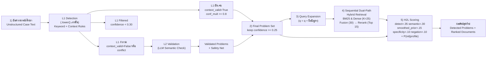
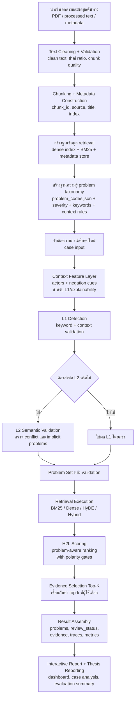
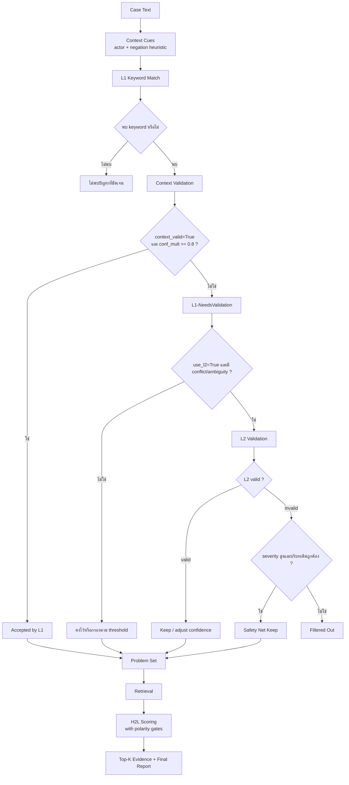
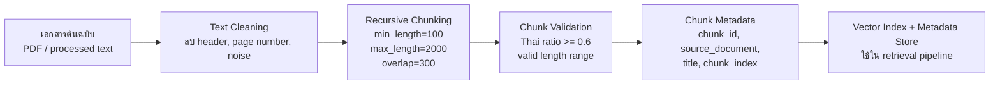
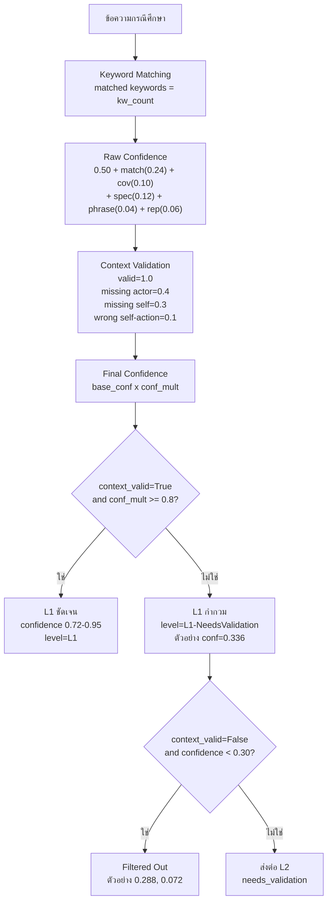
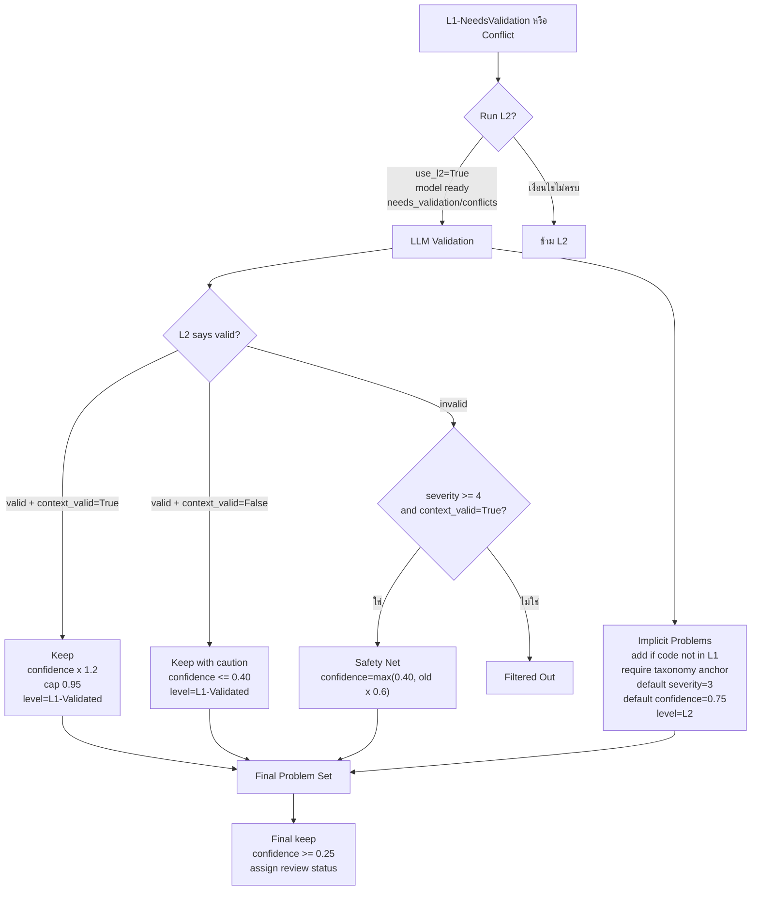
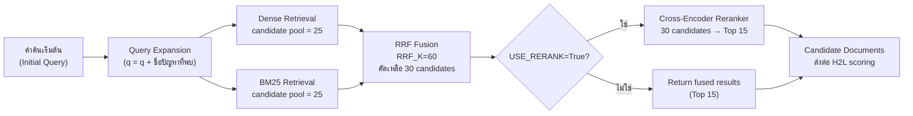
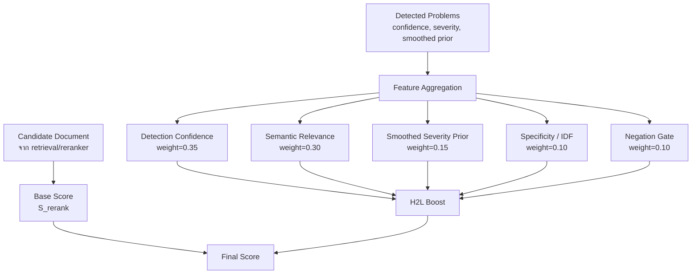
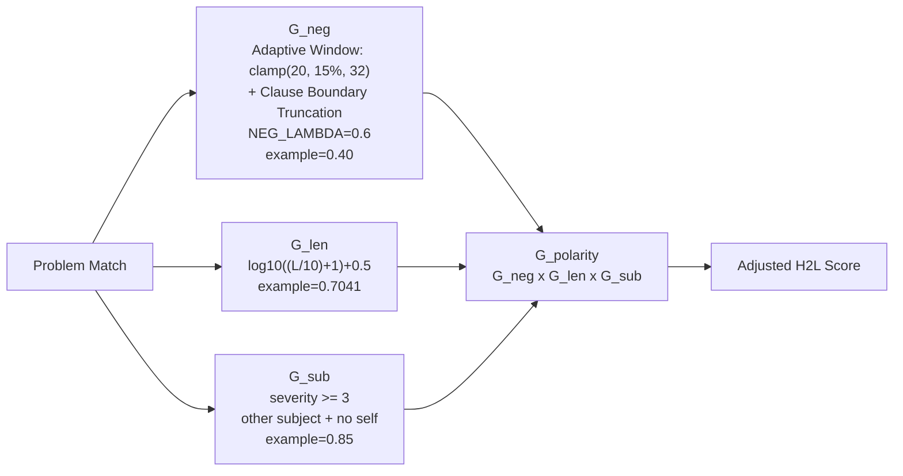

# บทที่ 3 วิธีดำเนินการวิจัยและการออกแบบระบบ H2L

การวิจัยฉบับนี้เป็นการวิจัยเชิงทดลองและพัฒนาระบบ (Experimental and System Development Research) โดยมีวัตถุประสงค์เพื่อออกแบบและพัฒนาระบบค้นคืนข้อมูลเชิงความหมายสำหรับสนับสนุนการคัดกรองปัญหาสังคมและการประเมินความเสี่ยงทางจิตสังคมจากข้อความกรณีศึกษาแบบไร้โครงสร้างในบริบทสังคมสงเคราะห์ทางการแพทย์และสังคมสงเคราะห์คลินิก ระบบที่พัฒนาขึ้นใช้ชื่อว่า **H2L (A Two-Level Hierarchical Retrieval-Augmented Generation Approach with Polarity Gates for Screening and Differential Diagnosis of Social Problems)** ซึ่งออกแบบให้เชื่อมโยงการตรวจจับปัญหาทางสังคม การอ้างอิงบริบททางคลินิก และการค้นคืนเอกสารที่เกี่ยวข้องเข้าไว้ในกระบวนการเดียวกัน

บทนี้นำเสนอวิธีดำเนินการวิจัยและการออกแบบระบบในเชิงกระบวนการ โดยเริ่มจากการเตรียมข้อมูลเอกสาร การออกแบบฐานความรู้รหัสปัญหา การตรวจจับปัญหาจากข้อความ การค้นคืนเอกสาร การปรับคะแนนด้วย H2L scoring framework และการควบคุมผลบวกลวงด้วย Contextual Polarity Gates ภาพประกอบในบทนี้แทรกค่าตัวเลขที่ตรวจสอบจากโค้ดจริงเท่าที่สามารถระบุได้ เพื่อให้สอดคล้องกับระบบที่พัฒนาขึ้นจริงและสามารถตรวจสอบย้อนกลับได้

## 3.1 วิธีดำเนินการวิจัย

หลักคิดสำคัญของระบบนี้คือการแยกกระบวนการวิเคราะห์ออกเป็นโมดูลที่ตรวจสอบย้อนกลับได้ แทนที่จะส่งข้อความทั้งหมดเข้าสู่แบบจำลองแบบ end-to-end เพียงครั้งเดียว เนื่องจากข้อความกรณีศึกษาทางสังคมสงเคราะห์มักมีความซับซ้อนสูง เช่น มีการกล่าวถึงบุคคลหลายฝ่าย มีการใช้คำปฏิเสธ มีการกล่าวถึงปัญหาในเชิงอ้อม หรือมีคำสำคัญที่อาจนำไปสู่การตีความผิดหากพิจารณาเฉพาะการพบคำ ระบบจึงถูกออกแบบให้มีสองระดับหลัก ได้แก่ L1 สำหรับการตรวจจับด้วยกฎเชิงบริบท และ L2 สำหรับการตรวจสอบเชิงความหมาย จากนั้นใช้ H2L scoring และ Polarity Gates เป็นกลไกประกอบการปรับคะแนน ไม่ใช่ระดับที่สามของสถาปัตยกรรม

ในเชิงกระบวนการ วิธีดำเนินการวิจัยแบ่งออกเป็น 6 ขั้นตอนหลัก ได้แก่ การเตรียมเอกสารและสร้างฐานข้อมูล retrieval การออกแบบฐานความรู้รหัสปัญหา การตรวจจับปัญหาจากข้อความกรณีศึกษา การค้นคืนเอกสารอ้างอิง การปรับคะแนนเอกสารด้วย H2L scoring framework และการประเมินผลระบบด้วยชุดข้อมูลอ้างอิงและตัวชี้วัดมาตรฐาน

## 3.2 ภาพรวมสถาปัตยกรรมและ pipeline ของระบบ

สถาปัตยกรรมของระบบ H2L ถูกออกแบบในรูปแบบ pipeline-based modular architecture เพื่อให้แต่ละส่วนมีหน้าที่ชัดเจนและสามารถตรวจสอบผลลัพธ์ระหว่างทางได้ ระบบเริ่มจากการรับข้อความกรณีศึกษา จากนั้นทำการตรวจจับปัญหาแบบสองระดับ โดยระดับแรกใช้ keyword matching ร่วมกับ context validation และระดับที่สองใช้แบบจำลองภาษาขนาดใหญ่เพื่อตรวจสอบรหัสที่กำกวมหรือมี conflict เมื่อได้ชุด problem codes แล้ว ระบบจะนำข้อความเข้าสู่ retrieval pipeline เพื่อค้นคืนเอกสารที่เกี่ยวข้อง และนำผลลัพธ์ retrieval มาปรับคะแนนด้วย H2L scoring และ Contextual Polarity Gates

**ภาพที่ 3.1 ภาพรวม pipeline ของระบบ H2L พร้อมค่าที่ใช้กำกับการตัดสินใจ**



คำบรรยายภาพ: ภาพที่ 3.1 แสดงลำดับการประมวลผลของระบบ H2L ตั้งแต่การรับข้อความกรณีศึกษา การตรวจจับปัญหา การส่งรหัสที่กำกวมไปตรวจสอบในระดับ L2 การค้นคืนเอกสาร และการปรับคะแนนด้วย H2L scoring framework ตัวเลขที่ใส่ในภาพเป็นค่าจากโค้ดปัจจุบัน เช่น สูตรคำนวณความเชื่อมั่นใน L1, เกณฑ์กรองที่ `0.30`, เกณฑ์เก็บผลสุดท้ายที่ `0.25`, ค่า retrieval defaults และค่าน้ำหนักของ feature ใน H2L scoring

โค้ดอ้างอิงแบบย่อ:

```python
# End-to-end methodological flow (ย่อจาก orchestrator + retriever)
def analyze_case(case_text):
    detection = detector.detect_with_metadata(case_text)
    problems = detection["problems"]

    docs = retriever.retrieve(
        query=case_text,
        explicit_problems=problems
    )

    ranked_docs = h2l_rescore(
        docs=docs,
        problems=problems,
        query_text=case_text
    )

    return {
        "problems": problems,
        "ranked_documents": ranked_docs
    }
```

โค้ดย่อข้างต้นสรุป logic ของระบบในระดับวิธีวิจัย กล่าวคือระบบเริ่มจากการตรวจจับปัญหา สร้าง problem profile ส่งต่อไปยัง retrieval pipeline และปรับคะแนนเอกสารด้วย H2L scoring ก่อนประกอบผลลัพธ์สุดท้าย โค้ดนี้เป็น pseudo-code เพื่ออธิบาย pipeline ไม่ใช่การคัดลอก implementation ทั้งหมดจากไฟล์ runtime

```python
# H2LDetector.py — _calculate_confidence (สูตรที่ใช้จริงในระบบ)
unique = list(dict.fromkeys(matched_keywords))
match_count_score = min(0.24, 0.10 * len(unique))
coverage_score    = min(0.10, (len(unique) / max(len(all_keywords), 1)) * 0.18)
specificity_score = min(0.12, (avg_keyword_length / 24) * 0.12)
phrase_bonus      = 0.04 if any(len(k) >= 10 or " " in k for k in unique) else 0.0
repetition_score  = min(0.06, max(0, occurrences - len(unique)) * 0.03)

raw_confidence    = 0.50 + match_count_score + coverage_score + specificity_score \
                  + phrase_bonus + repetition_score
final_confidence  = max(0.05, min(0.95, raw_confidence * conf_mult))

if is_valid and conf_mult >= 0.8:
    detection_level = "L1"
else:
    detection_level = "L1-NeedsValidation"
```

สูตร confidence ของ L1 จึงประกอบด้วยฐาน `0.50` บวกองค์ประกอบ 5 ส่วนที่สะท้อนคุณภาพของหลักฐาน ได้แก่ จำนวน keyword ที่พบ (cap ที่ `0.24`), ความครอบคลุมต่อ taxonomy (cap `0.10`), ความเฉพาะเจาะจงเชิงความยาวของ keyword (cap `0.12`), โบนัสกรณีพบวลีหรือ keyword ยาว (cap `0.04`) และการพบซ้ำในข้อความเดียวกัน (cap `0.06`) จากนั้นคูณด้วยตัวคูณบริบท `conf_mult` แล้ว clamp ผลลัพธ์ไว้ในช่วง `[0.05, 0.95]` เพดานสูงสุดเชิงทฤษฎีของ raw confidence จึงอยู่ที่ `0.50 + 0.24 + 0.10 + 0.12 + 0.04 + 0.06 = 1.06` ซึ่งจะถูก clamp ไม่ให้เกิน `0.95`

**หมายเหตุเรื่อง cap-sum ที่ไม่เท่ากับ 1.00 พอดี:** ค่าเพดาน `1.06` เป็นผลพลอยได้ (incidental ceiling) จากการกำหนด cap ของแต่ละองค์ประกอบหลักฐานอย่างเป็นอิสระตามน้ำหนักเชิงโดเมน มิใช่เป้าหมายในการออกแบบ ผู้วิจัยเลือกไม่ rescale ให้ผลรวมเท่ากับ `1.00` พอดีด้วยเหตุผลสองประการ คือ (1) การ proportional rescale (หารทุก cap ด้วย `1.06`) จะทำให้ค่า cap แต่ละตัวสูญรูปตัวเลขที่อ่านง่ายและตีความเชิงโดเมนได้ และ (2) การตัด cap ตัวใดตัวหนึ่งลง `0.06` เป็น arbitrary และทำลายเหตุผลเชิงน้ำหนักของ cap นั้น เพื่อยืนยันว่าการเลือกนี้ไม่กระทบผลเชิงประจักษ์ ผู้วิจัยทำการ replay การตรวจจับบนเคสทั้งชุดทดสอบ 197 เคส (รวม `934` detection events) เปรียบเทียบ raw confidence ระหว่าง scheme ปัจจุบัน (cap-sum `1.06`) กับ scheme ที่ rescale เป็น `1.00` พบว่า: ค่า raw confidence จริงสูงสุดอยู่ที่ `0.9333` ต่ำกว่าเพดาน clamp `0.95` ดังนั้น **ไม่มีเคสใดที่ถูก clamp ตัดในทั้งสอง scheme** ความแตกต่างของ final confidence ระหว่างสอง scheme อยู่ในระดับเล็ก (max `|Δ| = 0.0528`, mean `|Δ| = 0.0293`) ซึ่งเป็นเพียงการเลื่อน scale แบบเชิงเส้น และไม่เปลี่ยนลำดับสัมพัทธ์ของ confidence ระหว่าง code นอกจากนี้ค่า L1 confidence ใช้สำหรับ explainability และ `review_status` มิได้เข้าสู่ H2L ranking score โดยตรง จึงไม่ส่งผลต่อ retrieval metric (nDCG, MRR, Recall) ที่รายงานในบทที่ 4 ข้อมูลดิบของการเปรียบเทียบนี้บันทึกไว้ที่ `evaluation_results/l1_capsum_comparison.json`

### 3.2.1 Flow diagram ของระบบตั้งแต่การนำเข้าข้อมูลจนถึงการรายงานผล

เพื่อให้สอดคล้องกับหลักการเขียนบทที่ 3 ของวิทยานิพนธ์ ผู้วิจัยอธิบายกระบวนการทำงานของระบบตั้งแต่ระดับการเตรียมข้อมูล (offline preparation) ไปจนถึงระดับการประมวลผลเคสจริง (online inference) และการรายงานผลอย่างต่อเนื่อง ภาพต่อไปนี้จึงทำหน้าที่เป็นภาพรวมเชิงระเบียบวิธีของทั้งระบบ ไม่ใช่เฉพาะ retrieval pipeline หรือ detector เพียงส่วนเดียว

**ภาพที่ 3.2 flow diagram ตั้งแต่การนำเข้าข้อมูลจนถึงการประมวลผลและรายงานผล**



คำบรรยายภาพ: ภาพที่ 3.2 แสดงกระบวนการทั้งหมดของงานวิจัยตั้งแต่การนำเข้าและเตรียมข้อมูล การสร้างฐาน retrieval และฐานความรู้รหัสปัญหา การวิเคราะห์กรณีศึกษา การค้นคืนเอกสาร และการประกอบผลลัพธ์ในรูปแบบรายงานเชิงโต้ตอบและผลสำหรับการอภิปรายในวิทยานิพนธ์ ภาพนี้ช่วยให้ผู้อ่านเข้าใจว่าระบบไม่ได้มีเฉพาะตัวโมเดล แต่เป็น workflow เชิงระบบที่ประกอบด้วยทั้งส่วน offline preparation และ online inference

### 3.2.2 Model Logic Tree ของ H2L

นอกจากภาพรวมแบบ pipeline แล้ว การอธิบายตรรกะการตัดสินใจของโมเดลในรูปแบบ tree จะช่วยให้ผู้อ่านเห็นชัดว่าระบบ H2L ใช้หลักคิดแบบลำดับขั้น (hierarchical decision process) อย่างไร โดยเฉพาะการแยกเส้นทางของรหัสที่ชัดเจน รหัสที่กำกวม และรหัสที่ต้องถูกกรองออก

**ภาพที่ 3.3 Model Logic Tree ของระบบ H2L**



คำบรรยายภาพ: ภาพที่ 3.3 อธิบายตรรกะการตัดสินใจของระบบ H2L ในลักษณะ logic tree จุดสำคัญคือระบบไม่ได้เชื่อการพบ keyword ในทันที แต่จะผ่านชั้นตรวจบริบท, การตรวจ semantic ในกรณีที่กำกวม, การลดผลบวกลวงด้วย polarity gate และจึงเข้าสู่ retrieval และ ranking ในขั้นสุดท้าย

### 3.2.3 ส่วนแสดงผลเชิงโต้ตอบที่ใช้ตรวจสอบย้อนกลับผลลัพธ์

ระบบที่พัฒนาขึ้นไม่ได้มีเพียงโมดูลคำนวณ แต่ยังมีส่วนแสดงผลเชิงโต้ตอบเพื่อช่วยให้ผู้วิจัยและผู้เชี่ยวชาญตรวจสอบตรรกะของระบบได้แบบย้อนหลัง (traceability) ส่วนแสดงผลสำคัญประกอบด้วย `Analyzed Case Text`, `Sentence Polarity`, `Live Execution Path`, `Case H2L Summary`, `H2L Document Score Breakdown`, `Problem-Document Matrix`, `Semantic Evidence Map` และ `Research Report` ส่วนมุมมอง event/actor ใช้เพื่อช่วยอธิบายบริบทในระดับ L1 และการตรวจสอบผล ไม่ใช่ตัวคำนวณหลักของ polarity score

หลักการของส่วนแสดงผลเหล่านี้คือการแปลงค่าที่เกิดขึ้นจริงจาก runtime ให้เป็นภาษาที่เข้าใจง่ายและตรวจสอบได้ เช่น

- `Analyzed Case Text` ใช้ไฮไลต์คำที่ระบบจับได้ในระดับ **occurrence** ไม่ใช่เพียงระดับคำที่ซ้ำกัน โดยอาศัย `matched_spans` และ `evidence_spans` จากผลตรวจจับจริง ทำให้คำที่ปรากฏหลายครั้งในคนละบริบทสามารถตรวจสอบแยกตามหลักฐานที่ระบบใช้ได้
- มุมมอง event/actor ใช้อธิบายบริบทของการตรวจจับในระดับ L1 และการตรวจสอบย้อนกลับเชิงคุณภาพ เช่น การดูว่าหลักฐานเกี่ยวข้องกับผู้รับบริการหรือบุคคลอื่น แต่ implementation ปัจจุบันยังไม่ได้ใช้ full event-frame parser เป็นตัวคำนวณ `G_neg` ในสมการ scoring หลัก
- `Live Execution Path` แสดงขั้นตอนของ pipeline พร้อมเวลาที่ใช้จริงในแต่ละ phase
- `Case H2L Summary` สรุปตัวแปรระดับเคส เช่น prior, severity, polarity gate จำนวน candidate ที่ผ่าน/ถูกกรอง และ `review summary` ของสถานะ `confirmed`, `needs_review`, `verify_documents`, `filtered`
- `H2L Document Score Breakdown` อธิบายการเกิดคะแนนระดับเอกสารโดยแยกตัวแปรหลักของสมการ H2L ออกจากบริบทระดับเคส
- `Problem-Document Matrix` เป็นมุมมองเชิงโครงสร้างที่แสดงว่า problem code ใดมี supporting document ใดหนุนอยู่บ้าง และความหนาแน่นของการรองรับเป็นอย่างไร
- `Semantic Evidence Map` แสดงความสัมพันธ์เชิงความหมายระหว่าง query, problem codes และ supporting documents โดยเน้นรายละเอียดระดับ node, semantic distance และหลักฐานเชิงลึก ซึ่งละเอียดกว่ามุมมองแบบ matrix
- `Research Report` แยก `Case-Level Runtime Review` ออกจาก `Benchmark Performance Review` อย่างชัดเจน พร้อมมี `Performance Provenance` สำหรับบอกแหล่งที่มาของผล, `System Evaluation Status` สำหรับสรุปว่าหลักฐาน benchmark ส่วนใดพร้อมใช้อ้างอิงแล้ว, `Latest Pair Reruns` สำหรับอ่านผลเปรียบเทียบ baseline vs H2L ราย family จาก `evaluation_results/pairs/` โดยตรง, `Live Evaluation Progress` สำหรับอ่านสถานะการรัน evaluator จาก progress artifact จริง และ `Artifact Retention` สำหรับอธิบายว่า dashboard ใช้ latest/checkpoint alias เป็นหลักและเก็บ timestamped history ไว้เพียงเท่าที่จำเป็น ทั้งหมดนี้ refresh ผ่าน `/evaluation-summary` และ `/evaluation-progress` เป็นช่วง ๆ โดยไม่สร้างข้อมูลจำลอง

ใน implementation ที่ใช้รายงานผล ส่วนแสดงผลช่วยให้ตรวจสอบตำแหน่งหลักฐานที่ระบบใช้ได้ชัดขึ้น โดยแยก occurrence ของคำสำคัญและบริบทที่สนับสนุนการตัดสินใจออกจากกัน อย่างไรก็ตาม การคำนวณ `G_neg` ใน H2L scoring ยังคงใช้กลไก lightweight จากหน้าต่างคำปฏิเสธย้อนหลัง `30` ตัวอักษรก่อนหน้า candidate term เป็นหลัก

ดังนั้น ส่วนแสดงผลจึงไม่ได้เป็นองค์ประกอบตกแต่งส่วนติดต่อผู้ใช้เท่านั้น แต่เป็นเครื่องมือสนับสนุนการตรวจสอบวิธีวิจัยและการอภิปรายผลในบทที่ 4 ด้วย

## 3.3 การเตรียมข้อมูลเอกสารและการสร้างฐานข้อมูล retrieval

การเตรียมข้อมูลเอกสารเป็นขั้นตอนพื้นฐานที่ทำให้ระบบสามารถค้นคืนข้อมูลได้อย่างมีประสิทธิภาพ เอกสารต้นฉบับอยู่ในรูปแบบ PDF หรือข้อความที่ผ่านการแปลงแล้ว จากนั้นระบบจะทำความสะอาดข้อความ แบ่งข้อความเป็นส่วนย่อย และสร้าง metadata เพื่อใช้เชื่อมโยงผลการค้นคืนกลับไปยังเอกสารต้นทาง การแบ่งข้อความเป็นส่วนย่อยมีความสำคัญเพราะช่วยให้ retrieval ทำงานกับหน่วยข้อมูลที่มีขนาดเหมาะสม แทนการคำนวณกับเอกสารทั้งฉบับซึ่งอาจมีหลายบริบทปะปนกัน

ในไฟล์ config ของระบบ ค่า chunking เริ่มต้นถูกกำหนดไว้ที่ความยาวขั้นต่ำ `100` ตัวอักษร ความยาวสูงสุด `2000` ตัวอักษร สัดส่วนภาษาไทยขั้นต่ำ `0.6` และ overlap `300` ตัวอักษร ค่าเหล่านี้ใช้เป็นกรอบในการคัดกรอง chunk ที่มีคุณภาพเพียงพอสำหรับนำไปสร้างดัชนี

**ภาพที่ 3.4 pipeline การเตรียมข้อมูลเอกสาร**



คำบรรยายภาพ: ภาพที่ 3.4 แสดงขั้นตอนการเตรียมเอกสารตั้งแต่การทำความสะอาดข้อความ การแบ่งข้อความแบบ recursive chunking และการตรวจคุณภาพของ chunk ก่อนจัดเก็บเป็น metadata และดัชนีสำหรับ retrieval ตัวเลขในภาพมาจากค่าเริ่มต้นของระบบ ได้แก่ `MIN_CHUNK_LENGTH=100`, `MAX_CHUNK_LENGTH=2000`, `OVERLAP=300` และ `MIN_THAI_RATIO=0.6`

โค้ดอ้างอิงแบบย่อ:

```python
# config.py
MIN_CHUNK_LENGTH = 100
MAX_CHUNK_LENGTH = 2000
MIN_THAI_RATIO = 0.6
OVERLAP = 300
```

```python
# data_pipeline.py
return (
    self.char_count >= _config.parsing.min_chunk_length and
    self.char_count <= _config.parsing.max_chunk_length and
    self.thai_ratio >= _config.parsing.min_thai_ratio
)
```

## 3.4 การออกแบบฐานความรู้รหัสปัญหา

ฐานความรู้รหัสปัญหาเป็นองค์ประกอบที่ทำให้ระบบสามารถเปลี่ยนข้อความกรณีศึกษาให้เป็นข้อมูลเชิงโครงสร้างได้ ระบบใช้ `problem_codes.json` เป็นฐานข้อมูล taxonomy ซึ่งประกอบด้วยรหัสปัญหา ชื่อปัญหา หมวดหมู่ คำสำคัญ และระดับความรุนแรงของปัญหา ข้อมูลดังกล่าวถูกใช้ทั้งในขั้นตอนการจับคู่คำสำคัญ การตรวจสอบบริบท การกำหนดระดับความเชื่อมั่น และการปรับคะแนนเอกสารใน H2L scoring framework

โครงสร้างรหัสแบ่งออกเป็น 2 กลุ่มใหญ่ ได้แก่ กลุ่มรหัสหลักด้านปัญหาสังคมจำนวน 17 กลุ่ม มีรหัสย่อยรวม 104 รหัส และกลุ่มรหัสพิเศษหรือรหัสอ้างอิงทางคลินิกจำนวน 17 กลุ่ม มีรหัสย่อยรวม 98 รหัส รวมทั้งระบบจึงมี 34 กลุ่มรหัส และ 202 รหัสย่อย การแยกกลุ่มเช่นนี้ช่วยให้ระบบรองรับทั้งมิติทางสังคมโดยตรงและบริบททางสุขภาพที่สัมพันธ์กับผู้รับบริการ

**ตารางที่ 3.1 สรุปโครงสร้างรหัสปัญหาที่ใช้ในระบบ**

| รายการ | จำนวนกลุ่ม | จำนวนรหัสย่อย |
|---|---:|---:|
| กลุ่มรหัสหลักด้านปัญหาสังคม | 17 | 104 |
| กลุ่มรหัสพิเศษและรหัสอ้างอิงทางคลินิก | 17 | 98 |
| รวมทั้งหมด | 34 | 202 |

## 3.5 กลไกการตรวจจับปัญหาระดับ L1

ระดับ L1 ทำหน้าที่คัดกรองปัญหาเบื้องต้นจากข้อความกรณีศึกษา โดยใช้การจับคู่คำสำคัญของแต่ละ problem code กับข้อความที่ผู้ใช้ป้อน ระบบไม่ได้ตัดสินจากการพบ keyword เพียงอย่างเดียว แต่จะตรวจสอบบริบทของรหัสนั้นร่วมด้วย เช่น รหัสที่ต้องมีการกล่าวถึงตนเอง รหัสที่ต้องมี passive voice หรือรหัสที่ต้องมี actor เฉพาะในหมวดความสัมพันธ์ หากบริบทถูกต้อง ระบบจะให้ตัวคูณความเชื่อมั่นเป็น `1.0` แต่หากบริบทไม่ครบ ระบบจะลดตัวคูณลงตามชนิดของปัญหา

สูตรการคำนวณความเชื่อมั่นเบื้องต้นของ L1 ใช้ฐาน `0.50` แล้วบวกองค์ประกอบ 5 ส่วน ได้แก่ จำนวน keyword ที่พบ (`min(0.24, 0.10 × n_unique)`), ความครอบคลุม keyword ใน taxonomy (`min(0.10, coverage × 0.18)`), ความเฉพาะเจาะจงเชิงความยาว (`min(0.12, (avg_len/24) × 0.12)`), โบนัสกรณีพบวลี (`0.04` ถ้ามี keyword ยาว ≥ 10 ตัวอักษรหรือมีช่องว่าง) และคะแนนการกล่าวซ้ำ (`min(0.06, max(0, occ - n_unique) × 0.03)`) จากนั้นคูณด้วย `conf_mult` แล้ว clamp ผลลัพธ์ไว้ที่ `[0.05, 0.95]` ดังนั้นหากพบ keyword 1 คำที่ไม่ใช่วลีและไม่ซ้ำในข้อความ บริบทถูกต้อง (`conf_mult=1.0`) จะได้ confidence ประมาณ `0.60-0.65` หากพบหลาย keyword ครอบคลุม taxonomy พร้อมวลีและการซ้ำจะเข้าใกล้เพดาน `0.95` รายละเอียดเต็มของแต่ละองค์ประกอบดูได้ที่ `H2LDetector.py` ฟังก์ชัน `_calculate_confidence`

เหตุผลของ term ความเฉพาะเจาะจงเชิงความยาว `min(0.12, (avg_len/24) × 0.12)` มาจากการสังเกตว่า keyword สั้น (เช่น `"นอน"` 3 ตัวอักษร) มักกำกวมและเจอได้ในบริบทกว้าง ขณะที่ keyword ยาวหรือเป็นวลี (เช่น `"นอนไม่หลับติดต่อกันหลายคืน"` ~24 ตัวอักษร) มี information content สูงกว่ามาก ทำให้การพบ keyword ยาวจึงเป็นหลักฐานที่เจาะจงและควรเพิ่มน้ำหนักให้ confidence — ตัวหาร `24` ถูก calibrate ให้วลีระดับกลาง-ยาวประมาณ 24 ตัวอักษรได้คะแนนเต็มที่ `0.12` พอดี ส่วน `min(...)` ทำหน้าที่เป็น cap เพื่อกัน keyword ที่ยาวผิดปกติไม่ให้ผลักคะแนนเกินสัดส่วนที่จัดสรรไว้ใน budget รวมของ confidence (match `0.24` + coverage `0.10` + specificity `0.12` + phrase `0.04` + repetition `0.06` + ฐาน `0.50`)

**ภาพที่ 3.5 flow การตัดสินใจของ L1 พร้อมค่า threshold**



คำบรรยายภาพ: ภาพที่ 3.5 แสดงกระบวนการตัดสินใจในชั้น L1 โดยเริ่มจากการนับ keyword ที่พบและคำนวณ base confidence จากนั้นปรับด้วยตัวคูณบริบท หากบริบทถูกต้องและ `conf_mult >= 0.8` จะจัดเป็นรหัสที่ชัดเจนในระดับ L1 หากบริบทไม่ครบหรือเกิดความกำกวมจะถูกจัดเป็น `L1-NeedsValidation` และส่งต่อให้ L2 เฉพาะกรณีที่ไม่ถูกกรองทิ้งด้วยเงื่อนไข `context_valid=False` และ `confidence < 0.30`

โค้ดอ้างอิงแบบย่อ:

```python
# H2LDetector.py — สูตรเต็มของ _calculate_confidence
match_count_score = min(0.24, 0.10 * len(unique))
coverage_score    = min(0.10, (len(unique) / max(len(all_keywords), 1)) * 0.18)
specificity_score = min(0.12, (avg_keyword_length / 24) * 0.12)
phrase_bonus      = 0.04 if any(len(k) >= 10 or " " in k for k in unique) else 0.0
repetition_score  = min(0.06, max(0, occurrences - len(unique)) * 0.03)

raw_confidence    = 0.50 + match_count_score + coverage_score + specificity_score \
                  + phrase_bonus + repetition_score
final_confidence  = max(0.05, min(0.95, raw_confidence * conf_mult))

if is_valid and conf_mult >= 0.8:
    detection_level = "L1"
else:
    detection_level = "L1-NeedsValidation"
```

```python
# H2LDetector.py
if not r.context_valid and r.confidence < 0.3:
    l1_filtered_out.append(r)
    continue
```

**ตารางที่ 3.2 ตัวคูณบริบทของ L1**

| สถานะบริบท | ค่า `conf_mult` | ความหมาย |
|---|---:|---|
| บริบทถูกต้อง | 1.0 | พบ actor หรือเงื่อนไขที่รหัสต้องการ |
| ไม่พบ actor หรือ passive context | 0.4 | พบ keyword แต่บริบทไม่พอ |
| ไม่พบ self-reference | 0.3 | รหัสต้องอ้างถึงตนเองแต่ข้อความไม่ชัด |
| เป็น self-action แต่รหัสไม่ควรเป็น self-case | 0.1 | ลดน้ำหนักอย่างมากเพราะผิดหมวด |

### 3.5.4 กลไกตัวปรับบริบทเชิงวากยสัมพันธ์ (Context Multiplier)

ระบบคำนวณความเชื่อมั่นดิบ (raw confidence) จาก **6 องค์ประกอบ**: (1) base confidence = 0.50, (2) match count score (0-0.24), (3) coverage score (0-0.10), (4) specificity score (0-0.12), (5) phrase bonus (0 หรือ 0.04 เมื่อพบ keyword ยาว ≥10 ตัวอักษรหรือเป็นวลีที่มีช่องว่าง), และ (6) repetition score (0-0.06) รวมได้สูงสุด 1.06 ซึ่งจะถูก clamp ไว้ที่ 0.95 หลังจากนั้นระบบจะปรับแก้ตามบริบทด้วย **context multiplier** (`conf_mult`) ซึ่งตรวจสอบว่าโครงสร้างประโยคสอดคล้องกับธรรมชาติของปัญหาหรือไม่ กลไกนี้ช่วยลดผลบวกลวงจากการพบ keyword ที่อยู่ในบริบทไม่เหมาะสม โดยเฉพาะกรณีที่คำสำคัญปรากฏในบริบทของบุคคลอื่นแทนที่จะเป็นผู้รับบริการโดยตรง

#### นิยามศัพท์และแนวคิดหลัก

ปัญหาทางสังคมสงเคราะห์แบ่งออกเป็น 2 ประเภทหลักตามลักษณะของความสัมพันธ์ระหว่างผู้รับบริการกับปัญหา:

**1. Self-action problem (ปัญหาที่ต้องเกิดกับตัวผู้รับบริการเอง)**

รหัสปัญหาที่ผู้รับบริการเป็นผู้กระทำหรือประสบการณ์โดยตรง เช่น การพยายามฆ่าตัวตาย (X60-X84), การใช้สารเสพติด (F11-F19) หรือปัญหาสุขภาพจิตของผู้รับบริการเอง (F32.0, F41.9) รหัสประเภทนี้ต้องมี **self-reference** คือสรรพนามหรือคำที่ระบุตัวผู้รับบริการโดยตรง เช่น "ผู้รับบริการ", "ผู้ป่วย", "ตัวเอง", "ฉัน", "ดิฉัน"

ตัวอย่างบริบทที่ถูกต้อง:
- "**ผู้ป่วย**พยายามฆ่าตัวตาย"
- "**ตัวเอง**ดื่มเหล้ามาก"
- "**ฉัน**ไม่อยากมีชีวิตอยู่"

ตัวอย่างบริบทที่ไม่ถูกต้อง (wrong actor context):
- "**ลูกชาย**พยายามฆ่าตัวตาย" ← ในเคสที่ผู้รับบริการคือแม่

**2. Relational problem (ปัญหาที่เกี่ยวข้องกับบุคคลอื่น)**

รหัสปัญหาที่เกี่ยวข้องกับความสัมพันธ์ระหว่างผู้รับบริการกับบุคคลอื่น เช่น ความรุนแรงในครอบครัว (0102, Z63.0), ปัญหาการเลี้ยงดูบุตร (0206, Z62), การขาดผู้ดูแล (Z63.4) รหัสประเภทนี้ต้องมี **actor** (ผู้กระทำ) ที่ชัดเจน เช่น "สามี", "ภริยา", "พ่อ", "แม่", "ลูก"

ตัวอย่างบริบทที่ถูกต้อง:
- "**สามี**ทำร้ายร่างกาย"
- "**แม่**ไม่ดูแลลูก"
- "ถูก**คู่สมรส**ทุบตี"

ตัวอย่างบริบทที่ไม่ถูกต้อง (missing actor):
- "ถูกทำร้าย" ← ไม่ระบุว่าใครทำร้าย

#### สมการและเงื่อนไขการปรับค่า

หลังจากคำนวณ raw confidence แล้ว ระบบจะคูณด้วย `conf_mult` และ clamp ผลลัพธ์ไว้ในช่วง `[0.05, 0.95]`:

**สมการที่ 23: การคำนวณ final confidence**
```
raw_confidence = 0.50 + match_count_score + coverage_score + specificity_score 
                 + phrase_bonus + repetition_score
                 (ค่าสูงสุดที่เป็นไปได้ = 1.06)

final_confidence = clamp(raw_confidence × conf_mult, 0.05, 0.95)
                 = max(0.05, min(0.95, raw_confidence × conf_mult))
```

ค่า `conf_mult` ถูกกำหนดโดยฟังก์ชัน `_check_context_validity()` ซึ่งตรวจสอบบริบทรอบคำสำคัญ (keyword window radius = 40 ตัวอักษร) และคืนค่าเป็น tuple `(is_valid, conf_mult, reason)` ตามเงื่อนไขดังนี้:

**ตารางที่ 3.3 ตัวคูณบริบทพร้อมตัวอย่างการใช้งาน**

| conf_mult | เงื่อนไข | บริบทที่ถูกต้อง | บริบทที่ไม่ถูกต้อง |
|---:|---|---|---|
| **1.0** | **Valid Context:** พบ self-reference หรือ actor ครบถ้วน | "ผู้รับบริการถูก**สามี**ทำร้ายร่างกาย" (0102)<br/>มี actor + passive + victim | ไม่มีตัวอย่าง (บริบทครบถ้วน) |
| **0.4** | **Missing Actor / Passive:** ไม่ระบุผู้กระทำหรือ passive voice | "ผู้รับบริการถูก**สามี**ทำร้าย" (มี actor + passive) | **"ถูกทำร้าย"**<br/>ไม่ระบุว่าใครทำร้าย (ไม่มี actor) |
| **0.3** | **Missing Self-reference:** ปัญหา self-action แต่ไม่พบ self-ref | "**ผู้ป่วย**พยายามฆ่าตัวตาย" (X60-X84)<br/>มี self-reference | **"พยายามฆ่าตัวตาย"**<br/>ไม่ระบุว่าใครพยายาม |
| **0.1** | **Wrong Actor Context:** actor ไม่ใช่ผู้รับบริการ | "**ผู้รับบริการ**พยายามฆ่าตัวตาย"<br/>actor ถูกต้อง | **"ลูกชาย**พยายามฆ่าตัวตาย"<br/>ในเคสที่ผู้รับบริการคือแม่ (actor ผิดคน) |

ค่า `conf_mult` ที่ต่ำกว่า `0.8` จะทำให้รหัสนั้นถูกจัดเป็น `"L1-NeedsValidation"` และถูกส่งต่อไปยัง L2 เพื่อตรวจสอบเพิ่มเติม

#### ตัวอย่างการคำนวณจริง

**กรณีที่ 1: Valid Context (conf_mult = 1.0)**
```
ประโยค: "ผู้รับบริการถูกสามีทำร้ายร่างกาย หลายครั้ง"
รหัสที่ตรวจพบ: 0102 (ความรุนแรงระหว่างคู่สมรส)

การคำนวณ:
  raw_confidence = 0.80
    ← 0.50 (base) + 0.10 (match) + 0.08 (coverage) + 0.06 (specificity)
       + 0.04 (phrase) + 0.06 (repetition "หลายครั้ง")
  conf_mult = 1.0 (พบ actor "สามี" + passive victim ชัดเจน)
  final_confidence = 0.80 × 1.0 = 0.80
  detection_level = "L1" (เพราะ conf_mult >= 0.8)

→ ผ่าน L1 โดยตรง ไม่ต้องส่ง L2
```

**กรณีที่ 2: Missing Actor (conf_mult = 0.4)**
```
ประโยค: "ถูกทำร้าย"
รหัสที่ตรวจพบ: 0102

การคำนวณ:
  raw_confidence = 0.60
  conf_mult = 0.4 (missing actor: ไม่ระบุว่าใครทำร้าย)
  final_confidence = 0.60 × 0.4 = 0.24
  detection_level = "L1-NeedsValidation"

→ ต่ำกว่า threshold 0.25 → ถูกกรองออกที่ L1 หรือส่ง L2 ตรวจสอบ
```

**กรณีที่ 3: Wrong Actor Context (conf_mult = 0.1)**
```
ประโยค: "ลูกชายพยายามฆ่าตัวตาย แต่ไม่สำเร็จ"
รหัสที่ตรวจพบ: X60-X84 (การพยายามฆ่าตัวตาย — self-action)
บริบทเคส: ผู้รับบริการคือแม่ ไม่ใช่ลูกชาย

การคำนวณ:
  raw_confidence = 0.75
  conf_mult = 0.1 (wrong actor: "ลูกชาย" ≠ ผู้รับบริการ)
  final_confidence = 0.75 × 0.1 = 0.075
  detection_level = "L1-NeedsValidation"

→ ระบบปฏิเสธการตรวจจับ (ต่ำกว่า 0.25 มาก)
```

**กรณีที่ 4: Missing Self-reference (conf_mult = 0.3)**
```
ประโยค: "พยายามฆ่าตัวตาย"
รหัสที่ตรวจพบ: X60-X84

การคำนวณ:
  raw_confidence = 0.70
  conf_mult = 0.3 (missing self-ref: ไม่ระบุ "ผู้ป่วย" หรือ "ตัวเอง")
  final_confidence = 0.70 × 0.3 = 0.21
  detection_level = "L1-NeedsValidation"

→ กรองออกที่ L1 หรือส่ง L2 ขอข้อมูลเพิ่มเติม
```

#### กลไกการตรวจสอบบริบท

ระบบใช้ฟังก์ชัน `_check_context_validity()` ที่ทำงานดังนี้:

1. **สร้าง keyword window:** ดึงบริบทรอบคำสำคัญ (radius = 40 ตัวอักษร) เพื่อตรวจสอบคำบ่งชี้
2. **ตรวจสอบ rule เฉพาะรหัส:** อ่านจาก `SPECIFIC_CODE_RULES` dictionary ว่ารหัสนี้มีเงื่อนไขพิเศษหรือไม่
3. **ตรวจ self-reference requirement:**
   - ถ้า `requires_self_reference=True` → ต้องพบ `self_indicators` เช่น "ตัวเอง", "ฉัน", "ผู้ป่วย"
   - ตรวจว่า **ไม่มี** การกล่าวถึงบุคคลอื่นในบริบทเดียวกัน (ฟังก์ชัน `_has_other_person_mention()`)
4. **ตรวจ passive requirement:**
   - ถ้า `requires_passive=True` → ต้องพบ `passive_indicators` เช่น "ถูก", "ได้รับ", "โดน"
5. **ตรวจบริบทเฉพาะทาง:** เช่น `requires_distress_context`, `requires_financial_context`, `requires_caregiver_burden_context`

โค้ดอ้างอิงแบบย่อ:

```python
# H2LDetector.py — ฟังก์ชัน _check_context_validity (บรรทัด 579-680)
def _check_context_validity(self, code, text, matched_keywords, matched_spans):
    """
    Returns: (is_valid, confidence_multiplier, reason)
    """
    code_info = self.taxonomy.get(code, {})
    
    if code in SPECIFIC_CODE_RULES:
        rule = SPECIFIC_CODE_RULES[code]
        local_contexts = self._keyword_windows(text, matched_keywords, radius=40)
        
        # ตรวจสอบ self-reference requirement
        if rule.get("requires_self_reference", False):
            self_indicators = rule.get("self_indicators", [])
            has_self = any(ind in ctx for ind in self_indicators for ctx in local_contexts)
            other_person = self._has_other_person_mention(local_contexts)
            
            if has_self and not other_person:
                return True, 1.0, "ตรวจพบ Self-reference"
            elif not has_self:
                return False, 0.3, "ไม่พบ Self-reference"
        
        # ตรวจสอบ passive requirement
        if rule.get("requires_passive", False):
            passive_indicators = rule.get("passive_indicators", [])
            has_passive = any(ind in text.lower() for ind in passive_indicators)
            
            if has_passive:
                return True, 1.0, "ตรวจพบ Passive voice"
            else:
                return False, 0.4, "ไม่พบ Passive voice"
    
    # Default: ถ้าไม่มี rule เฉพาะ → valid
    return True, 1.0, "ไม่มีเงื่อนไขบริบทเฉพาะ"
```

ตัวอย่าง `SPECIFIC_CODE_RULES` entry:

```python
SPECIFIC_CODE_RULES = {
    "X60-X84": {
        "requires_self_reference": True,
        "self_indicators": ["ตัวเอง", "ตนเอง", "ฉัน", "ผม", "ตาย", 
                           "ไม่อยากมีชีวิต", "ไม่อยากอยู่"],
        "conflicting_codes": ["0102", "0206", "T74"],
    },
    "0102": {
        "requires_passive": False,  # ไม่จำเป็นต้องเป็น passive
        "conflicting_codes": ["X60-X84"],
    },
    ...
}
```

กลไกนี้ช่วยให้ระบบสามารถแยกแยะบริบทได้อย่างแม่นยำ โดยเฉพาะในกรณีที่มีคำสำคัญคล้ายกัน เช่น "ทำร้าย" ที่อาจหมายถึงการทำร้ายตัวเอง (X60-X84) หรือการถูกผู้อื่นทำร้าย (0102, T74) ซึ่งต้องอาศัย actor และ self-reference เป็นตัวตัดสิน

## 3.6 กลไก L2 Validation และ implicit problem detection

ระดับ L2 ทำหน้าที่ตรวจสอบรหัสที่ L1 ยังตัดสินไม่ได้ชัดเจน เช่น รหัสที่บริบทไม่ครบ รหัสที่เกิด conflict หรือกรณีที่ L1 พบ keyword แต่มีโอกาสเกิดผลบวกลวง การเรียกใช้ L2 จะเกิดขึ้นเฉพาะเมื่อ `use_l2=True`, โมเดล L2 พร้อมใช้งาน และมีรายการ `needs_validation` หรือ `conflicts` อย่างน้อยหนึ่งรายการ แนวทางนี้ช่วยลดภาระการใช้ LLM โดยไม่จำเป็น และทำให้ระบบยังคงอธิบายได้ว่ารหัสใดผ่านจากกฎ L1 และรหัสใดต้องอาศัยการตรวจสอบเพิ่มเติม

กรณีที่ L2 ยืนยันว่ารหัสถูกต้องและบริบท L1 ถูกต้อง ระบบจะเพิ่มความเชื่อมั่นด้วยการคูณ `1.2` แต่ไม่เกิน `0.95` หาก L2 ยืนยันแต่ L1 เห็นว่าบริบทไม่ถูกต้อง ระบบจะเก็บรหัสไว้แต่จำกัด confidence ไม่เกิน `0.40` เพื่อสะท้อนความไม่แน่นอน หาก L2 ไม่ยืนยัน ระบบจะกรองทิ้ง ยกเว้นกรณีที่เป็นรหัสความรุนแรงสูง `severity >= 4`, บริบท L1 ถูกต้อง (`context_valid=True`) และมีความเชื่อมั่นตั้งต้นสูงพอ (`confidence >= 0.50`) ระบบจะเก็บไว้เป็น safety net เพื่อกันพลาด โดยจะปรับลด confidence ลงเป็น `max(0.40, confidence × 0.60)`

ใน implementation ที่ใช้รายงานผล ผู้วิจัยได้เพิ่ม refinement สำคัญอีก 4 ประการให้ชั้นนี้ ได้แก่ (1) L2 มีสิทธิ์คัดออกเฉพาะรหัสที่ถูกส่งเข้า `needs_validation` จริง เพื่อลดการลบรหัส L1 ที่บริบทชัดเจนอยู่แล้ว (2) implicit problems ที่ L2 เสนอเพิ่มต้องมี `taxonomy anchor` ใน evidence หรือข้อความจริงก่อนจึงจะถูกรับไว้ (3) ผลลัพธ์ทุกตัวจะถูกจัดสถานะ review เป็น `confirmed`, `needs_review`, `verify_documents` หรือ `filtered` เพื่อแยกระดับความมั่นใจเชิงปฏิบัติการ และ (4) baseline preview ถูกแยกสถานะเป็น `baseline_candidate` และ `baseline_filtered` เพื่อไม่ให้ปะปนกับผลที่ผ่านการตรวจ semantic แล้ว

**ภาพที่ 3.6 flow การทำงานของ L2 Validation**



คำบรรยายภาพ: ภาพที่ 3.6 แสดงเงื่อนไขการเรียกใช้ L2 และเงื่อนไขการตัดสินหลังจาก L2 วิเคราะห์แล้ว ระบบเพิ่มความเชื่อมั่นเฉพาะกรณีที่ L2 ยืนยันและบริบทเดิมถูกต้อง ขณะที่กรณีบริบทไม่ครบจะถูกเก็บไว้ด้วยคะแนนต่ำกว่า `0.40` ส่วนปัญหาแฝงที่ L2 เสนอเพิ่มจะถูกเพิ่มเฉพาะเมื่อยังไม่มีรหัสนั้นในผลลัพธ์จาก L1 และมี taxonomy anchor รองรับในข้อความจริง

โค้ดอ้างอิงแบบย่อ:

```python
# H2LDetector.py
if use_l2 and self.l2_detector and self.l2_detector.is_ready:
    if needs_validation or conflicts:
        l1_results, l2_results, context = self.l2_detector.validate_and_detect(...)
```

```python
# H2LDetector.py
if v.get("is_valid", True):
    if not p.context_valid:
        p.confidence = min(0.4, p.confidence)
    else:
        p.confidence = min(0.95, p.confidence * 1.2)
elif p.severity >= 4 and p.context_valid:
    p.confidence = max(0.4, p.confidence * 0.6)
```

```python
# H2LDetector.py
if code and code not in l1_codes:
    confidence=float(p.get("confidence", 0.75))
    severity=int(p.get("severity", 3))
    detection_level="L2"
```

หมายเหตุเชิงวิธีวิจัย: ใน `config.py` มีค่า `L2_SIMILARITY_THRESHOLD=0.7` และ `L2_TOP_K=5` แต่ implementation ปัจจุบันของ L2 validation ใช้ LLM-based validation จาก prompt และผล JSON เป็นหลัก ไม่ได้ใช้ `L2_SIMILARITY_THRESHOLD` เป็นเกณฑ์ตัดสินโดยตรง ดังนั้นภาพประกอบของบทนี้จึงอธิบาย L2 ในฐานะ LLM-based validation ไม่ใช่การตัดสินด้วย similarity มากกว่า `0.7`

## 3.7 Retrieval pipeline และการจัดอันดับเอกสาร

หลังจากได้ชุดปัญหาที่ตรวจพบ ระบบจะเข้าสู่ขั้นตอน **Query Expansion** โดยนำชื่อของปัญหาที่ตรวจพบมาต่อท้ายข้อความคำค้นเดิม (query = query + problem names) เพื่อเพิ่มโอกาสค้นเจอเอกสารที่ระบุชื่อปัญหาตรงๆ จากนั้นจึงส่งต่อให้กระบวนการค้นคืนแบบ **Sequential Dual-Path Hybrid Retrieval** ซึ่งหมายถึงการรัน Dense Retrieval และ BM25 Retrieval ตามลำดับใน process เดียวกัน (ไม่ใช่ thread-parallel)

ค่าเริ่มต้นในระบบกำหนดให้ BM25 และ Dense Retrieval ค้นหาผลลัพธ์เบื้องต้นเส้นทางละ `25` รายการ จากนั้นจะนำผลลัพธ์มาผสานรวมกันด้วย Reciprocal Rank Fusion (RRF) โดยใช้ `RRF_K=60` และคัดเหลือ candidate pool จำนวน `30` รายการ เพื่อส่งต่อให้ Reranker จัดอันดับความเกี่ยวข้องขั้นสุดท้าย โดย Reranker จะคัดกรองจาก 30 รายการลงมาเหลือ **Top 15** (หรือตามค่าที่ผู้ใช้กำหนด) เพื่อนำไปเข้าสู่กระบวนการ H2L Scoring ต่อไป

เพื่อหลีกเลี่ยงความสับสน ผู้วิจัยแยกคำว่า **candidate pool** ออกจาก **reporting top-k** อย่างชัดเจน กล่าวคือ

- `BM25_K=25` และ `DENSE_K=25` คือจำนวนเอกสารเบื้องต้นที่แต่ละ retriever ดึงเข้ามาพิจารณา
- `FUSION_K=30` คือจำนวนเอกสารที่ถูกคัดเลือกหลังจากการผสานด้วย RRF เพื่อส่งให้ Reranker
- `reporting top_k=15` คือจำนวนเอกสารสุดท้ายที่ Reranker คัดกรองและส่งออกไปใช้เป็นค่าหลักของการรายงานผล retrieval ในวิทยานิพนธ์

แม้ว่าส่วนติดต่อผู้ใช้จะเปิดให้สำรวจ `top-k = 5, 10, 15, 20` ได้ในเชิง sensitivity analysis แต่ผลหลักของวิทยานิพนธ์ยังยึด `problem_source=detected` และ `top_k=15` เพื่อให้ทุกส่วนของรายงานใช้ค่าหลักเดียวกัน

**ภาพที่ 3.7 Retrieval Pipeline พร้อมค่าเริ่มต้น**



คำบรรยายภาพ: ภาพที่ 3.7 แสดงกระบวนการค้นคืนเอกสารของระบบ โดยใช้การค้นคืนเชิงเวกเตอร์และการค้นคืนเชิงคำศัพท์ควบคู่กัน แล้วผสานผลลัพธ์ด้วย RRF ก่อนจัดอันดับใหม่ด้วย reranker ค่าเริ่มต้นที่แสดงในภาพมาจาก `config.py` และการเรียกใช้งานจริงใน `retrieval_engine.py` จุดสำคัญคือ `25/30` เป็นขนาด candidate pool ภายในระบบ ส่วนผลหลักของวิทยานิพนธ์ใช้ reporting `top_k=15` ผ่าน protocol การประเมิน

โค้ดอ้างอิงแบบย่อ:

```python
# config.py
TOP_K = 10
BM25_K = 25
FUSION_K = 30
RRF_K = 60
USE_RERANK = True
```

```python
# retrieval_engine.py
dense_hits = self.dense_retriever.search(query, top_k=bm25_k)
bm25_hits = self.lexical_retriever.search(query, top_k=bm25_k)
fused_hits = _rrf_fusion(dense_hits, bm25_hits, k=fusion_k, rrf_k=self.config.RRF_K)
```

ฟังก์ชันย่อของการผสานอันดับด้วย Reciprocal Rank Fusion สามารถสรุปได้ดังนี้

```python
def rrf_fusion(dense_hits, bm25_hits, rrf_k=60):
    scores = {}

    for ranked_list in [dense_hits, bm25_hits]:
        for rank, hit in enumerate(ranked_list, start=1):
            doc_id = hit[0] if isinstance(hit, tuple) else hit
            scores[doc_id] = scores.get(doc_id, 0.0) + 1.0 / (rrf_k + rank)

    return sorted(scores.items(), key=lambda x: x[1], reverse=True)
```

โค้ดย่อข้างต้นแสดงหลักการสำคัญของ RRF คือเอกสารที่ปรากฏในอันดับต้น ๆ ของ retriever หลายตัวจะได้คะแนนสะสมสูงกว่าเอกสารที่ปรากฏเฉพาะในอันดับท้าย ๆ ของ retriever ตัวใดตัวหนึ่ง วิธีนี้ช่วยรวมข้อดีของ dense retrieval ซึ่งจับความหมายได้ดี และ BM25 ซึ่งจับคำสำคัญเฉพาะได้ดี โดยไม่ต้องทำ normalization คะแนน similarity ระหว่างโมเดลต่างชนิดกันโดยตรง

## 3.8 กรอบการให้คะแนน H2L

H2L scoring framework ทำหน้าที่ปรับคะแนนเอกสารที่ได้จาก retrieval pipeline โดยคำนึงถึง problem profile ของกรณีศึกษา ระบบไม่ได้พิจารณาเฉพาะคะแนน similarity หรือคะแนน rerank แต่รวมปัจจัยจากการตรวจจับปัญหาเข้ามาด้วย ได้แก่ detection confidence, ความสัมพันธ์เชิงความหมายระหว่างเอกสารกับปัญหา, Dirichlet-smoothed severity prior ของปัญหา, ความจำเพาะของปัญหา และ negation gate

ค่าน้ำหนักของ feature ใน implementation ปัจจุบันกำหนดเป็น `detect=0.35`, `semantic=0.30`, `smoothed_prior=0.15`, `specificity=0.10` และ `negation=0.10` รวมเป็น 1.0 ระบบจึงให้น้ำหนักสูงสุดกับความเชื่อมั่นของการตรวจจับปัญหาและความสอดคล้องเชิงความหมายระหว่างปัญหากับเอกสาร

**ภาพที่ 3.8 องค์ประกอบของ H2L scoring framework**



คำบรรยายภาพ: ภาพที่ 3.8 แสดงองค์ประกอบของการปรับคะแนนเอกสารด้วย H2L scoring framework โดยนำคะแนน retrieval เดิมมาผสานกับ feature ที่เกิดจาก problem profile น้ำหนักของแต่ละ feature สะท้อนบทบาทขององค์ประกอบนั้นต่อคะแนนสุดท้าย และถูกกำหนดใน `H2LConfigV3`

โค้ดอ้างอิงแบบย่อ:

```python
# H2L_core.py
FEATURE_WEIGHTS = {
    'detect': 0.35,
    'semantic': 0.30,
    'prior': 0.15,
    'specificity': 0.10,
    'negation': 0.10,
}
```

เมื่อนำ feature ทั้งหมดมารวมกัน logic ของการคำนวณคะแนนสุดท้ายสามารถเขียนเป็นฟังก์ชันย่อได้ดังนี้

```python
def h2l_score(rerank_score, problems, document, query):
    priors = calculate_problem_prior(problems)
    alpha_eff = calculate_alpha_eff(problems, priors)
    weighted_sum = 0.0

    for problem in problems:
        features = {
            "detect": calibrated_confidence(problem),
            "semantic": document_problem_similarity(document, problem),
            "prior": priors[problem["code"]],
            "specificity": normalized_idf(problem),
            "negation": polarity_gate(problem, query),
        }

        phi = weighted_feature_sum(features)
        weighted_sum += co_occurrence_weight(problem, problems) * phi

    mean_phi = weighted_sum / max(len(problems), 1)
    boost = exp(alpha_eff * mean_phi)
    return rerank_score * boost * bayesian_prior(problems, priors)
```

ฟังก์ชันย่อนี้สอดคล้องกับสมการหลักของระบบ:

```text
S_final = S_rerank × exp(α_eff × mean(w_i × Φ_i)) × P(rel | profile)
```

โดย `S_rerank` คือคะแนนตั้งต้นจาก retrieval/reranker, `Φ_i` คือ feature รวมของปัญหาแต่ละรหัส (รวมถึง `smoothed_prior` 15%), `w_i` คือค่าน้ำหนักจาก co-occurrence ระหว่างปัญหา, `α_eff` คือค่าน้ำหนัก H2L ที่ปรับตามบริบทของเคส และ `P(rel | profile)` คือ Bayesian prior ที่เป็นตัวคูณแยกต่างหาก ซึ่งคำนวณจาก problem profile ของเคสนั้น

### 3.8.1 การวิเคราะห์บริบทแฝงและมิติความหมายเชิงเวลาด้วย LLM

นอกเหนือจากการจับคู่คำสำคัญและการตรวจสอบบริบทเชิงวากยสัมพันธ์แล้ว ระบบ H2L ยังใช้ความสามารถของ LLM ในการวิเคราะห์**บริบทแฝง (latent context)** และ**มิติความหมายเชิงเวลา (temporal dimension)** ที่ไม่สามารถจับได้จากกฎเชิงโครงสร้างเพียงอย่างเดียว กลไกนี้ทำงานในชั้น L2 และส่วนการประมวลผลล่วงหน้าของ H2L scoring โดยพิจารณาความหมายแฝงจาก 3 มิติหลัก ได้แก่ **บริบทเชิงเวลา (Temporal Context)**, **ความสมมุติและการปฏิเสธ (Hypothetical & Negation)** และ **ความรุนแรงแฝง (Implicit Severity)**

#### i. บริบทเชิงเวลา (Temporal Context)

ลำดับการปรากฏของคำสำคัญในข้อความกรณีศึกษามีผลต่อการตีความเชิงสาเหตุและความสำคัญของปัญหา LLM สามารถวิเคราะห์ว่าเหตุการณ์ใดเกิดก่อน-หลัง และเหตุการณ์ใดเป็นสาเหตุหรือผลที่ตามมา ซึ่งช่วยให้ระบบสามารถแยกแยะ**ปัญหาหลัก (primary problem)** ออกจาก**ผลที่ตามมา (secondary outcome)** ได้

**ตัวอย่างที่ 1:**
- ประโยค: "สามีดื่มเหล้ามาก → ทุบตีภริยา"  
  → ลำดับนี้บ่งชี้ว่า **การดื่มเหล้าเป็นสาเหตุ** นำไปสู่ความรุนแรง  
  → ระบบตรวจจับ: `Z72.1` (ปัญหาการดื่มเหล้า) เป็นปัญหาหลัก + `0102` (การใช้ความรุนแรงระหว่างคู่สมรส) เป็นผลที่ตามมา

**ตัวอย่างที่ 2:**
- ประโยค: "สามีทุบตีภริยา → ดื่มเหล้าหนีปัญหา"  
  → ลำดับนี้บ่งชี้ว่า **การดื่มเหล้าเป็นผลที่ตามมา** จากความรุนแรง  
  → ระบบตรวจจับ: `0102` (ความรุนแรงในครอบครัว) เป็นปัญหาหลัก + `Z72.1` เป็นกลไกหลบหนี (coping mechanism)

การวิเคราะห์เชิงเวลานี้ช่วยให้ระบบจัดลำดับความสำคัญของปัญหาและเชื่อมโยงความสัมพันธ์เชิงสาเหตุได้ถูกต้องยิ่งขึ้น

#### ii. ความสมมุติและการปฏิเสธ (Hypothetical & Negation)

ระบบต้องสามารถแยกระหว่าง**ข้อความยืนยัน (assertion)** กับ**ข้อความปฏิเสธ (negation)** เพราะการปรากฏของคำสำคัญไม่ได้หมายความว่าปัญหานั้นเกิดขึ้นจริงเสมอไป LLM ใน L2 จะตรวจสอบว่า keyword ที่พบอยู่ในบริบทการยืนยันหรือการปฏิเสธ

**ตัวอย่างที่ 3:**
- ประโยค: "**ลูกมีปัญหา**ทำร้ายร่างกาย"  
  → การปรากฏอยู่ในโหมด **assertion** (ยืนยันว่าเกิดขึ้นจริง)  
  → ระบบตรวจจับ: `0206` (ปัญหาพฤติกรรมไม่เหมาะสมของลูก) + `T74.1` (การถูกทำร้าย) confidence สูง

**ตัวอย่างที่ 4:**
- ประโยค: "**ลูก<u>ไม่มี</u>ปัญหา**ทำร้ายร่างกาย"  
  → การปรากฏอยู่ในโหมด **negation** (ปฏิเสธการเกิด)  
  → ระบบ **ปฏิเสธการตรวจจับ** หรือ **ลด confidence** ลงอย่างมาก (gate_neg ≈ 0.40)

**ตัวอย่างที่ 5 (Hardship Exception):**
- ประโยค: "ครอบครัว**ไม่มีเงิน** ไม่มีที่พักอาศัย"  
  → แม้มีคำว่า "**ไม่**" แต่เป็น **hardship statement** ไม่ใช่การปฏิเสธปัญหา  
  → ระบบตรวจจับ: `0801` (ปัญหาเศรษฐกิจ) + `Z59.0` (ปัญหาที่อยู่อาศัย) confidence ปกติ

กลไกนี้เชื่อมโยงโดยตรงกับ **Contextual Polarity Gates** ที่อธิบายในหัวข้อ §3.9 โดยเฉพาะ `G_neg` ซึ่งใช้หน้าต่างย้อนหลัง 30 ตัวอักษรก่อนหน้า candidate term ตรวจจับคำปฏิเสธ

#### iii. ความรุนแรงแฝง (Implicit Severity)

LLM สามารถประมาณความรุนแรงของเหตุการณ์จาก**คำขยายหรือคำบรรยายความถี่** ที่แฝงอยู่ในข้อความ แม้ว่ารหัสปัญหาเดียวกันจะถูกตรวจพบ แต่บริบทที่แสดงความรุนแรงสูงกว่าจะได้รับ confidence ที่สูงขึ้น

**ตัวอย่างที่ 6:**
- ประโยค: "สามีทุบตี**มาก** ภริยาได้รับบาดเจ็บ**รุนแรงมาก** **ทุกวัน**"  
  → บ่งชี้ความรุนแรงสูง (frequency: "ทุกวัน", intensity: "มาก", "รุนแรงมาก")  
  → ระบบเพิ่ม confidence และ severity score สูงกว่าปกติ

**ตัวอย่างที่ 7:**
- ประโยค: "สามีทุบตี**บางครั้ง** แต่**เล็กน้อย**"  
  → บ่งชี้ความรุนแรงต่ำ (frequency: "บางครั้ง", intensity: "เล็กน้อย")  
  → ระบบคง detection แต่ลด confidence หรือปรับ severity ต่ำกว่า

คำแสดงความรุนแรงแฝงที่ระบบตรวจจับได้แก่:
- **ความถี่สูง:** "ทุกวัน", "ตลอดเวลา", "หลายครั้ง", "เป็นประจำ", "ต่อเนื่อง"
- **ความเข้มข้นสูง:** "มาก", "หนัก", "รุนแรงมาก", "ทารุณ", "หนักหนา"
- **ความถี่ต่ำ:** "บางครั้ง", "เป็นครั้งคราว", "นาน ๆ ครั้ง"
- **ความเข้มข้นต่ำ:** "เล็กน้อย", "ไม่มาก", "เบา"

กลไก implicit severity ถูกใช้ใน 2 ระดับ:
1. **ใน L1:** เป็นส่วนหนึ่งของ `repetition_score` ในสูตร confidence (`min(0.06, max(0, occurrences - n_unique) × 0.03)`)
2. **ใน L2:** LLM วิเคราะห์ severity modifiers เพื่อปรับ confidence ของ implicit problems ที่เสนอเพิ่ม

#### บทบาทของ LLM ในการระบุปัญหาแฝง (Implicit Problem Detection)

นอกเหนือจากการวิเคราะห์บริบทแฝงแล้ว ในขั้นตอน L2 ยังใช้ความสามารถของ LLM ในการระบุ**ปัญหาแฝง (implicit problem)** ที่ผู้บันทึกกรณีศึกษา**ไม่ได้ระบุชื่อปัญหาโดยตรง** แต่สามารถสรุปได้จากพฤติกรรมหรือสถานการณ์ที่บรรยาย

**ตัวอย่างที่ 8:**
- ประโยค: "สามี**ไม่ส่งเงินค่าเลี้ยงดู** บ้านไม่มีรายได้ ต้องกู้นอกระบบ"  
  → L1 อาจตรวจจับเฉพาะ `0104` (ไม่รับผิดชอบครอบครัว) จาก keyword "ไม่ส่งเงิน"  
  → **L2 สรุปเพิ่ม** 2 ปัญหาแฝง:
    1. `0801` (ปัญหาเศรษฐกิจ) — อนุมานจาก "บ้านไม่มีรายได้"
    2. `0802` (ปัญหาหนี้สิน) — อนุมานจาก "ต้องกู้นอกระบบ"

**ตัวอย่างที่ 9:**
- ประโยค: "ผู้ป่วยเงียบขรึม ไม่พูดกับใคร นอนไม่หลับ ไม่อยากทำอะไร"  
  → L1 อาจพบ keyword กระจัดกระจายแต่ไม่ครบเพื่อยืนยันรหัสใดรหัสหนึ่ง  
  → **L2 สรุปเพิ่ม:** `F32.0` (Depression) หรือ `Z63.4` (การขาดการสนับสนุนทางสังคม) โดยอนุมานจากกลุ่มอาการ

#### เกณฑ์การรับปัญหาแฝงจาก L2

เพื่อควบคุมคุณภาพของ implicit problems ที่ L2 เสนอเพิ่ม ระบบกำหนดเงื่อนไขดังนี้:

1. **Taxonomy anchor requirement:** ปัญหาแฝงต้องมี**คำสำคัญหรือบริบทอ้างอิงได้**อยู่ในข้อความจริง — ห้าม hallucinate รหัสที่ไม่มีหลักฐานในข้อความ
2. **Default confidence:** implicit problems เริ่มต้นที่ `confidence=0.75` (สูงกว่า L1 กำกวม `0.336` แต่ต่ำกว่า L1 ชัดเจน `0.72-0.95`)
3. **Default severity:** ถ้าไม่ระบุจะใช้ `severity=3` (ระดับกลาง)
4. **Detection level:** ทุกรหัสจาก L2 จะถูกติดป้ายว่า `detection_level="L2"` เพื่อแยกจาก L1

โค้ดอ้างอิงแบบย่อ:

```python
# H2LDetector.py — implicit problem handling
if code and code not in l1_codes:
    confidence = float(p.get("confidence", 0.75))
    severity = int(p.get("severity", 3))
    detection_level = "L2"
    # ต้องมี taxonomy anchor ในข้อความจริง
    if has_taxonomy_anchor(code, case_text):
        implicit_problems.append({
            "code": code,
            "confidence": confidence,
            "severity": severity,
            "detection_level": detection_level
        })
```

#### สรุปความเชื่อมโยงกับสถาปัตยกรรมหลัก

การวิเคราะห์บริบทแฝงและมิติความหมายเชิงเวลาเป็น**กลไกสนับสนุน (supporting mechanism)** ที่ทำให้ H2L มีความแข็งแกร่งในการตีความข้อความซับซ้อน โดยเชื่อมโยงกับส่วนอื่นดังนี้:

- **L1 Detection (§3.5):** ใช้กฎเชิงโครงสร้างตรวจจับปัญหาหลัก + วิเคราะห์ `repetition_score` จาก frequency modifiers
- **L2 Validation (§3.6):** ใช้ LLM วิเคราะห์ temporal context, hypothetical/negation และเสนอ implicit problems
- **H2L Scoring (§3.8):** รับ problem profile จาก L1+L2 มาปรับคะแนนเอกสาร
- **Contextual Polarity Gates (§3.9):** ใช้ `G_neg`, `G_len`, `G_sub` ควบคุมผลบวกลวงจากบริบทปฏิเสธและข้อความสั้น

## 3.9 Contextual Polarity Gates

Contextual Polarity Gates ถูกออกแบบเพื่อควบคุมผลบวกลวงที่เกิดจากบริบทของประโยค โดยเฉพาะกรณีที่มีคำปฏิเสธ ข้อความสั้นเกินไป หรือข้อความกล่าวถึงปัญหาของบุคคลอื่นแทนผู้รับบริการเอง ใน implementation ปัจจุบัน polarity gate ที่ใช้ใน H2L scoring เป็นกลไกแบบ lightweight ประกอบด้วย 3 ส่วน ได้แก่ `G_neg`, `G_len` และ `G_sub` โดยคำนวณคะแนนรวมเป็น:

$$G_{\text{polarity}} = G_{\text{neg}} \times G_{\text{len}} \times G_{\text{sub}}$$

### 3.9.1 กลไกตรวจจับคำปฏิเสธแบบปรับตามความยาวและขอบเขตอนุประโยค (Adaptive Window & Clause-Boundary Segmentation: $G_{\text{neg}}$)

`G_neg` ตรวจจับคำปฏิเสธ (Negation Markers) เช่น `ไม่ได้`, `ไม่มี`, `ไม่เคย`, `ไม่ใช่`, `ปฏิเสธ` ที่อยู่ด้านหน้าคำสำคัญของปัญหา (Candidate Term) โดยระบบพัฒนาขึ้นด้วย 2 กลไกสำคัญ:

1. **หน้าต่างย้อนหลังแบบปรับขนาดตามความยาวข้อความ (Hybrid Adaptive Look-Back Window):**
   $$W(q) = \text{clamp}\Big(W_{\min}, \, \lfloor |q| \times r \rfloor, \, W_{\max}\Big)$$
   โดยมี 2 รูปแบบการทำงานหลัก (Operational Profiles):
   * **Balanced Profile (Default / F1-Optimized):** กำหนด $W_{\min} = 20$, $r = 15\%$, $W_{\max} = 32$ ตัวอักษร ออกแบบเพื่อเพิ่ม Precision และค่า F1-Score สูงสุด พร้อมลดอัตราการแจ้งเตือนลวง (False Alarm)
   * **High-Safety Profile (Recall-Optimized):** กำหนด $W_{\min} = 25$, $r = 15\%$, $W_{\max} = 35$ ตัวอักษร ออกแบบสำหรับกรณีศึกษาที่มีความอ่อนไหวสูงเป็นพิเศษเพื่อเก็บการปฏิเสธให้ครอบคลุมสูงสุด (NDR = 72.22%)

2. **การตัดขอบเขตอนุประโยคเพื่อป้องกันการรั่วไหลของคำปฏิเสธ (Conjunction-Aware Clause-Boundary Segmentation):**
   ในประโยคประสม (Compound/Mixed Sentences) ที่มีทั้งส่วนปฏิเสธปัญหาและส่วนปัญหาจริง เช่น *"เด็กไม่ได้เล่นยาเสพติด แต่ปัญหาแท้จริงคือพ่อแม่หาเงินค่าเทอมไม่พอ"* ระบบจะตรวจจับคำเชื่อมอนุประโยค (`CONJUNCTION_MARKERS` เช่น `แต่`, `ทว่า`, `ปัญหาคือ`, `ปัญหาแท้จริงคือ`, `อย่างไรก็ตาม`, `\n`) ที่อยู่ระหว่างหน้าต่างย้อนหลังและตัดขอบเขตหน้าต่าง ($W_{\text{effective}}$) ให้หยุดอยู่ที่จุดสิ้นสุดของคำเชื่อม ทำให้คำปฏิเสธจากอนุประโยคก่อนหน้าไม่สามารถรั่วไหลข้ามมารบกวนปัญหาจริงในอนุประโยคหลังได้

เมื่อตรวจพบคำปฏิเสธในหน้าต่างที่ผ่านการตัดขอบเขตแล้ว คะแนน $G_{\text{neg}}$ จะถูกลดลงตามสูตร:

$$G_{\text{neg}} = \max\left(0.1, \, 1.0 - \lambda_{\text{neg}} \times \frac{\text{neg\_score}}{\text{matched\_terms}}\right) \quad (\lambda_{\text{neg}} = 0.6)$$

3. **พจนานุกรมข้อยกเว้นอารมณ์และอาการทางคลินิก (Tone & Clinical Symptom Exceptions):**
   ระบบมีกลไก Bypass การลดคะแนน $G_{\text{neg}}$ สำหรับคำว่า "ไม่..." ที่สะท้อนความเดือดร้อนจริงและอาการทางคลินิก:
   * *กลุ่มภาวะความยากลำบาก:* `ไม่มีเงิน`, `ไม่มีรายได้`, `ไม่มีที่ไป`, `ไม่อยากมีชีวิตอยู่`, `ไม่สบายใจ`
   * *กลุ่มพฤติกรรมไม่ยอมรับการรักษา (Non-compliance):* `ไม่ยอมกินยา`, `ไม่ยอมรักษา`, `ไม่ให้ความร่วมมือ`, `ไม่ไปตามนัด`
   * *กลุ่มข้อจำกัดทางร่างกายและสังคม (Functional Limitations):* `ช่วยเหลือตัวเองไม่ได้`, `พูดไม่ได้`, `ควบคุมไม่ได้`, `ปลดหนี้ไม่ได้`

### 3.9.2 กลไกปรับสมดุลข้อความสั้น ($G_{\text{len}}$) และประธานของปัญหา ($G_{\text{sub}}$)

* `G_len` ใช้สูตรลอการิทึมเพื่อปรับคะแนนของข้อความที่สั้นเกินไป:
  $$G_{\text{len}} = \min\left(1.0, \, \log_{10}\left(\frac{\text{char\_len}}{10.0} + 1.0\right) + 0.5\right)$$
* `G_sub` ลดคะแนนเป็น `0.85` เมื่อปัญหามี `severity >= 3` และพบการกล่าวถึงบุคคลอื่น (`OTHER_SUBJECTS`) โดยไม่พบคำชี้ตัวผู้รับบริการ (`SELF_SUBJECTS`) และลดเป็น `0.70` หากพบว่าเป็นบริบทเล่าข่าว/สื่อ (`REPORTED_MARKERS`)

**ภาพที่ 3.9 Contextual Polarity Gates พร้อมค่าตัวอย่าง**



คำบรรยายภาพ: ภาพที่ 3.9 แสดงกลไก Contextual Polarity Gates ซึ่งทำหน้าที่ลดคะแนนเมื่อพบสัญญาณที่อาจทำให้ระบบตีความผิด ตัวอย่างเช่น ประโยค "ผู้ป่วยไม่ได้ขาดความรู้ เข้าใจโรคดี" ให้ `gate_neg=0.40`, ประโยคสั้น "รุนแรง" ให้ `gate_len=0.7041` และประโยค "น้องสาวถูกสามีทำร้ายร่างกาย" ให้ `gate_sub=0.85` เพราะกล่าวถึงบุคคลอื่นโดยไม่มีคำที่ชี้ว่าเป็นผู้ป่วยเอง

โค้ดอ้างอิงแบบย่อ:

```python
# h2l/core.py (Adaptive Look-Back Window & Clause Boundary Segmentation)
def get_negation_window_size(self, query_text: str = None) -> int:
    if not self.ADAPTIVE_WINDOW_ENABLE or self.ADAPTIVE_WINDOW_MODE == 'fixed' or not query_text:
        return self.NEG_WINDOW_CHARS
    q_len = len(query_text)
    if self.ADAPTIVE_WINDOW_MODE == 'safety':
        min_w, max_w, ratio = 25, 35, 0.15
    else:  # 'balanced'
        min_w, max_w, ratio = 20, 32, 0.15
    return max(min_w, min(max_w, int(q_len * ratio)))

# Clause Boundary Truncation
window_size = config.get_negation_window_size(query_text)
window_start = max(0, idx - window_size)
if config.CLAUSE_BOUNDARY_ENABLE and config.CONJUNCTION_MARKERS:
    preceding_text = query_lower[window_start:idx]
    latest_boundary_end = max([preceding_text.rfind(m) + len(m) for m in config.CONJUNCTION_MARKERS if m in preceding_text] or [-1])
    if latest_boundary_end > 0:
        window_start += latest_boundary_end

window = query_lower[window_start:idx]
gate_neg = max(0.1, min(1.0, 1.0 - config.NEG_LAMBDA * neg_ratio))
```

```python
# h2l/core.py (Length & Subject Gates)
gate_len = min(1.0, math.log10((char_len / 10.0) + 1.0) + 0.5)

if severity >= 3 and not has_self:
    if has_reported:
        gate_sub = 0.70
    elif has_other:
        gate_sub = 0.85
```

**ตารางที่ 3.3 ตัวอย่างค่าที่รันจากฟังก์ชันจริง**

| ข้อความตัวอย่าง | Gate ที่เด่น | ค่าที่ได้ |
|---|---|---:|
| ผู้ป่วยไม่ได้ขาดความรู้ เข้าใจโรคดี | `gate_neg` | 0.40 |
| รุนแรง | `gate_len` | 0.7041 |
| น้องสาวถูกสามีทำร้ายร่างกาย | `gate_sub` | 0.85 |
| ผู้ป่วยเล่าว่าน้องสาวถูกสามีทำร้ายร่างกาย | `gate_total` | 1.00 |

## 3.10 ตัวอย่างผลลัพธ์ L1 ที่ใช้ประกอบการอธิบายภาพ

เพื่อให้การบรรยายในเล่มสามารถเชื่อมโยงตัวเลขกับพฤติกรรมของระบบได้ชัดเจน ผู้วิจัยสามารถยกตัวอย่างผลลัพธ์จากการรัน detector ด้วย `enable_l2=False` เพื่อแสดงพฤติกรรมของ L1 โดยตรง ตัวอย่างเช่น ข้อความ "หญิงถูกสามีทำร้ายร่างกาย มีรอยฟกช้ำตามตัว" ตรวจพบรหัส `0102` และ `T74` ด้วย confidence `0.72` และสถานะ `L1` เพราะบริบทถูกต้อง ส่วนรหัส `0206` ถูกกรองออกด้วย confidence `0.288` เนื่องจากบริบทไม่สอดคล้องและต่ำกว่าเกณฑ์ `0.30`

**ตารางที่ 3.4 ตัวอย่างการทำงานของ L1 จากการรันจริง**

| ข้อความตัวอย่าง | รหัสที่พบ | Confidence | สถานะ |
|---|---|---:|---|
| หญิงถูกสามีทำร้ายร่างกาย มีรอยฟกช้ำตามตัว | `0102` | 0.72 | L1 |
| หญิงถูกสามีทำร้ายร่างกาย มีรอยฟกช้ำตามตัว | `T74` | 0.72 | L1 |
| หญิงถูกสามีทำร้ายร่างกาย มีรอยฟกช้ำตามตัว | `0206` | 0.288 | Filtered Out |
| ผู้ป่วยทำร้ายร่างกายตัวเองและไม่อยากมีชีวิตอยู่ | `X60-X84` | 0.84 | L1-NeedsValidation |
| นักเรียนเขียนเรียงความเรื่องการทำร้ายร่างกายและความรุนแรงในสังคม | `0102` | 0.336 | L1-NeedsValidation |
| นักเรียนเขียนเรียงความเรื่องการทำร้ายร่างกายและความรุนแรงในสังคม | `1106` | 0.72 | L1 |

## 3.11 ขั้นตอนที่ 6 : การประเมินผลระบบ (System Evaluation)

หลังจากระบบได้ประมวลผลครบตั้งแต่การตรวจจับปัญหา การค้นคืนเอกสาร การจัดอันดับใหม่ และการปรับคะแนนด้วย H2L Scoring พร้อม Contextual Polarity Gates แล้ว ขั้นตอนสุดท้ายของกระบวนการวิจัยคือการประเมินผลระบบ (System Evaluation) ขั้นตอนนี้ทำหน้าที่ตรวจสอบเชิงประจักษ์ว่ากลไกที่ออกแบบไว้สามารถเพิ่มคุณภาพการค้นคืนเอกสาร ลดผลบวกลวง และคงความสามารถในการอธิบายผลลัพธ์ได้จริงหรือไม่ โดยขั้นตอนที่ 6 ไม่ได้เป็นส่วนที่เปลี่ยนผลลัพธ์ของเคสใหม่ใน runtime แต่เป็นกระบวนการตรวจสอบและสรุปหลักฐานสำหรับตอบคำถามวิจัยในบทที่ 4

การประเมินผลระบบถูกออกแบบให้ตอบคำถามวิจัยหลัก 2 ข้อโดยตรง ได้แก่ (1) H2L ในฐานะ problem-aware scoring layer ให้ผลด้าน retrieval แตกต่างจาก baseline อย่างไร และ (2) sentence polarity gate ภายในสถาปัตยกรรม H2L ช่วยลด false positive จากประโยคที่ต้องอาศัยการตีความเชิงบริบทได้ในระดับใด ดังนั้นการประเมินจึงแยกออกเป็นหลายมิติ เพื่อไม่ให้ผลขององค์ประกอบหนึ่งถูกกลบด้วยผลรวมของระบบทั้งชุด

หน่วยวิเคราะห์หลักของการประเมินคือ **กรณีศึกษา 1 รายการ** ซึ่งประกอบด้วยข้อความกรณีศึกษา, problem list อ้างอิง, ผลลัพธ์ problem set จากระบบ, เอกสารที่ถูกค้นคืนและจัดอันดับ, รวมถึง trace ของการตัดสินใจระหว่างทาง ในการประเมิน retrieval ระบบใช้ข้อความกรณีศึกษาเป็น query และใช้รายการปัญหาใน ground truth เป็นตัวกำหนด relevance ของเอกสาร ส่วนในการประเมิน polarity gate ระบบใช้ประโยคหรือคู่ประโยคที่มีบริบทเปรียบเทียบกัน เช่น ประโยคยืนยันปัญหา ประโยคปฏิเสธปัญหา และประโยคที่กล่าวถึงบุคคลอื่น เพื่อวัดความสามารถในการลดผลบวกลวงโดยตรง

ตารางต่อไปนี้สรุปกรอบการประเมินผลที่ใช้ในงานวิจัย

| มิติการประเมิน | วัตถุประสงค์ | ตัวชี้วัดหลัก | หลักฐานที่ใช้รายงาน |
|---|---|---|---|
| Problem detection | ตรวจสอบคุณภาพของ L1/L2 ในการสร้าง problem set | Precision, Recall, F1, จำนวน filtered/review status | ผลตรวจจับรายเคสและ regression cases |
| Retrieval ranking | เปรียบเทียบคุณภาพการจัดอันดับเอกสารระหว่าง baseline กับ H2L | nDCG@K, MAP, MRR, Precision@K, Recall@K | evaluation artifacts จาก test split |
| Polarity gate | วัดผลการลด false positive จากบริบทปฏิเสธหรือบริบทผิดประธาน | Accuracy, NDR, FPR, F1 | sentence polarity evaluation |
| Component analysis | แยกผลขององค์ประกอบ H2L แต่ละส่วน | ablation delta, sensitivity trend | ablation และ sensitivity artifacts |
| Human/expert review | ตรวจสอบความเหมาะสมเชิงวิชาชีพและความน่าเชื่อถือในการใช้งานจริง | rating เฉลี่ย, agreement, paired preference | blind expert evaluation packet |

ในระดับ retrieval ระบบใช้ protocol หลักที่กำหนดให้ `problem_source=detected` และ `top_k=15` เป็นค่า headline ของการรายงานผล เนื่องจากเป็นจำนวนเอกสารที่ยังสามารถอ่านตรวจได้จริงและให้พื้นที่แก่ H2L scoring ในการจัดอันดับเอกสารรองรับอย่างเพียงพอ ขณะเดียวกันระบบยังรองรับการวิเคราะห์ความไวด้วย top-k อื่น ได้แก่ 5, 10, 15 และ 20 เพื่อดูว่าพฤติกรรมของระบบคงที่หรือไม่เมื่อเปลี่ยนจำนวนเอกสารที่นำมาพิจารณา ส่วนการเปรียบเทียบ baseline กับ H2L ใช้กลยุทธ์เป็นคู่ (paired strategies) เพื่อให้การเปรียบเทียบเกิดบน retrieval backbone เดียวกัน เช่น `bm25_only` เทียบกับ `h2l-bm25` และ `basic` เทียบกับ `h2l-hybrid`

ในระดับผลวิเคราะห์เคสจริง งานวิจัยนี้ยังประเมินการเปลี่ยนแปลงเชิงพฤติกรรมของ detector ด้วย เช่น การบังคับ code-specific context rules สำหรับรหัสกว้าง, การแยก review status เพื่อสื่อสารผลที่ยังต้องตรวจเอกสาร, การยุบรหัสซ้ำเชิงประเด็น เช่น `0801` กับ `Z59.0`, และการทดสอบ regression สำหรับเคสภาษาจริงที่เคยเกิด false positive/false negative การเก็บข้อมูลระดับนี้ช่วยให้บทอภิปรายแยก "ผล benchmark" ออกจาก "คุณภาพการตัดสินเชิงกรณีศึกษา" ได้ชัดเจนยิ่งขึ้น

โค้ดย่อของ evaluation loop ที่ใช้เชื่อมผล retrieval กับ metric หลักสามารถสรุปได้ดังนี้

```python
for case in test_cases:
    query = case["case_description"]
    expected = case["expected_diagnosis"]["problem_list"]
    relevance_keywords = build_relevance_keywords(expected, taxonomy)

    results = retriever.retrieve(query, top_k_override=15)

    relevance_grades = []
    for result in results:
        grade = judge_relevance(
            result.doc.text,
            relevance_keywords,
            expected
        )
        relevance_grades.append(grade)

    metrics = compute_all_metrics(relevance_grades)
    store_result(case["case_id"], metrics)
```

โค้ดย่อนี้แสดงหลักการประเมินแบบรายเคส โดยใช้ข้อความกรณีศึกษาเป็น query ใช้ problem list ใน ground truth เป็นคำตอบอ้างอิง ค้นคืนเอกสารด้วย protocol เดียวกัน และแปลงผลลัพธ์ที่จัดอันดับแล้วเป็น `relevance_grades` ก่อนคำนวณตัวชี้วัด เช่น nDCG@5, MAP, MRR และ Precision@K จากนั้นจึงรวมผลทุกเคสเป็นค่าเฉลี่ยและส่วนเบี่ยงเบนมาตรฐานสำหรับรายงานในบทที่ 4

เพื่อป้องกันการปะปนระหว่างผลการทดลองจริงกับข้อมูลสาธิต ผู้วิจัยได้กำหนด research-integrity guardrails ในระดับโค้ด โดยปิดการสร้างข้อมูลจำลองและผลสถิติสังเคราะห์เป็นค่าเริ่มต้น (`ALLOW_DEMO_DATA=false`, `ALLOW_SYNTHETIC_STATS=false`) รวมทั้งป้องกันการสร้างดัชนีค้นคืนจากชุด ground truth โดยไม่ตั้งใจ (`ALLOW_GROUND_TRUTH_INDEX=false`) ดังนั้นการแสดงผลเชิงภาพหรือการวิเคราะห์สถิติที่ไม่มีข้อมูลจริงรองรับจะต้องแสดงสถานะว่า “ข้อมูลจริงไม่เพียงพอ” แทนการสร้างคะแนนจำลองอัตโนมัติ หากต้องใช้ข้อมูลสาธิตเพื่ออธิบายส่วนติดต่อผู้ใช้ จะต้องเปิดโหมด demo โดยตรงและติดป้ายกำกับว่าไม่ใช่ผลเชิงประจักษ์ ส่วนการสร้าง index จาก `expanded_ground_truth.json` จะถูกจำกัดให้เป็น evaluation-only corpus และต้องแยกจาก production document index เพื่อป้องกัน label leakage จากฟิลด์เฉลย เช่น `expected_diagnosis`, `problem_codes` และ `relevant_keywords`

### 3.11.1 การสร้างชุดข้อมูลอ้างอิง

เนื่องจากยังไม่มีชุดข้อมูลสาธารณะที่ครอบคลุมบริบทงานสังคมสงเคราะห์ทางการแพทย์ภาษาไทยโดยเฉพาะ ผู้วิจัยจึงจัดทำชุดข้อมูลอ้างอิงในไฟล์ `expanded_ground_truth.json` ฉบับปัจจุบันมีทั้งหมด 225 เคส แบ่งเป็นเคสอ้างอิงที่ไม่ผ่านการขยายข้อมูล 105 เคส และเคสที่สร้างหรือดัดแปลงเพิ่มเติม 120 เคส เคสอ้างอิงประกอบด้วยเคสหลัก ข้อความสั้น และข้อความสั้นมาก ส่วนเคสที่สร้างหรือดัดแปลง 120 เคสประกอบด้วยการถอดความ (Paraphrase) 44 เคส การเพิ่มระดับความซับซ้อน (Complexity Escalation) 10 เคส การลดระดับความซับซ้อน (Complexity Reduction) 10 เคส เคสท้าทายระบบ (Adversarial Cases) 20 เคส และชุดเปรียบเทียบเชิงขั้วความหมาย (Polarity Pairs) 18 คู่หรือ 36 เคส

Adversarial Cases คือกรณีที่จงใจใส่คำซึ่งอาจกระตุ้นรหัสผิด แต่บริบทระบุว่าคำนั้นไม่ใช่ปัญหาปัจจุบันของผู้รับบริการ เช่น เป็นคำถามในแบบคัดกรอง เหตุการณ์ในอดีต ข่าวหรือเอกสาร ตัวอย่างในสื่อ ปัญหาของบุคคลอื่น หรือข้อความปฏิเสธ แต่ละเคสกำหนด `false_trigger_code` สำหรับรหัสที่ระบบไม่ควรสรุป และกำหนด expected problem codes จากปัญหาที่มีหลักฐานและเป็นเหตุให้ขอความช่วยเหลือจริง ตัวอย่างเช่น แบบคัดกรองที่ถามเรื่องการฆ่าตัวตายแต่ผู้รับบริการปฏิเสธและมาขอความช่วยเหลือเพราะตกงาน ต้องคาดหวังรหัส `1201` แทน `X60-X84`; มารดาพาบุตรที่ใช้ยาเสพติดมารักษาแต่ตนเองมีภาระดูแล ต้องคาดหวัง `0702` แทน `1602`; และผู้รับบริการอ่านข่าวคดีข่มขืนในฐานะพยานแต่ขอคำปรึกษาเรื่องข้อพิพาทสัญญาเช่าบ้าน ต้องคาดหวัง `1301` แทน `0601` รายการครบ 20 เคสจัดเก็บใน `evaluation_results/adversarial_cases_catalog.md`

### 3.11.2 การแบ่งข้อมูลแบบป้องกัน split leakage

เพื่อยกระดับความน่าเชื่อถือของผลการประเมิน ผู้วิจัยปรับการแบ่งข้อมูลจากการสุ่มรายเคสทั่วไปเป็น **family-level split** กล่าวคือ เคสต้นฉบับและเคสที่ดัดแปลงจากต้นฉบับเดียวกัน เช่น paraphrase และ complexity escalation/reduction จะถูกจัดอยู่ใน split เดียวกัน เพื่อป้องกันไม่ให้ข้อความที่มีเนื้อหาเกือบเหมือนกันหลุดไปอยู่ทั้ง train และ test ซึ่งจะทำให้ผลประเมินสูงเกินจริง การแบ่งส่วนหลักใช้สัดส่วนเป้าหมาย 70:30 และ seed เท่ากับ 42 จากนั้นกำหนด polarity pairs 36 เคสและ Adversarial Cases 20 เคสให้อยู่ในชุดทดสอบเพื่อใช้เป็น stress-test slice แยกต่างหาก จึงได้ชุดข้อมูลปัจจุบันเป็น train 125 เคสและ test 100 เคส สัดส่วนสุดท้ายจึงต่างจาก 70:30 เพราะมีการตรึง stress-test ไว้ใน test โดยเจตนา

หลังการแบ่งข้อมูล ระบบรัน `scripts/ground_truth_audit.py` เพื่อตรวจเคสที่ไม่มี split, case family ที่ปรากฏข้าม train/test, ข้อความซ้ำแบบตรงตัว และ near-duplicate ระหว่าง train/test ที่ threshold 0.90 ผล audit ของชุด 225 เคสไม่พบ family leakage ข้อความซ้ำแบบตรงตัว หรือ near-duplicate ข้ามชุด ผลการทดลองฉบับสุดท้ายในบทที่ 4 ใช้ชุดนี้เพียงชุดเดียว โดยรายงานผลบน test split 100 เคส และแยกผลของ Adversarial Cases 20 เคสเป็น stress-test slice เพิ่มเติม

### 3.11.3 Protocol การเปรียบเทียบ baseline กับ H2L

การประเมิน retrieval ใช้ protocol เดียวกันทุกกลยุทธ์ ได้แก่ `problem_source=detected`, `top_k=15` และชุด test split เดียวกันจำนวน 100 เคส กลยุทธ์ที่นำมาเปรียบเทียบแบ่งเป็น 4 baseline และ 4 H2L-enhanced counterpart ดังนี้

| Baseline | H2L counterpart | ความหมายของคู่เปรียบเทียบ |
|---|---|---|
| `bm25_only` | `h2l-bm25` | ทดสอบผลของ H2L บน sparse lexical backbone |
| `naive_rag` | `h2l-naive_rag` | ทดสอบผลของ H2L บน dense/naive RAG backbone |
| `hyde` | `h2l-hyde` | ทดสอบผลของ H2L เมื่อ backbone ใช้ hypothetical expansion |
| `basic` | `h2l-hybrid` | ทดสอบระบบเต็มบน hybrid retrieval backbone |

ตัวชี้วัดการจัดอันดับที่รายงานประกอบด้วย MAP, MRR, nDCG@5 และ nDCG@10 การทดสอบนัยสำคัญใช้กรณีศึกษาเป็นหน่วยวิเคราะห์อิสระ โดยเฉลี่ยผลการรัน 3 รอบภายในแต่ละกรณีก่อนเปรียบเทียบ H2L-hybrid กับอีก 7 กลยุทธ์ด้วย two-sided Wilcoxon signed-rank test จากนั้นปรับค่า p ด้วยวิธี Holm แยกเป็นสองครอบครัวสำหรับ nDCG@5 และ nDCG@10 ครอบครัวละ 7 คู่ นอกจากนี้ใช้ผลต่างเชิงปฏิบัติ (`absolute delta < 0.01`) เพื่อแยกกรณีที่ค่าต่างกันเพียงเล็กน้อยและไม่ควรตีความว่ามีความสำคัญในทางปฏิบัติ

### 3.11.4 Blind expert evaluation

เพื่อปิดช่องว่างระหว่าง relevance judgment จาก ground truth เชิงรหัสกับความเหมาะสมเชิงวิชาชีพ ระบบได้เพิ่มกระบวนการ **blind expert evaluation** โดยสุ่มเคสจาก artifact ผล evaluation จริง และซ่อนชื่อระบบก่อนส่งให้ผู้เชี่ยวชาญประเมิน แต่ละรายการในแบบฟอร์มประกอบด้วย case text, blinded system label, ranked evidence และช่องให้คะแนนความเกี่ยวข้อง ความครบถ้วน ความปลอดภัย และความเหมาะสมต่อการใช้งานเชิงสังคมสงเคราะห์

ไฟล์สำหรับแจกผู้ประเมินอยู่ใน `human_evaluation/blind_packet_latest/evaluation_form.csv` ส่วนไฟล์ mapping ระหว่าง label ลับกับชื่อระบบจริงอยู่ใน `blind_mapping.hidden.json` และต้องเก็บแยกจากผู้ประเมินจนกว่าจะวิเคราะห์ผลเสร็จ การวิเคราะห์รายงานทั้งคะแนนเฉลี่ย, inter-rater agreement และผลเปรียบเทียบแบบ paired ระหว่างระบบ เพื่อให้ข้อสรุปไม่พึ่งตัวชี้วัด retrieval เพียงอย่างเดียว

### 3.11.5 V6 component ablation

การทำ ablation ของ H2L V6 ถูกออกแบบเพื่อแยกบทบาทขององค์ประกอบย่อย เช่น adaptive alpha, Bayesian prior, IDF specificity, margin activation, KL penalty, negation gate และ product-feature mode โดยใช้การรัน retrieval pipeline จริง ไม่ใช้ค่าจำลอง การรันทดสอบใช้ fixed candidate pool ต่อเคส แล้ว re-score candidate set เดียวกันด้วย one-component-disabled variants เพื่อลด candidate-set noise และตรวจว่า toggle แต่ละตัวเปลี่ยน live scoring path จริงหรือไม่ โดยผลลัพธ์ของการทดสอบ ablation จะนำไปสรุปและอภิปรายในบทที่ 4

### 3.11.6 เกณฑ์การวิเคราะห์และตีความผลทางสถิติ

เพื่อความรัดกุมในการอภิปรายผลการทดลอง ผู้วิจัยกำหนดเกณฑ์การสรุปผลทางสถิติในการเปรียบเทียบประสิทธิภาพดังนี้

- ระดับ **Supported**: เมื่อระบบนำเสนอให้ผลลัพธ์ดีกว่ากลยุทธ์เปรียบเทียบใน metric นั้น และ Wilcoxon signed-rank test มีค่า p หลังปรับ Holm (`Holm-adjusted p`) น้อยกว่า 0.05
- ระดับ **Trend-only**: เมื่อค่าเฉลี่ยของระบบนำเสนอดีขึ้น แต่ยังไม่พบความแตกต่างอย่างมีนัยสำคัญทางสถิติ
- ระดับ **Practically tied**: เมื่อผลต่างของประสิทธิภาพน้อยกว่า 0.01 หรือมีความแตกต่างในระดับที่ไม่มีนัยสำคัญเชิงปฏิบัติ
- ระดับ **Baseline-supported**: เมื่อ baseline ให้ผลลัพธ์ที่ดีกว่าระบบนำเสนออย่างมีนัยสำคัญ

### 3.11.7 การจัดทำรายงานผลและการตรวจสอบย้อนกลับ

ผลการประเมินทั้งหมดถูกจัดเก็บเป็น artifact แยกตามชนิดของการทดลอง เช่น retrieval evaluation, sentence polarity evaluation, ablation study, sensitivity analysis และ blind expert evaluation เพื่อให้สามารถตรวจสอบย้อนกลับได้ว่าคะแนนในบทที่ 4 มาจากการรันใด ใช้ split ใด ใช้ top-k ใด และใช้ problem source แบบใด การจัดเก็บลักษณะนี้ช่วยให้การรายงานผลมีความโปร่งใสและลดความเสี่ยงจากการเลือกเฉพาะผลที่ดีที่สุดโดยไม่มีหลักฐานรองรับ

ในการนำเสนอผล ผู้วิจัยจะแยก **ผลเชิงประสิทธิภาพ** ออกจาก **ผลเชิงพฤติกรรมของระบบ** กล่าวคือ ตาราง metric เช่น MAP, MRR และ nDCG ใช้ตอบว่าระบบจัดอันดับเอกสารดีขึ้นหรือไม่ ส่วน trace รายเคส, review status, filtered candidates และ polarity effect ใช้อธิบายว่าระบบตัดสินใจอย่างไรและมีข้อจำกัดในบริบทใด การแยกสองส่วนนี้สอดคล้องกับลักษณะงานวิจัยระบบสนับสนุนการตัดสินใจ ซึ่งไม่ควรรายงานเฉพาะคะแนนรวม แต่ต้องแสดงเหตุผลและขอบเขตความน่าเชื่อถือของผลลัพธ์ด้วย

## 3.12 สรุปบท

บทนี้ได้นำเสนอวิธีดำเนินการวิจัยและการออกแบบระบบ H2L ตั้งแต่ภาพรวมสถาปัตยกรรม การเตรียมข้อมูลเอกสาร การออกแบบฐานความรู้รหัสปัญหา กลไกการตรวจจับปัญหาแบบ L1-L2 retrieval pipeline กรอบการให้คะแนนแบบ H2L, Contextual Polarity Gates และขั้นตอนการประเมินผลระบบ โดยแทรกตัวเลข threshold และค่าพารามิเตอร์สำคัญจากโค้ดจริงลงในภาพประกอบและคำบรรยาย เพื่อให้เนื้อหาสามารถตรวจสอบย้อนกลับจาก implementation ได้

ภาพประกอบในบทนี้ใช้เพื่ออธิบาย pipeline ในระดับกระบวนการ โดยใส่เฉพาะค่าที่เป็นจุดตัดสินใจสำคัญ เช่น `0.30` สำหรับการกรอง L1, `0.25` สำหรับ final keep threshold, `0.40` สำหรับการจำกัด confidence เมื่อ L2 ยืนยันแต่บริบท L1 ไม่ถูกต้อง, `0.75` สำหรับ implicit problem default confidence, ค่าของ polarity gates เช่น `30` ตัวอักษร, `0.6`, `0.85` และ protocol การประเมินผล เช่น `top_k=15` สำหรับผลหลัก ส่วนโค้ดอ้างอิงแทรกแบบสั้นหลังภาพ เพื่อให้บทที่ 3 อ่านเป็นวิทยานิพนธ์เชิงระบบและยังคงตรวจสอบจากระบบจริงได้
