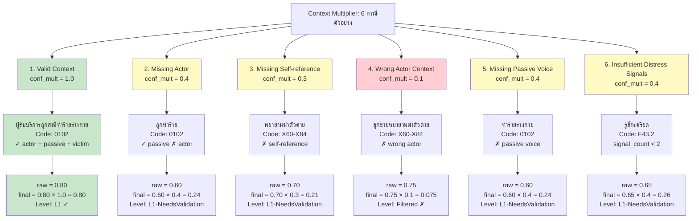
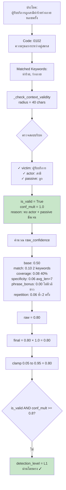
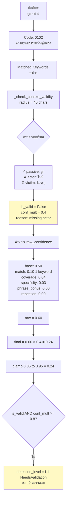
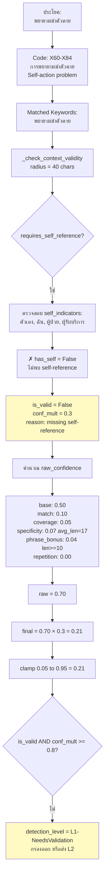
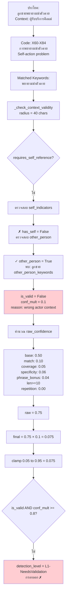
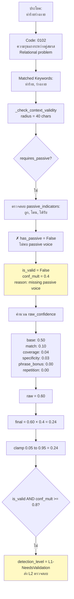

# Mermaid Flowchart: 6 กรณีของ Context Multiplier

## Overview: 6 กรณีตัวอย่างการใช้งาน Context Multiplier

---

## กรณีที่ 1: Valid Context (conf_mult = 1.0)

**ตัวอย่าง:** "ผู้รับบริการถูกสามีทำร้ายร่างกาย หลายครั้ง"

---

## กรณีที่ 2: Missing Actor (conf_mult = 0.4)

**ตัวอย่าง:** "ถูกทำร้าย"

---

## กรณีที่ 3: Missing Self-reference (conf_mult = 0.3)

**ตัวอย่าง:** "พยายามฆ่าตัวตาย"

---

## กรณีที่ 4: Wrong Actor Context (conf_mult = 0.1)

**ตัวอย่าง:** "ลูกชายพยายามฆ่าตัวตาย" (เคสของแม่)

---

## กรณีที่ 5: Missing Passive Voice (conf_mult = 0.4)

**ตัวอย่าง:** "ทำร้ายร่างกาย" (ไม่มี passive voice)

---

## กรณีที่ 6: Insufficient Distress Signals (conf_mult = 0.4)

**ตัวอย่าง:** "รู้สึกเครียด" (F43.2 - Adjustment Disorder)

```mermaid
flowchart TD
    A["ประโยค:<br/>รู้สึกเครียด"] --> B[Code: F43.2<br/>Adjustment Disorder<br/>requires_distress_context]
    
    B --> C[Matched Keywords:<br/>เครียด]
    
    C --> D[_check_context_validity<br/>radius = 40 chars]
    
    D --> E{requires_distress_context?}
    
    E -->|ใช่| F[นับ signal_count<br/>จาก 4 กลุ่ม]
    
    F --> G[1. distress_indicators: เครียด ✓<br/>2. impact_indicators: ✗<br/>3. stressor_indicators: ✗<br/>4. severity_indicators: ✗]
    
    G --> H[signal_count = 1]
    
    H --> I{signal_count >= 2?}
    
    I -->|ไม่| J[is_valid = False<br/>conf_mult = 0.4<br/>reason: ความเครียดระดับเล็กน้อย]
    
    J --> K[คำนวณ raw_confidence]
    
    K --> L[base: 0.50<br/>match: 0.10<br/>coverage: 0.05<br/>specificity: 0.03<br/>phrase_bonus: 0.00<br/>repetition: 0.00]
    
    L --> M[raw = 0.65]
    
    M --> N[final = 0.65 × 0.4 = 0.26]
    
    N --> O[clamp 0.05 to 0.95 = 0.26]
    
    O --> P{is_valid AND conf_mult >= 0.8?}
    
    P -->|ไม่| Q[detection_level = L1-NeedsValidation<br/>ส่ง L2 ตรวจสอบ]
    
    style J fill:#fff9c4
    style Q fill:#fff9c4
```

---

## สรุปผลลัพธ์ทั้ง 6 กรณี

| กรณี | conf_mult | raw | final | Level | ผลลัพธ์ |
|------|-----------|-----|-------|-------|---------|
| 1. Valid Context | 1.0 | 0.80 | 0.80 | L1 | ✅ ผ่านโดยตรง |
| 2. Missing Actor | 0.4 | 0.60 | 0.24 | L1-NeedsValidation | ⚠️ ส่ง L2 |
| 3. Missing Self-ref | 0.3 | 0.70 | 0.21 | L1-NeedsValidation | ⚠️ กรองออก/ส่ง L2 |
| 4. Wrong Actor | 0.1 | 0.75 | 0.075 | Filtered | ❌ กรองออก |
| 5. Missing Passive | 0.4 | 0.60 | 0.24 | L1-NeedsValidation | ⚠️ ส่ง L2 |
| 6. Insufficient Signals | 0.4 | 0.65 | 0.26 | L1-NeedsValidation | ⚠️ ส่ง L2 |

**หมายเหตุ:**
- ✅ **L1** (conf_mult = 1.0, final ≥ 0.72): ผ่านโดยตรง ไม่ต้องส่ง L2
- ⚠️ **L1-NeedsValidation** (conf_mult < 0.8, final 0.21-0.40): ส่ง L2 ตรวจสอบ
- ❌ **Filtered** (final < 0.20): กรองออกทันที
- เกณฑ์เก็บผลสุดท้าย: **final_confidence ≥ 0.25**
