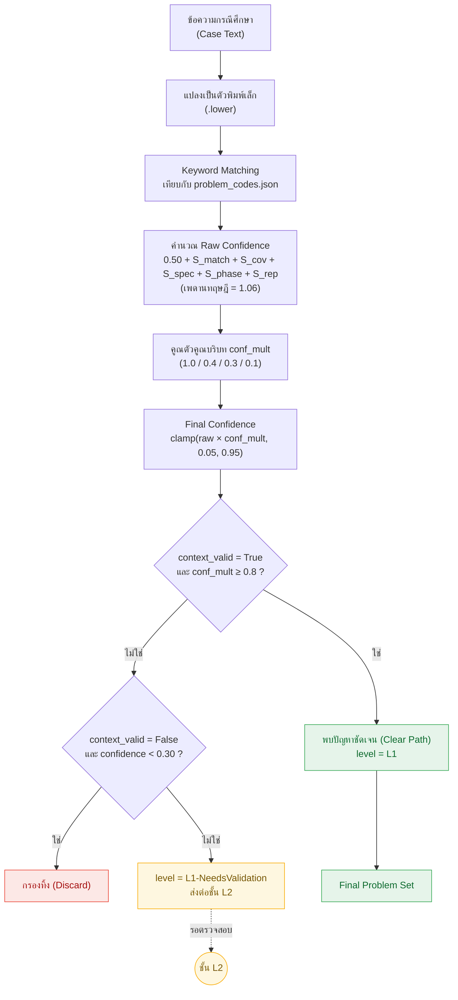
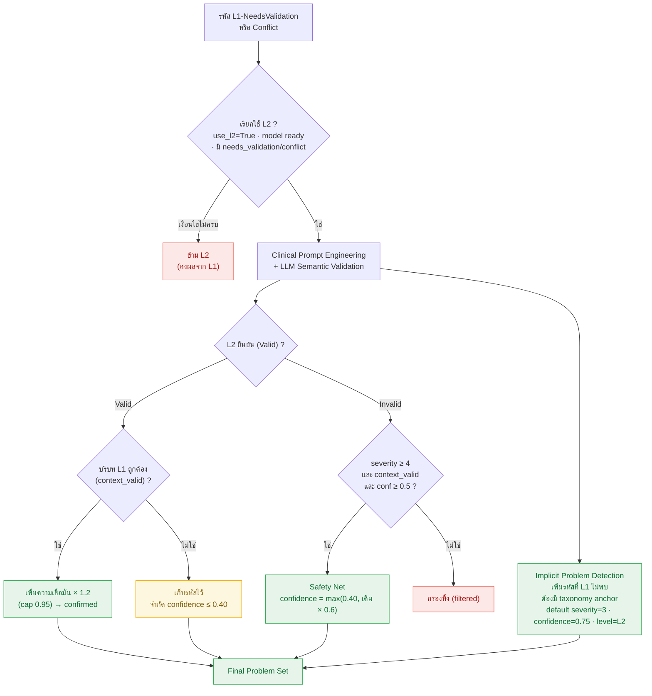

# แผนภาพ Mermaid: กลไกการตรวจจับปัญหา L1 และ L2

## ภาพที่ 3.5 — Flow การตัดสินใจของชั้น L1

```mermaid
flowchart TD
    A["ข้อความกรณีศึกษา<br/>(Case Text)"] --> B["แปลงเป็นตัวพิมพ์เล็ก<br/>(.lower)"]
    B --> C["Keyword Matching<br/>เทียบกับ problem_codes.json"]
    C --> D["คำนวณ Raw Confidence<br/>0.50 + S_match + S_cov + S_spec + S_phase + S_rep<br/>(เพดานทฤษฎี = 1.06)"]
    D --> E["คูณตัวคูณบริบท conf_mult<br/>(1.0 / 0.4 / 0.3 / 0.1)"]
    E --> F["Final Confidence<br/>clamp(raw × conf_mult, 0.05, 0.95)"]
    F --> G{"context_valid = True<br/>และ conf_mult ≥ 0.8 ?"}
    G -->|ใช่| H["พบปัญหาชัดเจน (Clear Path)<br/>level = L1"]
    G -->|ไม่ใช่| I{"context_valid = False<br/>และ confidence < 0.30 ?"}
    I -->|ใช่| J["กรองทิ้ง (Discard)"]
    I -->|ไม่ใช่| K["level = L1-NeedsValidation<br/>ส่งต่อชั้น L2"]

    H --> Z["Final Problem Set"]
    K -.->|รอตรวจสอบ| L2(("ชั้น L2"))

    classDef keep fill:#e6f4ea,stroke:#34a853,color:#0b6b2f;
    classDef drop fill:#fce8e6,stroke:#ea4335,color:#a50e0e;
    classDef wait fill:#fef7e0,stroke:#f9ab00,color:#7a5900;
    class H,Z keep;
    class J drop;
    class K,L2 wait;
```

## ภาพที่ 3.6 — Flow การทำงานของชั้น L2 (Deep Semantic Validation)

```mermaid
flowchart TD
    A["รหัส L1-NeedsValidation<br/>หรือ Conflict"] --> B{"เรียกใช้ L2 ?<br/>use_l2=True · model ready<br/>· มี needs_validation/conflict"}
    B -->|เงื่อนไขไม่ครบ| Z["ข้าม L2<br/>(คงผลจาก L1)"]
    B -->|ใช่| C["Clinical Prompt Engineering<br/>+ LLM Semantic Validation"]

    C --> D{"L2 ยืนยัน (Valid) ?"}
    D -->|Valid| E{"บริบท L1 ถูกต้อง<br/>(context_valid) ?"}
    E -->|ใช่| F["เพิ่มความเชื่อมั่น × 1.2<br/>(cap 0.95) → confirmed"]
    E -->|ไม่ใช่| G["เก็บรหัสไว้<br/>จำกัด confidence ≤ 0.40"]

    D -->|Invalid| H{"severity ≥ 4<br/>และ context_valid<br/>และ conf ≥ 0.5 ?"}
    H -->|ใช่| I["Safety Net<br/>confidence = max(0.40, เดิม × 0.6)"]
    H -->|ไม่ใช่| J["กรองทิ้ง (filtered)"]

    C --> K["Implicit Problem Detection<br/>เพิ่มรหัสที่ L1 ไม่พบ<br/>ต้องมี taxonomy anchor<br/>default severity=3 · confidence=0.75 · level=L2"]

    F --> Y["Final Problem Set"]
    G --> Y
    I --> Y
    K --> Y

    classDef keep fill:#e6f4ea,stroke:#34a853,color:#0b6b2f;
    classDef drop fill:#fce8e6,stroke:#ea4335,color:#a50e0e;
    classDef wait fill:#fef7e0,stroke:#f9ab00,color:#7a5900;
    class F,I,K,Y keep;
    class J,Z drop;
    class G wait;
```
