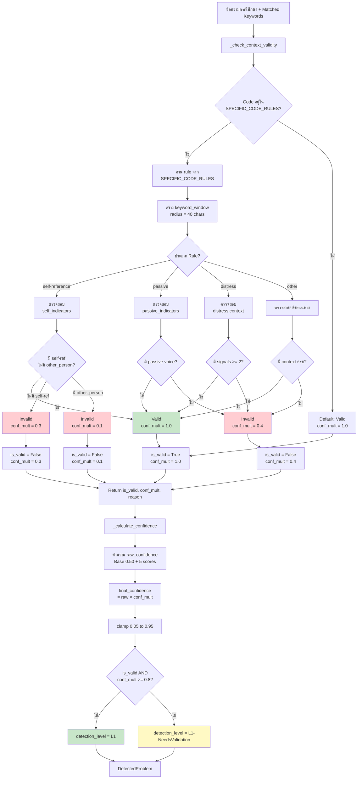
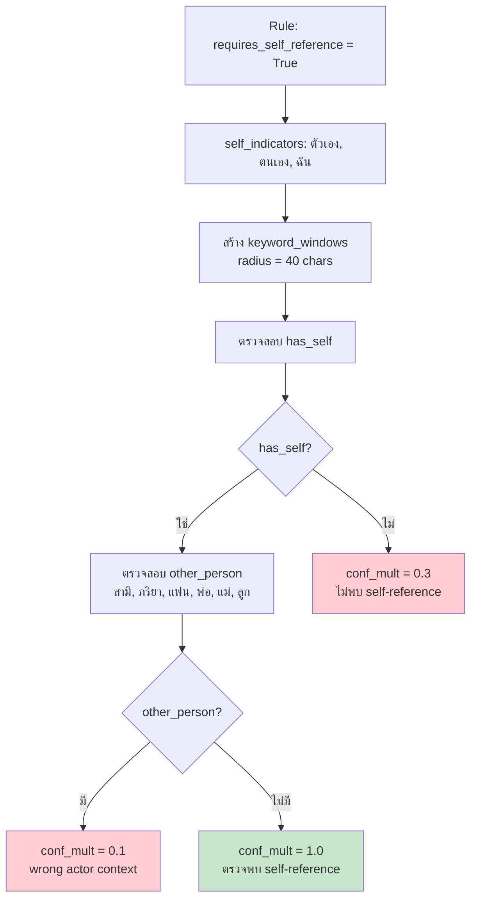
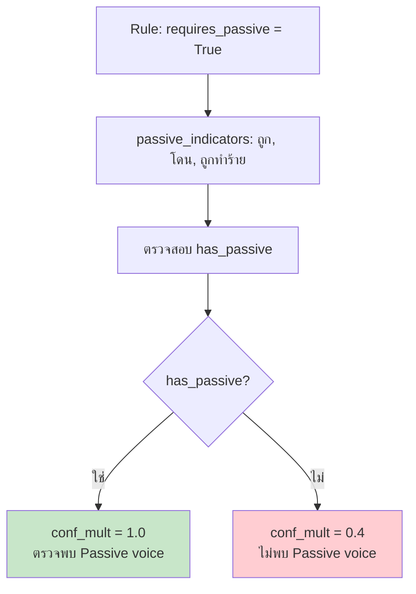
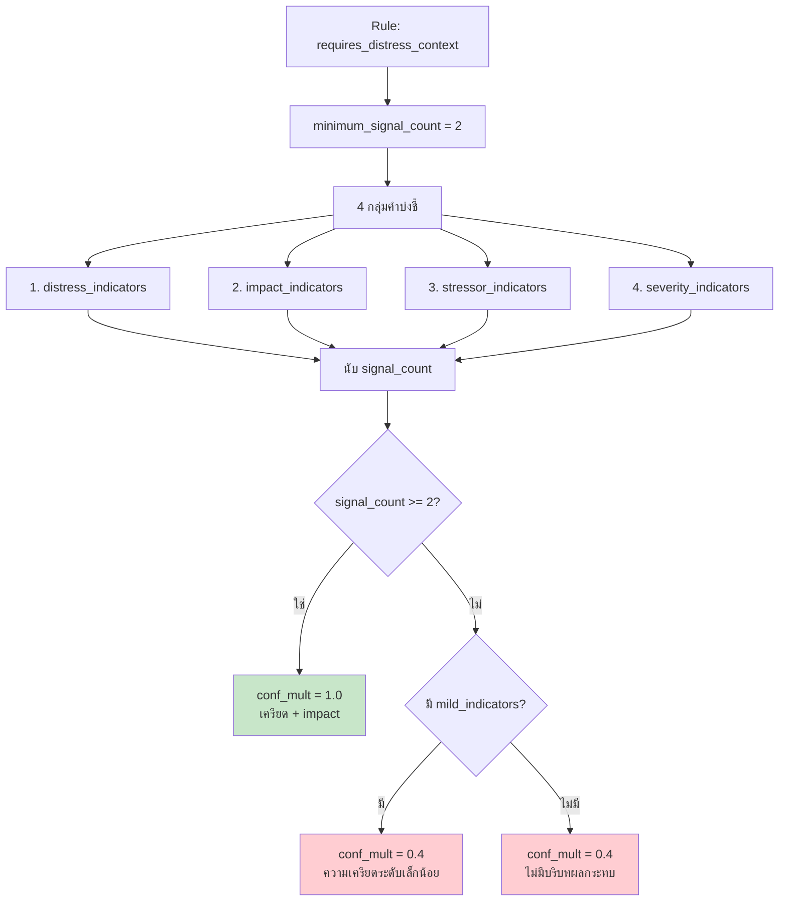
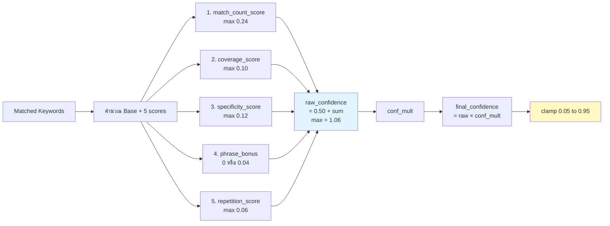
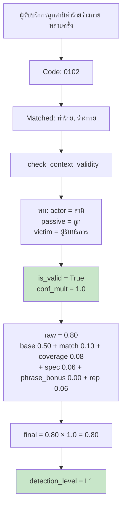
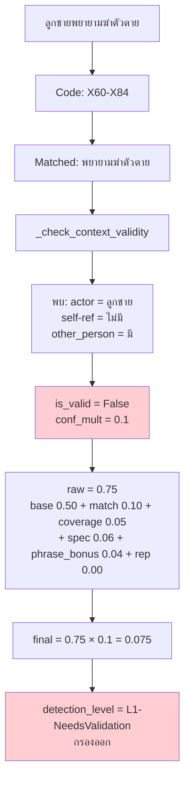
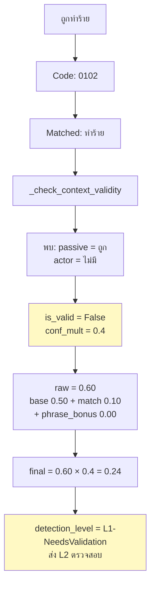
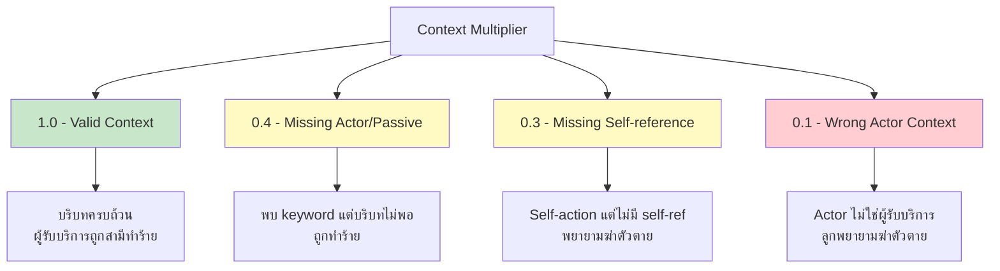
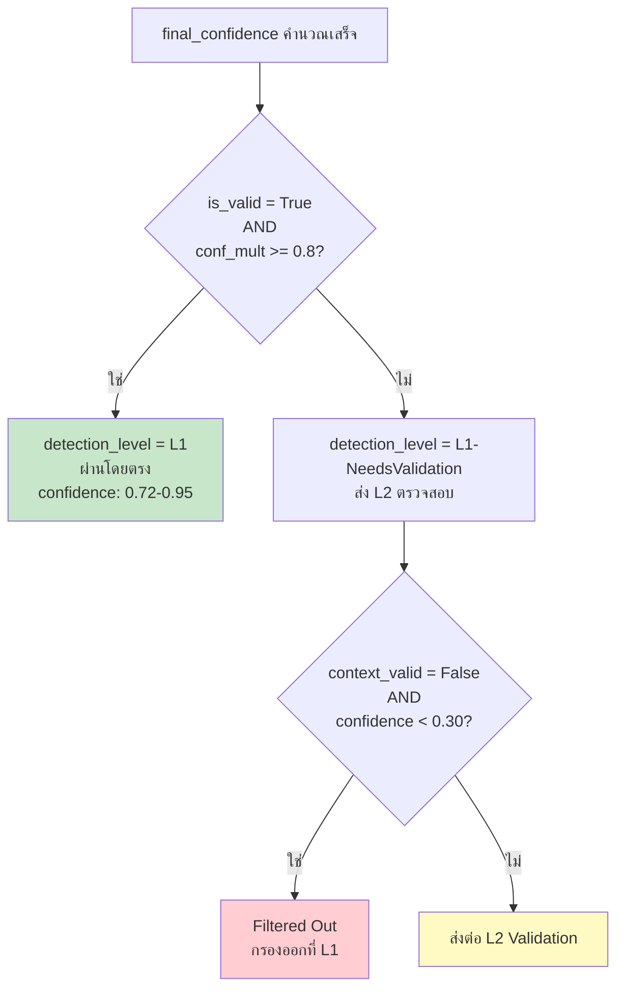

# Mermaid Diagrams: กลไก Context Multiplier (Fixed)

## Diagram 1: Overview Flow ของ Context Multiplier

---

## Diagram 2: Self-Reference Validation Flow

---

## Diagram 3: Passive Voice Validation Flow

---

## Diagram 4: Distress Context Validation (F43.2)

---

## Diagram 5: Confidence Calculation with conf_mult

---

## Diagram 6: Case Study 1 - Valid Context

---

## Diagram 7: Case Study 2 - Wrong Actor

---

## Diagram 8: Case Study 3 - Missing Actor

---

## Diagram 9: conf_mult Summary Table

---

## Diagram 10: Detection Level Decision

