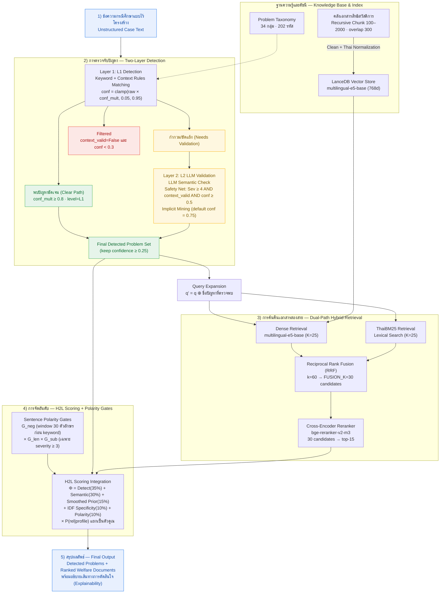

# แผนภาพ Mermaid: ภาพรวมสถาปัตยกรรมระบบ H2L

**ภาพที่ 3.2 ภาพรวมสถาปัตยกรรมระบบ H2L (Two-Level Hierarchical RAG with Polarity Gates)**

**คำบรรยายภาพ:** ระบบ H2L รับข้อความกรณีศึกษาแบบไร้โครงสร้าง แล้วทำการตรวจจับปัญหาแบบสองชั้น (L1 เชิงกฎ/คะแนนความเชื่อมั่น และ L2 ด้วย LLM พร้อมกลไก Safety Net และการตรวจปัญหาแฝง) เพื่อให้ได้ชุดรหัสปัญหาสุดท้าย ปัญหาที่พบจะถูกนำไปทำ Query Expansion ก่อนส่งเข้าสู่การค้นคืนเอกสารแบบ Dual-Path (Dense + ThaiBM25 → RRF) ซึ่งส่ง 30 อันดับแรกไปให้ Reranker คัดกรองเหลือ Top-15 ข้อมูลทั้งสองส่วนบรรจบกันที่ชั้น H2L Scoring ซึ่งผสานคุณลักษณะของปัญหากับคะแนนเอกสาร และควบคุมผลบวกลวงด้วย Contextual Polarity Gates ก่อนสรุปเป็นผลลัพธ์สุดท้าย ค่าพารามิเตอร์ทั้งหมดอ้างอิงจาก implementation จริง
