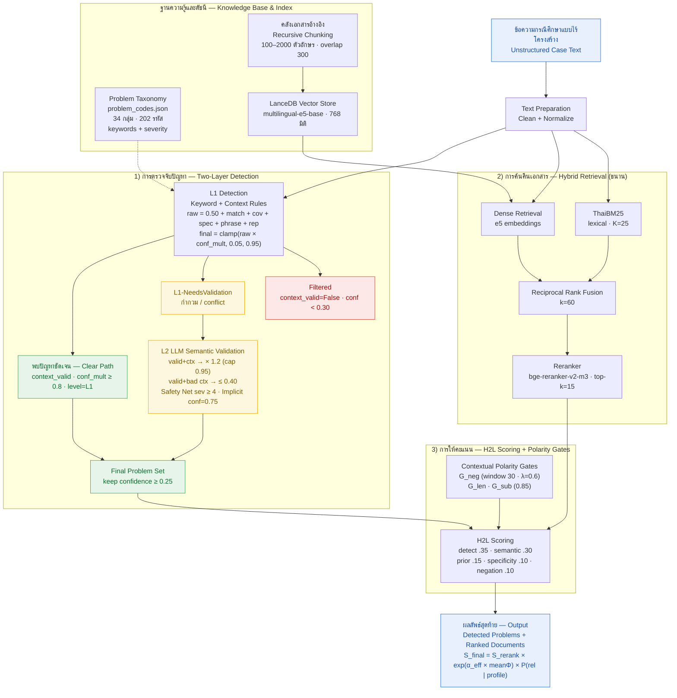

# แผนภาพ Mermaid: ภาพรวมสถาปัตยกรรมระบบ H2L

**ภาพที่ 3.2 ภาพรวมสถาปัตยกรรมระบบ H2L (Two-Level Hierarchical RAG with Polarity Gates)**

**คำบรรยายภาพ:** ระบบ H2L รับข้อความกรณีศึกษาแบบไร้โครงสร้าง แล้วแยกการประมวลผลออกเป็นสองเส้นทางขนานจากขั้นเตรียมข้อความเดียวกัน เส้นทางแรกคือการตรวจจับปัญหาแบบสองชั้น (L1 เชิงกฎ/คะแนนความเชื่อมั่น และ L2 ด้วย LLM พร้อมกลไก Safety Net และการตรวจปัญหาแฝง) เพื่อให้ได้ชุดรหัสปัญหาสุดท้าย เส้นทางที่สองคือการค้นคืนเอกสารแบบไฮบริด (Dense + ThaiBM25 → RRF → Reranker) ทั้งสองเส้นทางบรรจบกันที่ชั้น H2L Scoring ซึ่งผสานคุณลักษณะของปัญหากับคะแนนเอกสาร และควบคุมผลบวกลวงด้วย Contextual Polarity Gates ก่อนสรุปเป็นผลลัพธ์สุดท้าย ค่าพารามิเตอร์ทั้งหมดอ้างอิงจาก implementation จริง
