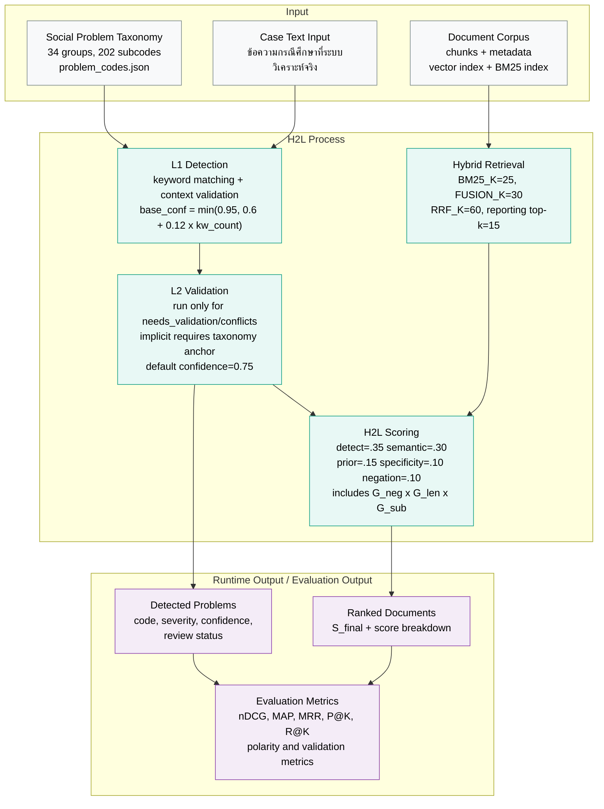
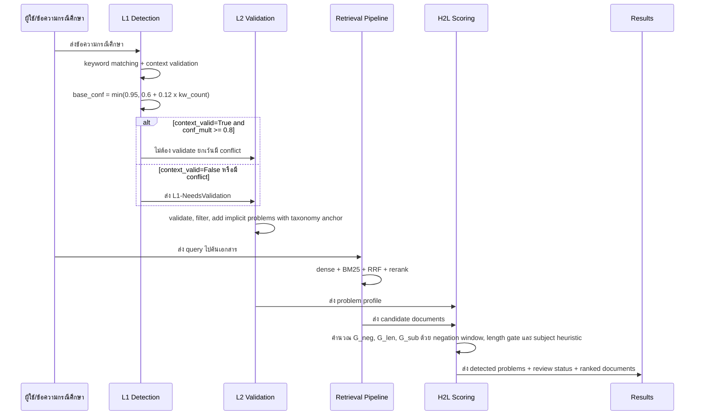
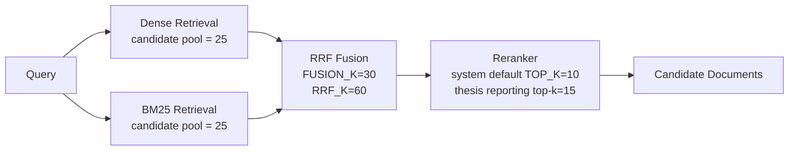
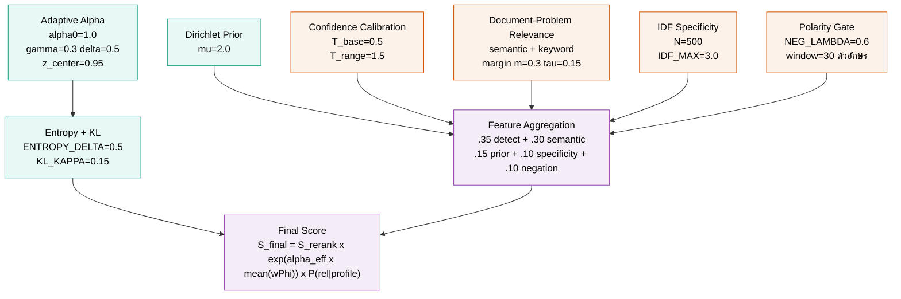
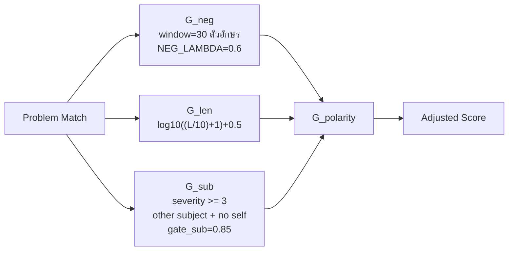

# กรอบแนวคิด สถาปัตยกรรมระบบ และกระแสการคำนวณทางคณิตศาสตร์

เอกสารฉบับนี้เป็นเอกสารประกอบบทที่ 3 สำหรับอธิบายกรอบแนวคิด สถาปัตยกรรมระบบ และกระแสการคำนวณของระบบ H2L ซึ่งหมายถึง **A Two-Level Hierarchical Retrieval-Augmented Generation Approach with Polarity Gates for Screening and Differential Diagnosis of Social Problems** ให้สอดคล้องกับไฟล์หลัก `md_report/thesis_full_ch3_methodology.md` ฉบับที่ใช้รายงานผล เนื้อหานี้เน้นภาพรวมเชิงระบบและสูตรที่จำเป็นต่อการอ้างอิงในวิทยานิพนธ์ โดยแทรกค่าพารามิเตอร์และ threshold ที่ตรวจสอบจากโค้ดปัจจุบันเท่าที่สามารถระบุได้

---

## 1. ความสัมพันธ์กับบทที่ 3

บทที่ 3 อธิบายระบบ H2L ในฐานะ pipeline แบบทวิลำดับชั้นสำหรับวิเคราะห์ข้อความกรณีศึกษา ตรวจจับรหัสปัญหา ค้นคืนเอกสาร และปรับคะแนนผลลัพธ์ด้วย problem-aware scoring ร่วมกับ Polarity Gates ส่วนเอกสารฉบับนี้ทำหน้าที่ขยายรายละเอียดด้านกรอบแนวคิดและลำดับสมการ เพื่อใช้เป็นแหล่งอ้างอิงร่วมกับภาพประกอบและตารางในบทที่ 3

ประเด็นที่ปรับให้ตรงกับบทที่ 3 ฉบับที่ใช้รายงานผลมีดังนี้

- L1 detection ใช้ keyword matching ร่วมกับ context validation เป็นเกณฑ์หลักของ detector
- L2 validation ทำงานแบบ LLM-based validation สำหรับรหัสที่กำกวมหรือมี conflict ไม่ได้ใช้ `L2_SIMILARITY_THRESHOLD=0.7` เป็นเกณฑ์ตัดสินโดยตรง
- Retrieval pipeline แยกจาก detector และใช้ dense retrieval, BM25, RRF fusion และ reranking ตามค่า config
- Contextual Polarity Gates ประกอบด้วย `G_neg`, `G_len` และ `G_sub` ในฐานะ feature ภายใน H2L scoring ไม่ใช่ stage แยกหลัง retrieval
- ค่าที่ใช้กำกับภาพประกอบหลัก ได้แก่ `0.30`, `0.25`, `0.40`, `0.75`, `BM25_K=25`, `FUSION_K=30`, `RRF_K=60`, `NEG_LAMBDA=0.6`, `gate_sub=0.85` และ reporting `top_k=15` สำหรับผลวิจัยหลัก

---

## 2. กรอบแนวคิดการวิจัย

กรอบแนวคิดของงานวิจัยนี้อธิบายความสัมพันธ์ระหว่างข้อมูลนำเข้า กระบวนการของระบบ และผลลัพธ์ที่นำไปประเมินผล โดยระบบ H2L ทำหน้าที่เป็นกระบวนการแทรกแซงที่เชื่อมข้อความกรณีศึกษาเข้ากับฐานความรู้รหัสปัญหาและคลังเอกสารอ้างอิง ขณะที่ `expanded_ground_truth.json` ทำหน้าที่เป็นชุดข้อมูลสำหรับการประเมินผลและการตรวจสอบย้อนกลับเชิงงานวิจัย ไม่ใช่ข้อมูลนำเข้าของ runtime detector โดยตรง



**ตารางที่ 1 ตัวแปรในกรอบแนวคิด**

| ประเภท | ตัวแปร | แหล่งข้อมูลหรือโมดูล |
|---|---|---|
| ตัวแปรต้น | Taxonomy รหัสปัญหา 34 กลุ่ม 202 รหัสย่อย | `problem_codes.json` |
| ตัวแปรต้น | ข้อความกรณีศึกษาที่ระบบวิเคราะห์จริง | runtime case input |
| ตัวแปรต้น | คลังเอกสารและ metadata | `data/`, vector DB, BM25 index |
| กระบวนการ | L1/L2 detection | `H2LDetector.py` |
| กระบวนการ | Retrieval + H2L scoring | `retrieval_engine.py`, `H2L_core.py` |
| ตัวแปรประเมิน | ชุดกรณีศึกษาอ้างอิง 197 เคส | `expanded_ground_truth.json` |
| ตัวแปรตาม | คุณภาพการค้นคืนและความปลอดภัยเชิงบริบท | `evaluate_h2l_proper.py`, `evaluate_sentence_polarity.py` |

---

## 3. ลำดับการทำงานของระบบ

ระบบ H2L ทำงานเป็นลำดับจากการตรวจจับปัญหาไปสู่การค้นคืนเอกสารและการปรับคะแนน โดยแยก detection ออกจาก retrieval อย่างชัดเจน เพื่อให้สามารถอธิบายผลลัพธ์และตรวจสอบข้อผิดพลาดได้เป็นขั้นตอน



---

## 4. Detection pipeline: L1 และ L2

### 4.1 L1 Context-Aware Detection

L1 ใช้คำสำคัญจาก taxonomy จับคู่กับข้อความกรณีศึกษา แล้วตรวจสอบบริบทของรหัสนั้นก่อนกำหนดสถานะผลลัพธ์ สูตร confidence ของ L1 คือ

$$base\_confidence = \min(0.95, 0.6 + 0.12 \times kw\_count)$$

$$final\_confidence = base\_confidence \times conf\_mult$$

เงื่อนไขสำคัญมีดังนี้

| เงื่อนไข | ผลลัพธ์ |
|---|---|
| `context_valid=True` และ `conf_mult >= 0.8` | สถานะ `L1` |
| `context_valid=False` หรือพบ conflict | สถานะ `L1-NeedsValidation` |
| `context_valid=False` และ `confidence < 0.30` | กรองออกใน L1 |
| หลังรวม L1/L2 แล้ว `confidence < 0.25` | กรองออกใน final filter |

โค้ดอ้างอิงแบบย่อ:

```python
base_confidence = min(0.95, 0.6 + len(matched) * 0.12)
final_confidence = base_confidence * conf_mult

if is_valid and conf_mult >= 0.8:
    detection_level = "L1"
else:
    detection_level = "L1-NeedsValidation"
```

### 4.2 Context multiplier

ค่าตัวคูณบริบททำหน้าที่ลดหรือคงคะแนนของ keyword match ตามความครบถ้วนของบริบท

| สถานะบริบท | `conf_mult` |
|---|---:|
| บริบทถูกต้อง | 1.0 |
| ไม่พบ actor หรือ passive context | 0.4 |
| ไม่พบ self-reference | 0.3 |
| self-action แต่รหัสไม่ควรเป็น self-case | 0.1 |

### 4.3 L2 Validation และ implicit problems

L2 ทำงานเฉพาะเมื่อเข้าเงื่อนไขครบ คือ `use_l2=True`, L2 model พร้อมใช้งาน และมี `needs_validation` หรือ `conflicts` จาก L1

| กรณี | ผลลัพธ์ |
|---|---|
| L2 valid และ `context_valid=True` | keep, `confidence = min(0.95, old x 1.2)` |
| L2 valid แต่ `context_valid=False` | keep with caution, `confidence <= 0.40` |
| L2 invalid แต่ `severity >= 4` และ `context_valid=True` | safety net, `confidence = max(0.40, old x 0.6)` |
| L2 invalid และไม่เข้า safety net | filter out |
| L2 เสนอ implicit code ที่ไม่อยู่ใน L1 และมี taxonomy anchor | เพิ่มเป็น `level=L2`, default `severity=3`, `confidence=0.75` |

โค้ดอ้างอิงแบบย่อ:

```python
if v.get("is_valid", True):
    if not p.context_valid:
        p.confidence = min(0.4, p.confidence)
    else:
        p.confidence = min(0.95, p.confidence * 1.2)
elif p.severity >= 4 and p.context_valid:
    p.confidence = max(0.4, p.confidence * 0.6)
```

---

## 5. Retrieval pipeline

Retrieval pipeline แยกจาก detector และทำหน้าที่ค้นคืนเอกสารจากคลังข้อมูล โดยใช้ dense retrieval และ BM25 ควบคู่กัน ก่อนผสานด้วย reciprocal rank fusion และ rerank ผลลัพธ์ขั้นสุดท้าย



ค่าเริ่มต้นที่ใช้ในระบบมีดังนี้

| พารามิเตอร์ | ค่า |
|---|---:|
| `TOP_K` | 10 (system default) |
| `BM25_K` | 25 |
| `FUSION_K` | 30 |
| `RRF_K` | 60 |
| `USE_RERANK` | True |

หมายเหตุ: แม้ `TOP_K=10` จะเป็นค่า default ใน config ของระบบ แต่ผลวิจัยหลักในวิทยานิพนธ์ override เป็น `top_k=15` เพื่อให้ benchmark และ runtime reporting ใช้ protocol เดียวกัน

โค้ดอ้างอิงแบบย่อ:

```python
dense_hits = self.dense_retriever.search(query, top_k=bm25_k)
bm25_hits = self.lexical_retriever.search(query, top_k=bm25_k)
fused_hits = _rrf_fusion(dense_hits, bm25_hits, k=fusion_k, rrf_k=self.config.RRF_K)
```

---

## 6. Mathematical scoring pipeline

### 6.1 ภาพรวมการคำนวณ

การคำนวณคะแนน H2L แบ่งเป็น 3 ระยะ ได้แก่ pre-compute ต่อ query, per-document/per-problem computation และ final aggregation



### 6.2 Dirichlet-smoothed prior

$$P_{smoothed}(p_i) = \frac{sev_i + \mu P_{bg}}{\sum_j sev_j + \mu}$$

| พารามิเตอร์ | ค่า | ความหมาย |
|---|---:|---|
| $\mu$ | 2.0 | ความแรงของ smoothing |
| $P_{bg}$ | $1/|P|$ | background prior แบบ uniform |
| $sev_i$ | 1 ถึง 5 | ระดับความรุนแรงของปัญหา |

### 6.3 Severity-weighted confidence calibration

$$C(p_i|q) = P(p_i|q)^{1/T_i}$$

$$T_i = T_{base} + (1 - sev_i / sev_{max}) \times T_{range}$$

| พารามิเตอร์ | ค่า |
|---|---:|
| `CALIBRATION_T_BASE` | 0.5 |
| `CALIBRATION_T_RANGE` | 1.5 |

### 6.4 Adaptive alpha และ regularization

$$\alpha(C) = \alpha_0 \times 2 \times \sigma(\gamma |P| + \delta \bar{c} - z_{center})$$

โดยค่า default คือ $\alpha_0=1.0$, $\gamma=0.3$, $\delta=0.5$ และ $z_{center}=0.95$

หลังจากนั้นระบบปรับด้วย entropy และ KL penalty:

$$\alpha_{eff} = \alpha(C) \times (1 + \delta_H H_{severity}) \times (1 - \kappa KL_{penalty})$$

| พารามิเตอร์ | ค่า |
|---|---:|
| `ENTROPY_SCALE_DELTA` | 0.5 |
| `KL_KAPPA` | 0.15 |

### 6.5 Feature aggregation

ระบบใช้ weighted sum แทนการคูณ feature ทุกตัวเข้าด้วยกัน เพื่อป้องกันไม่ให้ feature ที่ต่ำเพียงตัวเดียวทำให้คะแนนรวมเป็นศูนย์

$$\Phi_i = \sum_k w_k \varphi_k(d, p_i, q)$$

| Feature | น้ำหนัก |
|---|---:|
| Detection confidence | 0.35 |
| Semantic/document-problem relevance | 0.30 |
| Problem prior | 0.15 |
| Specificity/IDF | 0.10 |
| Negation/polarity gate | 0.10 |

โค้ดอ้างอิงแบบย่อ:

```python
FEATURE_WEIGHTS = {
    'detect': 0.35,
    'semantic': 0.30,
    'prior': 0.15,
    'specificity': 0.10,
    'negation': 0.10,
}
```

### 6.6 Final score

สมการสุดท้ายของ H2L ใช้คะแนนพื้นฐานจาก reranker คูณด้วย boost จาก problem-aware features และ Bayesian prior:

$$S_{final} = S_{rerank} \times \exp(\alpha_{eff} \times mean(w_i \Phi_i)) \times P(rel|profile)$$

ค่า exponent ถูก clamp ในช่วง `[-3.0, 3.0]` เพื่อป้องกันความไม่เสถียรเชิงตัวเลข

---

## 7. Contextual Polarity Gates

Contextual Polarity Gates ใช้ควบคุมผลบวกลวงจากข้อความเชิงปฏิเสธ ข้อความสั้น และการกล่าวถึงบุคคลอื่น โดยใช้ผลคูณของ 3 gate หลัก

$$G_{polarity} = G_{neg} \times G_{len} \times G_{sub}$$



### 7.1 Negation gate

ระบบค้นหาคำปฏิเสธในหน้าต่างย้อนหลัง 30 ตัวอักษรก่อน keyword

$$G_{neg} = 1.0 - \lambda_{neg} \times neg\_ratio$$

โดย $\lambda_{neg}=0.6$ และค่าถูก clamp ในช่วง `[0.1, 1.0]`

### 7.2 Length gate

$$G_{len} = \min(1.0, \log_{10}(L/10 + 1) + 0.5)$$

### 7.3 Subject/actor gate

เมื่อ `severity >= 3` และพบคำที่ชี้ถึงบุคคลอื่นโดยไม่พบคำที่ชี้ถึงผู้ป่วยเอง ระบบจะลดค่าเป็น `gate_sub=0.85`

**ตารางที่ 2 ตัวอย่างค่าที่รันจากฟังก์ชันจริง**

| ข้อความตัวอย่าง | Gate ที่เด่น | ค่าที่ได้ |
|---|---|---:|
| ผู้ป่วยไม่ได้ขาดความรู้ เข้าใจโรคดี | `gate_neg` | 0.40 |
| รุนแรง | `gate_len` | 0.7041 |
| น้องสาวถูกสามีทำร้ายร่างกาย | `gate_sub` | 0.85 |
| ผู้ป่วยเล่าว่าน้องสาวถูกสามีทำร้ายร่างกาย | `gate_total` | 1.00 |

โค้ดอ้างอิงแบบย่อ:

```python
window_start = max(0, idx - 30)
gate_neg = 1.0 - config.NEG_LAMBDA * neg_ratio
gate_len = min(1.0, math.log10((char_len / 10.0) + 1.0) + 0.5)

if severity >= 3 and has_other and not has_self:
    gate_sub = 0.85
```

---

## 8. กรอบการประเมินผล

การประเมินผลแบ่งเป็น 3 กลุ่มหลัก ได้แก่ การประเมินคุณภาพ retrieval การประเมินกลไก polarity/detection และการวิเคราะห์เชิงสถิติหรือการประเมินโดยผู้เชี่ยวชาญ

| กลุ่มการประเมิน | ตัวชี้วัดหรือวิธีการ |
|---|---|
| Retrieval quality | nDCG@K, MAP, MRR, Precision@K, Recall@K |
| Detection/polarity safety | Accuracy, F1, false positive behavior, negation-related cases |
| Comparative analysis | ablation study, sensitivity analysis, statistical tests, expert validation |

หมายเหตุ: เอกสารนี้ไม่กำหนด threshold ตัดสิทธิ์เชิงคลินิกเป็นค่า hard constraint ของระบบหลัก เพราะบทที่ 3 ฉบับที่ใช้รายงานผลอธิบายการประเมินผลเป็นกรอบเชิงวิธีวิจัย ไม่ได้ใช้เกณฑ์ดังกล่าวเป็นเงื่อนไขตัดสินใน implementation หลัก

---

## 9. ตารางสรุปพารามิเตอร์ที่สอดคล้องกับบทที่ 3

| กลุ่ม | พารามิเตอร์ | ค่า |
|---|---|---:|
| L1 detection | base confidence | `min(0.95, 0.6 + 0.12 x kw_count)` |
| L1 detection | clear L1 condition | `context_valid=True`, `conf_mult >= 0.8` |
| L1 detection | L1 pre-filter | `context_valid=False`, `confidence < 0.30` |
| L1/L2 output | final keep threshold | `confidence >= 0.25` |
| L2 validation | valid boost | `x 1.2`, cap `0.95` |
| L2 validation | bad-context cap | `<= 0.40` |
| L2 implicit | default severity/confidence | `3`, `0.75` |
| Retrieval | `BM25_K`, `FUSION_K`, `RRF_K`, `TOP_K` | `25`, `30`, `60`, `10` |
| H2L scoring | feature weights | `.35`, `.30`, `.15`, `.10`, `.10` |
| H2L scoring | `DIRICHLET_MU`, `KL_KAPPA` | `2.0`, `0.15` |
| H2L scoring | `MARGIN_M`, `MARGIN_TAU` | `0.3`, `0.15` |
| Polarity | `NEG_LAMBDA`, window | `0.6`, `30 ตัวอักษร` |
| Polarity | `gate_sub` | `0.85` |

---

## 10. สรุป

เอกสาร framework และ math flow ฉบับนี้ถูกปรับให้ทำหน้าที่เป็นเอกสารประกอบบทที่ 3 โดยตรง เนื้อหาเน้นความสอดคล้องกับ implementation ปัจจุบันมากกว่าการอธิบายเชิงแนวคิดแบบกว้าง ๆ จุดที่สำคัญคือการแยก L1/L2 detection ออกจาก retrieval pipeline อย่างชัดเจน การใช้ threshold จริงของ detector การใช้ค่า retrieval defaults จาก config และการอธิบาย Contextual Polarity Gates ในฐานะ feature ภายใน H2L scoring ตามสูตรและค่าที่มีอยู่ในโค้ดจริง
