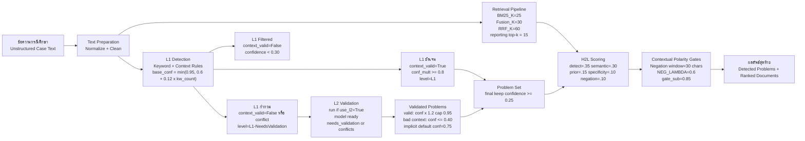
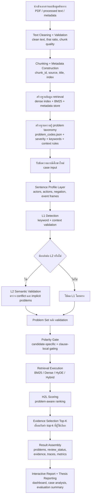
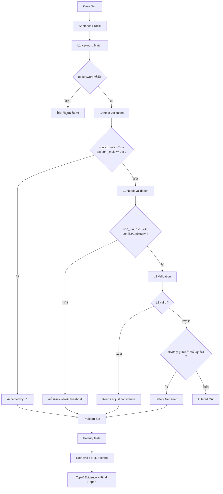
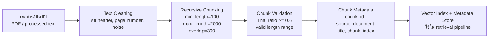
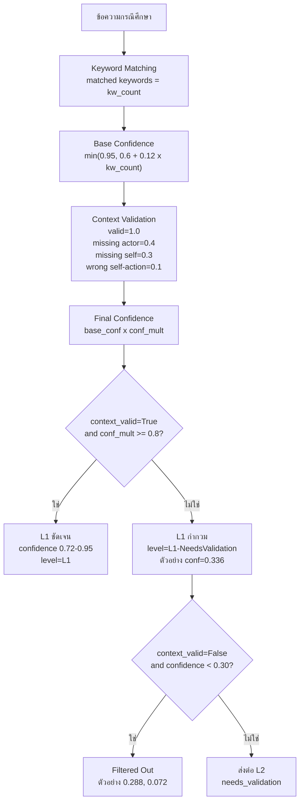
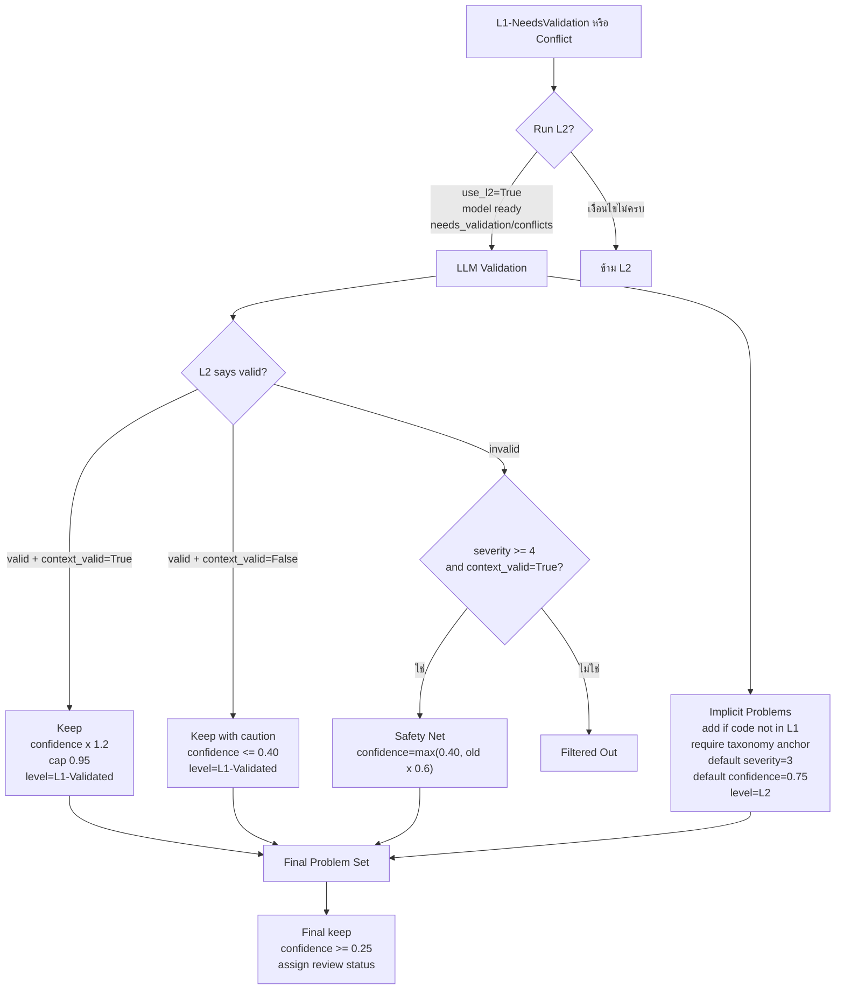
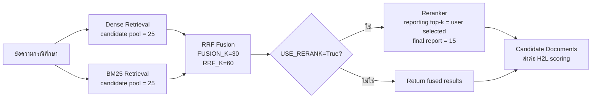
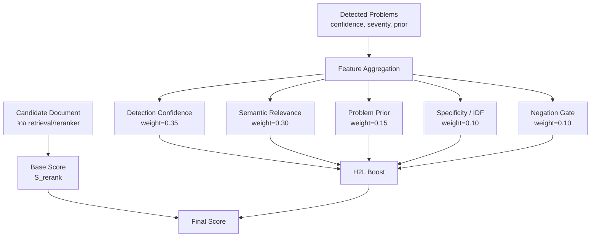
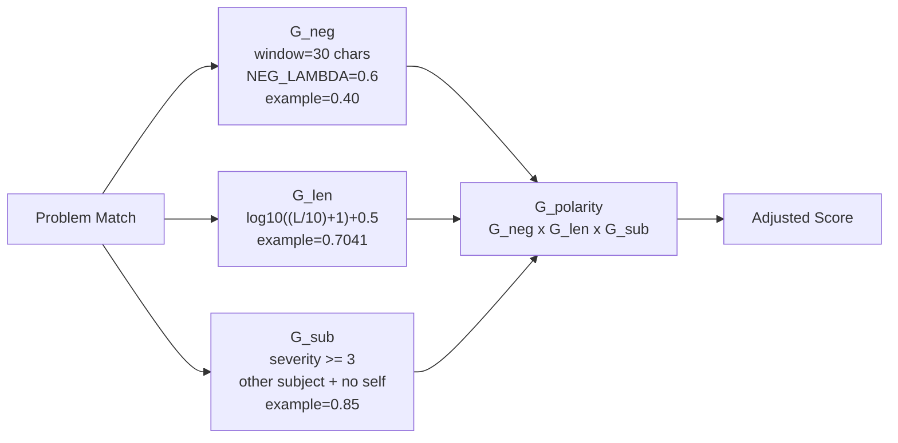

# บทที่ 3 วิธีดำเนินการวิจัยและการออกแบบระบบ H2L

การวิจัยฉบับนี้เป็นการวิจัยเชิงทดลองและพัฒนาระบบ (Experimental and System Development Research) โดยมีวัตถุประสงค์เพื่อออกแบบและพัฒนาระบบค้นคืนข้อมูลเชิงความหมายสำหรับสนับสนุนการคัดกรองปัญหาสังคมและการประเมินความเสี่ยงทางจิตสังคมจากข้อความกรณีศึกษาแบบไร้โครงสร้างในบริบทสังคมสงเคราะห์ทางการแพทย์และสังคมสงเคราะห์คลินิก ระบบที่พัฒนาขึ้นใช้ชื่อว่า **H2L (A Two-Level Hierarchical Retrieval-Augmented Generation Approach with Polarity Gates for Screening and Differential Diagnosis of Social Problems)** ซึ่งออกแบบให้เชื่อมโยงการตรวจจับปัญหาทางสังคม การอ้างอิงบริบททางคลินิก และการค้นคืนเอกสารที่เกี่ยวข้องเข้าไว้ในกระบวนการเดียวกัน

บทนี้นำเสนอวิธีดำเนินการวิจัยและการออกแบบระบบในเชิงกระบวนการ โดยเริ่มจากการเตรียมข้อมูลเอกสาร การออกแบบฐานความรู้รหัสปัญหา การตรวจจับปัญหาจากข้อความ การค้นคืนเอกสาร การปรับคะแนนด้วย H2L scoring framework และการควบคุมผลบวกลวงด้วย Contextual Polarity Gates ภาพประกอบในบทนี้แทรกค่าตัวเลขที่ตรวจสอบจากโค้ดจริงเท่าที่สามารถระบุได้ เพื่อให้สอดคล้องกับระบบที่พัฒนาขึ้นจริงและสามารถตรวจสอบย้อนกลับได้

## 3.1 วิธีดำเนินการวิจัย

หลักคิดสำคัญของระบบนี้คือการแยกกระบวนการวิเคราะห์ออกเป็นโมดูลที่ตรวจสอบย้อนกลับได้ แทนที่จะส่งข้อความทั้งหมดเข้าสู่แบบจำลองแบบ end-to-end เพียงครั้งเดียว เนื่องจากข้อความกรณีศึกษาทางสังคมสงเคราะห์มักมีความซับซ้อนสูง เช่น มีการกล่าวถึงบุคคลหลายฝ่าย มีการใช้คำปฏิเสธ มีการกล่าวถึงปัญหาในเชิงอ้อม หรือมีคำสำคัญที่อาจนำไปสู่การตีความผิดหากพิจารณาเฉพาะการพบคำ ระบบจึงถูกออกแบบให้มีสองระดับหลัก ได้แก่ L1 สำหรับการตรวจจับด้วยกฎเชิงบริบท และ L2 สำหรับการตรวจสอบเชิงความหมาย จากนั้นใช้ H2L scoring และ Polarity Gates เป็นกลไกประกอบการปรับคะแนน ไม่ใช่ระดับที่สามของสถาปัตยกรรม

ในเชิงกระบวนการ วิธีดำเนินการวิจัยแบ่งออกเป็น 6 ขั้นตอนหลัก ได้แก่ การเตรียมเอกสารและสร้างฐานข้อมูล retrieval การออกแบบฐานความรู้รหัสปัญหา การตรวจจับปัญหาจากข้อความกรณีศึกษา การค้นคืนเอกสารอ้างอิง การปรับคะแนนเอกสารด้วย H2L scoring framework และการประเมินผลระบบด้วยชุดข้อมูลอ้างอิงและตัวชี้วัดมาตรฐาน

## 3.2 ภาพรวมสถาปัตยกรรมและ pipeline ของระบบ

สถาปัตยกรรมของระบบ H2L ถูกออกแบบในรูปแบบ pipeline-based modular architecture เพื่อให้แต่ละส่วนมีหน้าที่ชัดเจนและสามารถตรวจสอบผลลัพธ์ระหว่างทางได้ ระบบเริ่มจากการรับข้อความกรณีศึกษา จากนั้นทำการตรวจจับปัญหาแบบสองระดับ โดยระดับแรกใช้ keyword matching ร่วมกับ context validation และระดับที่สองใช้แบบจำลองภาษาขนาดใหญ่เพื่อตรวจสอบรหัสที่กำกวมหรือมี conflict เมื่อได้ชุด problem codes แล้ว ระบบจะนำข้อความเข้าสู่ retrieval pipeline เพื่อค้นคืนเอกสารที่เกี่ยวข้อง และนำผลลัพธ์ retrieval มาปรับคะแนนด้วย H2L scoring และ Contextual Polarity Gates

**ภาพที่ 3.1 ภาพรวม pipeline ของระบบ H2L พร้อมค่าที่ใช้กำกับการตัดสินใจ**



คำบรรยายภาพ: ภาพที่ 3.1 แสดงลำดับการประมวลผลของระบบ H2L ตั้งแต่การรับข้อความกรณีศึกษา การตรวจจับปัญหา การส่งรหัสที่กำกวมไปตรวจสอบในระดับ L2 การค้นคืนเอกสาร และการปรับคะแนนด้วย H2L scoring framework ตัวเลขที่ใส่ในภาพเป็นค่าจากโค้ดปัจจุบัน เช่น สูตรคำนวณความเชื่อมั่นใน L1, เกณฑ์กรองที่ `0.30`, เกณฑ์เก็บผลสุดท้ายที่ `0.25`, ค่า retrieval defaults และค่าน้ำหนักของ feature ใน H2L scoring

โค้ดอ้างอิงแบบย่อ:

```python
# H2LDetector.py
base_confidence = min(0.95, 0.6 + len(matched) * 0.12)
final_confidence = base_confidence * conf_mult

if is_valid and conf_mult >= 0.8:
    detection_level = "L1"
else:
    detection_level = "L1-NeedsValidation"
```

### 3.2.1 Flow diagram ของระบบตั้งแต่การนำเข้าข้อมูลจนถึงการรายงานผล

เพื่อให้สอดคล้องกับหลักการเขียนบทที่ 3 ของวิทยานิพนธ์ ผู้วิจัยควรอธิบายกระบวนการทำงานของระบบตั้งแต่ระดับการเตรียมข้อมูล (offline preparation) ไปจนถึงระดับการประมวลผลเคสจริง (online inference) และการรายงานผลอย่างต่อเนื่อง ภาพต่อไปนี้จึงทำหน้าที่เป็นภาพรวมเชิงระเบียบวิธีของทั้งระบบ ไม่ใช่เฉพาะ retrieval pipeline หรือ detector เพียงส่วนเดียว

**ภาพที่ 3.1A flow diagram ตั้งแต่การนำเข้าข้อมูลจนถึงการประมวลผลและรายงานผล**



คำบรรยายภาพ: ภาพที่ 3.1A แสดงกระบวนการทั้งหมดของงานวิจัยตั้งแต่การนำเข้าและเตรียมข้อมูล การสร้างฐาน retrieval และฐานความรู้รหัสปัญหา การวิเคราะห์กรณีศึกษา การค้นคืนเอกสาร และการประกอบผลลัพธ์ในรูปแบบรายงานเชิงโต้ตอบและผลสำหรับการอภิปรายในวิทยานิพนธ์ ภาพนี้ช่วยให้ผู้อ่านเข้าใจว่าระบบไม่ได้มีเฉพาะตัวโมเดล แต่เป็น workflow เชิงระบบที่ประกอบด้วยทั้งส่วน offline preparation และ online inference

### 3.2.2 Model Logic Tree ของ H2L

นอกจากภาพรวมแบบ pipeline แล้ว การอธิบายตรรกะการตัดสินใจของโมเดลในรูปแบบ tree จะช่วยให้ผู้อ่านเห็นชัดว่าระบบ H2L ใช้หลักคิดแบบลำดับขั้น (hierarchical decision process) อย่างไร โดยเฉพาะการแยกเส้นทางของรหัสที่ชัดเจน รหัสที่กำกวม และรหัสที่ต้องถูกกรองออก

**ภาพที่ 3.1B Model Logic Tree ของระบบ H2L**



คำบรรยายภาพ: ภาพที่ 3.1B อธิบายตรรกะการตัดสินใจของระบบ H2L ในลักษณะ logic tree จุดสำคัญคือระบบไม่ได้เชื่อการพบ keyword ในทันที แต่จะผ่านชั้นตรวจบริบท, การตรวจ semantic ในกรณีที่กำกวม, การลดผลบวกลวงด้วย polarity gate และจึงเข้าสู่ retrieval และ ranking ในขั้นสุดท้าย

### 3.2.3 ส่วนแสดงผลเชิงโต้ตอบที่ใช้ตรวจสอบย้อนกลับผลลัพธ์

ระบบที่พัฒนาขึ้นไม่ได้มีเพียงโมดูลคำนวณ แต่ยังมีส่วนแสดงผลเชิงโต้ตอบเพื่อช่วยให้ผู้วิจัยและผู้เชี่ยวชาญตรวจสอบตรรกะของระบบได้แบบย้อนหลัง (traceability) ส่วนแสดงผลสำคัญประกอบด้วย `Analyzed Case Text`, `Event Frames`, `Sentence Polarity`, `Live Execution Path`, `Case H2L Summary`, `H2L Document Score Breakdown`, `Problem-Document Matrix`, `Semantic Evidence Map` และ `Research Report`

หลักการของส่วนแสดงผลเหล่านี้คือการแปลงค่าที่เกิดขึ้นจริงจาก runtime ให้เป็นภาษาที่เข้าใจง่ายและตรวจสอบได้ เช่น

- `Analyzed Case Text` ใช้ไฮไลต์คำที่ระบบจับได้ในระดับ **occurrence** ไม่ใช่เพียงระดับคำที่ซ้ำกัน โดยอาศัย `start/end span`, `mention_id`, `action_id`, `support_spans` และ `event_id` จาก runtime จริง ทำให้คำอย่าง `มารดา` ที่ปรากฏหลายครั้งในคนละบริบทถูกคลิกแยกกันได้ และไม่ถูกลากไปอธิบายด้วย event เดียวกันทั้งหมด
- `Event Frames` แยก clause-level relation ในรูปแบบ `agent → action → target` เพื่อหลีกเลี่ยงการลาก actor ข้าม clause และใช้ร่วมกับ sentence-bound coreference สำหรับคำอ้างอิงอย่าง `เขา`, `รายนี้`, `คนดังกล่าว` โดยแต่ละ event ถูกผูกกับ `span_start/span_end` และ support mentions ที่ตรวจสอบย้อนกลับได้
- `Live Execution Path` แสดงขั้นตอนของ pipeline พร้อมเวลาที่ใช้จริงในแต่ละ phase
- `Case H2L Summary` สรุปตัวแปรระดับเคส เช่น prior, severity, polarity gate จำนวน candidate ที่ผ่าน/ถูกกรอง และ `review summary` ของสถานะ `confirmed`, `needs_review`, `verify_documents`, `filtered`
- `H2L Document Score Breakdown` อธิบายการเกิดคะแนนระดับเอกสารโดยแยกตัวแปรหลักของสมการ H2L ออกจากบริบทระดับเคส
- `Problem-Document Matrix` เป็นมุมมองเชิงโครงสร้างที่แสดงว่า problem code ใดมี supporting document ใดหนุนอยู่บ้าง และความหนาแน่นของการรองรับเป็นอย่างไร
- `Semantic Evidence Map` แสดงความสัมพันธ์เชิงความหมายระหว่าง query, problem codes และ supporting documents โดยเน้นรายละเอียดระดับ node, semantic distance และหลักฐานเชิงลึก ซึ่งละเอียดกว่ามุมมองแบบ matrix
- `Research Report` แยก `Case-Level Runtime Review` ออกจาก `Benchmark Performance Review` อย่างชัดเจน พร้อมมี `Performance Provenance` สำหรับบอกแหล่งที่มาของผล, `System Evaluation Status` สำหรับสรุปว่าหลักฐาน benchmark ส่วนใดพร้อมใช้อ้างอิงแล้ว, `Latest Pair Reruns` สำหรับอ่านผลเปรียบเทียบ baseline vs H2L ราย family จาก `evaluation_results/pairs/` โดยตรง, `Live Evaluation Progress` สำหรับอ่านสถานะการรัน evaluator จาก progress artifact จริง และ `Artifact Retention` สำหรับอธิบายว่า dashboard ใช้ latest/checkpoint alias เป็นหลักและเก็บ timestamped history ไว้เพียงเท่าที่จำเป็น ทั้งหมดนี้ refresh ผ่าน `/evaluation-summary` และ `/evaluation-progress` เป็นช่วง ๆ โดยไม่สร้างข้อมูลจำลอง

ในรุ่นล่าสุด ผู้ใช้ยังสามารถเลือกช่วงข้อความในกล่องเคสเพื่อสร้าง `user-adjusted span anchor` ได้โดยตรง ระบบจะ remap offset ของ span ดังกล่าวหลังขั้น `trim` และ `PII redaction` ก่อนส่งต่อไปยัง polarity และ event binding ทำให้ตำแหน่งที่ผู้ใช้เลือกยังคงเป็น occurrence หลัก แม้ข้อความจริงจะถูกแทนบางส่วนด้วย `[PERSON]` หรือ `[LOCATION]`

ดังนั้น ส่วนแสดงผลจึงไม่ได้เป็นองค์ประกอบตกแต่งส่วนติดต่อผู้ใช้เท่านั้น แต่เป็นเครื่องมือสนับสนุนการตรวจสอบวิธีวิจัยและการอภิปรายผลในบทที่ 4 ด้วย

## 3.3 การเตรียมข้อมูลเอกสารและการสร้างฐานข้อมูล retrieval

การเตรียมข้อมูลเอกสารเป็นขั้นตอนพื้นฐานที่ทำให้ระบบสามารถค้นคืนข้อมูลได้อย่างมีประสิทธิภาพ เอกสารต้นฉบับอยู่ในรูปแบบ PDF หรือข้อความที่ผ่านการแปลงแล้ว จากนั้นระบบจะทำความสะอาดข้อความ แบ่งข้อความเป็นส่วนย่อย และสร้าง metadata เพื่อใช้เชื่อมโยงผลการค้นคืนกลับไปยังเอกสารต้นทาง การแบ่งข้อความเป็นส่วนย่อยมีความสำคัญเพราะช่วยให้ retrieval ทำงานกับหน่วยข้อมูลที่มีขนาดเหมาะสม แทนการคำนวณกับเอกสารทั้งฉบับซึ่งอาจมีหลายบริบทปะปนกัน

ในไฟล์ config ของระบบ ค่า chunking เริ่มต้นถูกกำหนดไว้ที่ความยาวขั้นต่ำ `100` ตัวอักษร ความยาวสูงสุด `2000` ตัวอักษร สัดส่วนภาษาไทยขั้นต่ำ `0.6` และ overlap `300` ตัวอักษร ค่าเหล่านี้ใช้เป็นกรอบในการคัดกรอง chunk ที่มีคุณภาพเพียงพอสำหรับนำไปสร้างดัชนี

**ภาพที่ 3.2 pipeline การเตรียมข้อมูลเอกสาร**



คำบรรยายภาพ: ภาพที่ 3.2 แสดงขั้นตอนการเตรียมเอกสารตั้งแต่การทำความสะอาดข้อความ การแบ่งข้อความแบบ recursive chunking และการตรวจคุณภาพของ chunk ก่อนจัดเก็บเป็น metadata และดัชนีสำหรับ retrieval ตัวเลขในภาพมาจากค่าเริ่มต้นของระบบ ได้แก่ `MIN_CHUNK_LENGTH=100`, `MAX_CHUNK_LENGTH=2000`, `OVERLAP=300` และ `MIN_THAI_RATIO=0.6`

โค้ดอ้างอิงแบบย่อ:

```python
# config.py
MIN_CHUNK_LENGTH = 100
MAX_CHUNK_LENGTH = 2000
MIN_THAI_RATIO = 0.6
OVERLAP = 300
```

```python
# data_pipeline.py
return (
    self.char_count >= _config.parsing.min_chunk_length and
    self.char_count <= _config.parsing.max_chunk_length and
    self.thai_ratio >= _config.parsing.min_thai_ratio
)
```

## 3.4 การออกแบบฐานความรู้รหัสปัญหา

ฐานความรู้รหัสปัญหาเป็นองค์ประกอบที่ทำให้ระบบสามารถเปลี่ยนข้อความกรณีศึกษาให้เป็นข้อมูลเชิงโครงสร้างได้ ระบบใช้ `problem_codes.json` เป็นฐานข้อมูล taxonomy ซึ่งประกอบด้วยรหัสปัญหา ชื่อปัญหา หมวดหมู่ คำสำคัญ และระดับความรุนแรงของปัญหา ข้อมูลดังกล่าวถูกใช้ทั้งในขั้นตอนการจับคู่คำสำคัญ การตรวจสอบบริบท การกำหนดระดับความเชื่อมั่น และการปรับคะแนนเอกสารใน H2L scoring framework

โครงสร้างรหัสแบ่งออกเป็น 2 กลุ่มใหญ่ ได้แก่ กลุ่มรหัสหลักด้านปัญหาสังคมจำนวน 17 กลุ่ม มีรหัสย่อยรวม 104 รหัส และกลุ่มรหัสพิเศษหรือรหัสอ้างอิงทางคลินิกจำนวน 17 กลุ่ม มีรหัสย่อยรวม 98 รหัส รวมทั้งระบบจึงมี 34 กลุ่มรหัส และ 202 รหัสย่อย การแยกกลุ่มเช่นนี้ช่วยให้ระบบรองรับทั้งมิติทางสังคมโดยตรงและบริบททางสุขภาพที่สัมพันธ์กับผู้รับบริการ

**ตารางที่ 3.1 สรุปโครงสร้างรหัสปัญหาที่ใช้ในระบบ**

| รายการ | จำนวนกลุ่ม | จำนวนรหัสย่อย |
|---|---:|---:|
| กลุ่มรหัสหลักด้านปัญหาสังคม | 17 | 104 |
| กลุ่มรหัสพิเศษและรหัสอ้างอิงทางคลินิก | 17 | 98 |
| รวมทั้งหมด | 34 | 202 |

## 3.5 กลไกการตรวจจับปัญหาระดับ L1

ระดับ L1 ทำหน้าที่คัดกรองปัญหาเบื้องต้นจากข้อความกรณีศึกษา โดยใช้การจับคู่คำสำคัญของแต่ละ problem code กับข้อความที่ผู้ใช้ป้อน ระบบไม่ได้ตัดสินจากการพบ keyword เพียงอย่างเดียว แต่จะตรวจสอบบริบทของรหัสนั้นร่วมด้วย เช่น รหัสที่ต้องมีการกล่าวถึงตนเอง รหัสที่ต้องมี passive voice หรือรหัสที่ต้องมี actor เฉพาะในหมวดความสัมพันธ์ หากบริบทถูกต้อง ระบบจะให้ตัวคูณความเชื่อมั่นเป็น `1.0` แต่หากบริบทไม่ครบ ระบบจะลดตัวคูณลงตามชนิดของปัญหา

สูตรการคำนวณความเชื่อมั่นเบื้องต้นของ L1 คือ `min(0.95, 0.6 + 0.12 x จำนวน keyword ที่พบ)` จากนั้นคูณด้วย `conf_mult` ซึ่งมาจากการตรวจสอบบริบท ดังนั้นหากพบ keyword 1 คำและบริบทถูกต้อง จะได้ confidence ประมาณ `0.72` หากพบ 2 คำจะได้ `0.84` และหากพบหลายคำจะชนเพดานที่ `0.95`

**ภาพที่ 3.3 flow การตัดสินใจของ L1 พร้อมค่า threshold**



คำบรรยายภาพ: ภาพที่ 3.3 แสดงกระบวนการตัดสินใจในชั้น L1 โดยเริ่มจากการนับ keyword ที่พบและคำนวณ base confidence จากนั้นปรับด้วยตัวคูณบริบท หากบริบทถูกต้องและ `conf_mult >= 0.8` จะจัดเป็นรหัสที่ชัดเจนในระดับ L1 หากบริบทไม่ครบหรือเกิดความกำกวมจะถูกจัดเป็น `L1-NeedsValidation` และส่งต่อให้ L2 เฉพาะกรณีที่ไม่ถูกกรองทิ้งด้วยเงื่อนไข `context_valid=False` และ `confidence < 0.30`

โค้ดอ้างอิงแบบย่อ:

```python
# H2LDetector.py
base_confidence = min(0.95, 0.6 + len(matched) * 0.12)
final_confidence = base_confidence * conf_mult

if is_valid and conf_mult >= 0.8:
    detection_level = "L1"
else:
    detection_level = "L1-NeedsValidation"
```

```python
# H2LDetector.py
if not r.context_valid and r.confidence < 0.3:
    l1_filtered_out.append(r)
    continue
```

**ตารางที่ 3.2 ตัวคูณบริบทของ L1**

| สถานะบริบท | ค่า `conf_mult` | ความหมาย |
|---|---:|---|
| บริบทถูกต้อง | 1.0 | พบ actor หรือเงื่อนไขที่รหัสต้องการ |
| ไม่พบ actor หรือ passive context | 0.4 | พบ keyword แต่บริบทไม่พอ |
| ไม่พบ self-reference | 0.3 | รหัสต้องอ้างถึงตนเองแต่ข้อความไม่ชัด |
| เป็น self-action แต่รหัสไม่ควรเป็น self-case | 0.1 | ลดน้ำหนักอย่างมากเพราะผิดหมวด |

## 3.6 กลไก L2 Validation และ implicit problem detection

ระดับ L2 ทำหน้าที่ตรวจสอบรหัสที่ L1 ยังตัดสินไม่ได้ชัดเจน เช่น รหัสที่บริบทไม่ครบ รหัสที่เกิด conflict หรือกรณีที่ L1 พบ keyword แต่มีโอกาสเกิดผลบวกลวง การเรียกใช้ L2 จะเกิดขึ้นเฉพาะเมื่อ `use_l2=True`, โมเดล L2 พร้อมใช้งาน และมีรายการ `needs_validation` หรือ `conflicts` อย่างน้อยหนึ่งรายการ แนวทางนี้ช่วยลดภาระการใช้ LLM โดยไม่จำเป็น และทำให้ระบบยังคงอธิบายได้ว่ารหัสใดผ่านจากกฎ L1 และรหัสใดต้องอาศัยการตรวจสอบเพิ่มเติม

กรณีที่ L2 ยืนยันว่ารหัสถูกต้องและบริบท L1 ถูกต้อง ระบบจะเพิ่มความเชื่อมั่นด้วยการคูณ `1.2` แต่ไม่เกิน `0.95` หาก L2 ยืนยันแต่ L1 เห็นว่าบริบทไม่ถูกต้อง ระบบจะเก็บรหัสไว้แต่จำกัด confidence ไม่เกิน `0.40` เพื่อสะท้อนความไม่แน่นอน หาก L2 ไม่ยืนยัน ระบบจะกรองทิ้ง ยกเว้นกรณีที่เป็นรหัสความรุนแรงสูง `severity >= 4` และบริบท L1 ถูกต้อง ระบบจะเก็บไว้เป็น safety net โดยให้ confidence อย่างน้อย `0.40`

ในรุ่นล่าสุดของระบบ ผู้วิจัยได้เพิ่ม refinement สำคัญอีก 4 ประการให้ชั้นนี้ ได้แก่ (1) L2 มีสิทธิ์คัดออกเฉพาะรหัสที่ถูกส่งเข้า `needs_validation` จริง เพื่อลดการลบรหัส L1 ที่บริบทชัดเจนอยู่แล้ว (2) implicit problems ที่ L2 เสนอเพิ่มต้องมี `taxonomy anchor` ใน evidence หรือข้อความจริงก่อนจึงจะถูกรับไว้ (3) ผลลัพธ์ทุกตัวจะถูกจัดสถานะ review เป็น `confirmed`, `needs_review`, `verify_documents` หรือ `filtered` เพื่อแยกระดับความมั่นใจเชิงปฏิบัติการ และ (4) baseline preview ถูกแยกสถานะเป็น `baseline_candidate` และ `baseline_filtered` เพื่อไม่ให้ปะปนกับผลที่ผ่านการตรวจ semantic แล้ว

**ภาพที่ 3.4 flow การทำงานของ L2 Validation**



คำบรรยายภาพ: ภาพที่ 3.4 แสดงเงื่อนไขการเรียกใช้ L2 และเงื่อนไขการตัดสินหลังจาก L2 วิเคราะห์แล้ว ระบบเพิ่มความเชื่อมั่นเฉพาะกรณีที่ L2 ยืนยันและบริบทเดิมถูกต้อง ขณะที่กรณีบริบทไม่ครบจะถูกเก็บไว้ด้วยคะแนนต่ำกว่า `0.40` ส่วนปัญหาแฝงที่ L2 เสนอเพิ่มจะถูกเพิ่มเฉพาะเมื่อยังไม่มีรหัสนั้นในผลลัพธ์จาก L1 และมี taxonomy anchor รองรับในข้อความจริง

โค้ดอ้างอิงแบบย่อ:

```python
# H2LDetector.py
if use_l2 and self.l2_detector and self.l2_detector.is_ready:
    if needs_validation or conflicts:
        l1_results, l2_results, context = self.l2_detector.validate_and_detect(...)
```

```python
# H2LDetector.py
if v.get("is_valid", True):
    if not p.context_valid:
        p.confidence = min(0.4, p.confidence)
    else:
        p.confidence = min(0.95, p.confidence * 1.2)
elif p.severity >= 4 and p.context_valid:
    p.confidence = max(0.4, p.confidence * 0.6)
```

```python
# H2LDetector.py
if code and code not in l1_codes:
    confidence=float(p.get("confidence", 0.75))
    severity=int(p.get("severity", 3))
    detection_level="L2"
```

หมายเหตุเชิงวิธีวิจัย: ใน `config.py` มีค่า `L2_SIMILARITY_THRESHOLD=0.7` และ `L2_TOP_K=5` แต่ implementation ปัจจุบันของ L2 validation ใช้ LLM-based validation จาก prompt และผล JSON เป็นหลัก ไม่ได้ใช้ `L2_SIMILARITY_THRESHOLD` เป็นเกณฑ์ตัดสินโดยตรง ดังนั้นในภาพประกอบจึงไม่ควรเขียนว่า L2 ตัดสินด้วย similarity มากกว่า `0.7`

## 3.7 Retrieval pipeline และการจัดอันดับเอกสาร

หลังจากได้ชุดปัญหาที่ตรวจพบ ระบบจะค้นคืนเอกสารอ้างอิงจากฐานข้อมูล retrieval โดยใช้ทั้ง dense retrieval และ BM25 จากนั้นผสานผลลัพธ์ด้วย reciprocal rank fusion และส่งต่อให้ reranker หากเปิดใช้งาน ค่าเริ่มต้นใน config ปัจจุบันกำหนดให้ BM25 และ dense retrieval ดึงผลลัพธ์เบื้องต้น `25` รายการ ผสานเหลือ `30` รายการด้วย `RRF_K=60` ส่วนค่า `TOP_K=10` ใน config ทำหน้าที่เป็น default ภายในระบบ ขณะที่การประเมินหลักของวิทยานิพนธ์ override เป็น `top_k=15` เพื่อใช้เป็น reporting protocol เดียวกันทั้งบท

เพื่อหลีกเลี่ยงความสับสน ผู้วิจัยแยกคำว่า **candidate pool** ออกจาก **reporting top-k** อย่างชัดเจน กล่าวคือ

- `BM25_K=25` คือจำนวนเอกสารเบื้องต้นที่แต่ละ retriever ดึงเข้ามาพิจารณา
- `FUSION_K=30` คือจำนวนเอกสารหลังการผสานด้วย RRF ก่อน rerank
- `reporting top_k=15` คือจำนวนเอกสารสุดท้ายที่ใช้เป็นค่าหลักของการรายงานผล retrieval ในวิทยานิพนธ์ ขณะที่ `TOP_K=10` ยังเป็นค่า default ภายใน config ของระบบ

แม้ว่าส่วนติดต่อผู้ใช้จะเปิดให้สำรวจ `top-k = 5, 10, 15, 20` ได้ในเชิง sensitivity analysis แต่ผลหลักของวิทยานิพนธ์ยังยึด `problem_source=detected` และ `top_k=15` เพื่อให้ทุกส่วนของรายงานใช้ค่าหลักเดียวกัน

**ภาพที่ 3.5 retrieval pipeline พร้อมค่าเริ่มต้น**



คำบรรยายภาพ: ภาพที่ 3.5 แสดงกระบวนการค้นคืนเอกสารของระบบ โดยใช้การค้นคืนเชิงเวกเตอร์และการค้นคืนเชิงคำศัพท์ควบคู่กัน แล้วผสานผลลัพธ์ด้วย RRF ก่อนจัดอันดับใหม่ด้วย reranker ค่าเริ่มต้นที่แสดงในภาพมาจาก `config.py` และการเรียกใช้งานจริงใน `retrieval_engine.py` จุดสำคัญคือ `25/30` เป็นขนาด candidate pool ภายในระบบ ส่วนผลหลักของวิทยานิพนธ์ใช้ reporting `top_k=15` ผ่าน protocol การประเมิน

โค้ดอ้างอิงแบบย่อ:

```python
# config.py
TOP_K = 10
BM25_K = 25
FUSION_K = 30
RRF_K = 60
USE_RERANK = True
```

```python
# retrieval_engine.py
dense_hits = self.dense_retriever.search(query, top_k=bm25_k)
bm25_hits = self.lexical_retriever.search(query, top_k=bm25_k)
fused_hits = _rrf_fusion(dense_hits, bm25_hits, k=fusion_k, rrf_k=self.config.RRF_K)
```

## 3.8 กรอบการให้คะแนน H2L

H2L scoring framework ทำหน้าที่ปรับคะแนนเอกสารที่ได้จาก retrieval pipeline โดยคำนึงถึง problem profile ของกรณีศึกษา ระบบไม่ได้พิจารณาเฉพาะคะแนน similarity หรือคะแนน rerank แต่รวมปัจจัยจากการตรวจจับปัญหาเข้ามาด้วย ได้แก่ detection confidence, ความสัมพันธ์เชิงความหมายระหว่างเอกสารกับปัญหา, prior ของปัญหา, ความจำเพาะของปัญหา และ negation gate

ค่าน้ำหนักของ feature ใน implementation ปัจจุบันกำหนดเป็น `detect=0.35`, `semantic=0.30`, `prior=0.15`, `specificity=0.10` และ `negation=0.10` รวมเป็น 1.0 ระบบจึงให้น้ำหนักสูงสุดกับความเชื่อมั่นของการตรวจจับปัญหาและความสอดคล้องเชิงความหมายระหว่างปัญหากับเอกสาร

**ภาพที่ 3.6 องค์ประกอบของ H2L scoring framework**



คำบรรยายภาพ: ภาพที่ 3.6 แสดงองค์ประกอบของการปรับคะแนนเอกสารด้วย H2L scoring framework โดยนำคะแนน retrieval เดิมมาผสานกับ feature ที่เกิดจาก problem profile น้ำหนักของแต่ละ feature สะท้อนบทบาทขององค์ประกอบนั้นต่อคะแนนสุดท้าย และถูกกำหนดใน `H2LConfigV3`

โค้ดอ้างอิงแบบย่อ:

```python
# H2L_core.py
FEATURE_WEIGHTS = {
    'detect': 0.35,
    'semantic': 0.30,
    'prior': 0.15,
    'specificity': 0.10,
    'negation': 0.10,
}
```

## 3.9 Contextual Polarity Gates

Contextual Polarity Gates ถูกออกแบบเพื่อควบคุมผลบวกลวงที่เกิดจากบริบทของประโยค โดยเฉพาะกรณีที่มีคำปฏิเสธ ข้อความสั้นเกินไป หรือข้อความกล่าวถึงปัญหาของบุคคลอื่นแทนผู้รับบริการเอง ในรุ่นปัจจุบันกลไกนี้ไม่ได้พิจารณาเพียงการพบคำว่า "ไม่" ในหน้าต่างอักษร แต่ใช้ **candidate-specific polarity แบบ clause-local** ร่วมกับ sentence profile, actor-target-action, sentence-bound evidence, occurrence-level match spans และ coreference binding เพื่อประเมินว่าคำปฏิเสธครอบ candidate ใดจริง กลไกนี้ประกอบด้วย 3 ส่วน ได้แก่ `G_neg`, `G_len` และ `G_sub` โดยคะแนนรวมคำนวณจากผลคูณของทั้งสาม gate

`G_neg` ใช้หน้าต่างย้อนหลัง `30` ตัวอักษรเป็น lexical fallback ภายใน clause ที่ candidate ปรากฏ และใช้ค่า `NEG_LAMBDA=0.6` เพื่อลดคะแนนเมื่อคำปฏิเสธครอบ candidate นั้นจริง `G_len` ใช้สูตรลอการิทึมเพื่อปรับคะแนนของข้อความที่สั้นเกินไป ส่วน `G_sub` ลดคะแนนเป็น `0.85` เมื่อปัญหามี `severity >= 3` และพบการกล่าวถึงบุคคลอื่นโดยไม่พบ self-subject นอกจากนี้ระบบยังมี hardship-aware exceptions สำหรับวลีอย่าง `ไม่มีเงิน`, `เงินไม่พอ`, `ยังไม่ได้นำส่ง` ที่ไม่ควรถูกตีความว่าเป็นการปฏิเสธปัญหาการเงินโดยอัตโนมัติ ในกรณีที่ผู้ใช้ปรับตำแหน่ง evidence เอง ระบบจะสร้าง `anchor span` เพิ่มก่อนคำนวณ polarity เพื่อให้ candidate ถูกประเมินจาก occurrence เดียวกับที่ผู้ใช้เลือกจริง ไม่ไปอาศัย occurrence อื่นของ keyword เดียวกันในข้อความ

**ภาพที่ 3.7 Contextual Polarity Gates พร้อมค่าตัวอย่าง**



คำบรรยายภาพ: ภาพที่ 3.7 แสดงกลไก Contextual Polarity Gates ซึ่งทำหน้าที่ลดคะแนนเมื่อพบสัญญาณที่อาจทำให้ระบบตีความผิด ตัวอย่างเช่น ประโยค "ผู้ป่วยไม่ได้ขาดความรู้ เข้าใจโรคดี" ให้ `gate_neg=0.40`, ประโยคสั้น "รุนแรง" ให้ `gate_len=0.7041` และประโยค "น้องสาวถูกสามีทำร้ายร่างกาย" ให้ `gate_sub=0.85` เพราะกล่าวถึงบุคคลอื่นโดยไม่มีคำที่ชี้ว่าเป็นผู้ป่วยเอง

โค้ดอ้างอิงแบบย่อ:

```python
# H2L_core.py
window_start = max(0, idx - 30)
gate_neg = 1.0 - config.NEG_LAMBDA * neg_ratio
gate_neg = max(0.1, min(1.0, gate_neg))
```

```python
# H2L_core.py
gate_len = min(1.0, math.log10((char_len / 10.0) + 1.0) + 0.5)

if severity >= 3 and has_other and not has_self:
    gate_sub = 0.85
```

**ตารางที่ 3.3 ตัวอย่างค่าที่รันจากฟังก์ชันจริง**

| ข้อความตัวอย่าง | Gate ที่เด่น | ค่าที่ได้ |
|---|---|---:|
| ผู้ป่วยไม่ได้ขาดความรู้ เข้าใจโรคดี | `gate_neg` | 0.40 |
| รุนแรง | `gate_len` | 0.7041 |
| น้องสาวถูกสามีทำร้ายร่างกาย | `gate_sub` | 0.85 |
| ผู้ป่วยเล่าว่าน้องสาวถูกสามีทำร้ายร่างกาย | `gate_total` | 1.00 |

## 3.10 ตัวอย่างผลลัพธ์ L1 ที่ใช้ประกอบการอธิบายภาพ

เพื่อให้การบรรยายในเล่มสามารถเชื่อมโยงตัวเลขกับพฤติกรรมของระบบได้ชัดเจน ผู้วิจัยสามารถยกตัวอย่างผลลัพธ์จากการรัน detector ด้วย `enable_l2=False` เพื่อแสดงพฤติกรรมของ L1 โดยตรง ตัวอย่างเช่น ข้อความ "หญิงถูกสามีทำร้ายร่างกาย มีรอยฟกช้ำตามตัว" ตรวจพบรหัส `0102` และ `T74` ด้วย confidence `0.72` และสถานะ `L1` เพราะบริบทถูกต้อง ส่วนรหัส `0206` ถูกกรองออกด้วย confidence `0.288` เนื่องจากบริบทไม่สอดคล้องและต่ำกว่าเกณฑ์ `0.30`

**ตารางที่ 3.4 ตัวอย่างการทำงานของ L1 จากการรันจริง**

| ข้อความตัวอย่าง | รหัสที่พบ | Confidence | สถานะ |
|---|---|---:|---|
| หญิงถูกสามีทำร้ายร่างกาย มีรอยฟกช้ำตามตัว | `0102` | 0.72 | L1 |
| หญิงถูกสามีทำร้ายร่างกาย มีรอยฟกช้ำตามตัว | `T74` | 0.72 | L1 |
| หญิงถูกสามีทำร้ายร่างกาย มีรอยฟกช้ำตามตัว | `0206` | 0.288 | Filtered Out |
| ผู้ป่วยทำร้ายร่างกายตัวเองและไม่อยากมีชีวิตอยู่ | `X60-X84` | 0.84 | L1-NeedsValidation |
| นักเรียนเขียนเรียงความเรื่องการทำร้ายร่างกายและความรุนแรงในสังคม | `0102` | 0.336 | L1-NeedsValidation |
| นักเรียนเขียนเรียงความเรื่องการทำร้ายร่างกายและความรุนแรงในสังคม | `1106` | 0.72 | L1 |

## 3.11 แนวทางการประเมินผลระบบ

การประเมินผลระบบในวิทยานิพนธ์ฉบับนี้ถูกออกแบบให้ตอบคำถามวิจัยหลัก 2 ข้อโดยตรง ได้แก่ (1) H2L ในฐานะ problem-aware scoring layer ให้ผลด้าน retrieval แตกต่างจาก baseline อย่างไร และ (2) sentence polarity gate ภายในสถาปัตยกรรม H2L ช่วยลด false positive จากประโยคที่ต้องอาศัยการตีความเชิงบริบทได้ในระดับใด การประเมินจึงแบ่งเป็น 3 ระดับ คือ การประเมินคุณภาพการค้นคืนเอกสาร การประเมินองค์ประกอบเฉพาะของระบบ และการประเมินโดยมนุษย์หรือผู้เชี่ยวชาญ

ในระดับ retrieval ระบบใช้ตัวชี้วัดมาตรฐาน เช่น nDCG, MAP, MRR, Precision@K และ Recall@K เพื่อประเมินว่าระบบจัดอันดับเอกสารที่เกี่ยวข้องได้ดีเพียงใดสำหรับการตอบคำถามวิจัยข้อที่ 1 ส่วนการตอบคำถามวิจัยข้อที่ 2 ใช้การประเมิน sentence polarity แยกจาก retrieval metrics โดยวัด Accuracy, Negation Detection Rate (NDR), False Positive Rate (FPR) และ F1 เพื่อให้เห็นผลของกลไกความปลอดภัยโดยตรง ไม่ถูกกลบด้วยคะแนนจัดอันดับเอกสาร ขณะเดียวกัน ระดับองค์ประกอบย่อยยังใช้วิเคราะห์ผลของ L1-L2 detection, H2L scoring, ablation study และ sensitivity analysis ส่วนการประเมินโดยผู้เชี่ยวชาญช่วยตรวจสอบความเหมาะสมของผลลัพธ์ในมิติการใช้งานจริง

การออกแบบการประเมินผลเช่นนี้ทำให้ผู้วิจัยสามารถแยกวิเคราะห์ได้ว่าการปรับปรุงประสิทธิภาพของระบบเกิดจากองค์ประกอบใด เช่น เกิดจากการตรวจจับปัญหาที่แม่นยำขึ้น การปรับคะแนนเอกสารด้วย problem profile หรือการลดผลบวกลวงจาก polarity gates ขณะที่ชั้น explainability ถูกใช้เป็นกลไกสนับสนุนการตีความผลทั้งสองคำถามวิจัย ไม่ได้ถูกกำหนดเป็นคำถามวิจัยแยกต่างหาก

ในระดับผลวิเคราะห์เคสจริง งานรุ่นล่าสุดยังประเมินการเปลี่ยนแปลงเชิงพฤติกรรมของ detector ด้วย เช่น การบังคับ code-specific context rules สำหรับรหัสกว้าง, การแยก review status เพื่อสื่อสารผลที่ยังต้องตรวจเอกสาร, การยุบรหัสซ้ำเชิงประเด็น เช่น `0801` กับ `Z59.0`, และการทดสอบ regression สำหรับเคสภาษาจริงที่เคยเกิด false positive/false negative การเก็บข้อมูลระดับนี้ช่วยให้บทอภิปรายแยก "ผล benchmark" ออกจาก "คุณภาพการตัดสินเชิงกรณีศึกษา" ได้ชัดเจนยิ่งขึ้น

เพื่อป้องกันการปะปนระหว่างผลการทดลองจริงกับข้อมูลสาธิต ผู้วิจัยได้กำหนด research-integrity guardrails ในระดับโค้ด โดยปิดการสร้างข้อมูลจำลองและผลสถิติสังเคราะห์เป็นค่าเริ่มต้น (`ALLOW_DEMO_DATA=false`, `ALLOW_SYNTHETIC_STATS=false`) รวมทั้งป้องกันการสร้างดัชนีค้นคืนจากชุด ground truth โดยไม่ตั้งใจ (`ALLOW_GROUND_TRUTH_INDEX=false`) ดังนั้นการแสดงผลเชิงภาพหรือการวิเคราะห์สถิติที่ไม่มีข้อมูลจริงรองรับจะต้องแสดงสถานะว่า “ข้อมูลจริงไม่เพียงพอ” แทนการสร้างคะแนนจำลองอัตโนมัติ หากต้องใช้ข้อมูลสาธิตเพื่ออธิบายส่วนติดต่อผู้ใช้ จะต้องเปิดโหมด demo โดยตรงและติดป้ายกำกับว่าไม่ใช่ผลเชิงประจักษ์ ส่วนการสร้าง index จาก `expanded_ground_truth.json` จะถูกจำกัดให้เป็น evaluation-only corpus และต้องแยกจาก production document index เพื่อป้องกัน label leakage จากฟิลด์เฉลย เช่น `expected_diagnosis`, `problem_codes` และ `relevant_keywords`

## 3.12 สรุปบท

บทนี้ได้นำเสนอวิธีดำเนินการวิจัยและการออกแบบระบบ H2L ตั้งแต่ภาพรวมสถาปัตยกรรม การเตรียมข้อมูลเอกสาร การออกแบบฐานความรู้รหัสปัญหา กลไกการตรวจจับปัญหาแบบ L1-L2 retrieval pipeline กรอบการให้คะแนนแบบ H2L และ Contextual Polarity Gates โดยแทรกตัวเลข threshold และค่าพารามิเตอร์สำคัญจากโค้ดจริงลงในภาพประกอบและคำบรรยาย เพื่อให้เนื้อหาสามารถตรวจสอบย้อนกลับจาก implementation ได้

ภาพประกอบในบทนี้ควรใช้เพื่ออธิบาย pipeline ในระดับกระบวนการ โดยใส่เฉพาะค่าที่เป็นจุดตัดสินใจสำคัญ เช่น `0.30` สำหรับการกรอง L1, `0.25` สำหรับ final keep threshold, `0.40` สำหรับการจำกัด confidence เมื่อ L2 ยืนยันแต่บริบท L1 ไม่ถูกต้อง, `0.75` สำหรับ implicit problem default confidence, และค่าของ polarity gates เช่น `30` ตัวอักษร, `0.6`, `0.85` ส่วนโค้ดอ้างอิงควรแทรกแบบสั้นหลังภาพหรือในภาคผนวก เพื่อให้บทที่ 3 อ่านเป็นวิทยานิพนธ์เชิงระบบและยังคงตรวจสอบจากระบบจริงได้
