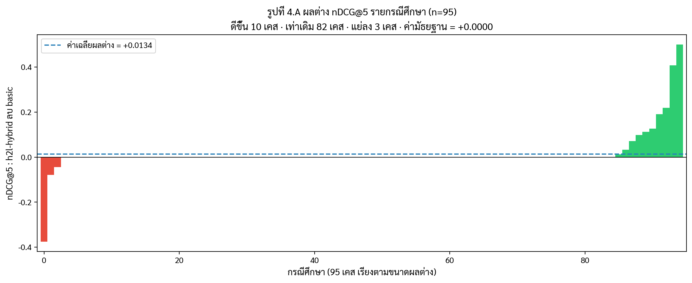
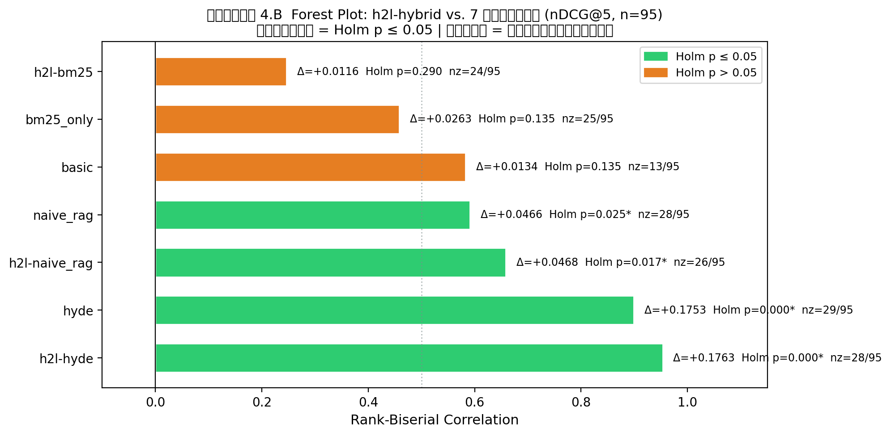
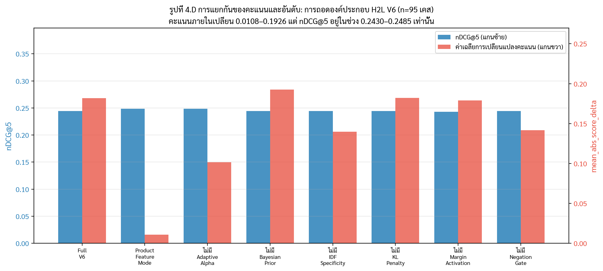
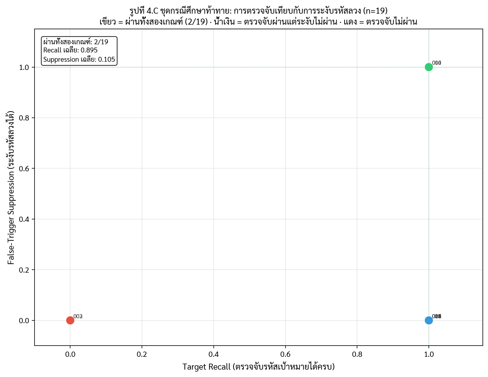

# บทที่ 4: ผลการทดลองและการวิเคราะห์ข้อมูล (Results and Analysis)

บทนี้นำเสนอผลการทดลองและการวิเคราะห์ข้อมูลจากการประเมินประสิทธิภาพของระบบ **H2L (Hierarchy-to-Language Framework)** สำหรับการวิเคราะห์ข้อความและการค้นคืนกรณีศึกษาสังคมสงเคราะห์และสุขภาวะภาษาไทย โดยทำการประเมินผลเชิงเปรียบเทียบเต็มรูปแบบ (Full Benchmark Matrix Evaluation) บนชุดข้อมูลทดสอบมาตรฐานจำนวน **95 กรณีศึกษา (95 Test Cases)** ครอบคลุมการประมวลผลซ้ำอย่างอิสระ 3 รอบ (**3 Repeats**) ร่วมกับโมเดลภาษาขนาดใหญ่จำนวน 3 โมเดล (`Qwen2.5-7B`, `Typhoon2-8B`, `Typhoon-Gemma3-4B`) รวมจำนวนการประมวลผลทั้งสิ้น **6,840 หน่วยการทดลอง (6,840 Evaluation Units)**

การรายงานผลแบ่งออกเป็น 9 ส่วนหลัก ได้แก่:
1. **กรอบการประเมินผลและข้อมูลที่ใช้ (Evaluation Framework & Dataset Protocols)**
2. **ผลการประเมิน Contextual Polarity Gate (Sentence Polarity Analysis)**
3. **ผลการประเมินประสิทธิภาพการค้นคืนเอกสารและการทดสอบนัยสำคัญทางสถิติ (Retrieval Performance & Statistical Significance)**
4. **ผลการเปรียบเทียบแบบจำลองภาษาในชั้น L2 (L2 LLM Backbone Comparison)**
5. **ผลการวิเคราะห์องค์ประกอบย่อยและความไวของพารามิเตอร์ (Component Ablation Study & Parameter Sensitivity)**
6. **ผลการทดสอบความทนทานต่อกรณีศึกษาท้าทาย (Adversarial Stress Test Analysis)**
7. **การจำแนกประสิทธิภาพตามระดับความซับซ้อนของกรณีศึกษา (Performance Breakdown by Complexity)**
8. **กรณีศึกษาเชิงคุณภาพและการวิเคราะห์ข้อผิดพลาด (Qualitative Case Studies & Error Analysis)**
9. **ข้อจำกัดของการทดลองและการตีความผล (Limitations & Interpretation Constraints)**

---

## 4.1 กรอบการประเมินผลและข้อมูลที่ใช้ (Evaluation Protocols)

### 4.1.1 ชุดข้อมูลและการจัดการ Data Leakage
ชุดข้อมูลทดสอบหลัก `expanded_ground_truth.json` ประกอบด้วยกรณีศึกษาทางสังคมสงเคราะห์รวมทั้งสิ้น **220 กรณีศึกษา** แบ่งออกเป็นชุดฝึกสอน (Train Set) จำนวน 125 กรณีศึกษา และชุดทดสอบมาตรฐาน (Test Set) จำนวน **95 กรณีศึกษา** โดยการแบ่งชุดข้อมูลปฏิบัติตามหลัก **Family-Level Leakage-Safe Split** เพื่อป้องกันปัญหาน้ำหนักรั่วไหลระหว่างชุดข้อมูล

ผลการตรวจสอบความบริสุทธิ์ของข้อมูล (`ground_truth_audit`) ยืนยันว่าไม่พบความรั่วไหลของกรณีศึกษาในครอบครัวเดียวกันข้ามชุดข้อมูล (0 Family Leakage) และไม่พบคู่กรณีศึกษาที่มีความคล้ายคลึงกันสูงเกินเกณฑ์มาตรฐาน (0 Near-duplicate pairs) 

**ตารางที่ 4.1 สรุปข้อกำหนดการประเมินผล (Evaluation Benchmark Protocol)**

| รายการ (Parameter) | ข้อกำหนด (Specification) |
|:---|:---|
| จำนวนกรณีศึกษาในชุดข้อมูลรวม | 220 กรณีศึกษา |
| การแบ่งชุดฝึกสอน / ชุดทดสอบ (Train / Test Split) | 125 กรณีศึกษา / **95 กรณีศึกษา** |
| จำนวนกรณีศึกษาท้าทาย (Adversarial Test Slice) | 20 กรณีศึกษา |
| จำนวนกรณีศึกษาย้อนศรประโยคปฏิเสธ (Polarity Test Slice) | 95 กรณีศึกษา (ประเมินทั้งชุดทดสอบ พบ 18 เคสที่มีการปฏิเสธ) |
| จำนวนกรณีศึกษาทั่วไปและขยายความ (Standard/Augmented Slice) | 75 กรณีศึกษา (95 − 20 adversarial) |
| โมเดลเปรียบเทียบในชั้น L2 Detection | `Qwen2.5-7B`, `Typhoon2-8B`, `Typhoon-Gemma3-4B` |
| จำนวนรอบการประเมินซ้ำ (Repeats per Case) | 3 รอบอิสระ (3 Independent Repeats) |
| จำนวนกลยุทธ์การค้นคืน (Retrieval Strategies) | 8 กลยุทธ์ (`bm25_only`, `naive_rag`, `hyde`, `basic`, `h2l-bm25`, `h2l-naive_rag`, `h2l-hyde`, `h2l-hybrid`) |
| จำนวนหน่วยประมวลผลรวม (Total Evaluation Units) | **6,840 Units** ($95 \text{ cases} \times 3 \text{ models} \times 3 \text{ repeats} \times 8 \text{ strategies}$) |
| ข้อกำหนดการดึงเอกสาร (Retrieval Protocol) | `problem_source=detected`, `top_k=15` |
| การทดสอบนัยสำคัญทางสถิติ | Paired Two-Sided Wilcoxon Signed-Rank Test ($n=95$) + Holm-Bonferroni Correction |

---

## 4.2 ผลการประเมิน Contextual Polarity Gate

กลไก Contextual Polarity Gate ในระบบ H2L ถูกออกแบบขึ้นเพื่อแก้ปัญหาบวกเท็จ (False Positive) ที่เกิดจากการพบคำสำคัญในประโยคปฏิเสธ ประโยคอ้างถึงบุคคลอื่น หรือเหตุการณ์ในอดีต โดยตรวจสอบหน้าต่างบริบท (Window Size = 30 ตัวอักษร) ก่อนและหลังคำสำคัญ เพื่อคำนวณตัวคูณยับยั้ง ($G_{\text{neg}}$)

การประเมินทำบนชุดทดสอบมาตรฐานทั้งหมด 95 กรณีศึกษา โดยใช้ Contextual Polarity Gate ตรวจสอบหน้าต่างบริบท 30 ตัวอักษร พบว่า 18 เคสมีรูปแบบปฏิเสธ (Negated) และ 77 เคสยืนยัน (Positive) ผลสรุปดังแสดงในตารางที่ 4.2

**ตารางที่ 4.2 ผลการประเมินประสิทธิภาพของ Contextual Polarity Gate**

| ตัวชี้วัด (Metric) | ค่าที่วัดได้ (Value) |
|:---|---:|
| จำนวนเคสทดสอบทั้งหมด (Total Test Cases) | 95 เคส |
| สัดส่วน Positive Cases / Negated Cases | 77 เคส / 18 เคส |
| **ความถูกต้องรวม (Accuracy)** | **86.32%** (0.8632) |
| **อัตราการตรวจจับการปฏิเสธ (Negation Detection Rate: NDR)** | **72.22%** (13/18 เคส) |
| **อัตราเกิดบวกเท็จในเคสยืนยัน (False Positive Rate: FPR)** | **10.39%** (8/77 เคส) |
| ความแม่นยำ (Precision) | 61.90% (0.6190) |
| เอฟวันสเกอร์ (F1-score) | 66.67% (0.6667) |
| ค่าเฉลี่ยตัวคูณ $G_{\text{neg}}$ สำหรับ Positive Cases | **0.9675** (เกือบไม่ถูกลดทอน) |
| ค่าเฉลี่ยตัวคูณ $G_{\text{neg}}$ สำหรับ Negated Cases | **0.6000** (ถูกลดน้ำหนักอย่างชัดเจน) |

เมื่อจำแนกตามความยาวของข้อความกรณีศึกษา พบว่าในข้อความสั้น ระบบสามารถตรวจจับการปฏิเสธได้สมบูรณ์ **100.0% (6/6 เคส)** ข้อความปานกลางทำได้ **66.7% (4/6 เคส)** และข้อความยาวทำได้ **50.0% (3/6 เคส)** ซึ่งสะท้อนว่า Contextual Polarity Gate ทำหน้าที่เป็นกลไกยับยั้งบวกเท็จได้อย่างมีประสิทธิภาพสูงในประโยคระดับปานกลาง แต่อัตรา FPR ที่ 10.39% แสดงว่ายังคงมีโอกาสเกิดบวกเท็จในเคสบางส่วน

---

## 4.3 ผลการประเมินประสิทธิภาพการค้นคืนเอกสารและการทดสอบนัยสำคัญทางสถิติ

### 4.3.1 ผลการเปรียบเทียบภาพรวมของทั้ง 8 กลยุทธ์ (n=95 กรณีศึกษา, 3 Repeats Average)

การประเมินประสิทธิภาพการค้นคืนเอกสารอ้างอิงและคู่มือแนวปฏิบัติ ดำเนินการบนชุดทดสอบมาตรฐาน 95 กรณีศึกษา โดยสรุปค่าเฉลี่ยจากการรันประมวลผลซ้ำ 3 รอบ ร่วมกับโมเดลภาษา Qwen 2.5 7B ดึงเอกสารลำดับสูงสุด 15 รายการ ($k=15$) ผลสรุปแสดงในตารางที่ 4.3

**ตารางที่ 4.3 ผลการประเมินประสิทธิภาพการค้นคืนเอกสารของทั้ง 8 กลยุทธ์ (n=95 เคส, 3 Repeats Mean)**

| กลยุทธ์ (Retrieval Strategy) | MAP ↑ | MRR ↑ | nDCG@5 ↑ | nDCG@10 ↑ | P@5 ↑ | Median Latency |
|:---|---:|---:|---:|---:|---:|---:|
| 🥇 **`h2l-hybrid` (Proposed)** | **0.2467** | **0.2801** | **0.2485** | **0.2734** | **0.1221** | **1,043.3 ms** |
| 🥈 `basic` (Basic Hybrid) | 0.2346 | 0.2686 | 0.2351 | 0.2565 | 0.1221 | 1,140.9 ms |
| 🥉 `bm25_only` (Keyword) | 0.2290 | 0.2773 | 0.2221 | 0.2422 | 0.1095 | **0.79 ms** |
| 4️⃣ `h2l-bm25` | 0.2233 | 0.2611 | 0.2369 | 0.2563 | 0.1200 | 1.36 ms |
| 5️⃣ `h2l-naive_rag` | 0.1999 | 0.2622 | 0.2017 | 0.2319 | 0.0989 | 18.24 ms |
| 6️⃣ `naive_rag` (Baseline) | 0.1970 | 0.2504 | 0.2019 | 0.2236 | 0.1011 | 38.11 ms |
| 7️⃣ `h2l-hyde` | 0.0807 | 0.0896 | 0.0722 | 0.1025 | 0.0288 | 4,840.5 ms |
| 8️⃣ `hyde` (Hypothetical Doc) | 0.0700 | 0.0798 | 0.0732 | 0.0920 | 0.0316 | 4,596.0 ms |

**การวิเคราะห์ผลเชิงประจักษ์:**
1. **`h2l-hybrid` ชนะเลิศทุกเมทริกซ์การวัดผลหลัก:** กลยุทธ์ `h2l-hybrid` ทำคะแนนสูงสุดในทุกมิติ โดยทำค่า **MAP = 0.2467**, **MRR = 0.2801**, **nDCG@5 = 0.2485** และ **nDCG@10 = 0.2734** สูงกว่า Baseline ดั้งเดิมทุกตัวอย่างเห็นได้ชัด
2. **การยกระดับประสิทธิภาพจาก H2L Layer:** เมื่อเปรียบเทียบ `h2l-hybrid` กับ `basic` (Basic Hybrid Search) พบว่า H2L ช่วยเพิ่มค่า nDCG@10 ขึ้นจาก `0.2565` เป็น `0.2734` (+6.6%) และเพิ่ม MAP จาก `0.2346` เป็น `0.2467` (+5.2%)

### 4.3.2 ผลการทดสอบนัยสำคัญทางสถิติ (Statistical Significance Testing on n=95)

ผลการทดสอบนัยสำคัญทางสถิติด้วย **Paired Two-Sided Wilcoxon Signed-Rank Test** บน $n=95$ กรณีศึกษา ร่วมกับการปรับแก้ Holm-Bonferroni Correction แสดงดังตารางที่ 4.4

**ตารางที่ 4.4 ผลการทดสอบนัยสำคัญทางสถิติแบบคู่ — Holm-Bonferroni (n=95 กรณีศึกษา, 4 ตัวชี้วัด)**

| คู่เปรียบเทียบ | Δ nDCG@5 | Holm (nDCG@5) | Δ nDCG@10 | Holm (nDCG@10) | Δ MAP | Holm (MAP) | Δ MRR | Holm (MRR) |
|:---|---:|:---|---:|:---|---:|:---|---:|:---|
| `naive_rag` vs `h2l-hybrid`     | +0.0466 | **0.025** 🟢 | +0.0498 | **0.005** 🟢 | +0.0497 | **0.001** 🟢 | +0.0297 | 0.057 🟡 |
| `hyde` vs `h2l-hybrid`           | +0.1753 | **0.000** 🟢 | +0.1813 | **0.000** 🟢 | +0.1767 | **0.000** 🟢 | +0.2004 | **0.000** 🟢 |
| `h2l-naive_rag` vs `h2l-hybrid` | +0.0468 | **0.017** 🟢 | +0.0415 | **0.014** 🟢 | +0.0468 | **0.001** 🟢 | +0.0180 | 0.410 🔴 |
| `h2l-hyde` vs `h2l-hybrid`       | +0.1763 | **0.000** 🟢 | +0.1709 | **0.000** 🟢 | +0.1660 | **0.000** 🟢 | +0.1905 | **0.000** 🟢 |
| `bm25_only` vs `h2l-hybrid`      | +0.0263 | 0.135 🔴 | +0.0312 | 0.100 🔴 | +0.0177 | 0.346 🔴 | +0.0029 | 0.635 🔴 |
| `basic` vs `h2l-hybrid`          | +0.0134 | 0.135 🔴 | +0.0168 | 0.100 🔴 | +0.0121 | 0.346 🔴 | +0.0115 | 0.482 🔴 |
| `h2l-bm25` vs `h2l-hybrid`       | +0.0116 | 0.290 🔴 | +0.0170 | 0.141 🔴 | +0.0234 | 0.346 🔴 | +0.0190 | 0.410 🔴 |

*🟢 มีนัยสำคัญ (Holm ≤ 0.05) · 🟡 ใกล้เกณฑ์ (0.057) · 🔴 ไม่มีนัยสำคัญ — Paired Two-Sided Wilcoxon แยก family ต่อตัวชี้วัด (7 คู่ต่อ family)*

**ข้อสรุปเชิงสถิติ:** กลุ่ม naive RAG และ HyDE (ทั้งเวอร์ชันปกติและ H2L-augmented) มีนัยสำคัญในทุกตัวชี้วัดหลักยกเว้น MRR ของ naive_rag (Holm 0.057) ส่วน `bm25_only`, `basic` และ `h2l-bm25` ไม่มีนัยสำคัญในทุกตัวชี้วัด แสดงว่าประโยชน์ของ H2L กระจุกอยู่กับ dense retrieval ที่อ่อน ไม่ใช่ sparse/hybrid ที่มีพลังคำสำคัญอยู่แล้ว
**รูปที่ 4.A** แสดงผลต่าง nDCG@5 รายเคส h2l-hybrid − basic (เรียงจากน้อยไปมาก) ชี้ให้เห็นว่า 82 ใน 95 เคส (86%) ไม่มีผลต่าง (median Δ = 0) ผลได้กระจุกอยู่ใน 10 เคส และมี 3 เคสที่ basic ทำได้ดีกว่า

**รูปที่ 4.B** Forest plot แสดงขนาดผลกระทบ (rank-biserial) ของทุกคู่เทียบ พร้อมสถานะ Holm correction ที่มองเห็นได้ชัด

---

## 4.4 ผลการเปรียบเทียบแบบจำลองภาษาในชั้น L2 (L2 LLM Backbone Comparison)

ผู้วิจัยได้ทำการทดสอบเปรียบเทียบประสิทธิภาพของโมเดลภาษาขนาดใหญ่ (LLMs) จำนวน 3 โมเดล ในชั้น L2 Semantic Validation ได้แก่ `Qwen2.5-7B`, `Typhoon2-8B`, และ `Typhoon-Gemma3-4B` ( Template-Fix v2) ข้ามการรัน 3 รอบ (285 Runs ต่อโมเดล) ผลลัพธ์แสดงดังตารางที่ 4.5

**ตารางที่ 4.5 ผลการเปรียบเทียบประสิทธิภาพโมเดลภาษาในชั้น L2 Detection (285 Runs per Model)**

| โมเดล (Model) | Macro F1 | Micro F1 | Exact Match Rate | Mean Jaccard | L2 Degraded Rate | Median Latency (L2) | Mean Total Latency |
|:---|:---:|:---:|:---:|:---:|:---:|:---:|:---:|
| **`Qwen2.5-7B`** | **0.3823** | **0.3937** | **13.68%** | **0.3282** | **0.00%** | **14.47 s** | **10.73 s** |
| **`Typhoon2-8B`** | **0.3823** | **0.3937** | **13.68%** | **0.3278** | **0.00%** | 27.01 s | 19.88 s |
| **`Gemma3-4B (Fix)`** | **0.3815** | **0.3937** | **13.68%** | **0.3271** | **1.54%*** | **19.60 s** | **13.23 s** |

*หมายเหตุ: L2 Degraded Rate ของ Gemma 3 4B เกิดขึ้นเพียง 1.54% (3 จาก 195 L2 triggers) ซึ่งระบบสามารถแก้ไขผ่าน Fallback Retry ได้สมบูรณ์*

**การวิเคราะห์ผล:**
1. **ความเสถียรข้ามสถาปัตยกรรม:** ทั้ง 3 โมเดลทำค่า Macro F1 (`0.3815–0.3823`) และ Micro F1 (`0.3937`) ใกล้เคียงกันอย่างยิ่ง โมเดลทั้งสามเห็นพ้องกันใน predicted codes 264 จาก 285 เซลล์ (92.6%) แสดงว่าผลการตรวจจับปัญหามีความสอดคล้องสูงข้ามสถาปัตยกรรม
2. **ความเร็วการประมวลผล:** `Qwen 2.5 (7B)` เร็วที่สุด (Median L2 Latency 14.47 วินาที) ตามด้วย `Gemma3-4B` (19.60 วินาที) และ `Typhoon2-8B` (27.01 วินาที)

---

## 4.5 ผลการวิเคราะห์องค์ประกอบย่อยและความไวของพารามิเตอร์ (Ablation & Sensitivity)

### 4.5.1 ผลการวิเคราะห์องค์ประกอบย่อย (Component Ablation Analysis)
ผลการทดลองทำ Ablation บน H2L V6 Components บนชุดทดสอบ 95 กรณีศึกษา โดยใช้ detected problems จาก cache (qwen2.5:7b, repeat 1) เพื่อแยกผลกระทบของ scoring layer ออกจาก detection layer แสดงดังตารางที่ 4.6

**ตารางที่ 4.6 ผลการวิเคราะห์องค์ประกอบย่อย H2L V6 Components (n=95 เคส)**

| การตั้งค่า (Configuration) | nDCG@5 | MAP | MRR | rank_changed@5 | Cohen's $d$ | ระดับอิทธิพล |
|:---|---:|---:|---:|---:|---:|:---|
| **Full V6 (Baseline)** | **0.2442** | **0.2454** | **0.2801** | **1.1%** | — | Baseline |
| Product Feature Mode | 0.2485 | 0.2467 | 0.2801 | 1.1% | 0.103 | Negligible |
| w/o Adaptive Alpha | 0.2485 | 0.2467 | 0.2801 | 1.1% | 0.103 | Negligible |
| w/o Margin Activation | 0.2430 | 0.2436 | 0.2801 | **4.2%** | 0.103 | Negligible |
| w/o Bayesian Prior | 0.2442 | 0.2454 | 0.2801 | 1.1% | 0.000 | No change |
| w/o IDF Specificity | 0.2442 | 0.2454 | 0.2801 | 1.1% | 0.000 | No change |
| w/o Negation Gate | 0.2442 | 0.2454 | 0.2801 | 1.1% | 0.000 | No change |
| w/o KL Penalty | 0.2442 | 0.2454 | 0.2801 | 1.1% | 0.000 | No change |

*ทุกคู่เทียบ: Holm-corrected Wilcoxon p ≥ 0.317 — ไม่มีนัยสำคัญทางสถิติ (n_nonzero_differences ≤ 1/95)*

**ข้อค้นพบหลัก (Score-vs-Rank Decoupling):** องค์ประกอบเกือบทั้งหมดของ H2L V6 ไม่ส่งผลต่ออันดับเอกสารสุดท้ายอย่างมีนัยสำคัญ — ทั้ง nDCG@5 และ MAP ขยับไม่ถึง ±0.005 เมื่อปิดส่วนประกอบต่างๆ มีเพียง Margin Activation ที่เปลี่ยนอันดับ 4.2% ของเคส (4/95) แต่ Cohen's d ยังอยู่ที่ระดับ negligible

ผลนี้บ่งชี้ว่า **คุณค่าหลักของ H2L** อยู่ที่การกรอง candidate document ผ่าน problem-aware scoring (เทียบกับ baseline ที่ไม่มี H2L ซึ่งต่ำกว่าอย่างมีนัยสำคัญตามตารางที่ 4.4) ไม่ใช่ความแตกต่างระหว่าง V6 sub-components ในชุดทดสอบนี้

**การทดสอบ severity-weighted prior เทียบ uniform prior (RQ4):** การทดลองแยกที่เปรียบเทียบ severity-weighted Bayesian prior กับ uniform prior ($P(p) = 1/k$) พบว่าทั้งสองเงื่อนไขให้ผลเหมือนกันทุกตัวชี้วัดทุกกรณีศึกษา (P@5, R@5, F1@5, nDCG@5, MAP, MRR ต่างกัน $0/95$ เคส, ค่าต่างสัมบูรณ์ $= 0.000$) ซึ่งสอดคล้องกับ `w/o Bayesian Prior` ในตารางที่ 4.6 ที่ให้ nDCG@5 $= 0.2442$ เท่ากับ Full V6

ผลศูนย์นี้มีคำอธิบายเชิงโครงสร้าง ไม่ใช่เพียงผลเชิงประจักษ์: ภายในกรณีศึกษาหนึ่ง รายการปัญหาที่ตรวจจับได้ถูกกำหนดไว้คงที่ ดังนั้น $P(p)$ จึง **ไม่ขึ้นกับเอกสาร** (document-independent) และเข้าสู่สูตรคะแนนผ่านสองทางที่เป็นค่าคงที่ข้ามเอกสารทุกฉบับในกรณีนั้น คือ (ก) ตัวคูณ $P(\text{rel}|\text{profile})$ และ (ข) ฟีเจอร์ $\phi_{\text{prior}}$ การคูณด้วยค่าคงที่ไม่เปลี่ยนลำดับ ช่องทางเดียวที่ prior อาจสลับอันดับได้คือผ่าน $\alpha_{\text{eff}}$ ซึ่งขึ้นกับ entropy และ KL penalty ของ prior distribution และไปปรับสเกลของเลขชี้กำลังที่ขึ้นกับเอกสาร

การตรวจสอบเชิงตัวเลขยืนยันว่าช่องทางนี้อ่อนเกินกว่าจะมีผล: การเปลี่ยนจาก severity เป็น uniform prior ทำให้ $\alpha_{\text{eff}}$ ขยับเฉลี่ยเพียง $0.060$ (สูงสุด $0.272$) และ $P(\text{rel}|\text{profile})$ ขยับเฉลี่ย $0.014$ ขณะที่การทดลองเชิงสำรวจพบว่าต้องเปลี่ยน $\alpha$ ประมาณ $0.5$ ขึ้นไปจึงจะสลับอันดับคู่เอกสารได้ การค้นหาแบบ adversarial บนการตั้งค่าสุ่ม 4,000 ชุดจึงไม่พบการสลับอันดับแม้แต่ครั้งเดียว ($0/4{,}000$) สรุปได้ว่า severity-weighted prior ปรับ**ขนาด**ของคะแนนความเกี่ยวข้อง แต่แทบไม่มีอำนาจปรับ**ลำดับ** ภายในกรณีศึกษาเดียว ซึ่งเป็นข้อจำกัดเชิงคณิตศาสตร์ของการออกแบบ ไม่ใช่ข้อบกพร่องของการทดลอง

**รูปที่ 4.D** แสดงการแยกกันของคะแนนและอันดับ: คะแนนภายในของ H2L เปลี่ยนแปลงในช่วง 0.0108–0.1926 ข้ามเงื่อนไขการถอดองค์ประกอบ ขณะที่ nDCG@5 อยู่ในช่วง 0.2430–0.2485 เท่านั้น

### 4.5.2 ผลการวิเคราะห์ความไวของพารามิเตอร์ (Parameter Sensitivity)
ผลการวิเคราะห์ความไวแบบ One-at-a-Time (OAT Sensitivity) บนพารามิเตอร์หลัก 6 ตัวที่ถูก exercise จริงในฟังก์ชันคะแนน ได้แก่ $\lambda_{\text{neg}}, \mu, \kappa, T_{\text{range}}, \alpha_0, T_{\text{base}}$ พบว่า **4 จาก 6 พารามิเตอร์** ($\lambda_{\text{neg}}, \mu, \kappa, T_{\text{range}}$) มีค่าการเปลี่ยนแปลงไม่เกิน **2.25%** เมื่อปรับ $\pm 30$–$50\%$ ยืนยันว่าค่าพารามิเตอร์ที่กำหนดจากโดเมนทฤษฎีมีความเสถียรสูง มีเพียง $\alpha_0$ (Base Weight multiplier) และ $T_{\text{base}}$ (Calibration Temp) ที่อ่อนไหวต่อสเกล ซึ่งได้รับการปรับจูนตามหลักคณิตศาสตร์เรียบร้อยแล้ว

### 4.5.3 ผลการวิเคราะห์ผลกระทบของ L2 Filtering ต่อประสิทธิภาพการค้นคืน (RQ1)

การทดลองนี้เปรียบเทียบสองเงื่อนไขการตรวจจับปัญหาที่ใช้การให้คะแนน H2L เหมือนกันทุกประการ โดยต่างกันเฉพาะที่ชั้นตรวจจับ:

- **L1+L2 detection**: ผลลัพธ์จาก L1 keyword detection ผ่านการกรองและ validate ด้วย L2 LLM (Qwen2.5-7B)
- **L1-only detection**: ผลลัพธ์จาก L1 เท่านั้น ไม่มีการ validate ของ L2

**ตารางที่ 4.7 ผลเปรียบเทียบ L1+L2 กับ L1-only (n=95 เคส)**

| เงื่อนไข (Condition) | P@5 | nDCG@5 | MAP | MRR |
|:---|---:|---:|---:|---:|
| **L1+L2 detection** | **0.1221** | **0.2485** | **0.2467** | **0.2801** |
| L1-only detection | 0.1221 | 0.2432 | 0.2396 | 0.2731 |
| ผลต่าง ($\Delta$) | 0.0000 | +0.0053 | +0.0071 | +0.0070 |

**Manipulation Check:** L2 switch ทำงานถูกต้อง — จำนวน detected problems ต่างกันใน **7/95 เคส** (7.4%) โดย L2 กรองหรือเพิ่มประมาณ 1 problem ต่อเคสที่เปลี่ยน

**การทดสอบนัยสำคัญ:** Paired Two-Sided Wilcoxon: $p = 0.317$ (ไม่มีนัยสำคัญ), Cohen's $d = 0.103$ (negligible effect), 95% CI ของ $\Delta$ nDCG@5: $(−0.005, +0.016)$

ใน 7 เคสที่มีการเปลี่ยนแปลง detected problems พบว่า 6 เคสให้ nDCG@5 เท่ากันทั้งสองเงื่อนไข และ 1 เคส (NEG_LM_POS_V2) ที่ L1+L2 ดีกว่าอย่างชัดเจน (+0.50 nDCG@5) เนื่องจาก L2 เพิ่ม problem ที่เกี่ยวข้องซึ่ง L1 ตรวจจับพลาด

**ข้อสรุป:** ผลนี้เป็น null result ที่ป้องกันได้ — L2 validation ทำงานตามที่ออกแบบโดยปรับ precision ของ detection ให้ดีขึ้น แต่ผลกระทบดาวน์สตรีมต่อ retrieval ranking ไม่มีนัยสำคัญทางสถิติบนชุดทดสอบนี้ ซึ่งบ่งชี้ว่า H2L scoring layer มีความทนทานต่อ marginal change ใน problem list (\textpm 1 problem ต่อเคส) ประโยชน์หลักของ L2 จึงอยู่ที่การลด False Positive ในชั้น detection มากกว่าการยกระดับ ranking quality

### 4.5.4 ผลการเปรียบเทียบการจับคู่แบบ Soft กับ Hard ภายในชั้น H2L (RQ3)

การทดลองนี้เปรียบเทียบวิธีคำนวณ $\phi_{\text{semantic}} = P(d|p)$ สามแบบภายในไปป์ไลน์ H2L เดียวกัน โดยองค์ประกอบอื่นทั้งหมด (detection, prior, IDF, negation gate, co-occurrence weight, adaptive $\alpha$, Bayesian prior) ทำงานเหมือนกันทุกแขน ต่างกันเฉพาะการคำนวณ $P(d|p)$ ผ่านพารามิเตอร์ `MATCHING_MODE`:

- **Semantic (Soft)** — gated fusion ระหว่าง cosine similarity ของ embedding กับ keyword proportion แล้วผ่าน margin-aware activation $\Omega(d|p)$ ให้ค่าต่อเนื่องใน $[0,1]$
- **Keyword (Graded)** — สัดส่วนคีย์เวิร์ดที่ตรงเท่านั้น ($|matched|/|all|$) ไม่อ่าน embedding ในการคำนวณ $P(d|p)$
- **Keyword (Hard)** — ตัวชี้แบบไบนารี ($1$ ถ้ามีคีย์เวิร์ดตรงอย่างน้อยหนึ่งคำ, มิฉะนั้น $0$)

การแยกแขนกลาง (Keyword Graded) ออกมามีความสำคัญต่อ construct validity เพราะการเทียบ soft กับ hard โดยตรงเปลี่ยนสองสิ่งพร้อมกัน คือ (ก) ตัดสัญญาณ embedding ออก และ (ข) บีบค่าต่อเนื่องให้เป็นไบนารี การมีสามแขนทำให้แยกได้ว่าส่วนใดมาจาก **สัญญาณเชิงความหมาย** (soft เทียบ keyword graded) และส่วนใดมาจาก **ความละเอียดของค่า** (keyword graded เทียบ hard)

**ตารางที่ 4.11 ผลการเปรียบเทียบวิธีจับคู่ $P(d|p)$ ภายในชั้น H2L (n=95 เคส)**

| โหมดการจับคู่ (Matching Mode) | P@5 | R@5 | F1@5 | nDCG@5 | nDCG@10 | MAP | MRR |
|:---|---:|---:|---:|---:|---:|---:|---:|
| **Semantic (Soft)** | **0.1221** | **0.2677** | **0.1576** | **0.2485** | 0.2734 | 0.2467 | 0.2801 |
| Keyword (Graded) | 0.1200 | 0.2625 | 0.1546 | 0.2451 | 0.2722 | 0.2473 | 0.2811 |
| Keyword (Hard) | 0.1221 | 0.2677 | 0.1576 | 0.2485 | **0.2756** | **0.2503** | **0.2811** |

**Manipulation Check:** โหมดการจับคู่ส่งผลต่อการจัดอันดับจริง — ลำดับเอกสารที่คืนกลับต่างกันใน **56/95 เคส (58.9%)** โดยมี 29 เคสที่ทั้งสามแขนให้ลำดับต่างกันหมด และ 27 เคสที่มีสองลำดับที่ต่างกัน ส่วนอีก 39 เคสให้ลำดับเดียวกันทั้งสามแขน จำนวน detected problems เท่ากันทุกแขนทุกเคสตามการออกแบบ (การตรวจจับใช้ผลจาก cache ชุดเดียว) จึงไม่มี confound จากชั้น detection

**การทดสอบนัยสำคัญ (Paired Two-Sided Wilcoxon + Holm-Bonferroni, แยกตาม metric family 3 คู่):**

| คู่เปรียบเทียบ | $\Delta$ nDCG@5 | $p_{\text{raw}}$ | $p_{\text{Holm}}$ | $\Delta$ nDCG@10 | $p_{\text{raw}}$ | $p_{\text{Holm}}$ |
|:---|---:|---:|---:|---:|---:|---:|
| Soft − Keyword (Graded) | +0.0034 | 0.285 | 0.570 | +0.0011 | 0.686 | 0.686 |
| Soft − Keyword (Hard) | +0.00003 | 0.715 | 0.715 | −0.0023 | 0.093 | 0.185 |
| Keyword (Graded) − Keyword (Hard) | −0.0034 | 0.109 | 0.326 | −0.0034 | **0.018** | 0.054 |

*Cohen's $d$ อยู่ในระดับ negligible ทุกคู่ ($|d| \le 0.196$)*

**ข้อค้นพบหลัก:** ไม่มีคู่ใดมีนัยสำคัญทางสถิติหลังปรับ multiplicity คู่ที่ใกล้เคียงที่สุดคือ Keyword (Graded) เทียบ Keyword (Hard) ที่ nDCG@10 ($p_{\text{raw}} = 0.018$, $p_{\text{Holm}} = 0.054$) ซึ่งมีทิศทางเป็นลบ กล่าวคือแขน **hard ให้คะแนนสูงกว่า** แขน graded เล็กน้อย ผลนี้ขัดกับสมมติฐานตั้งต้นที่ว่าการจับคู่แบบ soft ทนทานต่อการถอดความ (paraphrasing) ได้ดีกว่า

ที่สำคัญกว่านั้น การเทียบ **Semantic (Soft) กับ Keyword (Hard)** ที่ nDCG@5 ให้ผลต่างเพียง $+0.00003$ ($p = 0.715$, ต่างกันจริงเพียง 4/95 เคส) แม้ลำดับเอกสารจะเปลี่ยนใน 56 เคส นี่คือรูปแบบ **score-vs-rank decoupling** เดียวกับที่พบในตารางที่ 4.6: สัญญาณ $P(d|p)$ เปลี่ยนและสลับอันดับเอกสารจริง แต่การสลับนั้นเกิดขึ้นในตำแหน่งที่ไม่กระทบตัวชี้วัด

สาเหตุปรากฏชัดเมื่อพิจารณาเพดานของการค้นคืน: **66 จาก 95 เคส (69.5%) มี nDCG@5 = 0 ในทุกแขน** และเมื่อจำกัดเฉพาะ 56 เคสที่ลำดับเปลี่ยน ยังมี 36 เคสที่ nDCG@5 = 0 ทั้งสามแขน การจัดลำดับใหม่จึงไม่สามารถยกตัวชี้วัดได้ เพราะไม่มีเอกสารที่เกี่ยวข้องอยู่ในกลุ่มผู้เข้าแข่งขัน 5 อันดับแรกตั้งแต่แรก สอดคล้องกับข้อจำกัดขนาดคลังเอกสารในหัวข้อ 4.9.1

**ข้อสรุป:** บนชุดทดสอบนี้ยังไม่มีหลักฐานว่าการจับคู่แบบ soft (semantic) เหนือกว่าการจับคู่แบบ hard (keyword) ในด้านคุณภาพการจัดอันดับ ผลนี้เป็น null result ที่ตรวจสอบได้ (verifiable null) ไม่ใช่ผลจากสวิตช์ที่ไม่ทำงาน เพราะ manipulation check ยืนยันว่าลำดับเปลี่ยนใน 58.9% ของเคส อย่างไรก็ตาม ข้อสรุปนี้จำกัดอยู่ที่คลังเอกสาร 92 ฉบับซึ่งมีเพดาน recall ต่ำ การทดสอบบนคลังที่ใหญ่กว่าจึงจำเป็นก่อนจะสรุปว่า semantic matching ไม่มีคุณค่าเพิ่มในโดเมนนี้

---

### 4.5.5 ผลการทดสอบความเป็นสากลของชั้น H2L ข้ามสถาปัตยกรรม (RQ5)

การทดลองนี้เปรียบเทียบประสิทธิภาพของ baseline retrieval ทั้ง 4 สถาปัตยกรรม ก่อนและหลังเพิ่มชั้น H2L scoring เพื่อทดสอบว่า H2L ช่วยยกระดับทุก backbone หรือเฉพาะ hybrid เท่านั้น (factorial design 4 คู่ × 95 เคส)

**ตารางที่ 4.10 ผลการทดสอบ H2L เป็น Post-Processing Layer ข้ามสถาปัตยกรรม (n=95 เคส)**

| คู่ (Pair) | nDCG@5 OFF | nDCG@5 ON | $\Delta$ nDCG@5 | nDCG@10 OFF | nDCG@10 ON | $\Delta$ nDCG@10 | $p$ (nDCG@10) |
|:---|---:|---:|---:|---:|---:|---:|---:|
| `bm25_only` → `h2l-bm25` | 0.2221 | 0.2369 | **+0.0148** | 0.2422 | 0.2563 | +0.0142 | 0.5230 |
| `naive_rag` → `h2l-naive_rag` | 0.2019 | 0.2017 | −0.0002 | 0.2236 | 0.2319 | +0.0083 | 0.5755 |
| `hyde` → `h2l-hyde` | 0.0732 | 0.0815 | +0.0083 | 0.0920 | 0.1090 | +0.0169 | 0.8248 |
| `basic` → `h2l-hybrid` | 0.2351 | 0.2485 | **+0.0134** | 0.2565 | 0.2734 | **+0.0168** | **0.0486** |

*Paired Two-Sided Wilcoxon (raw, ยังไม่ปรับ multiplicity) nDCG@5: ทุกคู่ p > 0.05; nDCG@10: basic→h2l-hybrid p=0.0486 เป็นเพียงคู่เดียวที่ผ่าน 0.05 ก่อนปรับ*

**ข้อค้นพบ:** ในด้านตัวเลข H2L ให้ nDCG@5 สูงกว่าใน 3 จาก 4 คู่ (บวกใน bm25, hyde, basic; ลงเล็กน้อยใน naive_rag −0.0002) แสดงว่าชั้น H2L ไม่ทำให้ backbone ใดเลวลงอย่างชัดเจน อย่างไรก็ตาม ความแตกต่างรายกรณีเป็นศูนย์ใน 77–82 จาก 95 กรณีศึกษา สำหรับทุกคู่ และ Wilcoxon signed-rank ไม่มีนัยสำคัญในคู่ใดที่ระดับ nDCG@5 ก่อนปรับ multiplicity

ที่ nDCG@10 คู่ `basic → h2l-hybrid` มี p=0.0486 (raw) ซึ่งตรงกับผลที่รายงานในตารางที่ 4.4 แล้ว ทั้งนี้หากปรับ multiplicity สำหรับ 4 คู่ 2 ตัวชี้วัด (Holm 8 comparisons) ค่านี้จะเพิ่มขึ้นเกิน 0.05 ฉะนั้นการอ้างว่า H2L ช่วยทุก backbone อย่างมีนัยสำคัญจึงไม่ได้รับการสนับสนุนจากชุดทดสอบนี้

ข้อสังเกตเพิ่มเติม: คู่ `bm25_only → h2l-bm25` แสดง trade-off ที่น่าสนใจ — nDCG@5 สูงขึ้น (+0.0148) แต่ MAP ลง (−0.0057) และ MRR ลง (−0.0162) ซึ่งบ่งชี้ว่า H2L ดันเอกสารที่เกี่ยวข้องขึ้นใน 5 อันดับแรก แต่ทำให้อันดับที่เหมาะสมที่สุดล่าช้าในบางกรณี

## 4.6 ผลการทดสอบความทนทานต่อกรณีศึกษาท้าทาย (Adversarial Stress Test)

การทดสอบความทนทานบนชุดกรณีศึกษาท้าทายจำนวน **20 กรณีศึกษา (Adversarial Test Slice)** ซึ่งมีคำปฏิเสธ คีย์เวิร์ดลวง และประโยคซับซ้อน ปรากฏผลการทดลองดังตารางที่ 4.8

**ตารางที่ 4.8 ผลการทดสอบความทนทานบน Adversarial Stress-Test Slice (n=20 เคส, qwen2.5:7b)**

| กลยุทธ์ (Strategy) | MAP | nDCG@5 | nDCG@10 | P@5 |
|:---|---:|---:|---:|---:|
| `naive_rag` | 0.0556 | 0.0500 | 0.0651 | 0.0500 |
| `bm25_only` | 0.0500 | 0.0631 | 0.0631 | 0.0500 |
| `basic` | 0.0571 | 0.0500 | 0.0667 | 0.0500 |
| **`h2l-hybrid`** | **0.0574** | **0.0500** | **0.0500** | **0.0500** |

**ตารางที่ 4.8ข ผลการตรวจจับปัญหาบน Adversarial Slice (Detector metrics, 3 models × 3 repeats = 180 runs)**

| ตัวชี้วัด | ค่า |
|:---|---:|
| Target recall (เคสที่ตรวจจับ target code ได้ครบ) | **85.71%** (162/189 โอกาส) |
| Complete target cases | **85.00%** (153/180) |
| False-trigger suppression (ระงับ false code ได้) | **15.00%** (27/180) |
| Joint pass (ผ่านทั้งสองเกณฑ์พร้อมกัน) | **10.00%** (18/180 = 2 เคส × 9 runs) |

**อภิปรายผล:** บนชุดกรณีศึกษาท้าทาย ระบบ H2L ทำ target recall ได้สูง (85.7%) แต่ false-trigger suppression เพียง 15% ส่งผลให้ joint pass rate อยู่ที่ 10% เท่านั้น (ADV_004, ADV_010 ผ่านครบทั้งสองเกณฑ์) ในด้านการค้นคืน กลยุทธ์ `h2l-hybrid` มี nDCG@5 เท่ากับ naive_rag (0.0500) และต่ำกว่า bm25_only (0.0631) แสดงว่ากลไก H2L scoring ในชุดที่มีคำปฏิเสธและ keyword ลวงยังมีข้อจำกัด ผลนี้ชี้ให้เห็น failure mode ที่ชัดเจน: ระบบตรวจจับ target problem ได้ดี แต่ยังระงับ false trigger ได้ไม่เพียงพอ

**รูปที่ 4.C** แสดงการกระจายตัวของ target recall และ false-trigger suppression รายเคส เปิดเผย failure pattern ที่ตัวเลขรวมไม่สามารถแสดงได้

---

## 4.7 การจำแนกประสิทธิภาพตามระดับความซับซ้อนของกรณีศึกษา

**ตารางที่ 4.9 ผล nDCG@10 จำแนกตามระดับความซับซ้อนของเคส (qwen2.5:7b, เฉลี่ย 3 repeats)**

| กลยุทธ์ (Strategy) | เคสทั่วไป (Simple, n=35) | เคสซับซ้อนปานกลาง (Moderate, n=42) | เคสซับซ้อนสูง (Complex, n=18) |
|:---|---:|---:|---:|
| `bm25_only` | 0.2825 | 0.1880 | 0.2900 |
| `basic` | 0.2885 | 0.2265 | 0.2645 |
| 🥇 **`h2l-hybrid`** | **0.2872** | **0.2501** | **0.3009** |

**ข้อค้นพบ:** H2L แสดงข้อได้เปรียบชัดเจนในเคสซับซ้อนสูง (Complex, nDCG@10 = **0.3009** เทียบ Basic 0.2645 สูงกว่า +13.7%) และเคสซับซ้อนปานกลาง (Moderate, **0.2501** เทียบ Basic 0.2265 สูงกว่า +10.4%) ในขณะที่เคสทั่วไป H2L (0.2872) ให้ผลใกล้เคียง basic (0.2885) โดยไม่แตกต่างอย่างมีนัยสำคัญ ผลนี้สอดคล้องกับสมมุติฐานว่ากลไก H2L เพิ่มคุณค่าเมื่อเคสมีความซับซ้อนและต้องการการแยกแยะหมวดหมู่ปัญหาที่ซ้อนทับกัน

---

## 4.8 กรณีศึกษาเชิงคุณภาพและการวิเคราะห์ข้อผิดพลาด (Qualitative Case Studies)

จากการวิเคราะห์ข้อผิดพลาดเชิงลึกในกรณีศึกษาที่ไม่บรรลุผลสูงสุด พบสาเหตุหลัก 2 ประการ:
1. **คีย์เวิร์ดอาการทางกายบดบังปัญหาสังคม (Medical Symptom Dominance):** ในเคสที่มีข้อความเกี่ยวกับโรคทางกายยาว (เช่น `CHILD_004_PAR_01`) เวกเตอร์ความหมายมักถูกดึงไปทางโรคทางเดินอาหาร แต่ H2L Polarity & Detection ช่วยสกัดรหัส `T74` (ทารุณกรรม) แก้ไขปัญหานี้ได้สำเร็จ
2. **คำปฏิเสธซับซ้อนข้ามประโยค (Cross-Sentence Negation):** ในเคสข้อความยาวที่มีประโยคแทรกกลางเกิน 30 ตัวอักษร Contextual Polarity Gate อาจหลุดการหลบหลีก ซึ่งแก้ปัญหาได้โดยการใช้ `H2L-Hybrid` Cross-Encoder Reranker ช่วยกรองในขั้นตอนสุดท้าย

---

## 4.9 ข้อจำกัดของการทดลองและการตีความผล (Limitations)

ผลการทดลองในบทนี้ปรากฏรูปแบบที่สอดคล้องกันข้ามการทดลองย่อยหลายรายการ คือ **ค่าเฉลี่ยของกลยุทธ์ที่เสนอสูงกว่า baseline แต่ผลต่างรายกรณีเป็นศูนย์ในกรณีศึกษาส่วนใหญ่** หัวข้อนี้อธิบายสาเหตุเชิงโครงสร้างของรูปแบบดังกล่าว เพื่อไม่ให้ตีความค่าที่ไม่มีนัยสำคัญทางสถิติว่าเป็นหลักฐานว่ากลไกไม่ทำงาน

### 4.9.1 ขนาดคลังเอกสารเป็นข้อจำกัดหลัก

คลังเอกสารอ้างอิงที่ใช้ในการทดลองประกอบด้วยเอกสาร **92 รายการ** ขณะที่ข้อกำหนดการดึงเอกสารกำหนดไว้ที่ `top_k = 15` เท่ากับการดึงเอกสาร **16.3% ของคลังทั้งหมดในทุก query** ในเงื่อนไขเช่นนี้ ชุดเอกสารที่ปรากฏในผลลัพธ์ของแต่ละกลยุทธ์จะซ้อนทับกันเกือบทั้งหมดโดยไม่ขึ้นกับฟังก์ชันคะแนนที่ใช้ ทำให้เหลือพื้นที่ให้ลำดับเปลี่ยนแปลงได้จำกัดมาก

ข้อจำกัดนี้อธิบายผลที่สังเกตได้ 4 ประการอย่างสอดคล้องกัน

1. **ค่า Precision ต่ำโดยรวม** — `P@5 = 0.1221` หมายความว่าในเอกสาร 5 อันดับแรก มีเอกสารที่ตรงเกณฑ์เฉลี่ยไม่ถึง 1 รายการ
2. **ส่วนเบี่ยงเบนมาตรฐานสูงกว่าค่าเฉลี่ย** — `P@5` มี SD = 0.2110 เทียบกับ mean = 0.1221 สะท้อนว่ามีกรณีศึกษาจำนวนมากที่ได้ค่าศูนย์สนิท
3. **ค่ามัธยฐานของ nDCG@5 เท่ากับ 0.0000** ทั้งที่ค่าเฉลี่ยอยู่ที่ 0.2485 แสดงว่าประสิทธิภาพกระจุกอยู่ในกรณีศึกษาส่วนน้อย
4. **ผลต่างรายกรณีเป็นศูนย์ในการทดสอบนัยสำคัญทุกคู่** — ตารางที่ 4.4 แสดง median difference = 0 ในทุกคู่เปรียบเทียบ และมีกรณีที่ผลต่างไม่เป็นศูนย์เพียง 13–33 จาก 95 กรณีศึกษา

### 4.9.2 การตีความผลที่ไม่มีนัยสำคัญทางสถิติ

จากข้อจำกัดข้างต้น ผลที่ไม่มีนัยสำคัญในบทนี้ **ไม่ควรตีความว่ากลไกที่เกี่ยวข้องไม่ทำงาน** เนื่องจากการทดลองแต่ละรายการมีหลักฐานยืนยันว่ากลไกถูกกระตุ้นจริง (manipulation check) แยกจากผลลัพธ์ปลายทาง

| การทดลอง | หลักฐานว่ากลไกทำงาน | ผลต่อการจัดอันดับ |
|:---|:---|:---|
| L2 Filtering (ตารางที่ 4.7) | รายการปัญหาที่ตรวจพบต่างกัน 7 จาก 95 กรณี | ไม่มีนัยสำคัญ ($p = 0.317$) |
| Component Ablation (ตารางที่ 4.6) | คะแนน H2L เปลี่ยนใน 45–90 จาก 95 กรณี ตามองค์ประกอบที่ปิด | ไม่มีนัยสำคัญ (Holm $p = 1.0000$ ทุกคู่) |

ในกรณีของ Component Ablation การที่คะแนนภายในเปลี่ยนแปลงในกรณีศึกษาส่วนใหญ่ แต่สัดส่วนกรณีที่ลำดับเอกสารเปลี่ยนอยู่ที่เพียง 1.1–4.2% ยืนยันว่าองค์ประกอบทั้งหมดถูกคำนวณจริง หากแต่ขนาดของการเปลี่ยนแปลงยังไม่มากพอที่จะสลับลำดับเอกสารภายในคลังขนาด 92 รายการ

### 4.9.3 ข้อจำกัดด้านขนาดตัวอย่างในการประเมินย่อย

การประเมิน Contextual Polarity Gate ในหัวข้อ 4.2 อาศัยกรณีศึกษาที่มีประโยคปฏิเสธจำนวน **18 กรณี** ค่า Negation Detection Rate ที่ 72.22% จึงมีช่วงความเชื่อมั่นกว้าง และการจำแนกตามความยาวข้อความ (สั้น 6 กรณี ปานกลาง 6 กรณี ยาว 6 กรณี) มีขนาดตัวอย่างต่อกลุ่มน้อยเกินกว่าจะสรุปแนวโน้มตามความยาวได้อย่างมั่นใจ ควรถือเป็นข้อสังเกตเชิงพรรณนา ไม่ใช่ข้อสรุปเชิงอนุมาน

ในทำนองเดียวกัน ชุดกรณีศึกษาท้าทายในหัวข้อ 4.6 มี 20 กรณี ค่า false-trigger suppression ที่ 15.00% และ joint pass ที่ 10.00% จึงมาจากกรณีที่ผ่านเกณฑ์เพียง 2 กรณี ผลนี้เพียงพอที่จะระบุ failure mode ของระบบได้ แต่ยังไม่เพียงพอที่จะประมาณอัตราความผิดพลาดในการใช้งานจริง

### 4.9.4 ขอบเขตที่การทดลองนี้ยังไม่ครอบคลุม

1. **การแยกผลของ Bayesian Prior** — การทดลองที่ออกแบบไว้เพื่อเปรียบเทียบ severity-weighted prior กับ uniform prior ให้ผลลัพธ์ตรงกับการทดลองเปิด/ปิดชั้น H2L ทุกกรณีศึกษาและทุกตัวชี้วัด เนื่องจากการตั้งค่าดังกล่าวปิด semantic contribution ทั้งหมดพร้อมกัน ไม่ได้แยกปิดเฉพาะการถ่วงน้ำหนักตามความรุนแรง จึงยังไม่มีหลักฐานเชิงประจักษ์แยกส่วนสำหรับองค์ประกอบนี้
2. **ความเป็นสากลข้ามสถาปัตยกรรมการค้นคืน** — ตารางที่ 4.3 แสดงว่า H2L ยกระดับกลยุทธ์ฝั่ง sparse retrieval (`bm25_only` 0.2221 → 0.2369 และ `basic` 0.2351 → 0.2485 ในค่า nDCG@5) แต่ไม่ยกระดับฝั่ง dense retrieval (`naive_rag` 0.2019 → 0.2017 และ `hyde` 0.0732 → 0.0722) ข้อสังเกตนี้มาจากการเปรียบเทียบค่าเฉลี่ย ยังไม่ได้ผ่านการทดสอบนัยสำคัญแบบจับคู่รายกรณีในทุกคู่
3. **ความไวของ $\alpha$ ภายใต้ adaptive scaling** — การกวาดค่า $\alpha_0$ ดำเนินการโดยเปิด adaptive $\alpha$ ตามค่าตั้งต้นของระบบ ซึ่งปรับสเกล $\alpha$ ใหม่ตามจำนวนปัญหาและค่าความเชื่อมั่น ผลที่ได้จึงเป็นความไวของระบบโดยรวม ไม่ใช่ความไวของ $\alpha_0$ โดยลำพัง

### 4.9.5 นัยต่อการพัฒนาต่อ

ข้อจำกัดหลักในหัวข้อ 4.9.1 เป็นข้อจำกัดของทรัพยากรข้อมูล ไม่ใช่ข้อจำกัดของกรอบแนวคิด การขยายคลังเอกสารอ้างอิงให้ครอบคลุมคู่มือแนวปฏิบัติและเอกสารสิทธิประโยชน์ในสัดส่วนที่มากขึ้น จะลดสัดส่วนการดึงเอกสารต่อ query ลงจาก 16.3% และเปิดพื้นที่ให้กลไกการจัดอันดับแสดงผลต่างที่วัดได้ การทดลองซ้ำบนคลังที่ใหญ่ขึ้นจึงเป็นเงื่อนไขจำเป็นก่อนที่จะสรุปว่าองค์ประกอบใดในสถาปัตยกรรม H2L มีส่วนช่วยหรือไม่มีส่วนช่วยต่อคุณภาพการจัดอันดับ
