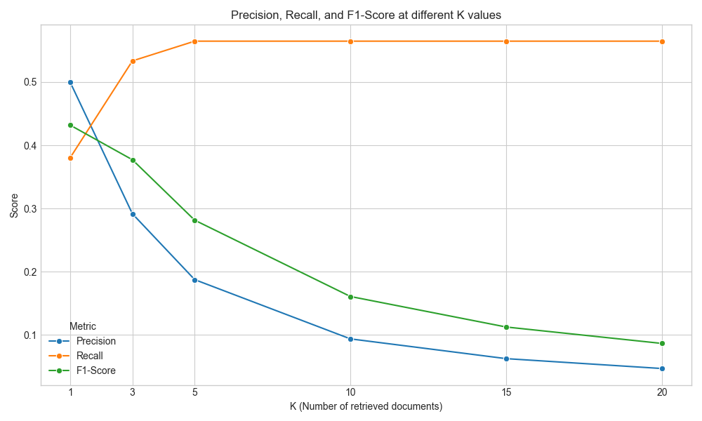
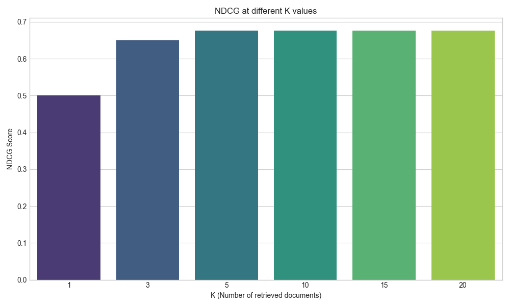

# Retrieval Evaluation Report

Generated on: 2025-10-13 12:41:57

## 📈 Overall Metrics

- **Mean Reciprocal Rank (MRR):** `0.6302`
- **Mean Average Precision (MAP):** `0.4794`
- **Mean Query Latency:** `0.1913` seconds

## 📊 Metrics @ K

| K | Precision | Recall | F1-Score | NDCG |
|---|---|---|---|---|
| 1 | 0.5000 | 0.3802 | 0.4320 | 0.5000 |
| 3 | 0.2917 | 0.5335 | 0.3771 | 0.6495 |
| 5 | 0.1875 | 0.5647 | 0.2815 | 0.6765 |
| 10 | 0.0938 | 0.5647 | 0.1608 | 0.6765 |
| 15 | 0.0625 | 0.5647 | 0.1125 | 0.6765 |
| 20 | 0.0469 | 0.5647 | 0.0866 | 0.6765 |

## 🖼️ Visualizations

### Precision, Recall, and F1-Score @ K

### NDCG @ K

