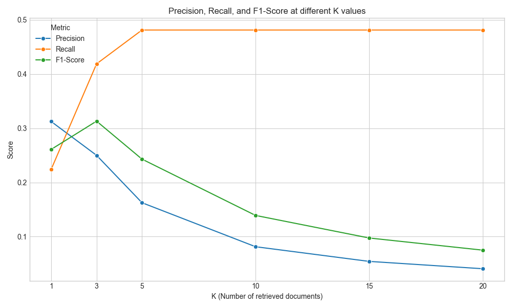
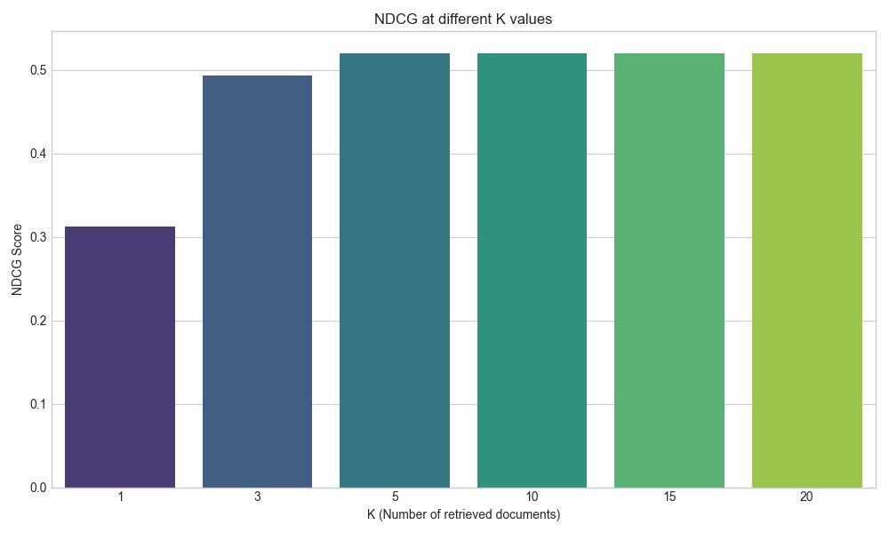

# Retrieval Evaluation Report

Generated on: 2025-10-12 18:30:08

## 📈 Overall Metrics

- **Mean Reciprocal Rank (MRR):** `0.4635`
- **Mean Average Precision (MAP):** `0.3397`
- **Mean Query Latency:** `0.2310` seconds

## 📊 Metrics @ K

| K | Precision | Recall | F1-Score | NDCG |
|---|---|---|---|---|
| 1 | 0.3125 | 0.2240 | 0.2609 | 0.3125 |
| 3 | 0.2500 | 0.4189 | 0.3131 | 0.4933 |
| 5 | 0.1625 | 0.4814 | 0.2430 | 0.5202 |
| 10 | 0.0813 | 0.4814 | 0.1390 | 0.5202 |
| 15 | 0.0542 | 0.4814 | 0.0974 | 0.5202 |
| 20 | 0.0406 | 0.4814 | 0.0749 | 0.5202 |

## 🖼️ Visualizations

### Precision, Recall, and F1-Score @ K

### NDCG @ K

